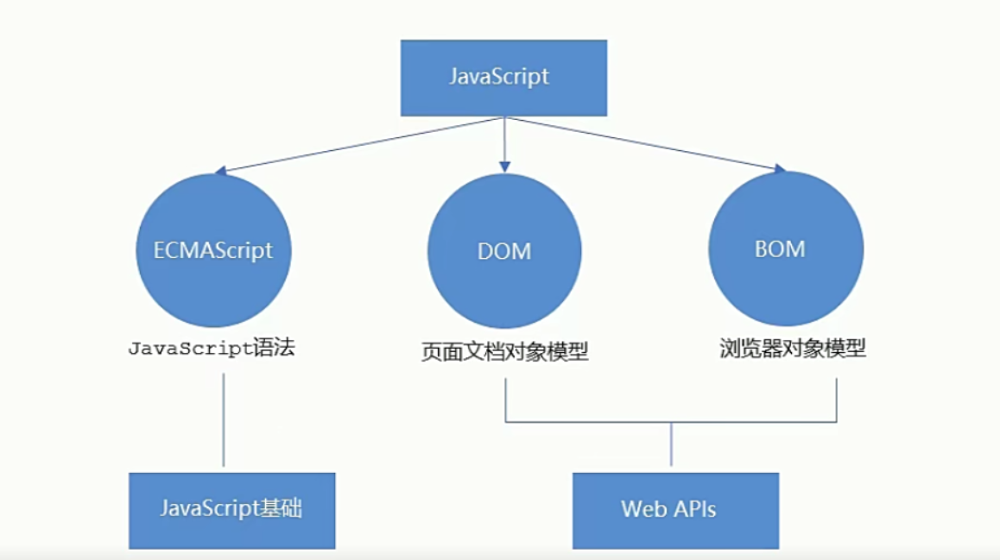
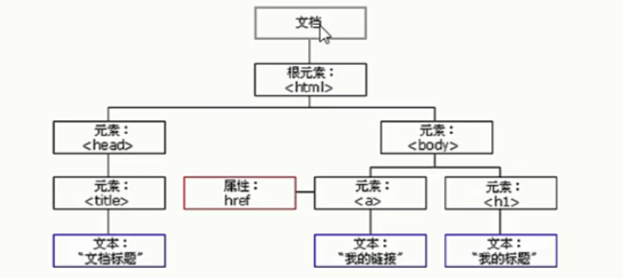
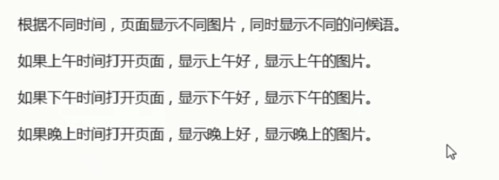

# WEB API基础概述

## 一、JavaScript的组成

  

ECMAScript只是javascript的基础语法，WEB APIs指的是DOM（页面文档对象模型）和BOM（浏览器对象模型）

JS基础阶段：

* 我们学习的是ECMAScript标准规定的基本语法
* 只要求掌握JS基础语法
* 只学习基本语法但是做不了网页的交互效果
* 目的是为了JS后面的课程打基础做铺垫

Web APIS阶段：
* Web APIS是W3C组织的标准
* Web APIs我们主要学习DOM和BOM
* Web APIs是我们JS独有的部分
* 我们主要学习页面交互功能
* 需要使用JS基础的课程内容做基础


Web API是浏览器提供的一套操作浏览器功能和页面元素的API（BOM和DOM）


## 二、DOM

### 1.DOM概述

&emsp;文档对象模型DOM,是W3C组织推荐的处理可扩展标记语言（HTML或者XML）的标准编程接口。

W3C已经定义了一系列的DOM接口，通过这些DOM接口可以改变网页的内容、结构和样式。

文档：一个页面就是一个文档，DOM中使用document表示
元素：页面中的所有标签都是元素，DOM中使用element表示
节点：网页中的所有内容都是节点（标签、属性、文本、注释等），DOM中使用node表示

  

### 2.获取页面元素

&emsp;DOM在实际开发中主要用来操作元素，如何获取页面中的元素（标签），使用以下几种方式：

* 根据ID进行获取
* 根据标签名获取
* 通过HTML5新增的方法进行获取
* 特殊元素获取

#### 2.1 通过ID进行获取元素

```js
var element = document.getElementById(id);
```

* element是一个Element对象。如果当前文档中拥有特定ID的元素不存在则返回null
* id是大小写敏感的字符串，代表了所要查找的元素的唯一ID
* 返回一个匹配到ID的DOM Element对象。若在当前Document下没有找到，则返回Null。

```js
<!DOCTYPE html>
<html lang="en">
<head>
    <meta charset="UTF-8">
    <meta http-equiv="X-UA-Compatible" content="IE=edge">
    <meta name="viewport" content="width=device-width, initial-scale=1.0">
    <title>Document</title>
</head>
<body>
    <div id = "time">2019-9-9</div>

    <script>
        // 因为我们文档页面都是从上往下进行加载的，所有先得有标签
        // get获得element元素 By通过驼峰命名法
        // id对大小写敏感
        // 返回的是一个元素对象
        var timer = document.getElementById('time');// 获取元素对象
        console.log(timer);
        console.log(typeof timer);
        console.dir(timer);// 打印我们返回的元素对象 更好的查看里面的属性和方法
    </script>
    
</body>
</html>

```

#### 2.2 根据标签名获取元素

&emsp;使用getElementsByTagName()方法可以返回带有指定标签名的对象的集合。

```js
document.getElementsByTagName('标签名');
```

```js
<!DOCTYPE html>
<html lang="en">
<head>
    <meta charset="UTF-8">
    <meta http-equiv="X-UA-Compatible" content="IE=edge">
    <meta name="viewport" content="width=device-width, initial-scale=1.0">
    <title>Document</title>
</head>
<body>
    <ul>
        <li>后翼弃兵，自我实现</li>
        <li>后翼弃兵，自我实现</li>
        <li>后翼弃兵，自我实现</li>
        <li>后翼弃兵，自我实现</li>
    </ul>

    <script>
        // 返回的是获取过来元素的集合 伪数组形式进行呈现
        var lis = document.getElementsByTagName('li');
        console.log(lis);
        console.log(lis[0]);

        // for循环打印
        for(var i = 0; i < lis.length; i++)
        {
            console.log(lis[i]);
        }
    </script>
    
</body>
</html>

```

注意：
* 因为得到的是一个对象的集合，所以我们想要操作里面的元素就需要进行遍历
* 得到元素对象是动态的
* element.getElementsByTagName() 可以得到这个元素里面的某些标签

```js
<!DOCTYPE html>
<html lang="en">
<head>
    <meta charset="UTF-8">
    <meta http-equiv="X-UA-Compatible" content="IE=edge">
    <meta name="viewport" content="width=device-width, initial-scale=1.0">
    <title>Document</title>
</head>
<body>
    <ul>
        <li>后翼弃兵，自我实现</li>
        <li>后翼弃兵，自我实现</li>
        <li>后翼弃兵，自我实现</li>
        <li>后翼弃兵，自我实现</li>
    </ul>

    <ul id="nav" >
        <li>不破不立！</li>
        <li>不破不立！</li>
        <li>不破不立！</li>
        <li>不破不立！</li>
        <li>不破不立！</li>        
    </ul>

    <script>
        // 返回的是获取过来元素的集合 伪数组形式进行呈现
        var lis = document.getElementsByTagName('li');
        console.log(lis);
        console.log(lis[0]);

        // for循环打印
        for(var i = 0; i < lis.length; i++)
        {
            console.log(lis[i]);
        }

        // element.getElementsByTagName()可以得到这个元素里面的某些标签
        var nav = document.getElementById('nav');
        var navLis = nav.getElementsByTagName('li');
        console.log(navLis);

    </script>
    
</body>
</html>

```

#### 2.3 根据类名获取元素

```js
document.getElementsByClassName('类名');// 根据类名返回元素对象集合
``` 

```js
<!DOCTYPE html>
<html lang="en">
<head>
    <meta charset="UTF-8">
    <meta http-equiv="X-UA-Compatible" content="IE=edge">
    <meta name="viewport" content="width=device-width, initial-scale=1.0">
    <title>Document</title>
</head>
<body>
    <div class = "box">盒子</div>
    <div class = "box">盒子</div>

    <div id = "nav">
        <ul>
            <li>首页</li>
            <li>产品</li>
        </ul>
    </div>

    <script>
        // 根据类名获得某些元素的集合
        var boxs = document.getElementsByClassName('box');
        console.log(boxs);
    </script>
</body>
</html>

```

```js
document.querySelector('选择器'); // 根据指定选择器返回第一个元素对象

// 切记 对于里面的选择器 需要加上符号 类选择器加上.  id选择器需要加上# 标签选择器不需要
```

```js
<!DOCTYPE html>
<html lang="en">
<head>
    <meta charset="UTF-8">
    <meta http-equiv="X-UA-Compatible" content="IE=edge">
    <meta name="viewport" content="width=device-width, initial-scale=1.0">
    <title>Document</title>
</head>
<body>
    <div class = "box">盒子1</div>
    <div class = "box">盒子2</div>

    <div id = "nav">
        <ul>
            <li>首页</li>
            <li>产品</li>
        </ul>
    </div>

    <script>
        // 根据类名获得某些元素的集合
        var boxs = document.getElementsByClassName('box');
        console.log(boxs);
        
        // 使用querySelector 返回指定选择器的第一个元素对象
        var firstbox = document.querySelector('.box');
        console.log(firstbox);

        var nav = document.querySelector('#nav');// 选择器有很多加上# 判断出是id选择器
        console.log(nav);

        var li = document.querySelector('li');
        console.log(li);

    </script>
</body>
</html>

```

```js
querySelectorAll('选择器')  //返回所有的对象元素集合
```


```js
<!DOCTYPE html>
<html lang="en">
<head>
    <meta charset="UTF-8">
    <meta http-equiv="X-UA-Compatible" content="IE=edge">
    <meta name="viewport" content="width=device-width, initial-scale=1.0">
    <title>Document</title>
</head>
<body>
    <div class = "box">盒子1</div>
    <div class = "box">盒子2</div>

    <div id = "nav">
        <ul>
            <li>首页</li>
            <li>产品</li>
        </ul>
    </div>

    <script>
        // 根据类名获得某些元素的集合
        var boxs = document.getElementsByClassName('box');
        console.log(boxs);
        
        // 使用querySelector 返回指定选择器的第一个元素对象
        var firstbox = document.querySelector('.box');
        console.log(firstbox);

        var nav = document.querySelector('#nav');// 选择器有很多加上# 判断出是id选择器
        console.log(nav);

        var li = document.querySelector('li');
        console.log(li);

        // querySelectorAll() 返回指定选择器的所有元素对象集合
        var allBox = document.querySelectorAll('.box');
        console.log(allBox);
        
        // 返回所有标签li的对象集合
        var lis = document.querySelectorAll('li');
        console.log(lis);

    </script>
</body>
</html>

```

#### 2.4 获取特殊元素

* 获取body元素：document.body //返回body元素对象
* 获取html元素对象：documentElement // 返回html元素对象

```js
<!DOCTYPE html>
<html lang="en">
<head>
    <meta charset="UTF-8">
    <meta http-equiv="X-UA-Compatible" content="IE=edge">
    <meta name="viewport" content="width=device-width, initial-scale=1.0">
    <title>Document</title>
</head>
<body>
    <script>
        // 获取body元素
        var bodyEle = document.body;
        console.log(bodyEle);
        console.dir(bodyEle);// 查看对象类型

        // 获取html元素
        var htmlEle = document.documentElement;
        console.log(htmlEle);
    </script>
</body>
</html>

```

### 3.事件基础

&emsp;JavaScript是我们有能力创建动态页面，而事件是可以被JavaScript侦测到的行为，简单的理解就是：触发-响应机制

&emsp;网页中的每一个元素都可以产生触发JavaScript的事件，例如，我们可以在用户点击某按钮时产生一个事件，然后去执行某些操作。

```js
<!DOCTYPE html>
<html lang="en">
<head>
    <meta charset="UTF-8">
    <meta http-equiv="X-UA-Compatible" content="IE=edge">
    <meta name="viewport" content="width=device-width, initial-scale=1.0">
    <title>Document</title>
</head>
<body>

    <button id = 'btn'>唐伯虎</button>  

    <script>
        // 点击一个按钮，弹出对话框
        // 事件是三部分组成 事件源 事件类型 事件处理程序   我们也称为事件三要素
        // 事件源 事件被触发的对象

        // 选择出所有Id是btn 的按钮
        var btn = document.getElementById('btn');

        // 事件类型 如何触发什么事件  鼠标点击 还是鼠标经过

        // 将对象连接鼠标点击信号onclick

        btn.onclick = function(){
            alert('点秋香');// 弹出对话框
        }
    </script>
</body>
</html>

```

执行事件的步骤：

* 获取事件源
* 注册事件（绑定事件）
* 添加事件处理程序（采取函数赋值的形式）

```js
<!DOCTYPE html>
<html lang="en">
<head>
    <meta charset="UTF-8">
    <meta http-equiv="X-UA-Compatible" content="IE=edge">
    <meta name="viewport" content="width=device-width, initial-scale=1.0">
    <title>Document</title>
</head>
<body>
    <div>123</div>

    <script>
        // 执行事件步骤
        // 点击div 控制台输出 我被选中了
        
        // 获取事件源
        var div = document.querySelector('div');
        // 绑定事件  注册事件

        div.onclick = function(){
            console.log('我被选中了');
        }
    </script>
</body>
</html>

```


### 4.操作元素

&emsp; JavaScript的DOM操作可以改变网页的内容、结构和样式，我们可以利用DOM操作元素来改变元素里面的内容、属性等。

#### 4.1 改变元素内容

从初始位置到终止位置的内容，但是它取出html标签，同时空格和换行也会去掉
```js
element.innerText
```

```js
<!DOCTYPE html>
<html lang="en">
<head>
    <meta charset="UTF-8">
    <meta http-equiv="X-UA-Compatible" content="IE=edge">
    <meta name="viewport" content="width=device-width, initial-scale=1.0">
    <title>Document</title>
</head>
<body>
    <button>显示当前系统时间</button>
    <div>某个时间</div>
    <p>123</p>

    <script>
        // 当我们点击按钮  div的文字会发生变化

        // 1 获取元素
        var btn = document.querySelector('button')
        var div = document.querySelector('div');

        // 2 注册事件
        btn.onclick = function(){
            // 换成系统的时间
            // div.innerText = '2019-6-6';
            div.innerText = getDate();// 返回一个字符串
        }

        function getDate(){
            // 获取一个时间对象
            var date = new Date();
            // 获取当前时间
            var year = date.getFullYear();// 获取年份
            var month = date.getMonth() + 1;// 获取月份  因为返回的月份小一个月 + 1
            var dates = date.getDate(); // 获取日
            var arr = ['星期日','星期一','星期二','星期三','星期四','星期五','星期六'];
            var day = date.getDay();// 获取星期几  返回的是整数值
            return '今天是：' + year + '年' + month + '月' + dates + '日 ' + arr[day];
        }

        var p = document.querySelector('p');
        p.innerText = getDate();// 直接修改

    </script>
</body>
</html>

```


从初始位置到终止位置的全部内容，包括html标签，同时保留空格和换行
```js
element.innerHTML
```


他们的区别：
```js
<!DOCTYPE html>
<html lang="en">
<head>
    <meta charset="UTF-8">
    <meta http-equiv="X-UA-Compatible" content="IE=edge">
    <meta name="viewport" content="width=device-width, initial-scale=1.0">
    <title>Document</title>
</head>
<body>
    <div>xia</div>
    <p>
        我是文字
        <span>123</span>
    </p>
    <script>
        // innertext和innerHTML的区别
        // 1. innerText  不识别Html标签  去除空格和换行
        var div = document.querySelector('div');
        div.innerText = '今天是个好日子';// 修改元素内容  直接赋值
        div.innerText = '<strong>hhhhh<strong>';// 没有加粗
        
        // 2 innerHtml  识别html标签  W3C标准
        div.innerHTML = '<strong>今天是：</strong>2019';

        // 这两个属性是可读可写的  可以获取元素里面的内容
        var p = document.querySelector('p');
        console.log(p.innerText);// 去除空格和换行
        console.log(p.innerHTML);// 保留空格和换行

    </script>
    
</body>
</html>

```


#### 4.2 操作元素属性

操纵src属性
```js
<!DOCTYPE html>
<html lang="en">
<head>
    <meta charset="UTF-8">
    <meta http-equiv="X-UA-Compatible" content="IE=edge">
    <meta name="viewport" content="width=device-width, initial-scale=1.0">
    <title>Document</title>
</head>
<body>
    <button id = "ldh">刘德华</button>
    <button id = "zxy">张学友</button>  <br>
    

    <script>
        // 修改元素属性  src
        // 获取元素对象
        var ldh = document.getElementById('ldh');
        var zxy = document.getElementById('zxy');
        var img = document.querySelector('img');// 根据标签类型获取

        // 注册事件
        zxy.onclick = function(){
            img.src = 'images/zxy.jpg';// 文件路径
        }

        ldh.onclick = function(){
            img.src = 'images/ldh.jpg';
            img.title = "刘德华";
        }
    </script>
</body>
</html>
```


#### 4.3 案例分析

  

案例分析：

* 根据系统不同的时间来判断，所以需要用到日期内置对象
* 利用多分支语句来设置不同的图片
* 需要一个图片，并且根据时间修改图片，就需要用到操作元素src属性
* 需要一个div元素，显示不同的问候语，修改元素内容


```js
<!DOCTYPE html>
<html lang="en">
<head>
    <meta charset="UTF-8">
    <meta http-equiv="X-UA-Compatible" content="IE=edge">
    <meta name="viewport" content="width=device-width, initial-scale=1.0">
    <title>Document</title>
    
    <style>
        img{
            width:300px;
        }
    </style>

</head>
<body>
    
    <div>上午好</div>
    <script>
        // 根据系统不同时间来判断，所以需 要用到日期内置对象
        // 利用多分枝语句来设置不同的图片
        // 需要一个图片，并且根据时间修改图片，就需要用到操作元素src属性
        // 需要一个div元素，显示不同问候语，修改元素内容即可

        // 获取元素 然后才可以操纵元素属性
        var img = document.querySelector('img');
        var div = document.querySelector('div');

        // 得到当前的小时数
        var date = new Date();// 获取日期对象
        var h = date.getHours();// 获取小时数

        // 判断小时数改变图片和文字信息
        if(h < 12)
        {
            img.src = 'images/a.png';
            div.innerHTML = '亲，上午好，好好写代码';// 修改标签内容
        }
        else if(h < 18)
        {
            //走到这里 h一定大于等于12
            img.src = 'images/b.jpg';
            div.innerHTML = '亲，下午好，写好代码，改变世界';//修改标签内容
        }
        else
        {
            img.src = 'images/c.jpg';
            div.innerHTML = '亲，晚上好,早点休息';
        }

    </script>
   
</body>
</html>

```

#### 4.4 表单元素的属性操作

&emsp;利用DOM可以操作如下表单元素的属性

```js
type、value、checked、selected、disabled
```

```js
<!DOCTYPE html>
<html lang="en">
<head>
    <meta charset="UTF-8">
    <meta http-equiv="X-UA-Compatible" content="IE=edge">
    <meta name="viewport" content="width=device-width, initial-scale=1.0">
    <title>Document</title>
</head>
<body>
    <button>按钮</button>
    <input type="text" value = "请输入内容">
    <script>
        // 获取元素
        var btn = document.querySelector('button');
        var input = document.querySelector('input');

        // 注册事件  处理程序
        btn.onclick = function(){
            // input.innerHTML = '点击了'；//这是一个普通盒子，只可以修改div标签里面的内容
            // 表单里面的值  文字内容是通过value来修改的
            input.value = '被点击了';

            // 点击完毕之后 禁用按钮
            // btn.disabled = true;
            this.disabled = true;// this指向的是事件的调用者
        }
    </script>
    
</body>
</html>
```

#### 4.5 案例

京东登录页面。

* 核心思路：点击眼睛按钮，把密码框类型改为文本框就可以看见里面的密码
* 一个按钮两个状态，点击一次，切换为文本框，继续点击一次切换为密码框
* 算法：利用一个flag变量，来判断flag的值，如果是1就切换为文本框，flag设置为0,如果是0就切换为密码框，flag设置为1

```js
<!DOCTYPE html>
<html lang="en">
<head>
    <meta charset="UTF-8">
    <meta http-equiv="X-UA-Compatible" content="IE=edge">
    <meta name="viewport" content="width=device-width, initial-scale=1.0">
    <title>Document</title>

    <style>
        .box{
            width:400px;
            border-bottom:1px solid #ccc;
            margin:100px auto;
        }

        .box input{
            width:370px;
            height:30px;
            border:0;
            outline:none;
        }

        .box img{
            position: absolute;
            top: 100px;
            right: 750px;
            width: 24px;
        }

    </style>
</head>
<body>
    <div class = "box">
        <label for = "">
            
        </label>
        <input type = "password" name = "" id = "pwd">
    </div>

    <script>
        // 获取元素
        // 根据id选择器 来获取元素
        // 获取元素之后 才可以更改属性
        var eye = document.getElementById('eye');
        var pwd = document.getElementById('pwd');
        var flag = 0;// 密码框切换标志
        // 注册事件  处理程序
        eye.onclick = function(){
            // 点击一次之后 flag一定要变化
            if(flag == 0)
            {
                pwd.type = 'text';// 更改类别属性：文本框
                eye.src = 'images/open.jpg';
                flag = 1;
            }
            else{
                pwd.type = 'password';// 更改标志
                eye.src = 'images/close.jpg';
                flag = 0;
            }
        }
    </script>

</body>
</html>

```

#### 4.6 操作元素之修改样式属性
&emsp;我们可以通过JS修改元素的大小、颜色、位置等样式

* element.style  行内样式操作
* element.className  类名样式操作

```JS
<!DOCTYPE html>
<html lang="en">
<head>
    <meta charset="UTF-8">
    <meta http-equiv="X-UA-Compatible" content="IE=edge">
    <meta name="viewport" content="width=device-width, initial-scale=1.0">
    <title>Document</title>
    <style>
        div{
            width:200px;
            height:200px;
            background-color:pink;
        }
    </style>
</head>
<body>
    <div>
    </div>

    <script>
        // JS里面的样式采取驼峰命名法，比如fontsize backgroundColor
        // JS修改style样式操作，产生的是行内样式，css权重比较高
        var div = document.querySelector('div');
        // 注册事件  处理程序
        div.onclick = function(){
            // div.style里面的属性 采用驼峰命名法
            this.style.backgroundColor = 'purple';
            this.style.width = '250px';
        }
    </script>
</body>
</html>
```


#### 4.7 淘宝点击关闭二维码

&emsp;当鼠标点击关闭按钮的时候，关闭整个二维码

* 核心思路：利用样式的显示和隐藏完成，display:none 隐藏元素 display:block 显示元素
* 点击按钮，就让这个二维码盒子隐藏起来即可

```js
<!DOCTYPE html>
<html lang="en">
<head>
    <meta charset="UTF-8">
    <meta http-equiv="X-UA-Compatible" content="IE=edge">
    <meta name="viewport" content="width=device-width, initial-scale=1.0">
    <title>Document</title>

    <style>
        .box{
            position: relative;
            width:74px;
            height:88px;
            border:1px solid #ccc;
            margin:100px auto;
            font-size:12px;
            text-align:center;
            color:#f40;
        }
        .box img{
            width:60px;
            margin-top:5x;
        }

        .close-btn{
            position: absolute;
            top:-1px;
            left:-16px;
            width:14px;
            height: 14px;
            border:1px solid #ccc;
            line-height:14px;
            font-family:Arial,Helvetica,sans-serif;
            cursor:pointer;
        }

    </style>

</head>
<body>
    <div class="box">
        淘宝二维码
        
        <i class = "close-btn">x</i>
    </div>
    <script>
        // 获取元素
        var btn = document.querySelector(".close-btn");
        var box = document.querySelector(".box");// 通过类名获取元素
        
        // 注册事件 程序处理
        btn.onclick = function(){
            box.style.display = 'none';// 直接隐藏盒子
        }
    </script>
</body>
</html>

```


#### 4.8 显示隐藏文本框内容

&emsp;当鼠标点击文本框时，里面的默认文字隐藏，当鼠标离开文本框时，里面的文字显示。

需求分析：

* 首先表单需要两个新事件，获得焦点onfocus,失去焦点 onblur
* 如果获得焦点，判断表单里面内容是否为默认文字，如果是默认文字，就清空表单内容
* 如果失去焦点，判断表单内容是否为空，如果为空，则表单内容改为默认文字

```js
<!DOCTYPE html>
<html lang="en">
<head>
    <meta charset="UTF-8">
    <meta http-equiv="X-UA-Compatible" content="IE=edge">
    <meta name="viewport" content="width=device-width, initial-scale=1.0">
    <title>Document</title>
    <style>
        input{
            color:#999;
        }
    </style>
</head>

<body>
    <input type = "text" value = "手机">
    <script>
        // 鼠标点进去获取焦点
        // 获取元素
        var text = document.querySelector('input');
        // 注册事件  获得焦点事件 onfocus
        text.onfocus = function(){
            // console.log('得到了焦点');
            // 如果里面的内容时默认文字 直接清空
            if(this.value === '手机')
            {
                this.value = '';// 直接使用this  因为事件注册者是text
            }
            // 获得焦点需要把文本框里面的文字颜色变深
            this.style.color = '#333';
        }
        // 注册事件 失去了焦点事件 onblur
        text.onblur = function(){
            // console.log('失去了焦点');
            // 如果失去焦点  判断表单内容是否为空，如果为空 则表单内容改为默认文字
            if(this.value === '')
            {
                this.value = '手机';
            }
            // 失去焦点需要把文本框里面的文字颜色变成浅色
            this.style.color = '#999';
        }
    </script>
</body>
</html>


```

#### 4.9 通过element.className 修改元素属性

* 如果修改样式比较多，可以采取类名方式更改元素样式
* class因为是一个保留字，因此使用className来操作元素类名属性
* className会直接更改元素的类名，会覆盖原先的类名

```js
<!DOCTYPE html>
<html lang="en">
<head>
    <meta charset="UTF-8">
    <meta http-equiv="X-UA-Compatible" content="IE=edge">
    <meta name="viewport" content="width=device-width, initial-scale=1.0">
    <title>Document</title>
    <style>
        div{
            width:200px;
            height:200px;
            background-color:pink;
        }

        .change{
            background-color:purple;
            color:#fff;
            font-size:25px;
            margin-top:100px;
        }
    </style>

</head>
<body>
    <div>
        文本
    </div>

    <script>
        // JS里面的样式采取驼峰命名法，比如fontsize backgroundColor
        // JS修改style样式操作，产生的是行内样式，css权重比较高
        var div = document.querySelector('div');
        // 注册事件  处理程序
        div.onclick = function(){
            // div.style里面的属性 采用驼峰命名法
            // 使用element.style获得修改元素样式
            // this.style.backgroundColor = 'purple';
            // this.style.color = '#fff';
            // this.style.width = '250px';
            // this.style.marginTop = '100px';

            // 我们可以通过修改元素的className更改元素的样式 适合于样式比较多或者功能复杂的情况
            this.className = 'change';// 点击鼠标 给元素添加类名即可。 然后css修改样式
            // 直接覆盖原先的类名
        }
    </script>

</body>
</html>

```

#### 4.10 仿新浪注册页面

* 首先判断的事件是表单失去焦点onblur
* 如果输入正确则提示正确的信息颜色为绿色小图标变化
* 如果输入的不是6到16位，则提示错误信息颜色为红色小图标变化
* 因为里面样式较多，我们采取className修改样式

```js
<!DOCTYPE html>
<html lang="en">
<head>
    <meta charset="UTF-8">
    <meta http-equiv="X-UA-Compatible" content="IE=edge">
    <meta name="viewport" content="width=device-width, initial-scale=1.0">
    <title>Document</title>

    <style>
        div{
            width:600px;
            margin: 100px auto;
        }
        .message{
            display:inline-block;
            font-size:12px;
            color:#999;
            background:url(images/tao.png) no-repeat left center;
            padding-left:20px;
        }

        .wrong{
            color:red;
            background-image:url(images/open.jpg);
        }

        .right{
            color:green;
            background-image:url(images/a.png);
        }

    </style>

</head>
<body>
    <div>
        <input type = "password" class = "ipt">
        <p class = "message">请输入6~16位密码</p>
    </div>

    <script>
        var ipt = document.querySelector('.ipt');
        var message = document.querySelector('.message');

        // 注册事件 失去焦点 判断表单里面值得长度 
        ipt.onblur = function(){
            // 根据表单里面值的长度 ipt.value.length
            if(this.value.length < 6 || this.value.length > 16)
            {
                // console.log('错误');
                message.className = 'message wrong';  // 通过更改类名来修改样式
                message.innerHTML = '您输入的位数不对,要求6~16位';
            }
            else
            {
                // 输入的信息是正确的
                message.className = 'message right';
                message.innerHTML = '您输入的位数是正确的';
            }
        }

    </script>
    
</body>
</html>

```


