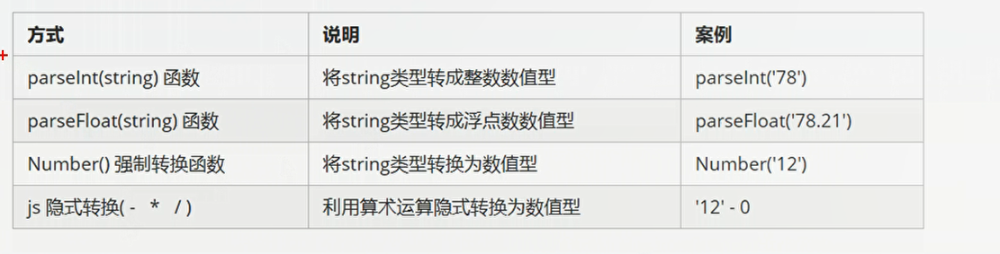

# JavaScript学习笔记

## 一、初步认识

### 1.概念
* JavaScript是世界上最流行的语言之一，是一种运行在客户端的脚本语言（Script是脚本的意思）
* 脚本语言：不需要编译，运行过程中由js解释器(js引擎)逐行来进行解释并执行
* 现在也可以基于Node.js技术进行服务器端编程

### 2.HTML/CSS/JS区别
* HTML决定网页结构和内容（决定看到什么），相当于人的身体
* CSS决定网页呈现给用户的模样（决定好不好看），相当于给人穿衣服、化妆
* JS实现业务逻辑和页面控制（决定功能），相当于人的各种动作

### 3.浏览器执行JS简介
浏览器分为两个部分：渲染引擎和JS引擎

* 渲染引擎：用来解析HTML与CSS，俗称内核，比如chrome浏览器的blink，老版本的webkit
* JS引擎：也成为JS解释器。用来读取网页中的JavaScript代码，对其处理后运行，比如chrome浏览器的V8

浏览器本身并不会执行JS代码，而是通过内置的JavaScipt引擎（解释器）来执行JS代码，JS引擎执行代码时逐行解释每一句源码（转化为机器语言），然后由计算机去执行，所以JavaScript语言归为脚本语言,会逐行解释执行。

### 4.JS的组成
  

**ECMAScript**是由ECMA国际进行标准化的一门编程语言，这种语言在万维网上应用广泛，他往往被称为JavaScript或者JScript，但实际上后两者是ECMAScript语言的实现和扩展。

  


也就是说ECMAScript规定了js的编程语法和基础核心知识，是所有浏览器厂商共同遵守的一套JS语法工业标准。


DOM:文档对象模型，是W3C组织推荐的处理可扩展标记语言的标准编程接口。**通过DOM提供的接口可以对页面上的各种元素进行操作（大小、位置、颜色等）**

BOM:浏览器对象模型，它提供了独立内容的、可以与浏览器窗口进行互动的对象结构，**通过BOM可以操作浏览器窗口，比如弹出框、控制浏览器跳转、获取分辨率等**。

## 二、初体验

**js有三种书写位置，分别为行内、内嵌、外部**

```js
<!DOCTYPE html>
<html lang="en">
<head>
    <meta charset="UTF-8">
    <meta http-equiv="X-UA-Compatible" content="IE=edge">
    <meta name="viewport" content="width=device-width, initial-scale=1.0">
    <title>Document</title>

    <!-- 内嵌式的js -->
    <script>
        // alert('xxxxxxxxxx')
    </script>
    <!-- 外部js写法  添加外部js文件  双标签 -->
    <script src = "my.js"></script>

</head>
<body>
    <!-- 1. 行内式的js 直接写入元素的内部 -->
    <!-- 点击这个button 弹出一个对话框 -->
    <input type = "button" value = "唐伯虎" onclick = "alert('石榴姐')">
    
</body>
</html>
```

### 2.1行内式JS

```js
<input type = "button" value = "点我试试" onclick = "alert('Hello World)"/>
```

* 可以将单行或者少量的js代码写在HTML标签的事件属性中（以on开头的属性），如:onclick
* 注意单双引号的使用：在HTML中我们推荐使用双引号，JS中我们推荐使用单引号
* 可读性差，在html中编写js大量代码时，不方便阅读
* 引号容易错，引号多层嵌套匹配时，非常容易弄混
* 特殊情况下使用

### 2.2 内嵌js
```js
<script>alert('hello world!);</script>
```

* 可以将多行js代码写进```script```
* 内嵌js是学习时常用的方式

### 2.3 外部Js文件
```js

<script src= "my.js"></script>
```

* 利用HTML页面代码结构化，把大段js代码独立到HTML页面之外，既美观，也方便文件级别的复用
* 引用外部js文件的script标签中间不可以写代码
* 适合于Js代码数比较多的情况下

### 2.4 注释

```js
// 单行注释 ctrl + /

/**/ 多行注释 默认的快捷键：shift + alt + a

```

### 2.5 输入输出语句

为了方便信息的输入输出，js提供了一些输入输出的语句，其常用的语句如下：
* alert(msg) 浏览器弹出警示框   
* console.log(msg)  浏览器控制台打印输出信息
* prompt(info)   浏览器弹出输入框，用户可以输入

测试代码:
```js
<!DOCTYPE html>
<html lang="en">
<head>
    <meta charset="UTF-8">
    <meta http-equiv="X-UA-Compatible" content="IE=edge">
    <meta name="viewport" content="width=device-width, initial-scale=1.0">
    <title>Document</title>

    <script>
        // 这是一个输出
        prompt('请输出你的年龄');
        // alert 弹出警示框  展示给用户看的
        alert('计算的结果是');

        // console  控制台输出   给程序员测试用的
        // 打开浏览器  按下f12 查看控制台输出语句
        console.log('我是程序员');
    </script>
</head>
<body>
    
</body>
</html>
```

## 三、变量
变量在使用时分为两步：1.声明变量 2.赋值

1.声明变量
```js
var age; //  声明一个名称为age的变量
age = 10;
```

* var是js的一个关键字，用来声明变量(variable变量的意思)。使用该关键字声明变量之后，计算机只会自动为变量分配内存空间，不需要程序员管
* age是程序员定义的变量名，我们要通过变量名来访问内存中分配的空间
* =代表赋值

2.变量的初始化
```js
var age = 19;
```
声明一个变量并赋值，我们称之为变量的初始化

3.案例使用1

  

```js
<!DOCTYPE html>
<html lang="en">
<head>
    <meta charset="UTF-8">
    <meta http-equiv="X-UA-Compatible" content="IE=edge">
    <meta name="viewport" content="width=device-width, initial-scale=1.0">
    <title>Document</title>
    <script>
        var myname = '孙悟空';
        var address = '花果山';
        var age = 30;
        var email = 'shililuzhou@outlook.com';
        var gz = 2000;

        console.log(myname);
        console.log(address);
        console.log(age);
        console.log(email);
        console.log(gz);
    </script>
</head>
<body>
    
</body>
</html>
```

效果图：


4. 案例使用2

```js
<!DOCTYPE html>
<html lang="en">
<head>
    <meta charset="UTF-8">
    <meta http-equiv="X-UA-Compatible" content="IE=edge">
    <meta name="viewport" content="width=device-width, initial-scale=1.0">
    <title>Document</title>
    <script>
        // 用户输入姓名 存储到一个myname变量中
        var myname = prompt('请输入您的名字');
        // 输出用户名
        alert(myname);
    </script>
</head>
<body>
    
</body>
</html>
```
5.更新变量
一个变量被重新赋值之后，它原有的值就会被覆盖，变量值将以最后一次赋值为准。

```js
<!DOCTYPE html>
<html lang="en">
<head>
    <meta charset="UTF-8">
    <meta http-equiv="X-UA-Compatible" content="IE=edge">
    <meta name="viewport" content="width=device-width, initial-scale=1.0">
    <title>Document</title>
    <script>
        var myname = 'xxx';
        console.log(myname);
        var myname = 'yyy';
        console.log(myname);
        // 声明多个变量
        var age = 19,address = '朝阳区',gz = 1000;

        // 输出未定义变量
        // undefined  js引擎 解释一句 执行一句
        // var aaa;
        // console.log(aaa);
        
        // js可以不声明 直接执行一条语句
        bbb = 10;
        console.log(bbb);

    </script>
</head>
<body>
    
</body>
</html>
```

6. 变量命名规范
  


## 四、数据类型

变量的数据类型，变量是用来存储值的所在处，他们有名字和数据类型，变量的数据类型决定了如何讲代表这些值的位存储到计算机内存中，javascript是一种弱类型或者说动态语言，这意味着不用提前声明变量的类型，在程序运行的过程，类型会被自动确定。

```js
var age = 10;// 这是一个数字型
var areYouOk = 'hhh';// 这是一个字符串类型
```
在代码运行时，变量的数据类型是由JS引擎根据 = 右边变量值的数据类型来判断的，运行完毕之后，变量就确定了类型。

**js是动态语言，数据类型可以发生变化**

数据类型的分类：
* 简单数据类型（Number,String,Boolean,Undefined,Null）
* 复杂数据类型（object）

### 4.1 简单数据类型


#### 4.1.1 数值类型

  

```js
<!DOCTYPE html>
<html lang="en">
<head>
    <meta charset="UTF-8">
    <meta http-equiv="X-UA-Compatible" content="IE=edge">
    <meta name="viewport" content="width=device-width, initial-scale=1.0">
    <title>Document</title>
    <script>
        var num = 010;// 八进制  前面加上一个0

        // 输出的时候全部转化为十进制
        console.log(num);

        var num1 = 0xa;
        console.log(num1);

    </script>
</head>
<body>
    
</body>
</html>
```

**JS中八进制前面加上0，十六进制前面加上0x**

```js
<!DOCTYPE html>
<html lang="en">
<head>
    <meta charset="UTF-8">
    <meta http-equiv="X-UA-Compatible" content="IE=edge">
    <meta name="viewport" content="width=device-width, initial-scale=1.0">
    <title>Document</title>
    <script>
        var num = 010;// 八进制  前面加上一个0

        // 输出的时候全部转化为十进制
        console.log(num);

        var num1 = 0xa;// 十六进制
        console.log(num1);// 十进制10
        
        // js中 数值的最大值和最小值
        alert(Number.MAX_VALUE);
        alert(Number.MIN_VALUE);

    </script>
</head>
<body>
    
</body>
</html>
```


javascript中数值的最大值和最小值
  


javascript中数值无穷大、无穷小
  


```javascript
<!DOCTYPE html>
<html lang="en">
<head>
    <meta charset="UTF-8">
    <meta http-equiv="X-UA-Compatible" content="IE=edge">
    <meta name="viewport" content="width=device-width, initial-scale=1.0">
    <title>Document</title>
    <script>
        var num = 010;// 八进制  前面加上一个0

        // 输出的时候全部转化为十进制
        console.log(num);
        var num1 = 0xa;
        console.log(num1);
        
        // js中 数值的最大值和最小值
        alert(Number.MAX_VALUE);
        alert(Number.MIN_VALUE);

        // 无穷大  无穷小
        alert(Infinity);// 无穷大
        alert(-Infinity);
        alert(NaN);// Not a Number 代表一个非数值
    </script>
</head>
<body>
    
</body>
</html>
```


isNaN用来判断是不是数字：
```javascript
console.log(isNaN(12))
console.log(isNaN('sss'))
```


#### 4.1.2 字符串类型

  


**外双内单，外单内双**

  


* 字符串的长度
```
var str = 'xxxx';
console.log(str.length);
```

* 字符串的连接
```javascript
<!DOCTYPE html>
<html lang="en">
<head>
    <meta charset="UTF-8">
    <meta http-equiv="X-UA-Compatible" content="IE=edge">
    <meta name="viewport" content="width=device-width, initial-scale=1.0">
    <title>Document</title>

    <script>
        var str1 = 'xxx';
        console.log(str1.length);

        // 字符串类型和其他类型进行拼接  还是字符串类型
        var str2 = 'xxxx' + 18;// 连接字符串 + 
        console.log(str2);
    </script>

</head>
<body>
    
</body>
</html>
```

* 小案例

```javascript
<!DOCTYPE html>
<html lang="en">
<head>
    <meta charset="UTF-8">
    <meta http-equiv="X-UA-Compatible" content="IE=edge">
    <meta name="viewport" content="width=device-width, initial-scale=1.0">
    <title>Document</title>

    <script>
        var age = prompt('你今年多大了');
        var str = '你今年'+age+'岁';
        alert(str);
    </script>

</head>
<body>
     
</body>
</html>
```

#### 4.1.3 布尔类型

  


#### 4.1.4 undefined NAN

undefined: 一个变量声明之后没有被赋值。

null： 一个变量为空值。

```javascript
<!DOCTYPE html>
<html lang="en">
<head>
    <meta charset="UTF-8">
    <meta http-equiv="X-UA-Compatible" content="IE=edge">
    <meta name="viewport" content="width=device-width, initial-scale=1.0">
    <title>Document</title>

    <script>
        var str;
        console.log(str);
        var str1 = undefined;
        console.log('xxx' + str1);// 变成字符串类型
        console.log(str1 + 1);// undefined 和 数字相加 最后结果是NAN
        var str2 = null;
        console.log('xxx' + str2);// 结果是字符串
        console.log(str2 + 1);// 结果是1
    </script>

</head>
<body>
    
</body>
</html>
```

检测数据类型：typeof

通过测试可以发现 通过prompt输入进来的数据都是字符串类型的


## 五、数据类型转换

### 5.1 数字类型转换为字符串类型

  


```javascript
<!DOCTYPE html>
<html lang="en">
<head>
    <meta charset="UTF-8">
    <meta http-equiv="X-UA-Compatible" content="IE=edge">
    <meta name="viewport" content="width=device-width, initial-scale=1.0">
    <title>Document</title>

    <script>
        var str = 10;
        var str1 = str.toString();// 转换为字符串类型
        console.log(typeof str1);

        var str2 = String(str);// 转换为字符串类型
        console.log(typeof str2);

    </script>

</head>
<body>
    
</body>
</html>
```

### 5.1 字符串转换成数字型

  

**要注意 这里的隐式转换没有加号，加号是数值型变成字符串的隐式转换**

```javascript
<!DOCTYPE html>
<html lang="en">
<head>
    <meta charset="UTF-8">
    <meta http-equiv="X-UA-Compatible" content="IE=edge">
    <meta name="viewport" content="width=device-width, initial-scale=1.0">
    <title>Document</title>

    <script>
        var str = '123';
        console.log(parseInt(str));// string转换成整数数值类型

        var str1 = '3.14';
        console.log(parseFloat(str1)); // string转换成浮点数类型

        //使用Number()强制转换函数  将string类型转换为数值型
        console.log(Number(str));
        // 利用隐式转换  字符串型自动转换为数值型
        console.log('12' - 0);
    </script>

</head>
<body>
    
</body>
</html>
```

案例1:
```javascript
// 隐式转换案例
       var age = prompt('请输入你的年龄');
       var output = 2018 - age;// age是字符串类型 减法运算 自动转换成数值类型
       console.log(output);
       alert(output);
```

案例2：

```javascript
<!DOCTYPE html>
<html lang="en">
<head>
    <meta charset="UTF-8">
    <meta http-equiv="X-UA-Compatible" content="IE=edge">
    <meta name="viewport" content="width=device-width, initial-scale=1.0">
    <title>Document</title>

    <script>
       var a = prompt("请输入第一个数：");
       var b = prompt("请输入第二个数：");

    
       var result = parseFloat(a) + parseFloat(b);// 这里加号不可以使用隐式转换 只有-*/可以使用


       alert('运算结果是：' + result);// 数值型转换成字符串型： 字符串的拼接

    </script>

</head>
<body>
    
</body>
</html>
```


### 5.2 转换成布尔型

  


```javascript
// 转换成布尔类型
      console.log(Boolean(null));
      console.log(Boolean(undefined));
      console.log(Boolean(null));
      console.log(Boolean(123));
      console.log(Boolean('你好吗'));
```


