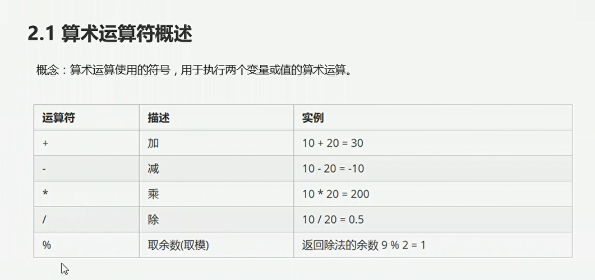
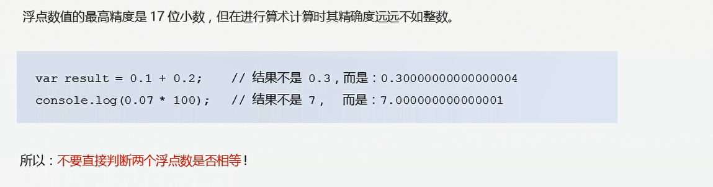
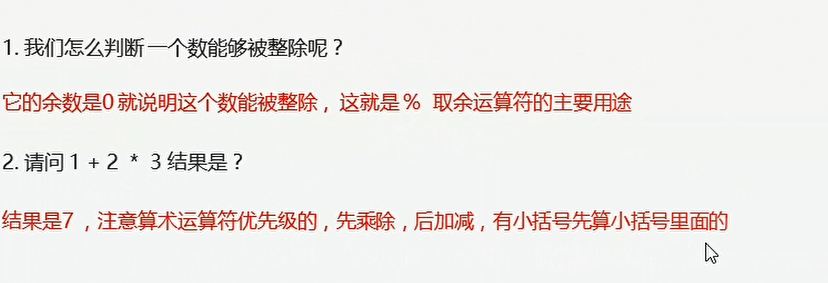
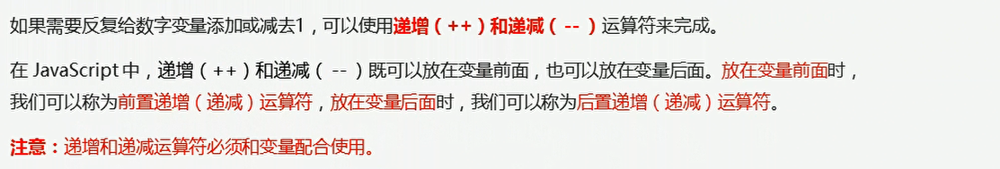
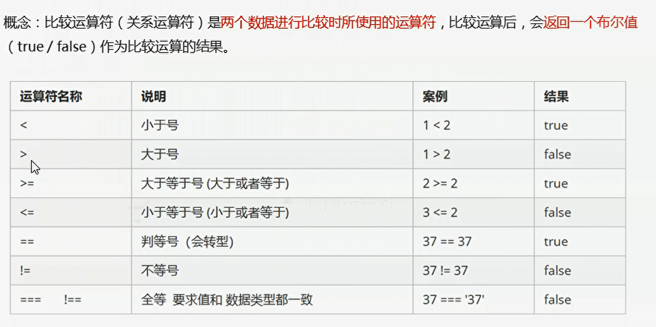
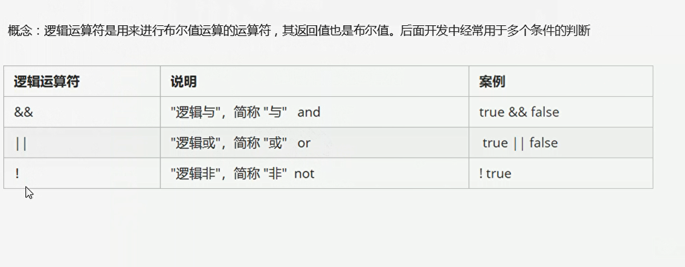
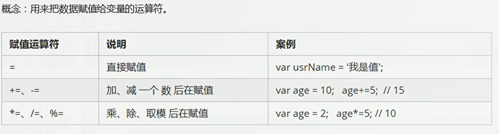
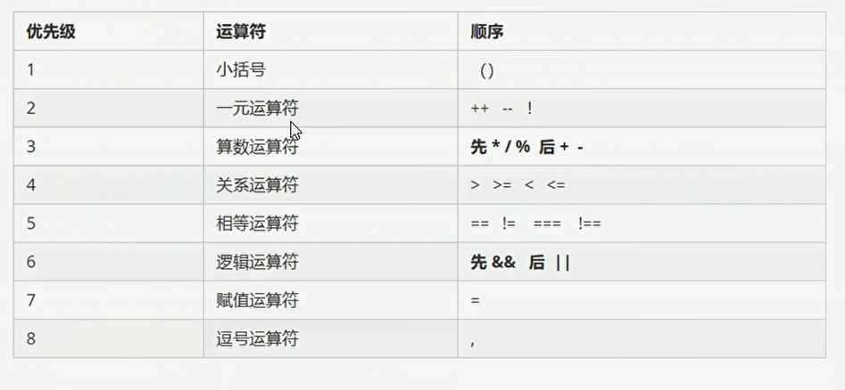

# 02-javascript学习笔记-运算符

## 一、算数运算符

  

  

```javascript
    console.log(3 + 1);
    console.log(3 * 1);
    console.log(3 - 1);
    console.log(3 / 1);
    console.log(0.1 + 0.2);// 浮点数直接计算会出现误差（小数使用二进制表示会出现误差）
```
  


## 二、递增和递减运算符


### 2.1 前置递增运算符
  

```javascript
<!DOCTYPE html>
<html lang="en">
<head>
    <meta charset="UTF-8">
    <meta http-equiv="X-UA-Compatible" content="IE=edge">
    <meta name="viewport" content="width=device-width, initial-scale=1.0">
    <title>Document</title>
    <script>
        var s = 10;
        console.log(++s + 10);// 前置递增运算符
        // 先加一 再返回值
    </script>

</head>
<body>
    
</body>
</html>
```


### 2.2 后置递增运算符
先返回原值，再加一

## 三、比较运算符

  

需要注意：```console.log(18 == '18'); // true```

## 四、逻辑运算符
  

短路运算：当有多个表达式，左边的表达式值可以确定结果时，就不再继续运算右边的表达式的值；


### 4.1 逻辑与
* 语法：表达式1 && 表达式2
* 如果第一个表达式的值为真，则返回表达式2
* 如果第一个表达式的值为假，则返回表达式1

### 4.2 逻辑或
* 语法：表达式1 || 表达式2
* 如果第一个表达式的值为真，则返回表达式1
* 如果第一个表达式为假，则返回表达式2

下面这个案例输出的是0
```javascript
var num = 0;
console.log(123 || num++);// 123为真，返回123,num++不执行 
console.log(num);
```

## 五、赋值运算符
  


## 六、运算符优先级

  


