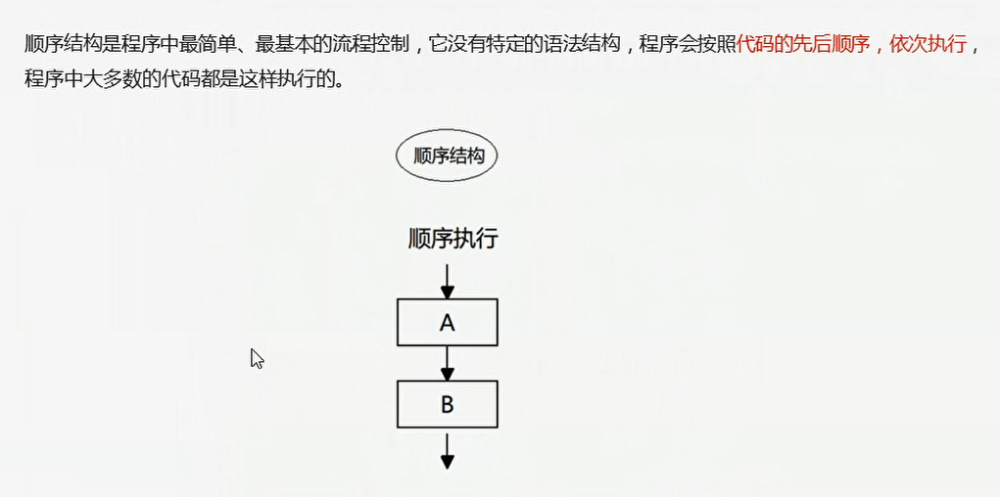
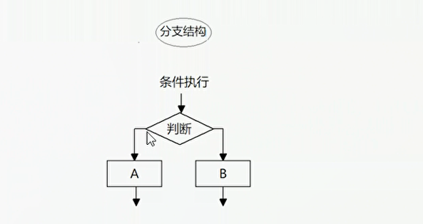
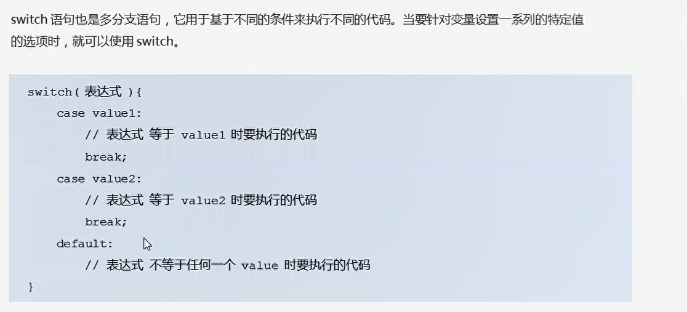
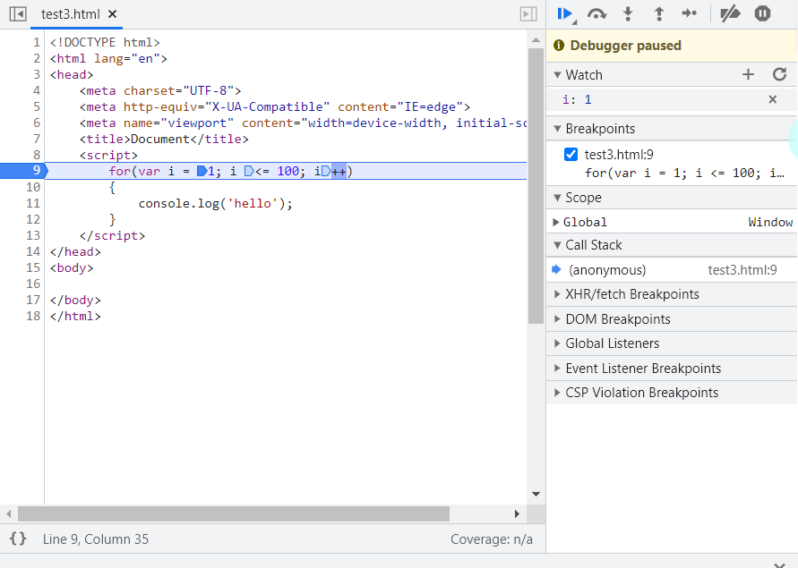

# 03-javascript学习笔记-流程控制

## 一、顺序结构
  


## 二、分支流程控制

由上到下执行代码的过程中，根据不同的条件，执行不同的路径代码（执行代码多选一的过程），从而得到不同的结果

  

js语言提供了两种分支结构语句：if语句，switch语句

```
if(条件表达式)
{
    //执行语句
}

```

```javascript
<script>
    var string = prompt('请输入你的年龄：');
    if(string >= 18)
    {
        alert('我想要带你去网吧偷耳机');
    }
    else{
        alert('滚！');
    }
</script>
```

判断是否是闰年：

```javascript
<script>
    var string = prompt('请输入年份：');
    if(string % 4 == 0 && string % 100 != 0 || string % 400 == 0)
    {
        alert('闰年');
    }
    else{
        alert('不是闰年');
    }
</script>
```

关于条件表达式：
```
条件表达式 ？表达式1 : 表达式2
```
如果条件表达式结果为真 则返回表达式1的值，如果条件表达式的结果是假 则返回表达式2的值


关于switch-case语句：

  

```javascript
<script>
        var num = 2;
        switch(num){
            case 1:
                console.log('1');
                break;

            case 2:
                console.log('匹配');
                break;

            default:
                console.log('匹配不成功！');

        }


    </script>
```

## 三、循环结构

### 3.1 for循环

```javascript
for(var i = 0; i <= 100; i++)
{
    console.log('Hello');
}
```

### 3.2 断点调试

浏览器中按下F12-->sources-->找到需要调试的文件-->在程序的某一行设置断点
watch:监视，通过watch可以监视变量的值得变化，非常的常用。
F11：程序单步执行，让程序一行一行的执行，这个时候，观察watch中变量的值得变化

  

点击source,点击相应的文件，鼠标点击左边得行号，设置断点，刷新一下页面，发现控制台并没有任何输出（因为程序在此处停止），然后按下F11,执行下一条语句，然后查看控制台。watch可以看出相关变量的值。

```javascript
<!DOCTYPE html>
<html lang="en">
<head>
    <meta charset="UTF-8">
    <meta http-equiv="X-UA-Compatible" content="IE=edge">
    <meta name="viewport" content="width=device-width, initial-scale=1.0">
    <title>Document</title>
    <script>
        // 求1~100之间所有数字的平均值
        var sum = 0;
        var average = 0;
        for(var i= 1; i <= 100; i++)
        {
            sum = sum + i;
        }
        average = sum / 100;
        console.log(average);

        // 求1-100之间所有偶数和奇数的和

        var sum1 = 0;
        var sum2 = 0;
        for(var i = 1; i<= 100; i++)
        {
            if(i % 2 == 0)
            {
                sum1 += i;
            }
            else
            {
                sum2 += i;
            }
        }
        console.log('1-100之间所有的偶数和是:' + sum1);
        console.log('1-100之间所有的奇数和是:' + sum2);
    </script>
</head>
<body>
    
</body>
</html>
```

### 3.3 案例：打印星星

打印五行五列星星、倒立直角三角形，通过循环嵌套来实现。

```javascript
    <script>
        // 打印五行星星
        var str = '';

        for(var i = 1; i <= 5; i++)
        {
            for(var j = 1; j <= 5; j++)
            {
                str = str + '*';
            }
            str += '\n';
        }
        console.log(str);
    </script>

```


打印倒三角形。（分析比写代码更加重要）
```javascript
<script>
    // 打印五行星星
    var str = '';

    for(var i = 1; i <= 5; i++)
    {
        // 打印倒三角形
        for(var j = i; j <= 5; j++)
        {
            str = str + '*';
        }
        str += '\n';
    }
    console.log(str);
</script>
```

打印正三角形

```javascript
   <script>
        // 打印五行星星
        var str = '';

        for(var i = 1; i <= 5; i++)
        {
            // 打印正三角形
            for(var j = 1; j <= i; j++)
            {
                str = str + '*';
            }
            str += '\n';
        }
        console.log(str);
    </script>
```

打印九九乘法表
```javascript
   <script>
        // 打印五行星星
        var str = '';

        for(var i = 1; i <= 9; i++)
        {
            // 打印九九乘法表
            for(var j = 1; j <= i; j++)
            {
                str = str + j + 'x' + i + '=' + i * j + '\t';
            }
            str += '\n';
        }
        console.log(str);
    </script>
```


### 3.4 while循环

```javascript
var num = 1;
while(num <= 100)
{
    console.log('xxx');
    num++;
}

```


### 3.5 continue break

计算1-100之间可以被7整除以外所有数的和,contine可以跳出本次循环。

```javascript
var sum = 0;
for(var i = 1; i <= 100; i++)
{
    if(i % 7 == 0)
    {
        continue;
    }
    sum += i;
}
```

不同的是，Break语句直接跳出整个循环。


