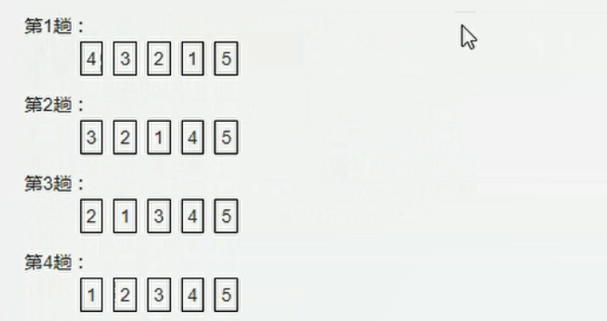

# 04-javascript学习笔记-数组

## 一、创建数组的两种方式

* 利用New创建数组
* 利用数组字面量创建数组

```javascript
// 利用new创建数组
var arr = new Array();

// 使用数组字面量创建数组 []
var arr1 = [];// 创建一个空的数组
var arr2 = [1,2,'夏老师',true];// 一个数组可以存储不同类型的数据

```

获取数组元素，通过索引号开始，索引号从0开始


## 二、遍历数组

```javascript
<script>
    var s = [1,2,3,4,5,6,7];
    // length属性获取数组长度
    for(var i = 0; i < s.length; i++)
    {
        console.log(s[i]);
    }
</script>
```

查找数组的最大值：
```javascript
<script>
    // 打印数组的最大值

    var s = [1,5,1,2,0,67,8,3,2,312,31];
    var max = s[0];

    for(var i = 1; i < s.length; i++)
    {
        if(max < s[i])
        {
            max = s[i];
        }
    }
    console.log('最大值：'+ max);
</script>
```

数组转换为分割字符串：将数组['red','green','blue','pink']转化为字符串，并且用|或者其他符号分割输出：'red|green|blue|pink|'

```javascript
<script>
    var str = '';
    var sep = '|';

    var s = ['red','green','pink'];
    for(var i = 0; i < s.length; i++)
    {
        str = str + s[i] + sep;
    }

    console.log(str);

</script>
```


## 三、修改数组长度

* 可以通过修改数组length来实现数组扩容的目的
* length属性是可读可写的
* 但是，新开辟的数组空间，由于没有元素赋值，默认值就是undefined。
* 也可以通过索引号直接修改数组元素

## 四、数组案例

### 4.1 删除数组元素

要求：将数组[2,0,6,1,77,0,52,0,25,7]中所有的0去掉，形成一个不包含0的新数组。


```javascript
<script>
    var arr = [2,0,6,1,77,0,52,0,25,7];
    var newArr = [];

    for(var i = 0; i < arr.length; i++)
    {
        if(arr[i] != 0)
        {
            newArr[newArr.length] = arr[i];
        }
    }

    console.log(newArr);
</script>

```

### 4.2 冒泡排序

冒泡排序是一种简单的排序算法，他重复的走访过要排序的数列，一次比较两个元素，如果顺序错误就把他们交换过来，n个元素的数组需要走访n - 1趟。

  


对于冒泡排序，需要明确以下两点：
* 一共需要的趟数：数组长度减一 arr.length - 1
* 对于每一趟需要比较的次数：第i趟比较（外层循环i从0开始）,arr.length - i  - 1


```javascript
  <script>
       var arr = [5,4,3,2,1];
       // 冒泡排序

       for(var i = 0; i < arr.length - 1; i++)
       {
           // 外层循环控制趟数
           for(var j = 0; j < arr.length - i - 1; j++)
           {
               // 内层循环控制每一趟的比较次数
               // 交换数据
               if(arr[j] > arr[j + 1])
               {
                   var temp = arr[j];
                   arr[j] = arr[j + 1];
                   arr[j + 1] = temp;
               }
           }
       }

       console.log(arr);
    </script>
```


