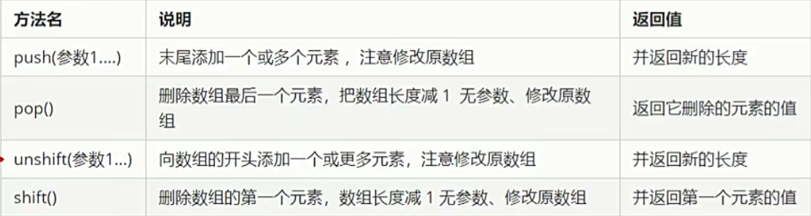
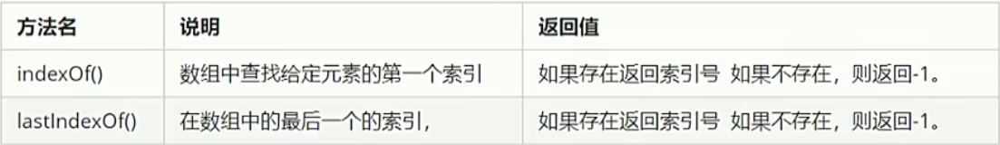
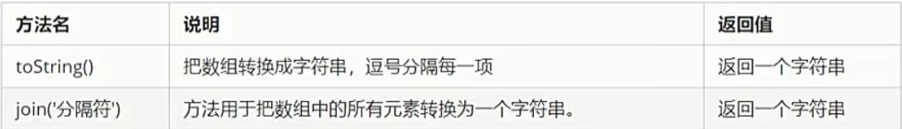
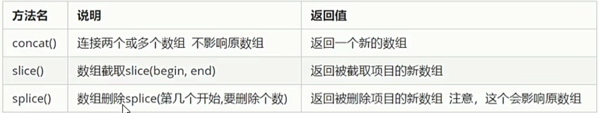
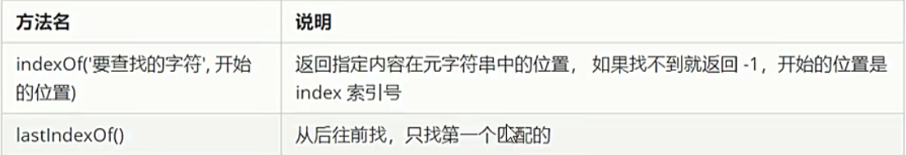
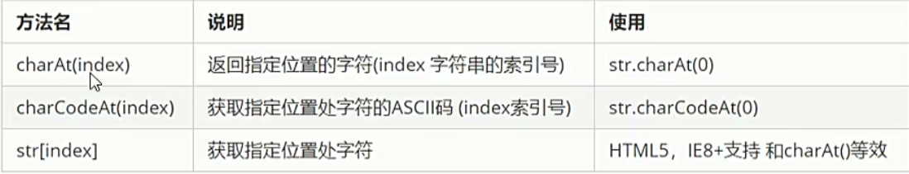
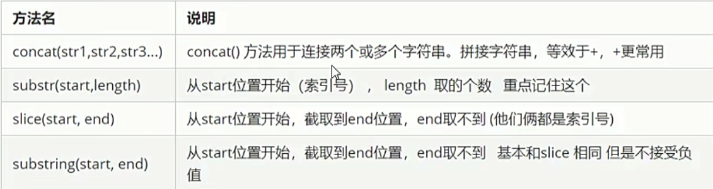

# javascript学习笔记-面向对象

JavaScript中，现阶段我们可以采用三种方式创建对象

* 利用字面量创建对象
* 利用New Object创建对象
* 利用构造函数创建对象

## 一、利用字面量创建对象

```js
var obj = {
    uname:'张三',
    age:18,
    sex:'男',
    sayHi: function(){
        console.log('hi~');
    }
}

```
(1) 里面的属性或者方法我们采用键值对的形式 键 属性名：值 属性值
(2) 多个属性或者方法中间用逗号隔开的
(3) 方法冒号后面跟的是一个匿名函数

调用对象还有两种方法：
(1) 调用对象的属性 我们采取对象名.属性名 我们理解为console.log(obj.uname);
(2) 调用属性还有一种方法 对象名['属性名'], console.log(obj['uname']);

## 二、使用new Object()创建对象

```js
var obj = new Object();  // 创建了一个空的对象
obj.uname = '张三丰';
obj.age = 18;
obj.sex = '男';

// 我们是利用等号 =赋值的方法 添加对象的属性和方法

```

```js
<!DOCTYPE html>
<html lang="en">
<head>
    <meta charset="UTF-8">
    <meta http-equiv="X-UA-Compatible" content="IE=edge">
    <meta name="viewport" content="width=device-width, initial-scale=1.0">
    <title>Document</title>
    <script>
        var a = new Object();// 创建了一个空的对象
        // 创建属性 并赋值
        obj.uname = '张三丰';
        obj.age = 18;
        obj.sex = '男';
        obj.sayHi = function(){
            console.log("hi~");
        }
        
        // 对象名.属性名 / 对象名['属性名'] / 对象名.函数名 
        console.log(obj.uname);
        console.log(obj['sex']);
        obj.sayHi();
    </script>
</head>
<body>
    
</body>
</html>

```

## 三、使用构造函数创建对象
构造函数：是一种特殊的函数，主要是用来初始化对象，即为对象成员变量赋初始值，它总与new运算符一起使用。我们可以把对象中一些公共的属性和方法抽取出来，然后封装到这个函数里面。

```js
<!DOCTYPE html>
<html lang="en">
<head>
    <meta charset="UTF-8">
    <meta http-equiv="X-UA-Compatible" content="IE=edge">
    <meta name="viewport" content="width=device-width, initial-scale=1.0">
    <title>Document</title>

    <script>
        // new 构造函数名（）
        function Star(uname,age,sex){
            this.name = uname;
            this.age = age;
            this.sex = sex;
        }
        var ldh = new Star('刘德华',18,'男');
        console.log(typeof ldh);
        // 构造函数名字首字母要大写
        // 我们构造函数不需要return 就可以返回结果

        var zs = new Star('张三',11,'男');
        console.log(zs.name);
        console.log(zs.age);

    </script>
</head>
<body>
    
</body>
</html>
```
// 构造函数 泛指某一大类 它类似于java语言中的类
// 对象 特指 具体事物


new 关键字执行过程：

* new 构造函数可以在内存中创建一个空的对象
* this 就会指向刚才创建的空对象
* 执行构造函数里面的代码 给这个空的对象添加属性和方法
* 返回这个对象

```js
<!DOCTYPE html>
<html lang="en">
<head>
    <meta charset="UTF-8">
    <meta http-equiv="X-UA-Compatible" content="IE=edge">
    <meta name="viewport" content="width=device-width, initial-scale=1.0">
    <title>Document</title>

    <script>
       var obj = {
            name:'晓凡老师',
            sex:'女',
            age:18,
            fn:function(){
                console.log("hhhh")
            }
       }
        // 遍历对象的属性
        for(var k in obj){
            console.log(k); // k变量输出 得到的是属性名
            console.log(obj[k]); // 得到的是属性值
        }

    </script>
</head>
<body>
    
</body>
</html>
```


## 四、JS内置对象

* JavaScript中的对象分为三种：自定义对象，内置对象，浏览器对象
* 前两种对象都是JS基础内容，属于ECMAScript;第三个浏览器对象属于我们JS独有的

### 4.1 math内置对象

Math是一个内置对象，它拥有一些数学常数属性和数学函数方法。Math不是一个函数对象。

```js
<!DOCTYPE html>
<html lang="en">
<head>
    <meta charset="UTF-8">
    <meta http-equiv="X-UA-Compatible" content="IE=edge">
    <meta name="viewport" content="width=device-width, initial-scale=1.0">
    <title>Document</title>
    <script>
        // 利用对象封装自己的数学对象 里面有PI 最大值 最小值函数
        var myMath = {
            PI:3.141592653,
            max: function(){
                var max = arguments[0];
                for(var i = 1; i < arguments.length; i++)
                {
                    if(max < arguments[i])
                    {
                        max = arguments[i];
                    }
                }
                return max;
            },
            min: function(){
                var min = arguments[0];
                for(var i = 1; i < arguments.length;i++)
                {
                    if(min > arguments[i])
                    {
                        min = arguments[i];
                    }
                }
                return min;
            }
        }

        console.log(myMath.PI);
        console.log(myMath.max(1,5,9));
        console.log(myMath.min(1,5,9));
    </script>
</head>
<body>
    
</body>
</html>

```

```js
* Math.PI // 圆周率
* Math.floor() // 向下取整
* Math.ceil() // 向上取整
* Math.round()  // 四舍五入版 就近取整
* Math.abs() // 绝对值
* Math.max()  // 最大值
```


### 4.2 Date内置对象

```js
<!DOCTYPE html>
<html lang="en">
<head>
    <meta charset="UTF-8">
    <meta http-equiv="X-UA-Compatible" content="IE=edge">
    <meta name="viewport" content="width=device-width, initial-scale=1.0">
    <title>Document</title>
    <script>
       // Date() 日期对象 是一个构造函数 必须使用new来调用创建我们的日期对象
       var date = new Date();// 没有参数 返回当前系统的当前时间
       console.log(date);

       // 参数常用的写法 字符串型'2019-10-1 8:8:8'
       var date1 = new Date('2019-10-1 8:8:8');
       console.log(date1);
    </script>
</head>
<body>
</body>
</html>

```

```js
<!DOCTYPE html>
<html lang="en">
<head>
    <meta charset="UTF-8">
    <meta http-equiv="X-UA-Compatible" content="IE=edge">
    <meta name="viewport" content="width=device-width, initial-scale=1.0">
    <title>Document</title>

    <script>
        // 格式化日期 时分秒
        var date = new Date();
        console.log(date.getHours());
        console.log(date.getMinutes());
        console.log(date.getSeconds());

        // 要求封装一个函数 返回当前的时分秒 格式08:08:08
        function getTimer(){
            var time = new Date();
            var h = time.getHours();
            h = h < 10 ? '0' + h : h;
            var m = time.getMinutes();
            m = m < 10 ? '0' + m : m;
            var s = time.getSeconds();
            s = s < 10 ? '0' + s:s;
            return h + ':' + m + ':' + s;
        }
        console.log(getTimer());
    </script>
</head>
<body>
    
</body>
</html>

```


### 4.3 案例分析


* 核心算法：输入的时间减去现在的时间就是剩余的时间，即倒计时，但是不能拿着时分秒相减，比如05分减去25分，结果变成负数
* 用时间戳来做。用户输入的时间总的毫秒数减去现在的时间的总毫秒数，得到的就是剩余时间的毫秒数
* 把剩余时间的总毫秒数值转换为天、时、分、秒（时间戳转换为时分秒）

```js
<!DOCTYPE html>
<html lang="en">
<head>
    <meta charset="UTF-8">
    <meta http-equiv="X-UA-Compatible" content="IE=edge">
    <meta name="viewport" content="width=device-width, initial-scale=1.0">
    <title>Document</title>

    <script>
        function countDown(time){
            var nowTime = +new Date();// 获取当前时间的总毫秒数
            var inputTime = +new Date(time);// 返回的是用户输入时间总的毫秒数
            var times = (inputTime - nowTime) / 1000;// times是剩余时间总的秒数

            var d = parseInt(times / 60 / 60 / 24);

            d = d < 10 ? '0' + d : d;
            var h = parseInt(times / 60 / 60 % 24);
            h = h < 10 ? '0' + h : h;
            var m = parseInt(times / 60 % 60);
            m = m < 10 ? '0' + m : m;
            var s = parseInt(times % 60);
            s = s < 10 ? '0' + s:s;

            return d + "天" + h + "时" + m + "分" + s + "秒";
        }
        console.log(countDown('2022-5-1 18:00:00'));
    </script>

</head>
<body>
    
</body>
</html>
```

### 4.4 数组对象

* 数组字面量
* new Array()

```js
<!DOCTYPE html>
<html lang="en">
<head>
    <meta charset="UTF-8">
    <meta http-equiv="X-UA-Compatible" content="IE=edge">
    <meta name="viewport" content="width=device-width, initial-scale=1.0">
    <title>Document</title>
    <script>
        // 利用字面量
        var arr = [1,2,3];
        console.log(arr[0]);

        // 利用new array
        var arr1 = new Array();// 创建一个空的数组
        var arr3 = new Array(2);  // 创建一个空数组 数组长度是2
        var arr2 = new Array(2,3); //等价于创建[2,3]
    </script>
</head>
<body>
    
</body>
</html>

```

* 使用instanceof 判断是否是数组类型 ```arr1 instanceof Array```
* push给数组末尾追加新的元素
* unshift 在数组开头添加一个或者多个新的数组元素
* pop 删除数组最后一个元素，删除之后 返回那个元素
* shift 删除数组第一个元素

  

```js
<!DOCTYPE html>
<html lang="en">
<head>
    <meta charset="UTF-8">
    <meta http-equiv="X-UA-Compatible" content="IE=edge">
    <meta name="viewport" content="width=device-width, initial-scale=1.0">
    <title>Document</title>
    <script>
        var arr = ['pink','red','blue'];
        arr.reverse();// 数组翻转
        console.log(arr);

        var arr1 = [3,4,7,1];
        arr1.sort();// 数组排序

        // 数组升序/降序
        arr1.sort(function(a,b){ 
            return a - b;// a - b升序排列   b - a 降序排列 
        });

        console.log(arr1);
        
    </script>
</head>
<body>
</body>
</html>
```

  


  

  

```js
<!DOCTYPE html>
<html lang="en">
<head>
    <meta charset="UTF-8">
    <meta http-equiv="X-UA-Compatible" content="IE=edge">
    <meta name="viewport" content="width=device-width, initial-scale=1.0">
    <title>Document</title>
    <script>
        // toString() 将我们的数组转换成字符串
        var arr = [1,2,3];
        console.log(arr.toString());
        
        // join 分隔符
        var arr1 = ['green','blue','pink'];
        console.log(arr1.join());
        console.log(arr1.join('-'));
        console.log(arr1.join('&'));
    </script>
</head>
<body>
    
</body>
</html>
```

### 4.5 基本包装类型

为了方便操作基本数据类型，JavaScript还提供了三个特殊的引用类型：String、Number和Boolean。

基本包装类型就是把简单数据类型包装成为复杂数据类型，这样基本数据类型就有了属性和方法。

```js
var str = 'andy';
console.log(str.length);

```

按道理基本数据类型是没有属性和方法的，而对象才有属性和方法，但是上面代码却可以执行，这是因为js将基本数据类型包装成复杂数据类型，执行过程如下：
```js
// 首先 生成临时变量 将简单类型包装成复杂数据类型
var temp = new String('andy');

// 赋值给我们声明的字符变量
str = temp;

// 销毁临时变量
temp = null;

```

关于字符串的不可变性：指的是里面的值不可变，虽然看上去可以改变内容，但是地址变化了，内存中新开辟了一个内存空间。

```js
var str = 'abc';
str = 'hello';

// 当重新给str赋值的时候，常量'abc'不会被修改，依然存在于内存中
// 重新给字符串赋值，会重新在内存中开辟空间，这个特点就是字符串的不可变
// 由于字符串的不可变，在大量拼接字符串的时候会有效率问题，开辟新的内存空间

```

同样的，字符串的所有方法，都不会修改字符串本身（字符串时不可变的），操作完成之后返回一个新的字符串。

  

  

```js
<!DOCTYPE html>
<html lang="en">
<head>
    <meta charset="UTF-8">
    <meta http-equiv="X-UA-Compatible" content="IE=edge">
    <meta name="viewport" content="width=device-width, initial-scale=1.0">
    <title>Document</title>
    <script>
        var str = 'andy';
        console.log(str.charAt(3));
        // 遍历所有的字符
        for(var i = 0; i < str.length; i++)
        {
            console.log(str.charAt(i));
        }

        console.log(str.charCodeAt(0));
        console.log(str[0]);
    
    </script>
</head>
<body>
    
</body>
</html>

```

  


