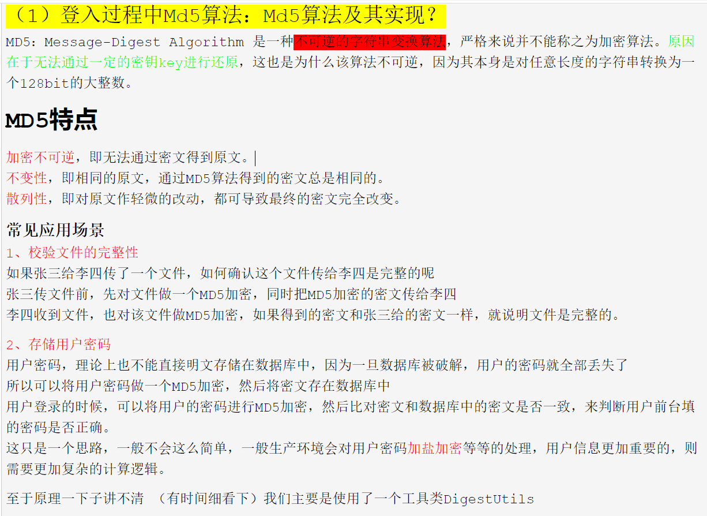

# 简历面试回答问题

##  实习

科大讯飞的实习：

* 完成反馈处理记录的增删改查接口

关注handleFeedBack处理接口和deleteFeedBack处理接口，页面表单的信息被整合到feedBackDtos集合，通过post请求提交，调用opsService接口的CreateHandleFeedBack方法，之后查询处理记录的id是否存在，来决定插入操作还是更新操作

* 在所有模型的页面添加筛选项接口，支持筛选模型是否发布到数据地图
  
阅读数据地图的查询接口，搞清楚代码流程 2. 自己编写一个接口，查询所有已经发布的模型 3. 改写search查询接口，改写modelDataSearchDTO,添加publish字段 以及在modelSearchDTO添加，改写ModelMapper.xml查询条件，写sql语句

* 优化测试作业统计逻辑，去除巡检用例的测试作业数量

代码流程：CaseReportWebServiceImpl中的getNumByCaseReportCase方法来统计测试作业数量，逻辑是循环一个测试用例，每一个测试用例有多个测试任务，最后取出这些测试用例的测试任务 进行累加即可 ,其中CaseJobCnt（测试用例的测试任务）变量是通过查询t_case_job表中的id得到的集合，针对每一个Id查询任务，任务不为空，CaseJobCn变量加一 2. 改写CaseReportMapper.xml中的查询语句

## 外卖项目

  

1.项目怎么识别用户登录的状态呢？
 前端的请求头里面会携带一个登录检验成功token，用token去识别session里面存储的数据。 这个token就相当于身份证。拿到身份证，就返回对应信息。

2.项目里redis 做什么用？

 redis主要是一个中间件，减少直接访问数据库的操作。 譬如大量查询到数据库的同时存在修改操作，那么查询的数据就不能保持一致，就是出错了。 redis就是为了减少错误，还有读取速度很快。直接从redis拿数据很快。而且redis也可以作为临时存储的数据。可以定时清理。

md5加密算法
  

