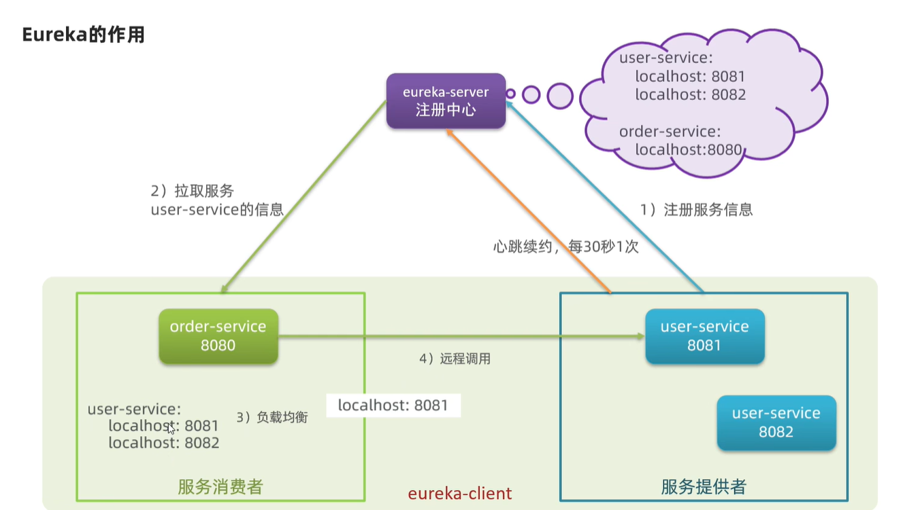

# EureKa

## 远程调用的问题

**多个服务有多个端口，这样的话服务有多个，硬编码不太适合**

  

## eureKa的作用
* 将service的所有服务的端口全部记录下来 想要的话 直接从注册中心查询
* 对于所有服务 每隔一段时间需要想eureKa发送请求 保证服务还存活

  

  

## 动手实践

### 搭建eureKa注册中心

  

三步走：

* 引入服务端依赖
* 添加注解
* 配置

### 注册user-service
**将service服务注册到eureka服务，order服务一样**
* 两步走
* 引入依赖
* 添加客户端配置  记得注意服务的名称

  

总结一下：
* 引入eureka-client依赖
* 在applicatin.yml中配置eureka地址

### 在order-service完成服务拉取

&emsp;服务拉取是基于服务名称获取服务列表，然后在对服务列表做负载均衡

  

* 引入eureka-client依赖
* 在application.yml中配置eureka地址
* 给restTemplate添加@LoadBalanced注解  因为有多个服务 添加该注解  可以动态选择服务 达到负载均衡
* 用服务提供者的服务名称远程调用

