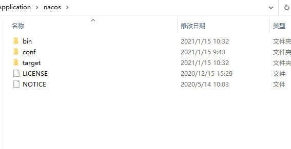
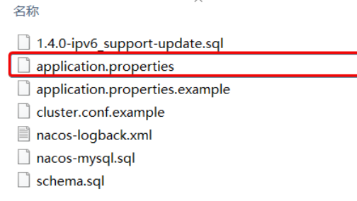
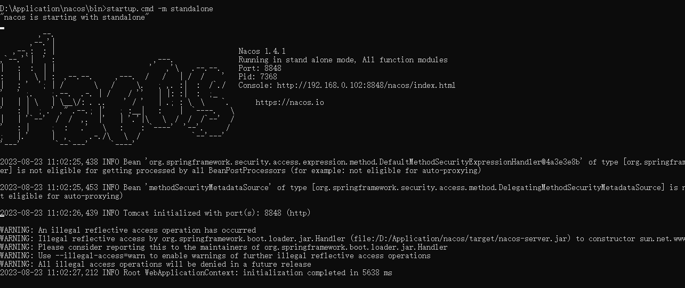
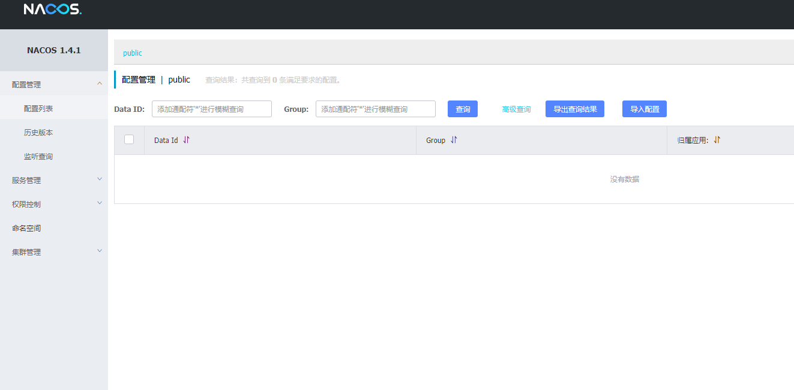

# Nacos简单入门

## 快速安装


在Nacos的GitHub页面，提供有下载链接，可以下载编译好的Nacos服务端或者源代码：

下载完压缩包之后，放在任意目录下面进行解压：

GitHub主页：https://github.com/alibaba/nacos

GitHub的Release下载页：https://github.com/alibaba/nacos/releases


bin：启动脚本
conf：配置文件

  


## 端口配置

Nacos的默认端口是8848，如果你电脑上的其它进程占用了8848端口，请先尝试关闭该进程。

**如果无法关闭占用8848端口的进程**，也可以进入nacos的conf目录，修改配置文件中的端口：

  

## 启动

进入bin目录 ，执行命令：

```
startup.cmd -m standlone

```
  


访问nacos

  

