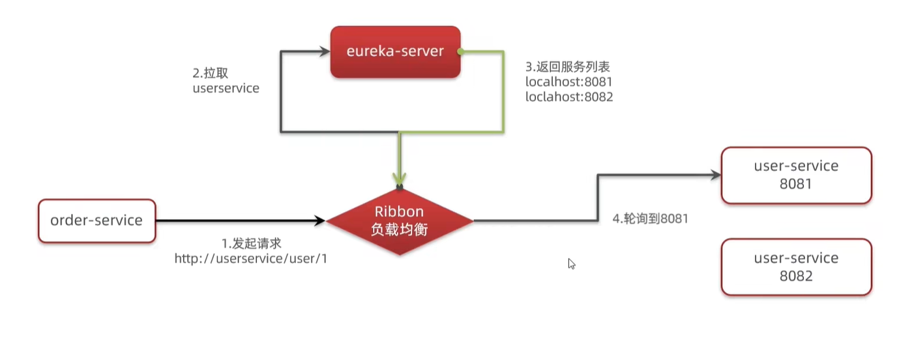
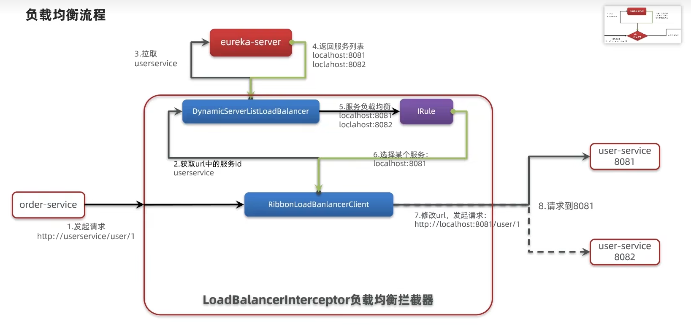
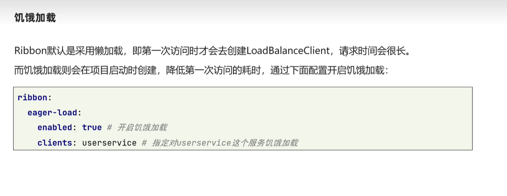

# Ribbon负载均衡


## 简单介绍

&emsp;OrderService发送请求 请求eureka server 返回服务userService列表

  

  

**默认负载均衡的规则是顺序的**


## 设置负载均衡规则

### 方式一

**在OrderService中对OrderAppplication添加如下代码，设置随机负载均衡**

```java
    @Bean
    public IRule randomRule(){
        return new RandomRule();// 使用随机的负载均衡机制
    }

```


### 方式二

* 在OrderService中的yml文件配置
```
userservice:
  ribbon:
    NFLoadBalancerRuleClassName: com.netflix.loadbalancer.RandomRule # 负载均衡规则

```

## 饥饿加载

**开启饥饿加载之后 需要指定对哪一个service进行加载**

  


