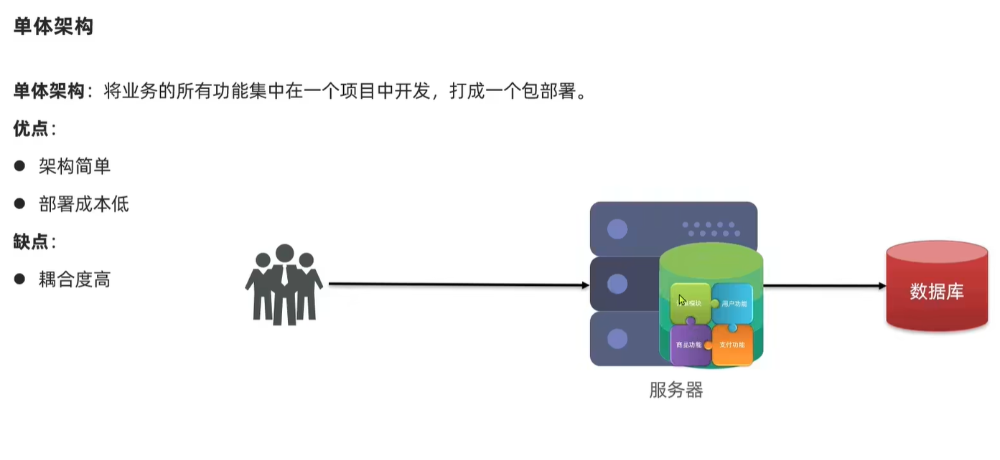
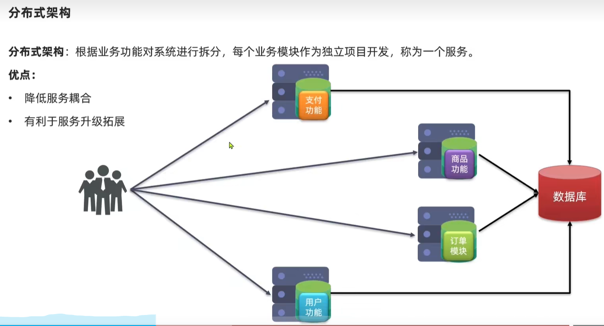
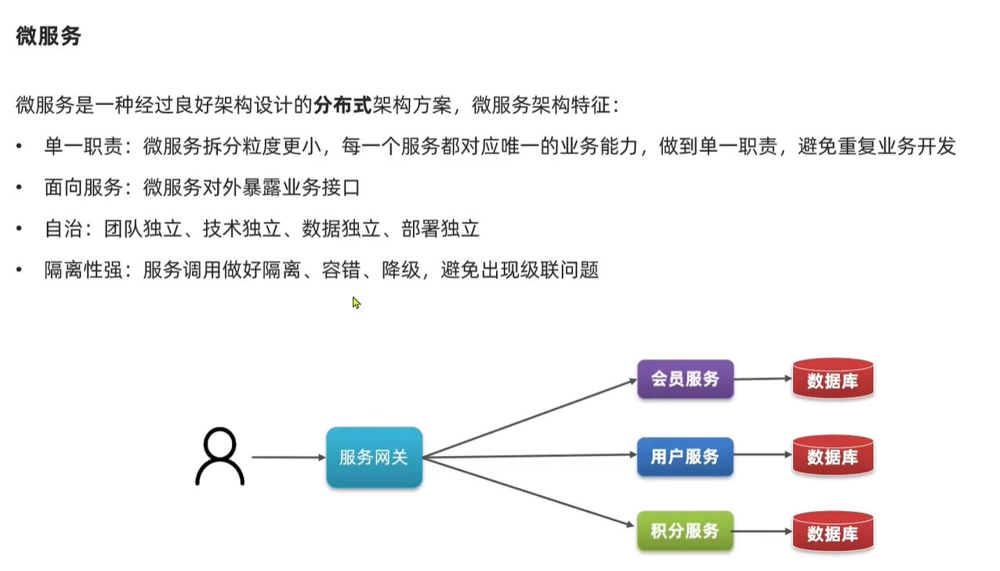
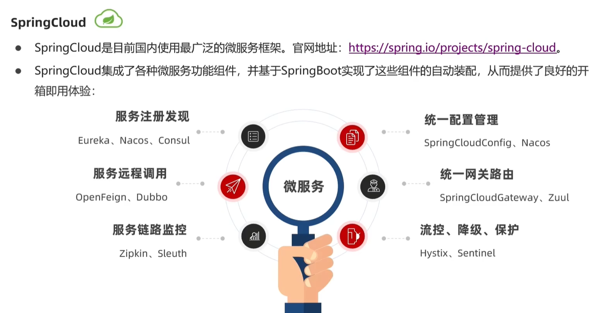
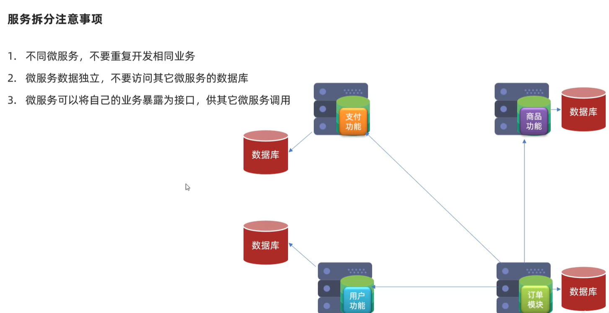
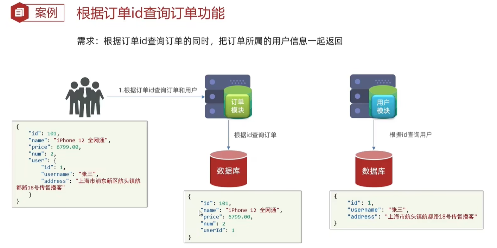
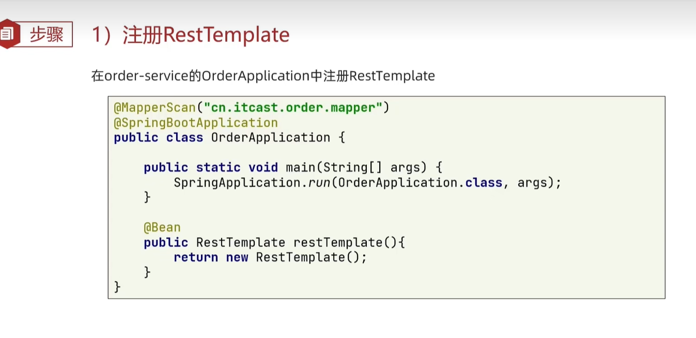
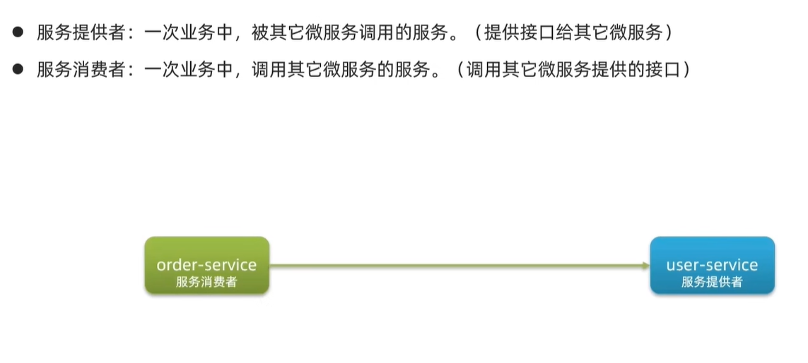

# 认识微服务


## 单体架构

  


## 分布式架构


  

## 微服务架构

  


## SpringCloud


  


## 服务拆分和注意事项

  


### 服务拆分的案例demo

**各个服务之间的数据库都是相互独立的，你不能直接访问对方的数据库，只能从一个服务像另外一个服务发起远程调用**


  

**在订单模块的服务中 发起用户查询的请求**

**在Order-Service模块中入口类注册RestTemplate,使用它来发送http请求**

  


**在查询订单的页面中，注入restTemplate变量，然后使用它发送http请求，查询用户**

```java
 public Order queryOrderById(Long orderId) {
        // 1.查询订单
        Order order = orderMapper.findById(orderId);

        // 创建url
        String url = "http://localhost:8081/user/" + order.getUserId();

        // 发哦是那个http请求  实现远程调用
        User user = restTemplate.getForObject(url,User.class);

        // 封装user到Order
        order.setUser(user);

        // 返回user
        return order;


        // 4.返回
//        return order;
    }

```


## 服务者和消费者

  


