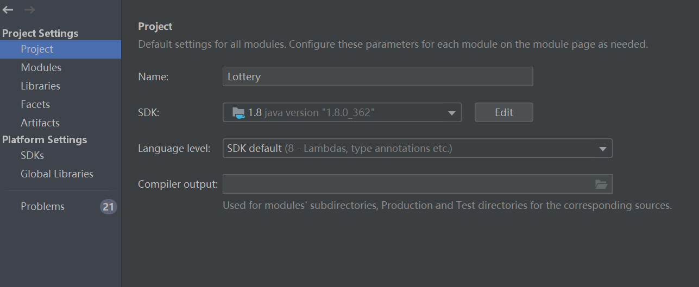

# 更换JDK


## 问题记录


```java
java: java.lang.IllegalAccessError: class lombok.javac.apt.LombokProcessor (in unnamed module @0x3278991b) cannot access class com.sun.tools.javac.processing.JavacProcessingEnvironment (in module jdk.compiler) because module jdk.compiler does not export com.sun.tools.javac.processing to unnamed module


```


## 问题原因


```java
lombok版本和jdk版本不匹配
```


## 解决办法-换掉JDK版本  换成1.8

**Ctrl + Alt + Shift + S快捷键打开Project Structure**

  


