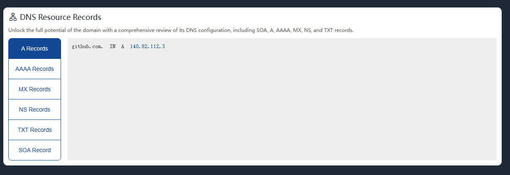
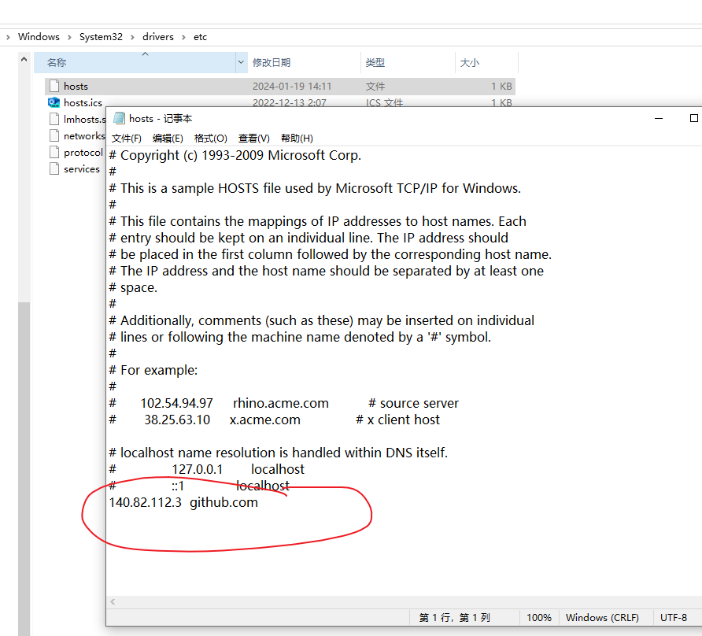

# git提交报错

```java

git报错：Failed to connect to github.com port 443: Timed out
```

## 解决办法

* 使用ping github.com 发现ping不通
* 修改hosts文件，让主机跳过DNS服务器 直接根据hosts配置信息进行替换域名
* 在ipaddress.com查询Github真实IP地址

  

* 打开hosts文件 添加配置 一般位于C:\Windows\System32\drivers\etc\hosts

  
