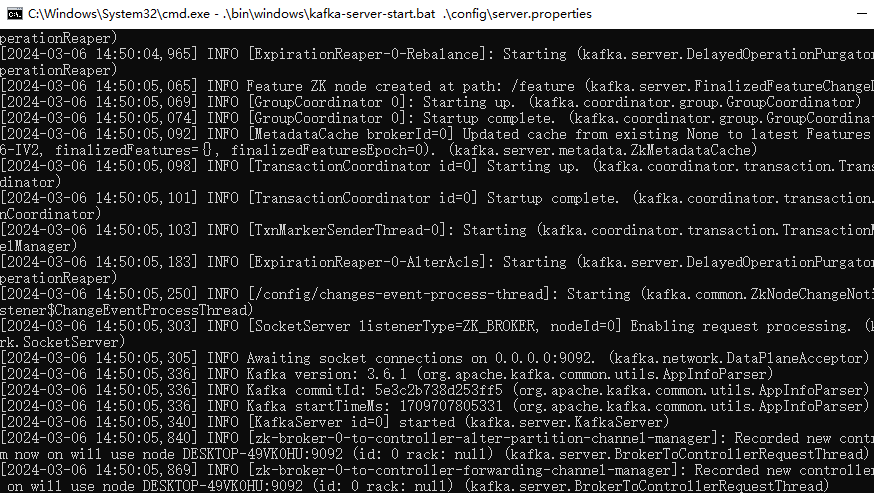

# 一文搞定Kafka安装和配置(Windows)


## 概述

* Kafka是一个分布式发布-订阅消息系统和一个强大的队列，可以处理大量的数据，并使您能够将消息从一个端点传递到另一个端点，Kafka适合离线和在线消息消费，Kafka消息保留在磁盘上，并在群集内复制以防止数据丢失，Kafka构建在Zookeeper同步服务之上，它与Apache Storm和Spark非常好集成，用于实时数据分析

* 可靠性  Kafka使分布式 分区 复制和容错的
* 可扩展性 Kafka消息传递系统轻松缩放 无需停机
* 耐用性  Kafka使用分布式提交日志 这意味着消息会尽可能保留在磁盘上
* 性能 Kafka对于发布和订阅消息都具有高吞吐量  即使存储了许多TB消息 它也保持稳定的性能
* Kafka非常快，并保证零停机和零数据丢失


## 安装Zookeeper

下载Zookeeper地址：https://zookeeper.apache.org/releases.html

### 下载好解压文件

  


### 修改zoo_sample.cfg文件为zoo

  

* 添加环境变量

  


### 进入Zookeeper目录 启动zkserver

  


## 安装Kafka

下载kafka地址：http://kafka.apache.org/downloads.html


  

* kafka安装目录下面新建一个logs文件夹 同时修改config文件夹下的server.properties文件
  

### 启动Kafka服务


* 在安装目录下面cmd .\bin\windows\kafka-server-start.bat .\config\server.properties

  


## 创建topic名称为syn_user的命令

```java
 .\bin\windows\kafka-topics.bat --create --zookeeper localhost:2181 --replication-factor 1 --partitions 1 --topic syn_user

```

* 以上命令使针对低版本的Kafka,对于新版本的Kafka 已经不需要依赖Zookeeper来创建topic ,新版本使用 --bootstrap-server替换老版本的 --zookeeper-server
* **新版本的kafka创建topic的方式改变了，不能继续使用--zookeeper创建了，要使用--bootstrap-server创建**

```

 .\bin\windows\kafka-topics.bat --create --bootstrap-server localhost:2181 --replication-factor 1 --partitions 1 Hello_Kafka
```


* 查看主题命令

```
 .\bin\windows\kafka-topics.bat --list --zookeeper localhost:2181

```


