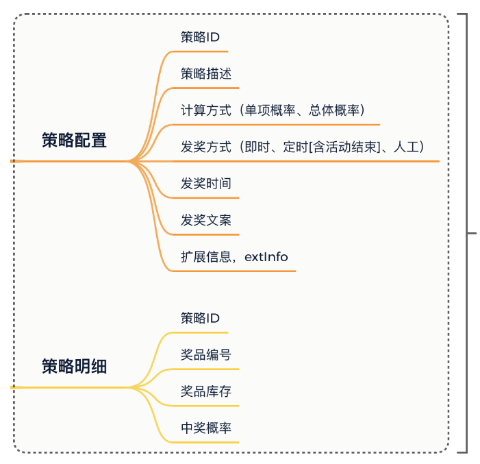
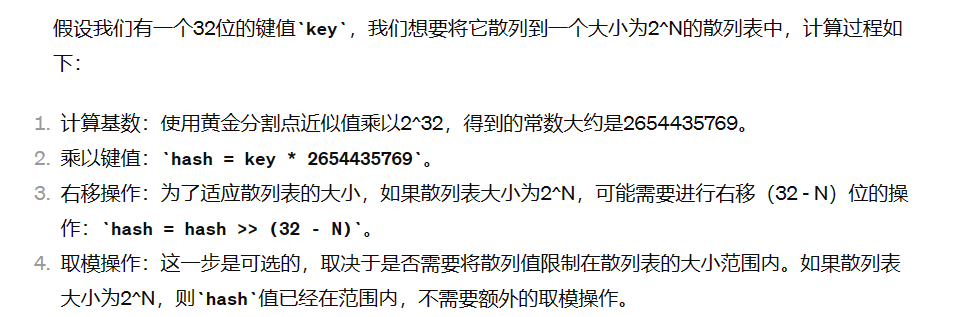

# RPC远程服务调用

## 介绍

&emsp;项目概述：本项目是一个基于DDD（领域驱动设计）的分布式抽奖系统，旨在通过高效的技术手段实现灵活、高并发的在线抽奖服务。系统采用微服务架构，通过自定义数据库路由组件实现数据的分库分表，确保系统的可扩展性和高性能。同时，项目通过引入各种设计模式和现代化的技术栈，有效提升了系统的开发效率和运行效率

* Java设计模式广泛应用：项目中运用了包括策略模式、模板模式、工厂模式等多种设计模式，有效地解耦了代码，增强了系统的灵活性和可维护性。

* 规则过滤引擎：引入规则量化引擎过滤人群，通过动态配置抽奖规则，实现了对参与用户的精细化管理，提升了抽奖活动的针对性和有效性。

* 自定义数据库路由组件实现分库分表：开发了自定义的数据库路由组件，实现了数据的分库分表，既解决了单库数据量大的问题，又保证了查询的高效性。

* 雪花算法生成全局唯一ID：采用雪花算法生成订单和用户的唯一标识，解决了在分布式系统中的ID生成问题。

* MQ消息组件解耦发货流程：通过MQ消息队列组件解耦订单发货流程，实现了高效的订单处理机制，提升了系统的响应速度和用户体验

* Worker补偿消息MQ发送：设计了Worker机制对未成功发送的MQ消息进行补偿处理，保证了消息的可靠性。

* 分布式调度平台XXL-JOB扫描定时任务：集成XXL-JOB分布式调度平台，对系统中的定时任务进行统一管理，实现了任务的精确调度和执行。

* 异步编程模式：系统中广泛应用异步编程模式，提高了系统处理请求的能力，尤其是在高并发场景下的性能表现。

* 多种抽奖算法支持：支持多种抽奖算法，包括随机抽奖、权重抽奖等，满足不同场景下的抽奖需求。

* RPC Dubbo远程调用服务：采用Dubbo作为RPC框架，实现了服务间的高效调用，降低了系统间耦合。

* 充血模型在领域驱动设计中的应用：项目采用充血模型，领域模型中丰富业务逻辑，提升了代码的可读性和业务的直观性。

* Redis分布式锁实现秒杀扣减库存：使用Redis分布式锁来处理秒杀场景中的库存扣减，确保了操作的原子性和一致性。

## 描述

&emsp;通过使用 Dubbo 框架实现 RPC（远程过程调用）服务，构建了一个分布式的应用系统,支持高效、可靠的服务间信息通信

**系统中单独定义RPC模块，定义各种RPC调用接口，在Interfaces层定义实现各种RPC调用接口服务**

* Dubbo框架
* 服务的提供者: 在ActivityBooth类中实现IactivityBooth 接口 通过Dubbo @service 注解发布了活动查询服务
* 在开发和测试环境中 通过设置广播模式 采用五注册中心的方式进行服务发现和通信 简化了配置


## 使用RPC进行拆分架构

**在DDD 项目中 结合RPC 技术进行微服务拆分和通信是一种比较常见的架构模式，项目一般都会被拆分为多个模块 每一个模块负责不同的领域逻辑和通信任务**

* Common 基础公共模块剔红系统的工具类
* Domain 包含领域实体  值对象 聚合对象 领域服务 核心业务逻辑 **实现各种领域服务 抽奖策略领域 奖品发放领域 活动信息领域**
* 应用层模块： 应用层负责编排领域模块的业务逻辑 处理更高层的业务逻辑和应用逻辑
* infrastructure 基础设施：提供 DAO PO Repository操作
* 接口层负责暴露服务的入口 RPC 接口

## 为什么选择广播模式Dubbo

* 在分布式系统中，RPC（远程过程调用）是一种常用的技术，用于实现不同服务之间的通信。Dubbo 是一个高性能的、基于 Java 的 RPC 框架，它支持多种服务治理方案，包括使用注册中心来发现和调用服务。然而，配置和使用注册中心需要一定的学习成本，特别是在学习实践或小规模项目初期，可能希望尽可能简化配置和依赖，以专注于核心业务逻辑的实现


**广播模式提供了一种无需注册中心的服务发现机制，服务启动的时候将服务信息通过广播模式发送到网络中，服务消费者监听指定的广播地址 从而实现服务的发现 简化了配置**


* 测试之前需要把 Lottery 工程中的 lottery-rpc 进行构建打包，便于测试工程引入

```java
<dependency>
    <groupId>cn.itedus.lottery</groupId>
    <artifactId>lottery-rpc</artifactId>
    <version>1.0-SNAPSHOT</version>
</dependency>

```

# 你的项目用到了哪些表格

* 活动配置，activity：提供活动的基本配置
* 策略配置，strategy：用于配置抽奖策略，概率、玩法、库存、奖品
* 策略明细，strategy_detail：抽奖策略的具体明细配置
* 奖品配置，award：用于配置具体可以得到的奖品
* 用户参与活动记录表，user_take_activity：每个用户参与活动都* 会记录下他的参与信息，时间、次数
* 用户活动参与次数表，user_take_activity_count：用于记录当前参与了多少次
* 用户策略计算结果表，user_strategy_export_001~004：最终策略结果的一个记录，也就是奖品中奖信息的内容
* 策略配置和策略明细  1 v n
* 

  


**这些库表是用于支撑起抽奖系统开发的必备表，后续可能会随着功能的开发做适当的调整。我们会围绕这些库表一点点实现各个领域的功能，包括：抽奖策略领域、奖品发放领域、活动信息领域等**

# 项目实现哪些领域服务

* 抽奖策略领域
* 活动领域
* 规则引擎
* 用户服务
* 每一个领域功能包括 model repository service三块区域
* model ： 用于提供 vo req res aggregates聚合对象
* repository 提供仓储服务  也就是对mysql redis等数据进行统一包装
* servIce具体的业务领域逻辑实现


# 项目的充血模型体现在哪里？


# 【策略模式】抽奖策略领域模块如何开发的-创新：单项概率抽奖和整体概率抽奖


**策略模式：两种抽奖算法可以算是不同的抽奖策略，最终提供统一的接口包装满足不同的抽奖功能调用**


* 在我们的策略配置表中有一个字段是计算方式 来选择到底是那种策略模式
* 需要注意的是，在策略表中不引入活动ID信息的配置 因为在建设领域，让部分领域实现具有可独立运行的特性 不被业务逻辑污染，作为无业务逻辑的通用共性的功能领域模块，在业务组合的过程中，可以使用此功能领域提供的标准接口

* model   req result 聚合对象StrategyRich
* repository 数据仓储服务接口  通过注入Infra层的DAO组件来访问数据库 完成对策略配置 策略明细和奖品信息的查询
* service 是具体的业务领域逻辑实现层，在这个包下定义了algorithm抽奖算法实现和具体的抽奖策略包装 draw 层，对外提供抽奖接口 IDrawExec#doDrawExec

* 总体概率：如果A奖品抽空后，B和C奖品的概率按照 3:5 均分，相当于B奖品中奖概率由 0.3 升为 0.375
* 单项概率：如果A奖品抽空后，B和C保持目前中奖概率，用户抽奖扔有20%中为A，因A库存抽空则结果展示为未中奖。为了运营成本，通常这种情况的使用的比较多

## 介绍一下单项概率算法和总体概率算法如何实现的

* 单项随机概率抽奖算法是指每个奖品有独立的中奖概率，不论其他奖品是否被抽中或库存为零，每个奖品的中奖概率都是固定不变的。如果随机抽到的奖品已经没有库存，则视为未中奖
  * 初始化时，为每个奖品配置一个独立的中奖概率。
  *  抽奖时，生成一个随机数，通过这个随机数决定用户抽中的是哪个奖品。
  * 如果所抽奖品已无库存，则返回未中奖。

* 总体概率抽奖算法是指，当某个奖品被抽中后，其概率会被重新分配到剩余的奖品上。这样做是为了保证总的中奖率不变，同时也使得每次抽奖的结果都能即时反映当前奖品的实际库存情况
  * 初始化时，为每个奖品配置一个中奖概率，并计算总概率
  * 抽奖时，首先检查每个奖品的库存，然后根据当前的库存情况动态调整奖品的中奖概率。
  * 生成一个随机数，根据调整后的概率决定中奖的奖品。


* **策略模式：在抽奖系统设计中，抽奖算法可以作为一个策略族，不同的抽奖算法（如单项随机概率和总体概率算法）实现相同的抽奖接口（IDrawAlgorithm）。
策略选择：根据不同的业务需求（如抽奖规则的不同、奖品库存管理的需求等），动态选择使用哪一种抽奖算法**


## 那你如何执行抽奖算法

* 首先获取抽奖策略配置
* 校验和初始化数据  初始化抽奖算法所需要的概率数据
* 执行抽奖算法 调用randomDraw执行抽奖 获取奖品ID
* 获取奖品信息 返回


# 创新点：模板模式处理抽奖

* 基于模板设计模式，规范化抽奖执行流程。包括：提取抽象类、编排模板流程、定义抽象方法、执行抽奖策略、扣减中奖库存、包装返回结果等

* 使用模板方法设计模式优化类 DrawExecImpl 抽奖过程方法实现，主要以抽象类 AbstractDrawBase 编排定义流程，定义抽象方法由类 DrawExecImpl 做具体实现的方式进行处理


## 讲一下模板化抽奖过程

* 标准化抽流程的核心步骤 初始化概率数据 获取排除奖品列表 执行抽奖算法 库存扣减和包装中奖结果  
* 在抽奖过程中预先初始化策略ID对应的概率信息和奖品ID 散列数组，避免每次抽奖的重复计算和数据库访问

* 库存扣减：这部分逻辑暂时使用数据库行级锁实现库存扣减

# 创新：工厂模式搭建发奖领域

* 关于award发奖领域 两块逻辑实现：goods商品处理  factory 工厂
* 工厂模式通过调用方提供发奖类型，返回对应的发奖服务，通过这样由具体的子类决定返回结果，并作相应的业务处理

**简单工厂模式来设计和实现了一个发奖配送的解决方案，DistributionGoodsFactory的简单工厂类，负责根据奖品类型动态地提供相应的奖品配送服务实例。这个工厂类继承自GoodsConfig配置类，后者负责初始化并存储一个奖品类型与配送服务实例之间的映射关系**


* 采用工厂模式使得奖品配送逻辑更加集中和清晰。每种奖品的配送逻辑被封装在各自的实现类中（如CouponGoods、DescGoods等），工厂类负责统一管理这些实现类的实例。


# 活动领域的配置与状态-> 设计模式的状态模式

* 活动创建、活动状态处理和用户领取活动操作
* **活动的创建操作需要用到实物，因为活动系统提供给运营后台创建活动的时候，需要包括：活动信息 奖品信息 策略信息 策略明细这些信息都需要在一个事务下面进行落库**

* **活动状态的管理是整个活动领域设计中非常关键的一部分。活动状态包括：编辑、提审、审核通过、审核拒绝、活动中、活动关闭等。每个状态下，活动可执行的操作和可能的状态转移都有所不同。为了有效管理活动状态的流转，并减少复杂的条件判断逻辑，我们采用了状态模式（State Pattern）。**
* **状态模式允许一个对象在其内部状态改变时改变它的行为。我们为每种活动状态定义了对应的状态类，这些类都继承自一个抽象状态类AbstractState，并实现了定义好的状态转移操作接口IStateHandler。这样，当活动的状态发生变化时，只需切换到对应的状态类实例，就可以调用相应的操作，而无需关心具体的状态转移逻辑。**


# 创新点：策略模式 + 雪花算法生成大量唯一ID


## 概述

* 我们采用了三种ID生成策略，以适应不同场景的需求，
* 雪花算法(Snowflake): 雪花算法是一种分布式ID生成策略，由Twitter开发。它生成的是一个64位的长整型数，能够保证在分布式系统中的全局唯一性。该算法通过组合机器ID、数据中心ID、毫秒级时间戳和序列号来生成ID，既能保证ID的唯一性，也能从ID中解析出生成时间等信息。在我们的系统中，我们利用Hutool工具包提供的实现，用它来生成订单号等需要大量且全局唯一的ID。

* 随机数生成(RandomNumeric): 这种策略使用Apache Commons的RandomStringUtils工具类生成一个指定长度的随机数字字符串。虽然简单，但在确保生成的ID在一定范围内唯一时非常有效和高效。我们在生成策略ID时采用了这种方法，因为策略ID的生成量不会太大，同时需要保持简洁。

* 短码生成(ShortCode): 短码生成策略主要用于生成较短且数量不是非常大的ID，如活动号。这种策略通过结合当前的时间信息（如年、周、小时）和随机数来生成ID，既保证了ID的简短，也能满足唯一性的需求。这对于需要人工输入或记忆的场景特别有用。


* 用策略模式把三种生成ID的算法进行统一包装，由调用方决定使用哪种生成ID的策略

```
ID 的生成因为有三种不同 ID 用于在不同的场景下；

订单号：唯一、大量、订单创建时使用、分库分表
活动号：唯一、少量、活动创建时使用、单库单表
策略号：唯一、少量、活动创建时使用、单库单表
```

* 雪花算法(SnowFlake): 适用于需要生成大量唯一ID的场景，如订单号。
* 日期拼接算法(ShortCode): 生成的ID较短，适用于活动号这种需求较少的场景。
* 随机数算法(RandomNumeric): 适用于策略ID的生成，需要保证唯一性。

* 雪花算法(SnowFlake): 主要用于生成唯一的单号。雪花算法是一个分布式系统中生成唯一ID的算法，它能够保证在分布式系统环境下生成全局唯一的ID号。它通过组合机器ID、时间戳和序列号来实现ID的唯一性和顺序性。
* 日期算法: 适用于生成活动编号这类ID，其特点是生成的数字串较短。这种方法通常依赖于当前日期和时间，可能会加上一些随机序列来保证在同一时间点生成的ID的唯一性。但是，它在指定的时间内不能生成太多的ID，以避免ID冲突
* 随机算法: 主要用于生成策略ID，依赖于生成随机数的方法来保证ID的唯一性


**日期凭借算法的短码生成策略主要是组合当前年月日的和一个随机数三位数 生成一个短码，注意该方法使用synchronized关键字来保证线程安全，防止高并发场景下产生相同的编号**

**雪花算法生成订单号ID：使用hutool工具包中的雪花算法生成唯一ID的策略，保证全局的唯一性**


## 请你讲讲雪花算法如何生成订单号ID

* 首先初始化Snowflake对象：类初始化之后，首先尝试获取本地IP地址,然后将IP地址转换为long类型的数值workerId 如果获取IP地址失败，则使用本地IP字符串的哈希码，workerId通过右移16位然后与31进行位与操作，以确保workerId在合理范围内（0~31），满足Snowflake算法对工作机器ID的要求。
* 数据中心ID（dataCenterId）：这里硬编码为1，实际应用中可以根据需要进行配置。
* 创建Snowflake对象：使用Hutool工具包的IdUtil.createSnowflake方法创建一个Snowflake对象，需要传入workerId和dataCenterId。这个对象会在接下来生成ID时使用。
* 生成ID：nextId方法使用创建的Snowflake对象来生成下一个唯一ID。注意，这里使用synchronized关键字保证了方法的线程安全，因为Snowflake算法在高并发的情况下可能会生成重复的ID，通过同步处理可以避免这个问题

## 请你讲讲雪花算法如何实现？

* 雪花算法生成的是一个64位的长整形Long
* 通过不同的部分组合：1位未使用、41位时间戳、10位工作机器id（可以分为5位datacenterId和5位workerId）、12位序列号


* 第1位：未使用，**因为二进制中最高位为1的话会被当作负数**，但实际应用中一般不需要生成负数的ID，所以这一位固定为0。
* 接下来的41位：**用来记录时间戳（毫秒级）。41位可以表示$2^{41}-1$个数字，如果只用这41位来表示时间戳**，则可以使用69年。
* 接下来的10位：**用来记录工作机器id**，可以部署在$2^{10} = 1024$个节点，包括5位datacenterId和5位workerId。
* 最后的12位：序列号，用来记录同毫秒内产生的不同id。12位可以表示的最大正整数是4095，即同一机器同一时间戳（毫秒）内能够产生的ID数量。

优点：
  * 高性能：能够在分布式系统内快速生成唯一的ID 并且生成工程简单
  * 以时间为基准  保证ID的唯一性
  * 可排序：生成的ID是趋势递增的 


缺点：
* 时间回拨问题： 如果系统时钟回拨，可能导致ID冲突或者重复，解决方案包括使用NTP时间同步，或者在检测到时钟回拨时 让服务暂时停止一段时间
* 不同系统键的时间同步问题：在分布式环境中，不同机器的时间可能存在微小的差异，这在大多数情况下并不会引起问题
* 序列号溢出问题：在同一毫秒内生成的ID数量超过序列号的最大值  可以等到下一毫秒产生


# 创新点分库分表

## 概述

**在分库分表的设计与实现中，涉及到了散列算法、数据源切换、AOP切面技术、以及SpringBoot Starter的开发。这些技术点共同支撑起了一个能够动态路由到不同数据库与表的系统**


**用到的技术点：AOP、数据源切换、散列算法、哈希寻址、ThreadLocal以及SpringBoot的Starter开发方式**

### 散列算法

* 我们用到的散列算法主要是斐波那契散列法，可以让数据更加分散，然后再数据发生碰撞之后进行开放寻址，从碰撞节点向后寻找位置进行存放元素

* 斐波那契散列通常采用斐波那契数列的“黄金分割点”作为散列的基础，

  

### AOP

AOP切面
* AOP（面向切面编程）是一种编程范式，允许开发者定义横切关注点（cross-cutting concerns），比如日志、事务管理等。在分库分表中，AOP切面技术可以用于实现数据库路由的逻辑，比如在方法执行前切换到正确的数据源。

### SpringBoot db Starter

* DB route Starter是Spring Boot提供的一种快速集成第三方库的机制。通过定义Starter，开发者可以将常用的配置、模板代码封装起来，简化Spring应用的初始搭建和配置工作。在分库分表组件中，可以通过自定义Starter，将分库分表的逻辑封装起来，提供给其他服务使用。

* 垂直拆分：指的是按照业务将表进行分类，其实就是由于业务体量比较大，数据增长的快速，所以需要将用户数据拆分到不同的库表中，减轻数据库压力
* 水平拆分：不同于垂直拆分（不同的表拆到不同的数据库中） 水平拆分是将同一个表拆到不同的数据库中

* AOP切面拦截的使用 因为需要给使用数据库路由的方法做上标记 便于处理分库分表逻辑
* 数据源的切换曹祖 既然有分库那么就会涉及到多个数据源之间进行连接切换，以便于把数据分配给不同的数据库中
* 数据库表寻址操作，一条数据需要进行索引计算操作 查到位置
* 数据散列操作：让数据均匀

## 讲讲项目中的分库分表如何实现

* 首先自定义路由注解，用于放置在需要被数据库路由的方法上
* 使用方式是通过方法配置注解，就可以被我们指定的AOP切面进行拦截，拦截之后进行相应的数据库路由计算和判断，并且切换到相应的操作数据源上面


* @DBRouterStrategy(splitTable = true)  表示这个接口的数据库操作需要考虑分表的策略，true表示DAO操作涉及到的数据库表是分表的，mybatis再执行任何数据库操作之前，会根据分表策略确定具体操作的目标表
* insert用于将用户的策略计算结果插入数据库中，@DBRouter(key = "uId")注解表示插入操作的分表策略将根据userStrategyExport对象的uId字段来计算，这意味着根据uId的值，mybatis会将数据插入到计算得到的特定分表中
* queryUserStrategyExportByUId  dbrouter注解表示查询操作会根据方法参数中的uId来计算 


```java
@Mapper
@DBRouterStrategy(splitTable = true)
public interface IUserStrategyExportDao {

    /**
     * 新增数据
     * @param userStrategyExport 用户策略
     */
    @DBRouter(key = "uId")
    void insert(UserStrategyExport userStrategyExport);

    /**
     * 查询数据
     * @param uId 用户ID
     * @return 用户策略
     */
    @DBRouter
    UserStrategyExport queryUserStrategyExportByUId(String uId);

}

```

* 关于配置文件

* 指定分库数量 2
* 分表数量 4
* default db00 表示默认数据源db00
* routerKey: uId：定义用于分库分表计算的路由键，这里使用用户ID（uId）作为路由键
* 这种配置方式允许应用根据用户ID来动态选择数据源 从而实现对不同数据库和表的访问 从而支持分库分表的场景

```yml
mini-db-router:
  jdbc:
    datasource:
      dbCount: 2
      tbCount: 4
      default: db00
      routerKey: uId
      list: db01,db02
      db00:
        driver-class-name: com.mysql.cj.jdbc.Driver
        url: jdbc:mysql://127.0.0.1:3306/lottery?useUnicode=true&serverTimezone=UTC
        username: root
        password: 123456
      db01:
        driver-class-name: com.mysql.cj.jdbc.Driver
        url: jdbc:mysql://127.0.0.1:3306/lottery_01?useUnicode=true&serverTimezone=UTC
        username: root
        password: 123456
      db02:
        driver-class-name: com.mysql.cj.jdbc.Driver
        url: jdbc:mysql://127.0.0.1:3306/lottery_02?useUnicode=true&serverTimezone=UTC
        username: root
        password: 123456

```


## 讲讲自己写的数据库路由组件  DB-Router-Starter


### DBRouter

**自定义DBRouter  用于标记哪些需要进行数据库路由的类或者方法，该注解可以帮助对数据库操作的拦截，从而根据注解提供的信息，动态的决定数据应该去哪一个数据库或者哪一个表**

* @Retention(RetentionPolicy.RUNTIME): 指定注解的保留策略是RUNTIME，意味着这个注解在运行时依然可见，因此可以通过反射机制读取注解的信息
* @Target({ElementType.TYPE, ElementType.METHOD}): 表明这个注解可以用在类或接口上（TYPE），也可以用在类的方法上（METHOD）。这为使用该注解提供了灵活性，既可以对整个类进行配置，也可以仅对类中的特定方法进行配置
* key: 这个属性用于指定分库分表的字段，它是一个字符串类型，默认值为空字符串。在使用注解时，可以通过key属性指定哪个字段用于分库分表的依据。例如，在一个用户信息的数据库表中，可以使用用户ID作为分表的依据，这时就可以通过key属性来指明
* 


```java

package cn.bugstack.middleware.db.router.annotation;

import java.lang.annotation.*;


/**
 * @description: 路由注解
 * @author: 小傅哥，微信：fustack
 * @date: 2021/9/22
 * @github: https://github.com/fuzhengwei
 * @Copyright: 公众号：bugstack虫洞栈 | 博客：https://bugstack.cn - 沉淀、分享、成长，让自己和他人都能有所收获！
 */
@Documented
@Retention(RetentionPolicy.RUNTIME)
@Target({ElementType.TYPE, ElementType.METHOD})
public @interface DBRouter {

    /** 分库分表字段 */
    String key() default "";

}

```


### DBRouterStrategy

* 该注解用于指定一个类或者方法是否涉及到分表策略
* 注解有助于框架再运行的时候根据指定的策略进行数据路由
* @Retention(RetentionPolicy.RUNTIME)：指定注解的保留策略为运行时。这意味着这个注解在运行时是可见的，因此可以通过反射获取注解信息。
* @Target({ElementType.TYPE, ElementType.METHOD})：表示这个注解可以被用于类或接口上（ElementType.TYPE），也可以用于方法上（ElementType.METHOD）
* splitTable()：这是注解的一个属性，返回一个布尔值，默认值为false。如果设置为true，表示这个类或方法涉及分表操作，需要按照分表的策略来路由数据。这对框架来说是一个信号，告诉框架执行这个类或方法时需要考虑数据库的分表逻辑。
  

**@DBRouterStrategy注解允许你标记那些需要进行分表操作的类或方法，这样框架就可以在执行这些操作时应用适当的路由策略，确保数据被正确地分配到不同的表中**


```java
package cn.bugstack.middleware.db.router.annotation;

import java.lang.annotation.*;

/**
 * @description: 路由策略，分表标记
 * @author: 小傅哥，微信：fustack
 * @date: 2021/9/30
 * @github: https://github.com/fuzhengwei
 * @Copyright: 公众号：bugstack虫洞栈 | 博客：https://bugstack.cn - 沉淀、分享、成长，让自己和他人都能有所收获！
 */
@Documented
@Retention(RetentionPolicy.RUNTIME)
@Target({ElementType.TYPE, ElementType.METHOD})
public @interface DBRouterStrategy {

    boolean splitTable() default false;

}

```


### 数据源配置DataSourceAutoConfig 

* 设置数据路由的环境
* 分库分表配置
  * 通过实现EnvironmentAware接口，该配置类能够访问到Spring环境中的属性，允许它读取和处理mini-db-router前缀下的分库分表相关配置。
  * 它读取分库(dbCount)和分表(tbCount)的数量，以及用于路由的键(routerKey)，这些配置影响了如何将数据分布在不同的数据库和表中。
* 动态数据源
  * createDataSource()方法创建一个DynamicDataSource，这是一个自定义的数据源，支持根据某些规则（如用户ID）动态选择实际的数据源。
  * 数据源信息是从配置文件中读取的，并且可以有多个数据源配置。这些数据源配置会被保存在一个Map中，后续可以根据键值（通常是业务逻辑中的某个字段，如用户ID）动态切换。

### IDBRouterStrategy


* 定义数据库路由策略的核心方法  主要用于实现分库分表的逻辑
* doRouter(String dbKeyAttr)： 确定数据路由到哪一个数据库和表的核心逻辑
* setDBKey(int dbIdx) 和 setTBKey(int tbIdx)： 手动设置当前现成的分库和分表索引
* dbCount() 和 tbCount()： 获取分库和分表的数量，配置数据库的数量和表的数量

### DBRouterConfig

* 配置数据路由的基础设置 定义分库分表的策略 宝库分库的数量 分表的数量 
* 同时指定分库分表路由计算的关键字段


### DBRouterBase

* 数据源基础配置类
* 提供方法获取当前线程特定的表的索引，这个表的索引是用于确定数据应该被路由到哪一个具体的表中


### DBRouterJoinPoint


* 通过AOP实现的数据路由切面类
* 拦截所有被DBRouter注解标记的方法，然后根据注解中的配置以及全局的路由配置来执行具体的数据库路由逻辑
  

* 主要流程
  * 路由键配置检查：首先检查方法上面的DBRouter注解 看看是不是有指定的key,如果没有 尝试使用全局配置的路由键
  * 从方法的入参中提取出指定的路由键(dbKey)对应的值(dbKeyAttr)。这里对单个参数的情况做了特别处理，如果参数是单个且为字符串，则直接返回该参数作为路由属性值；否则，会反射遍历所有参数，尝试获取对应字段的值。
  * 执行路由策略：使用配置的路由策略(dbRouterStrategy)根据提取出的路由属性值进行路由计算，这可能涉及到决定数据应该去哪个数据库或是哪个数据表
  * 执行被拦截的方法：路由计算完成后，允许被拦截的方法继续执行
  * 清理路由上下文：在方法执行完成后，需要清除本次请求所使用的路由上下文信息，以避免对后续操作造成影响。这一步非常重要，因为路由信息是通过 ThreadLocal 存储的，如果不清除，可能会导致内存泄漏。


* 涉及到的技术
  * AOP切面 ：通过 @Aspect 注解定义了一个 AOP 切面，@Pointcut 指定了拦截规则，即所有被 @DBRouter 注解标记的方法。@Around 注解定义了环绕通知，实现了拦截逻辑。
  * 反射访问：为了从方法的入参中获取指定的路由键值，使用了反射技术访问对象的字段。这包括处理私有字段和处理继承情况下的字段访问。
  * 动态路由：整个实现的核心是如何根据注解和方法参数动态决定数据的路由路径。这对于实现数据库的水平分库分表具有重要意义，可以根据业务需求灵活地扩展数据库结构，提高数据库操作的效率和可维护性


### DBRouterStrategyHashCode

* 定义一种基于哈希值的数据库路由策略
* 目的是通过哈希散列函数 将数据均匀地分配到多个数据库和数据表中 以实现数据的水平分库分表
* 流程：
  * 构造函数:接收一个 DBRouterConfig 实例，用于获取分库分表的配置信息，例如分库数量(dbCount)和分表数量(tbCount)
  * 路由计算：根据分库分表的总数(size)，使用扰动函数增加哈希值的随机性，减少哈希碰撞的概率。扰动函数利用了位运算，结合原始哈希值的高低位信息，提高分布的均匀性
  * 计算出的哈希值(idx)用来决定数据存储在哪一个数据库和哪一个表中。通过算法计算得到库索引(dbIdx)和表索引(tbIdx)。
  * 使用 DBContextHolder 类（一个基于 ThreadLocal 的上下文持有器）设置当前线程的数据库和表的键值，以便于后续操作（如数据库操作）可以根据这些键值定位到正确的数据库和表。
  * 设置和获取路由键：提供了 setDBKey 和 setTBKey 方法手动设置路由键，以及 dbCount 和 tbCount 方法获取分库分表的数量信息。
  * 清除路由信息(clear 方法)：在操作完成后，需要调用 clear 方法清除 ThreadLocal 中存储的路由信息，防止内存泄漏或者错误的路由信息干扰后续操作。


### 请你讲一下分库分表的计算公式？

* 总大小计算：首先知道总共有多少个数据库和表的组合，这个总数是分库数量dbCount乘以分表数量tbCount得到的
* 扰动函数应用：使用一个扰动函数处理路由键值dbKeyAttr的哈希值，以增加散列的随机性和均匀性，扰动函数通常使用位运算 16位右，结合原始哈希值的高低位信息，提高分布的均匀性
* 库表索引计算：得到扰动之后的索引Idx之后，需要计算这个索引值属于哪一个数据库和哪一个表
  * 库索引dbIdx的计算公式为：int dbIdx = idx / dbRouterConfig.getTbCount() + 1;  将索引值除以总表数来确定数据应该落在哪一个数据库中，加1是因为数据库的索引通常是从1 开始的
  * 表索引tbIdx：int tbIdx = idx - dbRouterConfig.getTbCount() * (dbIdx - 1); 通过索引值减去已经计算出来的库所占用的表的总数，来确定数据应该落在当前数据库的哪一个表中
  * 


## 讲一下自定义数据库路由组件的创新点

分库分表的实现主要涉及以下几个关键点：

* 路由策略：定义数据如何分配到不同的库和表中。通常基于某个字段的值（如用户ID）进行哈希计算，再根据哈希结果决定数据路由到哪个数据库和表。

* 扰动函数：为了使数据更均匀地分布在各个库表中，采用扰动函数对哈希值进行再处理，增加分布的随机性和均匀性。

* 数据源管理：在多数据库环境下，需要动态管理和切换数据源。根据路由策略计算出的目标数据库，动态指定当前操作的数据源。

* MyBatis拦截器：通过自定义MyBatis拦截器，动态修改SQL语句中的表名，实现分表逻辑。

### 在抽奖项目中使用分库分表组件

* 引入starter组件：在项目中的pom文件添加分库分表starter组件的依赖
* 配置数据源：在application.yml中配置多个数据源，包括每一个数据源的连接信息，数据库和表的数量
* 定义路由注解：在需要进行分库分表操作的dao接口或者方法,使用dbRouter注解指定路由字段
* 配置路由策略：通过实现IDBRouterStrategy接口，定义自己的路由策略，可以实现一个基于哈希算法的路由策略
* 使用AOP进行路由，使用AOP技术，拦截带有DBRouter注解的方法，根据路由策略计算出目标数据库和表，动态切换数据源，并且通过Mybatis拦截器修改SQL语句实现分表


### 请问扰动函数是什么


* 扰动函数的目的是为了让哈希值更加均匀分布，避免数据倾斜问题，
* int idx = (size - 1) & (dbKeyAttr.hashCode() ^ (dbKeyAttr.hashCode() >>> 16));
* 首先获取基于路由字段比如用户ID的哈希值，然后通过和自身进行无符号右移16位进行异或操作，这样得到的结果idx会更加分散，通过这个计算后的idx可以进一步计算得到目标数据库和表的索引


### 数据源如何实现切换

* 定义一个动态数据源：创建一个DynameicDataSource 继承AbstractRoutingDataSource 写determineCurrentLookupKey方法。在这个方法中返回当前线程所需要操作的数据源的key。

* 配置多数据源：在Spring配置文件中定义多个数据源，并将这些数据源注入到DynamicDataSource中，同时设置默认数据源。
* 切换数据源：通过在执行数据库操作前，基于扰动函数计算得到的数据库和表索引，动态设置DBContextHolder中保存的当前线程的数据源key。AbstractRoutingDataSource将根据这个key来决定使用哪个数据源。
* 在执行数据库操作时，AbstractRoutingDataSource会调用determineCurrentLookupKey方法获取当前线程指定的数据源key，并根据这个key找到对应的数据源进行数据库操作。这样，就实现了基于路由策略的数据源动态切换。


# 创新点：讲一下规则引擎量化人群参与活动  规则领域 domain下面

##  如何实现的

* 规则引擎过滤功能用于筛选和确定用户是否符合参与某一活动的条件
* 1 组合模式构建规则树：规则引擎采用组合模式来构建规则树，这种结构能灵活的表示规则之间的逻辑关系，规则树由节点Node和节点连接线NodeLine组成，通过节点间的父子关系表示规则的逻辑结构
* 2 规则过滤器 每一个规则节点对应一个具体的规则过滤器，这些过滤器负责对输入的决策物料进行判断，输出决策结果，通过定义规则过滤器接口和基础抽象类，系统可以灵活欧战新的规则过滤器
* 3 规则引擎处理器：RuleEngineHandle 类作为规则引擎的核心处理器，实现了规则决策的主要逻辑。它通过IRuleRepository从数据库中查询规则树的配置信息，然后根据决策物料逐步遍历规则树，直到找到最终的决策结果。
* 4 决策物料：决策物料（DecisionMatterReq）作为规则决策的输入，包含了所有必要的决策参数，如用户的年龄、性别等。这种设计使得规则引擎可以应用于不同的决策场景。

### 三种Po对象定义
* RuleTree
  * 这个类代表了一个规则树，它是规则引擎的基础。每个RuleTree对象存储了一棵规则树的基本信息，包括树的ID、树的名称、树的描述以及树的根节点ID。这些信息对于理解和管理规则树至关重要。通过这个类，可以对规则树进行基本的操作，如查询和更新规则树的结构
* RuleTreeNode
  * 这个类代表了规则树中的一个节点。每个节点可能代表一个决策点或者一个最终的决策结果。节点包含了类型（例如子叶节点或果实节点）、节点值（在果实节点中使用）、规则Key以及规则描述。这些信息使得每个节点都能够根据特定的逻辑或条件进行操作，是规则树执行逻辑判断的关键部分。
* RuleTreeNodeLine
  * 这个类表示规则树中节点之间的连线，是规则逻辑流转的关键。每条连线定义了从一个节点（From）到另一个节点（To）的转移条件，如限定类型（等于、大于、小于等）和限定值。这使得规则树可以根据不同的输入值决策出不同的路径，从而达到复杂的决策逻辑。


* 实现LogicFilter接口：为规则引擎提供一个基础的逻辑判断框架
* filter：
  * 遍历所有规则节点线信息，调用方法进行决策逻辑判断，如果判断为真，就返回对应的下一个节点ID，如果没有任何规则匹配成功，返回一个预定的空姐点ID，表示没有符合条件的决策路径
  * matterValue方法：这是一个抽象方法 需要具体的逻辑过滤器，根据决策物料请求进行获取用于逻辑判断的决策值
  * decisionLogic 方法：这是一个私有方法，用于根据节点线的限定类型（如等于、大于、小于等）和限定值来对决策值进行逻辑判断。这个方法的实现体现了决策树节点间的逻辑关系，如何根据不同的条件进行分支选择
  * 


* UserAgeFilter 和 UserGenderFilter: 具体是基于用户年龄的规则和用户性别的规则过来
* 方法是用于从决策物料（DecisionMatterReq）中提取特定的决策值


* EngineBase 类通过抽象规则决策的基本流程和结构
  * 抽象规则处理流程：EngineBase 通过定义 engineDecisionMaker 方法，实现了从决策树的根节点开始，根据决策物料的值递归地选择下一步要遍历的节点，直到达到叶子节点或果实节点。
  * 使用逻辑过滤器：在决策过程中，根据当前节点所需的规则键（ruleKey），从 logicFilterMap 中获取对应的逻辑过滤器（LogicFilter）实例，然后使用该过滤器对决策物料进行评估，以决定下一步的路径。
  * 决策逻辑的核心在于如何根据决策物料的值和规则树的配置选择下一步的路径，这需要密切关注规则树的配置和逻辑过滤器的实现


# 创新：讲一下使用MQ消息组件解耦发货流程  以及 worker补偿消息MQ发送

&emsp;在抽奖系统中，当用户中奖后，需要执行一系列发奖操作，生成发货单，通知发货等，通过引入Kafka，系统将中将物品的发货单消息发送到MQ，然后由独立的服务监听MQ中的消息来处理发奖流程，从而实现业务逻辑和发奖流程的解耦


* 通过增加MQ_state字段在数据库表User_strategy_export中，用于跟踪MQ消息的发送状态，这个字段帮助实现消息发送成功与否的反馈，以便于后续的处理，比如发送失败的MQ消息可以通过定时任务进行补偿重试
* 我们使用Kafka作为消息队列中间件的选择，需要进行适当的配置和启动，包括创建专门的主题Topic,用于处理中奖发货单的消息


## 流程说明

* 当用户抽奖并且中将之后，系统会生成一条中将发货单消息，并且将其发送到Kafka的Topic中，这个过程是异步的，允许抽奖活动的其余部分在不等待发货处理完成的情况下继续进行
* 消息发送之后，系统会根据发送结果（成功或者失败）更新数据库中的mq_state状态，如果消息发送失败，系统将标记该消息，以便后续通过定时任务进行补偿处理
* 独立的服务监听主题中的消息，然后根据消息内容进行实际的发奖处理，如物流发货，虚拟奖品兑换码发送等


## 具体类
* KafkaProducer：使用KafkaTemplate发送消息到指定的Topic中。消息内容是中奖发货单的JSON字符串形式
  * 定义一个主题常量：lottery_invoice 用于存放中奖物品发货单的消息
  * 发送消息：sendLotteryInvoice方法接收一个InvoiceVO对象（中奖物品的发货单信息），然后将其转换为JSON字符串，并通过kafkaTemplate.send方法发送到TOPIC_INVOICE主题。这个方法返回一个ListenableFuture<SendResult<String, Object>>对象，可以用于异步处理发送结果。
* Kafka消费者：监听lottery_invoice主题，接收并处理消息。消费者处理消息时，会转化消息内容为具体的对象，并根据奖品类型进行相应的发奖逻辑处理
  * 首先检查消息是否存在如果存在将消息内容解析回InvoiceVO对象
  * 使用发奖服务的工厂类distributionGoodsFactory来获取对应奖品类型的发奖服务(IDistributionGoods)，并调用doDistribution方法来执行发奖逻辑。此过程中，传递的参数包括用户ID、订单ID、奖品ID、奖品名称和奖品内容等。
  * 确认一下消息成功处理，发奖逻辑执行无误
  * 如果在处理消息的过程中发生任何异常，将记录错误日志，并通过抛出异常来确保Kafka知道这条消息没有被成功处理，根据配置可能会进行重试


## MQ技术解耦发奖流程


* 构建发货单信息：buildInvoiceVO(drawOrderVO)方法根据抽奖订单信息drawOrderVO构建出发货单信息invoiceVO
* 发送MQ消息：通过kafkaProducer.sendLotteryInvoice(invoiceVO)方法将发货单信息作为消息发送到Kafka队列。这里使用ListenableFuture来处理异步发送结果，允许注册回调函数来处理发送成功或失败的场景。
* 如果消息成功发送到MQ，onSuccess回调方法会被触发，系统将根据发货单信息更新数据库中的记录，将mq_state状态设置为1，表示消息发送完成
* 如果消息发送失败，onFailure回调方法会被触发，系统将根据发货单信息更新数据库中的记录，将mq_state状态设置为2。这意味着需要后续通过定时任务或其他机制来补偿这次失败的消息发送，确保发奖流程的完整性和准确性

## 你是如何通过补偿机制来解决失败的消息发送

* 分布式任务调度，扫描抽奖发货单消息状态，对于未发送MQ或者发送失败的MQ，进行补偿发送处理
*  首先获取分库分表配置的表的数量tbCount
*  循环处理每一个指定的库，对每一个库中的所有表进行遍历
*  使用activityPartake.scanInvoiceMqState(dbCount, i) 方法扫描指定库表中需要补偿发送的发货单记录，返回一个发货单列表
* MQ消息补偿：
  * 对于每一个需要补偿的发货单记录，调用消费者重新发送MQ消息
  *   使用ListenableFuture来处理异步消息发送结果。如果发送成功，执行成功回调onSuccess，更新数据库中的MQ发送状态为成功
  *   发送失败，执行失败回调onFailure，更新数据库中的MQ发送状态为失败（Constants.MQState.FAIL.getCode()），以便后续再次进行补偿。


# 创新：分布式任务调度平台XXL-JOB

* 引入XXL-JOB分布式任务调度平台到抽奖系统，主要是为了处理需要定时任务解决的场景，比如扫描活动状态，确保活动能按时开启和关闭
* XXL-JOB是一个轻量级、易扩展的分布式任务调度平台，支持通过Web界面进行任务的CRUD操作，支持动态修改任务状态、启动/停止任务等


**定时扫描数据库中的活动记录，根据活动的时间状态自动更新活动状态，比如，将即将开始的活动状态更新为活动中，将已经结束的活动状态更新为已经结束**

## 项目中是如何使用XXL-JOb分布式任务调度平台-


### 配置

* 把需要使用xxl-job的包，引入对应的POM配置
* 配置application.yml 包括服务地址  应用名称  日志路径


### LotteryXxlJobConfig
  * 该类是XXL-JOB在Spring项目中的配置类，负责初始化XXL-JOB的执行器，让我的应用能够接入XXL-JOB任务调度平台
  * 通过注解Configuration 扫描配置类 然后执行里面的方法 完成XXL-JOB执行器的初始化
* 项目中配置属性注入 ：使用@Value注解从application.properties或application.yml文件中注入XXL-JOB的相关配置，包括调度中心的地址、执行器的名称、IP、端口号、日志路径和日志保留天数等。
* 创建Executor实例，注入容器，初始化为Bean资源，定义了一个方法xxlJobExecutor()，使用@Bean注解标记，这样Spring Boot就会自动调用这个方法，并将返回的XxlJobSpringExecutor对象注册到Spring容器中。XxlJobSpringExecutor是XXL-JOB与Spring集成的核心类，负责初始化执行器的配置并启动。
* 执行器配置设置：在Executor方法中，创建executor实例，通过setter方法设置上面注入的各项配置

### LotteryXxlJob

* 首先扫描活动列表：扫描待处理的活动列表，将0L作为起始ID 从头开始扫描
* 状态更新：遍历活动列表，根据活动的当前状态（审核通过或活动中且已过期），调用状态处理器stateHandler对活动状态进行更新
  * 审核通过的活动临近开启时间时，更新状态为“活动中”。
  * 活动中的状态且已过期的活动，更新状态为“关闭”
* 循环扫描：在处理完一批活动后，取最后一条记录的ID，再次调用scanToDoActivityList方法继续扫描后续的活动，直到没有更多活动需要处理


# 创新：使用分布式锁扣减活动库存

**引入redis到抽奖系统，设计颗粒度更细的滑动库存编号分布式锁，处理秒杀流程**

* 要解决的问题：引入redis来处理高并发库存下的扣减问题，细化粒度的锁控制，提高并发处理的能力

## 概述一下实现：

* 滑块库存锁设计：通过细化锁的颗粒度，使用活动ID+库存编号作为锁的key，避免大范围锁带来的并发限制
* 库存扣减操作：使用redis的incr 和decr操作进行库存的预扣减操作和恢复，通过setNx实现分布式锁，确保操作的原子性
* 并发锁删除处理：操作完成之后，需要及时释放锁，确保其他请求能够继续执行
* MQ消息异步处理：扣减缓存库存之后，异步通过MQ消息更新数据库中的库存，保证数据的最终一致性


## 要解决的问题：

* 活动参与流程中的库存扣减操作，这部分我们原来是使用数据库行级锁处理的库存扣减，但是因为存在并发问题，优化为redis分布式锁进行处理
* 活动领取完成之后，只是把缓存的库存清楚，但是数据库中的库存并没有扣减，所以我们需要发送一个MQ消息，来对数据库中的库存进行处理


&emsp;当锁的颗粒度比较大的时候，直接以整个活动的编号作为锁的key,这意味着对于整个活动的所有库存操作，无论是对那个具体的库存单元的操作，都会被整个大锁控制：
  * 所有对库存的操作都需要等待获取同一个锁，这在并发量大时会严重影响性能，因为大多数操作都会被挂起等待锁的释放
  * 库存剩余问题：在极端情况下，可能会出现由于部分用户在锁定资源之后因为各种原因，比如支付超时，导致实际库存没有被真正扣减，但是其他用户由于无法获取锁而错失秒杀机会，这就会导致虽然理论有库存，但是因为锁的控制使得这部分库存没办法被进一步下单
  * 锁的粒度和并发度的权衡：锁的粒度越大，意味着并发度越低，因为同一时间只能有一个操作可以访问这个资源，但是秒杀场景下面，理想的情况是尽可能多的用户能同时参与到秒杀活动中来，这就需要更细的锁粒度来允许更高的并发度


**解决思路：通过增加锁的颗粒度来进行优化，不是对整个活动进行枷锁，而是对每个库存单元枷锁，这样即使某个库存单元的操作被锁定，其他库存单元的操作仍然可以进行，从而提高了系统的并发处理能力，这样减少也因为锁竞争导致的库存剩余但是没办法下单的情况**

**活动ID+库存扣减后的值一起作为分布式锁的Key，这样就缩小了锁的颗粒度**


## 具体实现：


### subtractionActivityStockByRedis


* 通过redis扣减活动库存，这个方法的核心时通过redis的incr操作来实现库存的扣减，并且通过setNx方法枷锁，以保证库存操作的原子性和一致性，如果库存扣减后超出了原始库存数，则通过decr方法恢复库存，并且返回库存不足的结果


* 细节描述：
  * 获取库存Key：首先根据活动ID构造一个Redis中用于表示库存的Key
  * 扣减库存：通过Redis的incr命令对该Key进行加1操作，返回值是操作后的值，即当前已占用的库存数量。这个操作是原子的，可以保证在高并发情况下的正确性
  * 超出库存判断：如果扣减后的库存数量超过了活动的总库存数量，说明库存不足，此时需要通过decr命令恢复库存（即撤销刚才的incr操作），并返回库存不足的结果。
  * 细化锁的颗粒度：为了避免在高并发下锁的竞争过于激烈，通过将活动ID和当前占用的库存编号组合成新的Key，用于加锁。这样可以将锁的粒度从整个活动细化到活动的每一个库存单位上。
  * 加锁：使用setNx命令尝试对上一步生成的Key加锁，设置的过期时间为350毫秒。如果加锁成功，表示扣减库存操作成功；如果加锁失败（即返回false），表示已有其他线程对这个库存单位加锁成功，当前操作应认为是失败的。
  * 返回结果：最后根据操作的成功与否返回相应的结果。成功的情况下返回的StockResult对象中包含成功状态码、成功信息、锁Key和剩余库存数量；失败的情况下返回错误状态码和信息。
  * 

```java
@Override
public StockResult subtractionActivityStockByRedis(String uId, Long activityId, Integer stockCount) {

    //  1. 获取抽奖活动库存 Key
    String stockKey = Constants.RedisKey.KEY_LOTTERY_ACTIVITY_STOCK_COUNT(activityId);
    
    // 2. 扣减库存，目前占用库存数
    Integer stockUsedCount = (int) redisUtil.incr(stockKey, 1);
    
    // 3. 超出库存判断，进行恢复原始库存
    if (stockUsedCount > stockCount) {
        redisUtil.decr(stockKey, 1);
        return new StockResult(Constants.ResponseCode.UN_ERROR.getCode(), Constants.ResponseCode.UN_ERROR.getInfo());
    }
    
    // 4. 以活动库存占用编号，生成对应加锁Key，细化锁的颗粒度
    String stockTokenKey = Constants.RedisKey.KEY_LOTTERY_ACTIVITY_STOCK_COUNT_TOKEN(activityId, stockUsedCount);
    
    // 5. 使用 Redis.setNx 加一个分布式锁
    boolean lockToken = redisUtil.setNx(stockTokenKey, 350L);
    if (!lockToken) {
        logger.info("抽奖活动{}用户秒杀{}扣减库存，分布式锁失败：{}", activityId, uId, stockTokenKey);
        return new StockResult(Constants.ResponseCode.UN_ERROR.getCode(), Constants.ResponseCode.UN_ERROR.getInfo());
    }
    return new StockResult(Constants.ResponseCode.SUCCESS.getCode(), Constants.ResponseCode.SUCCESS.getInfo(), stockTokenKey, stockCount - stockUsedCount);
}


```


### 并发锁删除处理 recoverActivityCacheStockByRedis

* 这个Key是在扣减库存时生成的，用于控制库存扣减的原子性和一致性。删除这个Key实际上是释放了这个库存单位的锁，其他的请求可以再次对这个库存单位进行操作

```java
    @Override
    public void recoverActivityCacheStockByRedis(Long activityId, String tokenKey, String code) {
        // 删除分布式锁 Key
        redisUtil.del(tokenKey);
    }

```


* 在领取活动的模板方法中，优化掉原来直接使用数据库行级锁的流程，把 Redis 库存的扣减添加到这里。
扣减库存后，在各个以下的流程节点中，如果有流程失败则进行缓存库存的恢复操作。


## 包装蔚来实习经历  做了哪些事情  有什么创新点

### 做了哪些事情

* C端商户商品详情优化：我负责完成了C端商户商品详情的查询功能，通过优化商户商品查询接口，成功减少了接口的响应时间。这一工作不仅提升了用户对商品信息获取的速度，还对整体的用户体验有了显著的提升。

* 异步处理机制：在商品详情查询中，我实现了异步处理机制，通过线程池管理并发任务，使用了Future设计模式，有效管理异步任务的执行状态。这种方式显著提高了系统处理高并发请求的能力，确保了服务的稳定和快速响应。

* 门面设计模式的应用：我应用了门面(Facade)设计模式，通过一个统一的接口封装了所有商户商品的操作，简化了外部调用的复杂性。这种设计提高了代码的可读性和可维护性，同时也降低了各个系统组件之间的耦合度。

* 增值服务微服务架构设计：我了解并参与了增值服务的微服务架构设计，编写了matrix底层业务代码（BE），并撰写了openapi上层业务接口调用代码（BFF）。通过这个过程，我深入理解了微服务架构的设计理念和实践方法。

* DevOps实践：我使用luban进行了上线部署，并针对测试提出的问题进行了日志查询和问题修复，熟练使用了git操作和Postman测试。这一实践加深了我的DevOps能力，提高了我的问题诊断和解决效率。

* Apollo配置管理：我在SpringBoot服务中应用了Apollo进行部署启动和应用配置管理，这不仅使配置管理更加集中和方便，也提高了配置的更改效率和安全性。


### 技术栈与设计模式
* Spring框架：使用了Spring的@RestController和@Service等注解，体现了Spring框架的典型应用，包括依赖注入、控制反转等特性。
* RESTful API设计：通过@PostMapping注解定义了RESTful风格的API接口，表明了采用HTTP POST方法进行数据交互。
* 门面设计模式（Facade Pattern）：通过MerchantCommodity4CFacade接口和其实现类MerchantCommodity4CFacadeImpl的设计，体现了门面设计模式，简化了客户端与系统内部复杂逻辑的交互。
* 异步编程：在处理器类MerchantCommodityDetail4CProcessor中，通过线程池和Future实现异步调用，提高了系统的并发处理能力

### 结构和流程

* 控制层（Controller）：MerchantCommodity4CController类接收前端的请求，进一步调用服务层的接口处理请求。
* 服务门面层（Facade）：MerchantCommodity4CFacade定义了服务接口，MerchantCommodity4CFacadeImpl实现了具体的服务逻辑，作为Controller和具体业务逻辑之间的桥梁。
* 业务逻辑处理层（Processor）：MerchantCommodityDetail4CProcessor类具体实现了商品详情查询的业务逻辑，包括异步获取数据、处理业务逻辑等。
* 数据传输对象（DTO）：使用了多个DTO对象来传输数据，如MerchantCommodityDetailDTO等，这是典型的DTO模式应用，用于服务层和控制层之间的数据交换


### 创新点 异步编程


* 查询controller 通过antowired注入一个查询的facade接口
* 在facade查询接口的具体实现类中，我们注入一个通用的Processor方法
* 线程池管理并发任务，有效地提高了系统处理请求的能力。这不仅优化了资源的使用，减少了等待时间，还提高了系统的吞吐量。


```java
线程池的设计需要考虑以下几个核心参数：

核心线程数（corePoolSize）：线程池中始终运行的线程数。即使某些线程处于空闲，线程池也不会将其回收。
最大线程数（maximumPoolSize）：线程池中允许存在的最大线程数。当工作队列满了之后，线程池会创建新线程来处理任务，直到线程数达到最大线程数。
空闲线程存活时间（keepAliveTime）：非核心线程空闲时在被终止前等待新任务的最长时间。
工作队列（workQueue）：用于存放等待执行的任务的阻塞队列。
线程工厂（threadFactory）：用于创建新线程的工厂。
拒绝策略（handler）：当工作队列满且达到最大线程数时，对新任务的拒绝策略。

```

* 异步查询图片附件：getAttachmentsImageAsync方法通过线程池提交了一个异步任务，该任务是查询特定类型的附件信息。这里使用的Future接口让你能异步获取方法执行的结果：

```java
private Future<List<Attachment<CarServeAttachmentSceneTypeEnum>>> getAttachmentsImageAsync(String mcNo,List<CarServeAttachmentSceneTypeEnum> sceneTypeEnums){
    return this.executorService.submit(() -> attachmentRepository.selectHeaderAndServiceImgAttachment(mcNo,sceneTypeEnums));
}


```

## 如何看出提升


* 监控系统指标：通过监控工具可以实时查看系统的CPU使用率、内存使用情况、I/O吞吐量等关键指标。异步编程通常会导致CPU利用率提高，同时I/O等待时间减少
* 日志记录与分析：通过分析系统日志，可以了解任务执行的时间和并发任务的处理效率。比较异步处理与同步处理模式下的日志，可以明显看到性能的提升


## xx

* executorService.submit()方法是ExecutorService接口的一部分，用于提交一个任务去异步执行。这个方法可以接受实现了Runnable或Callable接口的任务。与execute(Runnable)方法相比，submit()方法可以返回一个Future对象，这个对象可以用来检查任务是否完成，并且获取任务的返回结果（如果任务是Callable的实例）。

* 使用submit(Runnable)方法
当你提交一个Runnable任务时，Future对象没有返回值（get()方法将返回null），但你仍然可以使用这个Future对象来监测任务是否已经执行完毕，或者等待任务执行结束，或者取消任务


* submit()方法提供了一种灵活的方式来异步执行任务，同时通过返回的Future对象提供了一种检查任务状态和结果的机制。这在处理并发编程时非常有用，特别是当你需要任务的结果，或者需要在未来的某个时间点取消任务时。


```java
@Service
public class MerchantCommodity4CFacadeImpl extends VasBizServiceBase implements MerchantCommodity4CFacade {

    @Autowired
    private MerchantCommodityDetail4CProcessor merchantCommodityDetail4CProcessor;
    @Override
    public BaseResponse<MerchantCommodityDetailDTO> queryDetail(MerchantCommodityDetail4CRequest request) {
        return doBiz(request, this.merchantCommodityDetail4CProcessor, Boolean.FALSE, null);
    }
}

```


```
```java


@Service
@Slf4j
public class MerchantCommodityDetail4CProcessor extends AbstractMerchantCommodity4CProcessor<MerchantCommodityDetail4CRequest, BaseResponse<MerchantCommodityDetailDTO>>{
    
    protected ExecutorService executorService = ThreadPoolManager.TASK_THREAD_POOL;

    @Override
    public VasAction getAction() {
        return CarServeAction.QUERY_MERCHANT_COMMODITY_DETAIL_FOR_C;
    }

    @Override
    public BaseResponse<MerchantCommodityDetailDTO> initResult(MerchantCommodityDetail4CRequest order) {
        BaseResponse<MerchantCommodityDetailDTO> result = new BaseResponse<>();
        result.setResultCode(BaseResultCodeEnum.SUCCESS.getCode());
        result.setDisplayMsg(BaseResultCodeEnum.SUCCESS.getMessage());
        return result;
    }

    @Override
    public void doExecute(MerchantCommodityDetail4CRequest request, BaseResponse<MerchantCommodityDetailDTO> result) {
        final String mcNo = request.getMerchantCommodityNo();
        final String vehicleId = request.getVehicleId();
        final Date consumeDate = new Date();
        final String currAccountId = this.getUserAccountId();   //     final String currAccountId = "107338046";

        // 商品信息
        final MerchantCommodity merchantCommodity = this.getMerchantCommodity(mcNo, Boolean.TRUE, Boolean.TRUE, Boolean.TRUE,Boolean.TRUE);

        if(merchantCommodity == null){
            return;
        }

        // 标准商品信息
        StandardCommodity  standardCommodity = merchantCommodity.getStandardCommodity();

        // 商户信息
        Merchant merchant = merchantCommodity.getMerchant();

        // 商户地址信息
        Future<Address<CarServeAddressTypeEnum>> merchantAddressFuture = this.selectAddressByMerchantNoAsync(merchant.getMerchantNo());

         // 获取服务包信息  查询用户类型
        Future<ServicePackageVersion.ServicePackage> servicePackageFuture = null;
        if(StringUtils.isNotEmpty(vehicleId)) servicePackageFuture = this.getCurrentServicePackageAsync(vehicleId);

        // 获取可用卡券信息 只获取未使用卡券
        List<String> couponStatusList = Lists.newArrayList(CouponStatusEnum.UNUSED.getCode().toString());
        List<String> commodityIds = Lists.newArrayList(OLD_COUPON_WASH_COMMODITY_ID, merchantCommodity.getStandardCommodity().getCategoryNo());
        Future<List<CouponWrapper>> couponWrappersFuture = this.queryCouponsAsync(currAccountId, couponStatusList, commodityIds);

        // 获取剩余权益信息
        Future<EquityStockDTO> equityStockFuture = null;
        if(StringUtils.isNotEmpty(vehicleId)) equityStockFuture = this.getEquityStockAsync(vehicleId, currAccountId, consumeDate);

        // 图片附件信息查询
        Future<List<Attachment<CarServeAttachmentSceneTypeEnum>>> attachmentsStandardAsync = this.getAttachmentsImageAsync(standardCommodity.getStandardCommodityNo(),
                Lists.newArrayList(CarServeAttachmentSceneTypeEnum.STANDARD_COMMODITY_IMG,CarServeAttachmentSceneTypeEnum.STANDARD_COMMODITY_HEADER,CarServeAttachmentSceneTypeEnum.STANDARD_COMMODITY_OTHERS));
        Future<List<Attachment<CarServeAttachmentSceneTypeEnum>>> attachmentsServiceAsync = this.getAttachmentsImageAsync(mcNo,Lists.newArrayList(CarServeAttachmentSceneTypeEnum.COMMODITY_SERVICE_DETAIL));

        List<CouponWrapper> couponWrappers = null;
        ServicePackageVersion.ServicePackage servicePackage = null;
        EquityStockDTO equityStock = null;

        try {
            servicePackage = Objects.nonNull(servicePackageFuture) ? servicePackageFuture.get() : null;
            couponWrappers = Objects.nonNull(couponWrappersFuture) ? couponWrappersFuture.get() : null;
            equityStock = Objects.nonNull(equityStockFuture) ? equityStockFuture.get() : null;
        } catch (InterruptedException e) {
            log.error("MerchantCommodityDetail4CProcessor occurs InterruptedException", e);
        } catch (ExecutionException e) {
            log.error("MerchantCommodityDetail4CProcessor occurs ExecutionException", e);
        }catch (BusinessException e){
            log.error("MerchantCommodityDetail4CProcessor occurs BusinessException", e);
        }catch (Exception e){
            log.error("MerchantCommodityDetail4CProcessor occurs Exception", e);
        }

        // 获取当前用户类型：有包 or 非包
        UserTypeEnum userType = Objects.nonNull(servicePackage)
                ? UserTypeEnum.USER_WITH_RIGHTS_INTERESTS : UserTypeEnum.USER_WITHOUT_RIGHTS_INTERESTS;

        // 获取所有活动
        List<Campaign> availCampaigns = this.listAvailCampaigns(currAccountId, userType, mcNo
                , /*Lists.newArrayList(CampaignTypeEnum.SUBSTACT.getCode(), CampaignTypeEnum.DISCOUNT.getCode())*/null
                , consumeDate);

        // 计算优惠金额以及对应活动
        Pair<BigDecimal, Map<Campaign, Object>> discountPair = this.calculateDiscount(availCampaigns
                , merchantCommodity.getSalePrice(), null, null);

        MerchantCommodityDetailDTO mcDTO = this.buildDTO(merchant,merchantCommodity,attachmentsStandardAsync
                , attachmentsServiceAsync,standardCommodity,merchantAddressFuture,couponWrappers,equityStock,discountPair);
        result.setData(mcDTO);
    }

    /**
     * 组装信息
     * @param merchant
     * @param merchantCommodity
     * @param attachmentsStandardAsync
     * @param standardCommodity
     * @param merchantAddressAsync
     * @param couponWrappers
     * @param equityStock
     * @param discountPair
     */
    private MerchantCommodityDetailDTO  buildDTO(Merchant merchant,MerchantCommodity merchantCommodity,Future<List<Attachment<CarServeAttachmentSceneTypeEnum>>> attachmentsStandardAsync ,
                                                 Future<List<Attachment<CarServeAttachmentSceneTypeEnum>>> attachmentsServiceAsync,
                                                 StandardCommodity standardCommodity,
    Future<Address<CarServeAddressTypeEnum>> merchantAddressAsync,List<CouponWrapper> couponWrappers,EquityStockDTO equityStock,Pair<BigDecimal, Map<Campaign, Object>> discountPair){
        MerchantCommodityDetailDTO mcDTO = new MerchantCommodityDetailDTO();

        // 商户相关信息
        mcDTO.setMerchantNo(merchant.getMerchantNo());
        mcDTO.setMerchantName(merchant.getMerchantName());
        mcDTO.setMerchantPhoneNumber(merchant.getContactPhone());
        mcDTO.setBusinessStatus(merchant.getBusinessStatus().getCode());
        mcDTO.setBusinessStartTime(merchant.getBusinessStartTime());
        mcDTO.setBusinessEndTime(merchant.getBusinessEndTime());

        // 商户地址信息
        Address<CarServeAddressTypeEnum> carServeAddressTypeEnumAddress = null;
        try {
            carServeAddressTypeEnumAddress = merchantAddressAsync.get();
            if(carServeAddressTypeEnumAddress != null){
                AddressInfoDTO addressInfoDTO = MerchantAddressAssembler.INSTANCE.convert2DTO(carServeAddressTypeEnumAddress);
                mcDTO.setAddress(addressInfoDTO);
            }
        } catch (InterruptedException e) {
            log.error("MerchantCommodityDetail4CProcessor occurs InterruptedException", e);
        } catch (ExecutionException e) {
            log.error("MerchantCommodityDetail4CProcessor occurs Exception", e);
        }catch (BusinessException e){
            log.error("MerchantCommodityDetail4CProcessor occurs BusinessException", e);
        }catch (Exception e){
            log.error("MerchantCommodityDetail4CProcessor occurs Exception", e);
        }


        // 商品活动信息
        List<CampaignInfoDTO> campaignsInfoDTOList = new ArrayList<>();
        BigDecimal totalDiscountAmount = null;
        if(Objects.nonNull(discountPair)){
            totalDiscountAmount = discountPair.getLeft();
            Map<Campaign, Object> campaignDiscountMap = discountPair.getRight();
            campaignDiscountMap.keySet().forEach(campaign -> {
                Object discountObj = campaignDiscountMap.get(campaign);
                BigDecimal discountAmount = null;

                // 遍历每一种活动构建信息
                CampaignInfoDTO campaignsInfoDTO = new CampaignInfoDTO();
                campaignsInfoDTO.setCampaignNo(campaign.getCampaignNo());
                campaignsInfoDTO.setCampaignName(campaign.getCampaignName());
                campaignsInfoDTO.setCampaignDisplayName(campaign.getCampaignDisplayName());
                campaignsInfoDTO.setType(campaign.getType().getCode());
                campaignsInfoDTO.setSubType(campaign.getSubType().getCode());
                campaignsInfoDTO.setFulfilQuota(campaign.getFulfilQuota());
                campaignsInfoDTO.setFufilQuotaType(campaign.getFufilQuotaType().getCode());
                campaignsInfoDTO.setCampaignDesc(campaign.getCampaignDesc());// 活动说明
                campaignsInfoDTO.setDiscountAmount(campaign.getDiscountAmount());

                List<GiftInfoDTO> destinationGiftInfo = new ArrayList<>();
                if(campaign.getGiftInfo() != null){
                    for(GiftInfo giftInfo:campaign.getGiftInfo()){
                        GiftInfoDTO giftInfoDTO = new GiftInfoDTO();
                        giftInfoDTO.setGiftName(giftInfo.getGiftName());
                        giftInfoDTO.setGiftType(giftInfo.getGiftType());
                        giftInfoDTO.setGiftNo(giftInfo.getGiftNo());
                        giftInfoDTO.setGiftUrl(giftInfo.getGiftUrl());
                        destinationGiftInfo.add(giftInfoDTO);
                    }
                }
                campaignsInfoDTO.setGiftInfo(destinationGiftInfo);

                if(Lists.newArrayList(CampaignTypeEnum.SUBSTACT)
                        .contains(campaign.getType())) {
                    discountAmount = (BigDecimal) discountObj;
                    // 减价活动的减免金额
                    if(Lists.newArrayList(CampaignTypeEnum.SUBSTACT.getCode())
                            .contains(campaignsInfoDTO.getType())){
                        campaignsInfoDTO.setReductionAmount(discountAmount);
                    }

                }
                if(Lists.newArrayList(CampaignTypeEnum.DISCOUNT)
                        .contains(campaign.getType())) {
                    discountAmount = (BigDecimal) discountObj;
                    // 折价活动的减免金额
                    if(Lists.newArrayList(CampaignTypeEnum.DISCOUNT.getCode())
                            .contains(campaignsInfoDTO.getType())){
                        campaignsInfoDTO.setReductionAmount(discountAmount);
                    }
                }
                campaignsInfoDTOList.add(campaignsInfoDTO);
            });
        }
        mcDTO.setCampaigns(campaignsInfoDTOList);


        // 商品相关信息
        mcDTO.setSalePrice(merchantCommodity.getSalePrice());
        // 优惠金额
        if(totalDiscountAmount != null){
            mcDTO.setTotalDiscountAmount(totalDiscountAmount);
            // 优惠价
            mcDTO.setDiscountPrice(mcDTO.getSalePrice().subtract(mcDTO.getTotalDiscountAmount()));
        }else{
            // 没优惠金额 就是原价
            mcDTO.setDiscountPrice(mcDTO.getSalePrice());
        }
        mcDTO.setCommodityNo(merchantCommodity.getCommodityNo());
        mcDTO.setCommodityName(merchantCommodity.getCommodityName());
        mcDTO.setNotes(merchantCommodity.getNotes());
        mcDTO.setApplyVehicle(merchantCommodity.getApplyVehicle());
        mcDTO.setIsAdvanceBook(merchantCommodity.getIsNeedAppoint() == YesOrNoEnum.YES ? true: false);
        mcDTO.setCreditLimit(merchantCommodity.getCreditLimit());
        mcDTO.setMaxCredit((mcDTO.getDiscountPrice().multiply(ParkingApolloSwitchConfig.POINTS_EXCHANGE_AMOUNT_RATIO)).intValue());
        mcDTO.setServiceDetail(merchantCommodity.getServiceDetail());


        // 图片附件
        try {
            List<Attachment<CarServeAttachmentSceneTypeEnum>> attachmentsStandard = attachmentsStandardAsync.get();
            List<Attachment<CarServeAttachmentSceneTypeEnum>> attachmentsService =  attachmentsServiceAsync.get();
            List<Attachment<CarServeAttachmentSceneTypeEnum>> attachments = new ArrayList<>();
            attachments.addAll(attachmentsService);
            attachments.addAll(attachmentsStandard);
            if(attachments != null){
                mcDTO.setAttachments(MerchantCommodityAssembler.INSTANCE.assemblerAttachment2ImgDTOs(attachments));
            }
        } catch (InterruptedException e) {
            log.error("MerchantCommodityDetail4CProcessor occurs InterruptedException", e);
        } catch (ExecutionException e) {
            log.error("MerchantCommodityDetail4CProcessor occurs Exception", e);
        }catch (BusinessException e){
            log.error("MerchantCommodityDetail4CProcessor occurs BusinessException", e);
        }catch (Exception e){
            log.error("MerchantCommodityDetail4CProcessor occurs Exception", e);
        }

        // 标准商品信息
        mcDTO.setStandardCommodityNo(standardCommodity.getStandardCommodityNo());
        mcDTO.setStandardCommodityName(standardCommodity.getStandardCommodityName());
        mcDTO.setCommoditySubName(standardCommodity.getSubTitle());
        if(mcDTO.getServiceDetail() == null || mcDTO.getServiceDetail().isEmpty()){
            // 如果服务详情说明没有 使用标准商品说明
            mcDTO.setServiceDetail(standardCommodity.getServiceIntroduction());
        }
        // 购买须知的有效期信息
        mcDTO.setEffectDays(standardCommodity.getEffectDays());
        StandardCommodityCategory standardCommodityCategory = standardCommodity.getStandardCommodityCategory();
        mcDTO.setCommoditySimpleName(standardCommodityCategory.getDisplayName());


        // 洗车券信息  取出面额最大的
        BigDecimal orderAmount = mcDTO.getDiscountPrice(); // 订单金额


        Triple<List<CouponWrapper>, List<CouponWrapper>, List<CouponWrapper>> outCouponsTriple = this.filterOutCoupons(couponWrappers, orderAmount);
        List<CouponWrapper> availOutCoupons = outCouponsTriple.getLeft();


        CouponWashDTO couponWashDTO = calculateMaxCouponPrice(availOutCoupons);

        if(couponWashDTO != null){
            mcDTO.setWashCoupon(couponWashDTO);
        }

        // 增值券信息
        RightsInterestCouponDTO rightsInterestCouponDTO = new RightsInterestCouponDTO();
        if(equityStock != null){
            rightsInterestCouponDTO.setStockCode(equityStock.getStockCode());
            rightsInterestCouponDTO.setValidInCurrent(equityStock.getValidInCurrent());
            rightsInterestCouponDTO.setTotalAmount(equityStock.getTotalAmount());
            rightsInterestCouponDTO.setResidualAmount(equityStock.getResidualAmount());
        }
        mcDTO.setRightsInterestCoupon(rightsInterestCouponDTO);

        return mcDTO;
    }

    /**
     * 计算最大面值卡券
     * @param outCoupons
     * @return
     */
    protected CouponWashDTO calculateMaxCouponPrice(List<CouponWrapper> outCoupons) {
        if (CollectionUtils.isNotEmpty(outCoupons)) {// 待核销卡券
            BigDecimal maxAmount = BigDecimal.ZERO;
            String maxCouponName = null;

            for (CouponWrapper outCoupon : outCoupons) {
                CouponDisplayTypeEnum displayType = CouponDisplayTypeEnum.getByCode(outCoupon.getDisplay());
                if(displayType == CouponDisplayTypeEnum.PRICE) {// 现金
                    BigDecimal currentCreditPrice = BigDecimal.valueOf(outCoupon.getCreditPrice()).divide(BigDecimal.valueOf(100));
                    if(maxAmount.compareTo(currentCreditPrice) < 0){
                        maxAmount = currentCreditPrice;
                        maxCouponName = outCoupon.getCouponName();
                    }

                } else if (displayType == CouponDisplayTypeEnum.CREDIT) {// 积分
                    BigDecimal currentCreditPrice = BigDecimal.valueOf(outCoupon.getCreditPrice()).divide(ParkingApolloSwitchConfig.POINTS_EXCHANGE_AMOUNT_RATIO);
                    if(maxAmount.compareTo(currentCreditPrice) < 0){
                        maxAmount = currentCreditPrice;
                        maxCouponName = outCoupon.getCouponName();
                    }

                }
            }
            CouponWashDTO couponWashDTO = new CouponWashDTO();
            couponWashDTO.setCreditPrice(maxAmount.intValue());
            couponWashDTO.setCouponName(maxCouponName);
            return couponWashDTO;
        }
        return null;
    }


    /**
     * 异步获取商品图片附件
     * @param
     * @return
     */
    private Future<List<Attachment<CarServeAttachmentSceneTypeEnum>>> getAttachmentsImageAsync(String mcNo,List<CarServeAttachmentSceneTypeEnum> sceneTypeEnums){
        return this.executorService.submit(() -> attachmentRepository.selectHeaderAndServiceImgAttachment(mcNo,sceneTypeEnums));
    }

    /**
     * 查询服务包信息
     * @param vehicleId
     * @return
     */
    protected ServicePackageVersion.ServicePackage getCurrentServicePackage(String vehicleId) {
        ServicePackageVersion.ServicePackage servicePackage = this.equityAdapter.getCurrentServicePackage(vehicleId);
        return servicePackage;
    }


    /**
     * 异步查询获取商家地址信息
     * @param merchantNo
     * @return
     */
    private Future<Address<CarServeAddressTypeEnum>> selectAddressByMerchantNoAsync(String merchantNo) {
        return this.executorService.submit(() -> addressRepository.selectMerchantAddressByBizNo(merchantNo));
    }
}

```


```


