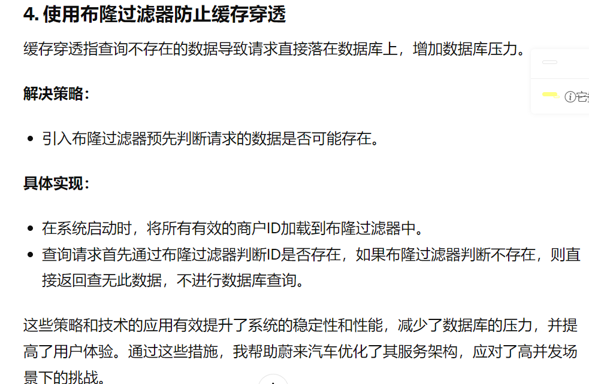
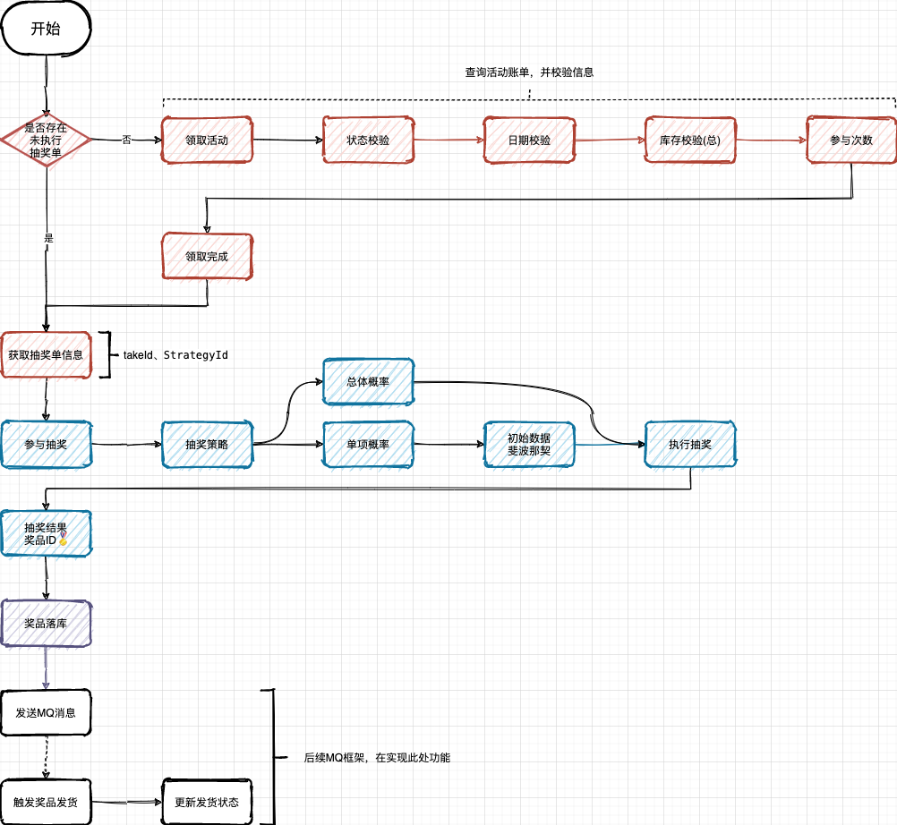
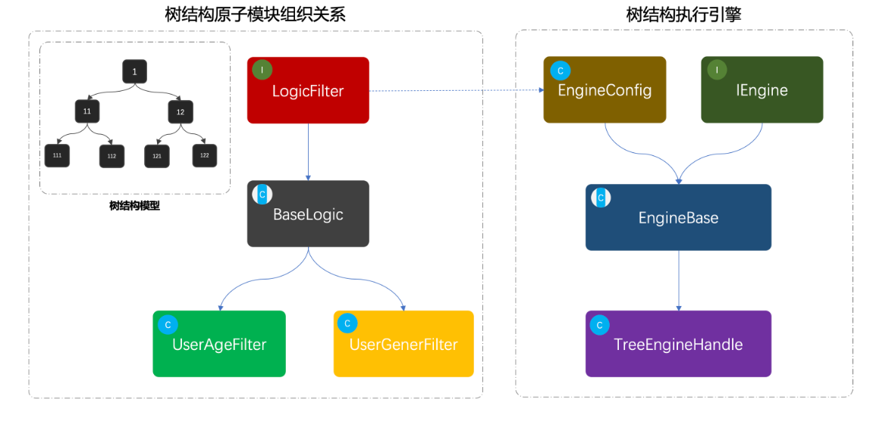
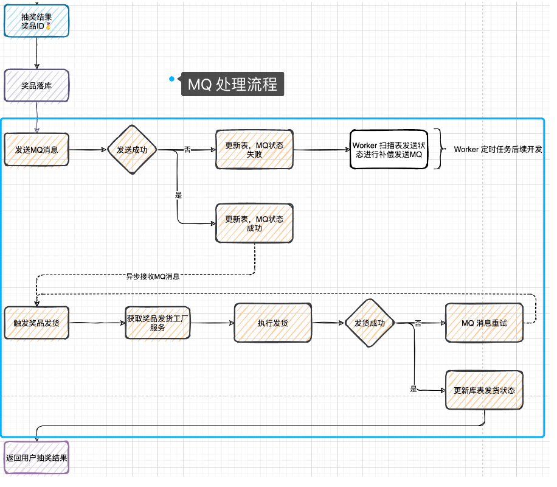
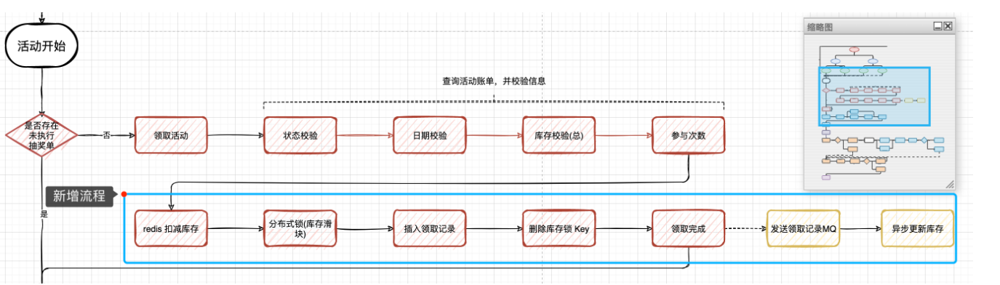

## 包装蔚来实习经历  做了哪些事情  有什么创新点

### 做了哪些事情

* C端商户商品详情优化：我负责完成了C端商户商品详情的查询功能，通过优化商户商品查询接口，成功减少了接口的响应时间。这一工作不仅提升了用户对商品信息获取的速度，还对整体的用户体验有了显著的提升。

* 异步处理机制：在商品详情查询中，我实现了异步处理机制，通过线程池管理并发任务，使用了Future设计模式，有效管理异步任务的执行状态。这种方式显著提高了系统处理高并发请求的能力，确保了服务的稳定和快速响应。

* 门面设计模式的应用：我应用了门面(Facade)设计模式，通过一个统一的接口封装了所有商户商品的操作，简化了外部调用的复杂性。这种设计提高了代码的可读性和可维护性，同时也降低了各个系统组件之间的耦合度。

* 增值服务微服务架构设计：我了解并参与了增值服务的微服务架构设计，编写了matrix底层业务代码（BE），并撰写了openapi上层业务接口调用代码（BFF）。通过这个过程，我深入理解了微服务架构的设计理念和实践方法。

* DevOps实践：我使用luban进行了上线部署，并针对测试提出的问题进行了日志查询和问题修复，熟练使用了git操作和Postman测试。这一实践加深了我的DevOps能力，提高了我的问题诊断和解决效率。

* Apollo配置管理：我在SpringBoot服务中应用了Apollo进行部署启动和应用配置管理，这不仅使配置管理更加集中和方便，也提高了配置的更改效率和安全性。


### 实习亮点

1. **使用Redis缓存用户频繁查询的店铺信息**
为了提高店铺信息的访问速度并减少对数据库的压力，我使用Redis来缓存用户频繁查询的店铺信息。这个过程包括以下步骤：

* 缓存逻辑实现：当用户请求店铺信息时，系统首先检查Redis缓存是否有该店铺的数据。如果有，则直接从缓存中获取数据返回给用户；如果没有，系统将从数据库中查询数据，然后将查询结果存入Redis缓存，并设置适当的过期时间以避免过时信息的问题。
* 缓存更新策略：为了保证缓存数据的一致性，每当店铺信息被更新时，相关的缓存也会被同步更新或清除，确保用户总是获取到最新的数据。

2. **使用Redis Set缓存用户关注信息**
* 用户的关注信息是频繁变动且被频繁访问的数据，适合使用Redis的Set数据结构进行管理：

* Set操作：Redis的Set结构提供了快速的添加、删除和检查操作，这使得它非常适合用来管理用户的关注列表。每当用户关注或取消关注一个店铺，系统会更新Redis中对应的Set。
优势：使用Set不仅响应速度快，还可以自动防止重复关注，提升了操作的效率和用户体验。

3. **使用Lua脚本保证活动优惠券的库存扣减问题**

* Lua脚本的应用：通过编写Lua脚本，一次性完成“检查库存”和“扣减库存”的操作，这两步作为一个原子操作在Redis服务器执行，避免了并发环境下的数据竞争问题。
* 脚本实例：Lua脚本会首先检查指定的库存键是否足够，如果足够则进行扣减，并返回扣减成功的信号；如果不足，则返回库存不足的错误。

## 互斥锁解决缓存击穿问题


缓存击穿指的是在缓存和数据库之间存在大量并发请求时，如果缓存失效（如某个热点key过期），所有的请求都会击穿缓存直接访问数据库，这可能导致数据库压力过大甚至崩溃


* 使用互斥锁（Mutex Lock）通过Redis的SETNX命令实现。
* 当缓存失效时，不是所有请求都去数据库加载数据，而是让第一个请求使用SETNX尝试获取锁。
* 如果获取锁成功，则去数据库查询数据并重新建立缓存；如果获取锁失败，其他请求则等待或重试直到缓存被重建。

* 具体实现：

  * 对每个商品或商户信息建立一个唯一锁键，例如："lock:merchant:123"，其中123是商户ID。
  * 当查询该商户信息的请求到来时，首先检查缓存。
  * 如果缓存中没有，尝试通过SETNX设置锁键，如果设置成功（返回1），则查询数据库并更新缓存；如果设置失败（返回0），表示其他线程已经在处理，当前线程则等待或者轮询直到缓存更新。

## 确保优惠券领取的唯一性

**为了防止一个用户多次领取同一优惠券的情况，需要在用户领取时进行控制。解决策略：对每个用户和优惠券组合使用SETNX命令创建一个唯一标识符，例如："user_coupon:userID:couponID"**


具体实现：

* 用户尝试领取优惠券时，使用SETNX命令尝试设置标识符。
* 如果命令返回1，表示之前没有人领取过，允许领取，并进行后续的业务处理。
* 如果返回0，表示该用户已经领取过这张优惠券，拒绝领取请求。


1. **使用布隆过滤器解决缓存穿透问题**

缓存穿透是指查询不存在的数据，导致请求直接落到数据库上，从而给数据库带来压力。布隆过滤器可以有效解决这一问题：

* 布隆过滤器的部署：在Redis缓存之前部署布隆过滤器，用来检查查询的键是否可能存在于缓存中。
* 原理：布隆过滤器通过多个哈希函数将信息映射到一个大的位数组上，查询时只有当所有哈希函数所在位置都为1时，才认为元素可能存在。
* 实践应用：使用布隆过滤器预先过滤掉那些绝对不存在的查询请求，减轻了数据库的压力，提高了系统的整体性能。

  


# 项目介绍

  


# RPC远程服务调用

## 介绍


## 描述

&emsp;通过使用 Dubbo 框架实现 RPC（远程过程调用）服务，构建了一个分布式的应用系统,支持高效、可靠的服务间信息通信

**系统中单独定义RPC模块，定义各种RPC调用接口，在Interfaces层定义实现各种RPC调用接口服务**

* Dubbo框架
* 服务的提供者: 在ActivityBooth类中实现IactivityBooth 接口 通过Dubbo @service 注解发布了活动查询服务
* 在开发和测试环境中 通过设置广播模式 采用五注册中心的方式进行服务发现和通信 简化了配置


## 使用RPC进行拆分架构

**在DDD 项目中 结合RPC 技术进行微服务拆分和通信是一种比较常见的架构模式，项目一般都会被拆分为多个模块 每一个模块负责不同的领域逻辑和通信任务**

* Common 基础公共模块剔红系统的工具类
* Domain 包含领域实体  值对象 聚合对象 领域服务 核心业务逻辑 **实现各种领域服务 抽奖策略领域 奖品发放领域 活动信息领域**
* 应用层模块： 应用层负责编排领域模块的业务逻辑 处理更高层的业务逻辑和应用逻辑
* infrastructure 基础设施：提供 DAO PO Repository操作
* 接口层负责暴露服务的入口 RPC 接口

## 为什么选择广播模式Dubbo

* 在分布式系统中，RPC（远程过程调用）是一种常用的技术，用于实现不同服务之间的通信。Dubbo 是一个高性能的、基于 Java 的 RPC 框架，它支持多种服务治理方案，包括使用注册中心来发现和调用服务。然而，配置和使用注册中心需要一定的学习成本，特别是在学习实践或小规模项目初期，可能希望尽可能简化配置和依赖，以专注于核心业务逻辑的实现


**广播模式提供了一种无需注册中心的服务发现机制，服务启动的时候将服务信息通过广播模式发送到网络中，服务消费者监听指定的广播地址 从而实现服务的发现 简化了配置**


* 测试之前需要把 Lottery 工程中的 lottery-rpc 进行构建打包，便于测试工程引入

```java
<dependency>
    <groupId>cn.itedus.lottery</groupId>
    <artifactId>lottery-rpc</artifactId>
    <version>1.0-SNAPSHOT</version>
</dependency>

```

# 你的项目用到了哪些表格

* 活动配置，activity：提供活动的基本配置
* 策略配置，strategy：用于配置抽奖策略，概率、玩法、库存、奖品
* 策略明细，strategy_detail：抽奖策略的具体明细配置
* 奖品配置，award：用于配置具体可以得到的奖品
* 用户参与活动记录表，user_take_activity：每个用户参与活动都* 会记录下他的参与信息，时间、次数
* 用户活动参与次数表，user_take_activity_count：用于记录当前参与了多少次
* 用户策略计算结果表，user_strategy_export_001~004：最终策略结果的一个记录，也就是奖品中奖信息的内容
* 策略配置和策略明细  1 v n
* 

  


**这些库表是用于支撑起抽奖系统开发的必备表，后续可能会随着功能的开发做适当的调整。我们会围绕这些库表一点点实现各个领域的功能，包括：抽奖策略领域、奖品发放领域、活动信息领域等**

# 项目实现哪些领域服务

* 抽奖策略领域
* 活动领域
* 规则引擎
* 用户服务
* 每一个领域功能包括 model repository service三块区域
* model ： 用于提供 vo req res aggregates聚合对象
* repository 提供仓储服务  也就是对mysql redis等数据进行统一包装
* servIce具体的业务领域逻辑实现


# 项目的充血模型体现在哪里？

* 充血模型（Rich Domain Model）是指一个模型中不仅包含数据，还包含处理这些数据的业务逻辑。这与贫血模型（Anemic Domain Model）形成对比，后者的模型仅包含数据而没有业务逻辑，业务逻辑通常位于服务层中。
* 充血模型的优势
业务封装: 通过将数据和行为封装在同一个领域对象中，充血模型使得业务逻辑更加直观和集中，便于理解和维护。
降低耦合: 减少了领域模型与服务层之间的依赖，领域层自包含所有必要的业务逻辑，服务层更多扮演协调角色，负责调用领域模型的行为。
重用性和测试性: 充血模型通常更易于测试和重用，因为业务逻辑与数据结构紧密集成，可以通过单元测试直接测试领域模型的行为。


# 【策略模式】抽奖策略领域模块如何开发的-创新：单项概率抽奖和整体概率抽奖


**策略模式：两种抽奖算法可以算是不同的抽奖策略，最终提供统一的接口包装满足不同的抽奖功能调用**


* 在我们的策略配置表中有一个字段是计算方式 来选择到底是那种策略模式
* 需要注意的是，在策略表中不引入活动ID信息的配置 因为在建设领域，让部分领域实现具有可独立运行的特性 不被业务逻辑污染，作为无业务逻辑的通用共性的功能领域模块，在业务组合的过程中，可以使用此功能领域提供的标准接口

* model   req result 聚合对象StrategyRich
* repository 数据仓储服务接口  通过注入Infra层的DAO组件来访问数据库 完成对策略配置 策略明细和奖品信息的查询
* service 是具体的业务领域逻辑实现层，在这个包下定义了algorithm抽奖算法实现和具体的抽奖策略包装 draw 层，对外提供抽奖接口 IDrawExec#doDrawExec

* 总体概率：如果A奖品抽空后，B和C奖品的概率按照 3:5 均分，相当于B奖品中奖概率由 0.3 升为 0.375
* 单项概率：如果A奖品抽空后，B和C保持目前中奖概率，用户抽奖扔有20%中为A，因A库存抽空则结果展示为未中奖。为了运营成本，通常这种情况的使用的比较多

## 介绍一下单项概率算法和总体概率算法如何实现的

* 单项随机概率抽奖算法是指每个奖品有独立的中奖概率，不论其他奖品是否被抽中或库存为零，每个奖品的中奖概率都是固定不变的。如果随机抽到的奖品已经没有库存，则视为未中奖
  * 初始化时，为每个奖品配置一个独立的中奖概率。
  *  抽奖时，生成一个随机数，通过这个随机数决定用户抽中的是哪个奖品。
  * 如果所抽奖品已无库存，则返回未中奖。

* 总体概率抽奖算法是指，当某个奖品被抽中后，其概率会被重新分配到剩余的奖品上。这样做是为了保证总的中奖率不变，同时也使得每次抽奖的结果都能即时反映当前奖品的实际库存情况
  * 初始化时，为每个奖品配置一个中奖概率，并计算总概率
  * 抽奖时，首先检查每个奖品的库存，然后根据当前的库存情况动态调整奖品的中奖概率。
  * 生成一个随机数，根据调整后的概率决定中奖的奖品。


* **策略模式：在抽奖系统设计中，抽奖算法可以作为一个策略族，不同的抽奖算法（如单项随机概率和总体概率算法）实现相同的抽奖接口（IDrawAlgorithm）。
策略选择：根据不同的业务需求（如抽奖规则的不同、奖品库存管理的需求等），动态选择使用哪一种抽奖算法**


## 那你如何执行抽奖算法

* 首先获取抽奖策略配置
* 校验和初始化数据  初始化抽奖算法所需要的概率数据
* 执行抽奖算法 调用randomDraw执行抽奖 获取奖品ID
* 获取奖品信息 返回


# 创新点：模板模式处理抽奖

* 基于模板设计模式，规范化抽奖执行流程。包括：提取抽象类、编排模板流程、定义抽象方法、执行抽奖策略、扣减中奖库存、包装返回结果等

* 使用模板方法设计模式优化类 DrawExecImpl 抽奖过程方法实现，主要以抽象类 AbstractDrawBase 编排定义流程，定义抽象方法由类 DrawExecImpl 做具体实现的方式进行处理


## 讲一下模板化抽奖过程

* 标准化抽流程的核心步骤 初始化概率数据 获取排除奖品列表 执行抽奖算法 库存扣减和包装中奖结果  
* 在抽奖过程中预先初始化策略ID对应的概率信息和奖品ID 散列数组，避免每次抽奖的重复计算和数据库访问

* 库存扣减：这部分逻辑暂时使用数据库行级锁实现库存扣减

# 创新：工厂模式搭建发奖领域

* 关于award发奖领域 两块逻辑实现：goods商品处理  factory 工厂
* 工厂模式通过调用方提供发奖类型，返回对应的发奖服务，通过这样由具体的子类决定返回结果，并作相应的业务处理

**简单工厂模式来设计和实现了一个发奖配送的解决方案，DistributionGoodsFactory的简单工厂类，负责根据奖品类型动态地提供相应的奖品配送服务实例。这个工厂类继承自GoodsConfig配置类，后者负责初始化并存储一个奖品类型与配送服务实例之间的映射关系**


* 采用工厂模式使得奖品配送逻辑更加集中和清晰。每种奖品的配送逻辑被封装在各自的实现类中（如CouponGoods、DescGoods等），工厂类负责统一管理这些实现类的实例。


# 活动领域的配置与状态-> 设计模式的状态模式

* 活动创建、活动状态处理和用户领取活动操作
* **活动的创建操作需要用到实物，因为活动系统提供给运营后台创建活动的时候，需要包括：活动信息 奖品信息 策略信息 策略明细这些信息都需要在一个事务下面进行落库**

* **活动状态的管理是整个活动领域设计中非常关键的一部分。活动状态包括：编辑、提审、审核通过、审核拒绝、活动中、活动关闭等。每个状态下，活动可执行的操作和可能的状态转移都有所不同。为了有效管理活动状态的流转，并减少复杂的条件判断逻辑，我们采用了状态模式（State Pattern）。**
* **状态模式允许一个对象在其内部状态改变时改变它的行为。我们为每种活动状态定义了对应的状态类，这些类都继承自一个抽象状态类AbstractState，并实现了定义好的状态转移操作接口IStateHandler。这样，当活动的状态发生变化时，只需切换到对应的状态类实例，就可以调用相应的操作，而无需关心具体的状态转移逻辑。**


# 创新点：策略模式 + 雪花算法生成大量唯一ID


## 概述

* 我们采用了三种ID生成策略，以适应不同场景的需求，
* 雪花算法(Snowflake): 雪花算法是一种分布式ID生成策略，由Twitter开发。它生成的是一个64位的长整型数，能够保证在分布式系统中的全局唯一性。该算法通过组合机器ID、数据中心ID、毫秒级时间戳和序列号来生成ID，既能保证ID的唯一性，也能从ID中解析出生成时间等信息。在我们的系统中，我们利用Hutool工具包提供的实现，用它来生成订单号等需要大量且全局唯一的ID。

* 随机数生成(RandomNumeric): 这种策略使用Apache Commons的RandomStringUtils工具类生成一个指定长度的随机数字字符串。虽然简单，但在确保生成的ID在一定范围内唯一时非常有效和高效。我们在生成策略ID时采用了这种方法，因为策略ID的生成量不会太大，同时需要保持简洁。

* 短码生成(ShortCode): 短码生成策略主要用于生成较短且数量不是非常大的ID，如活动号。这种策略通过结合当前的时间信息（如年、周、小时）和随机数来生成ID，既保证了ID的简短，也能满足唯一性的需求。这对于需要人工输入或记忆的场景特别有用。


* 用策略模式把三种生成ID的算法进行统一包装，由调用方决定使用哪种生成ID的策略

```
ID 的生成因为有三种不同 ID 用于在不同的场景下；

订单号：唯一、大量、订单创建时使用、分库分表
活动号：唯一、少量、活动创建时使用、单库单表
策略号：唯一、少量、活动创建时使用、单库单表
```

* 雪花算法(SnowFlake): 适用于需要生成大量唯一ID的场景，如订单号。
* 日期拼接算法(ShortCode): 生成的ID较短，适用于活动号这种需求较少的场景。
* 随机数算法(RandomNumeric): 适用于策略ID的生成，需要保证唯一性。

* 雪花算法(SnowFlake): 主要用于生成唯一的单号。雪花算法是一个分布式系统中生成唯一ID的算法，它能够保证在分布式系统环境下生成全局唯一的ID号。它通过组合机器ID、时间戳和序列号来实现ID的唯一性和顺序性。
* 日期算法: 适用于生成活动编号这类ID，其特点是生成的数字串较短。这种方法通常依赖于当前日期和时间，可能会加上一些随机序列来保证在同一时间点生成的ID的唯一性。但是，它在指定的时间内不能生成太多的ID，以避免ID冲突
* 随机算法: 主要用于生成策略ID，依赖于生成随机数的方法来保证ID的唯一性


**日期凭借算法的短码生成策略主要是组合当前年月日的和一个随机数三位数 生成一个短码，注意该方法使用synchronized关键字来保证线程安全，防止高并发场景下产生相同的编号**

**雪花算法生成订单号ID：使用hutool工具包中的雪花算法生成唯一ID的策略，保证全局的唯一性**


## 请你讲讲雪花算法如何生成订单号ID

* 首先初始化Snowflake对象：类初始化之后，首先尝试获取本地IP地址,然后将IP地址转换为long类型的数值workerId 如果获取IP地址失败，则使用本地IP字符串的哈希码，workerId通过右移16位然后与31进行位与操作，以确保workerId在合理范围内（0~31），满足Snowflake算法对工作机器ID的要求。
* 数据中心ID（dataCenterId）：这里硬编码为1，实际应用中可以根据需要进行配置。
* 创建Snowflake对象：使用Hutool工具包的IdUtil.createSnowflake方法创建一个Snowflake对象，需要传入workerId和dataCenterId。这个对象会在接下来生成ID时使用。
* 生成ID：nextId方法使用创建的Snowflake对象来生成下一个唯一ID。注意，这里使用synchronized关键字保证了方法的线程安全，因为Snowflake算法在高并发的情况下可能会生成重复的ID，通过同步处理可以避免这个问题

## 请你讲讲雪花算法如何实现？

* 雪花算法生成的是一个64位的长整形Long
* 通过不同的部分组合：1位未使用、41位时间戳、10位工作机器id（可以分为5位datacenterId和5位workerId）、12位序列号


* 第1位：未使用，**因为二进制中最高位为1的话会被当作负数**，但实际应用中一般不需要生成负数的ID，所以这一位固定为0。
* 接下来的41位：**用来记录时间戳（毫秒级）。41位可以表示$2^{41}-1$个数字，如果只用这41位来表示时间戳**，则可以使用69年。
* 接下来的10位：**用来记录工作机器id**，可以部署在$2^{10} = 1024$个节点，包括5位datacenterId和5位workerId。
* 最后的12位：序列号，用来记录同毫秒内产生的不同id。12位可以表示的最大正整数是4095，即同一机器同一时间戳（毫秒）内能够产生的ID数量。

优点：
  * 高性能：能够在分布式系统内快速生成唯一的ID 并且生成工程简单
  * 以时间为基准  保证ID的唯一性
  * 可排序：生成的ID是趋势递增的 


缺点：
* 时间回拨问题： 如果系统时钟回拨，可能导致ID冲突或者重复，解决方案包括使用NTP时间同步，或者在检测到时钟回拨时 让服务暂时停止一段时间
* 不同系统键的时间同步问题：在分布式环境中，不同机器的时间可能存在微小的差异，这在大多数情况下并不会引起问题
* 序列号溢出问题：在同一毫秒内生成的ID数量超过序列号的最大值  可以等到下一毫秒产生


# 创新点分库分表

## 概述

**在分库分表的设计与实现中，涉及到了散列算法、数据源切换、AOP切面技术、以及SpringBoot Starter的开发。这些技术点共同支撑起了一个能够动态路由到不同数据库与表的系统**


**用到的技术点：AOP、数据源切换、散列算法、哈希寻址、ThreadLocal以及SpringBoot的Starter开发方式**

### 散列算法

* 我们用到的散列算法主要是斐波那契散列法，可以让数据更加分散，然后再数据发生碰撞之后进行开放寻址，从碰撞节点向后寻找位置进行存放元素

* 斐波那契散列通常采用斐波那契数列的“黄金分割点”作为散列的基础，

  

### AOP

AOP切面
* AOP（面向切面编程）是一种编程范式，允许开发者定义横切关注点（cross-cutting concerns），比如日志、事务管理等。在分库分表中，AOP切面技术可以用于实现数据库路由的逻辑，比如在方法执行前切换到正确的数据源。

### SpringBoot db Starter

* DB route Starter是Spring Boot提供的一种快速集成第三方库的机制。通过定义Starter，开发者可以将常用的配置、模板代码封装起来，简化Spring应用的初始搭建和配置工作。在分库分表组件中，可以通过自定义Starter，将分库分表的逻辑封装起来，提供给其他服务使用。

* 垂直拆分：指的是按照业务将表进行分类，其实就是由于业务体量比较大，数据增长的快速，所以需要将用户数据拆分到不同的库表中，减轻数据库压力
* 水平拆分：不同于垂直拆分（不同的表拆到不同的数据库中） 水平拆分是将同一个表拆到不同的数据库中

* AOP切面拦截的使用 因为需要给使用数据库路由的方法做上标记 便于处理分库分表逻辑
* 数据源的切换曹祖 既然有分库那么就会涉及到多个数据源之间进行连接切换，以便于把数据分配给不同的数据库中
* 数据库表寻址操作，一条数据需要进行索引计算操作 查到位置
* 数据散列操作：让数据均匀

## 讲讲项目中的分库分表如何实现

* 首先自定义路由注解，用于放置在需要被数据库路由的方法上
* 使用方式是通过方法配置注解，就可以被我们指定的AOP切面进行拦截，拦截之后进行相应的数据库路由计算和判断，并且切换到相应的操作数据源上面


* @DBRouterStrategy(splitTable = true)  表示这个接口的数据库操作需要考虑分表的策略，true表示DAO操作涉及到的数据库表是分表的，mybatis再执行任何数据库操作之前，会根据分表策略确定具体操作的目标表
* insert用于将用户的策略计算结果插入数据库中，@DBRouter(key = "uId")注解表示插入操作的分表策略将根据userStrategyExport对象的uId字段来计算，这意味着根据uId的值，mybatis会将数据插入到计算得到的特定分表中
* queryUserStrategyExportByUId  dbrouter注解表示查询操作会根据方法参数中的uId来计算 


```java
@Mapper
@DBRouterStrategy(splitTable = true)
public interface IUserStrategyExportDao {

    /**
     * 新增数据
     * @param userStrategyExport 用户策略
     */
    @DBRouter(key = "uId")
    void insert(UserStrategyExport userStrategyExport);

    /**
     * 查询数据
     * @param uId 用户ID
     * @return 用户策略
     */
    @DBRouter
    UserStrategyExport queryUserStrategyExportByUId(String uId);

}

```

* 关于配置文件

* 指定分库数量 2
* 分表数量 4
* default db00 表示默认数据源db00
* routerKey: uId：定义用于分库分表计算的路由键，这里使用用户ID（uId）作为路由键
* 这种配置方式允许应用根据用户ID来动态选择数据源 从而实现对不同数据库和表的访问 从而支持分库分表的场景

```yml
mini-db-router:
  jdbc:
    datasource:
      dbCount: 2
      tbCount: 4
      default: db00
      routerKey: uId
      list: db01,db02
      db00:
        driver-class-name: com.mysql.cj.jdbc.Driver
        url: jdbc:mysql://127.0.0.1:3306/lottery?useUnicode=true&serverTimezone=UTC
        username: root
        password: 123456
      db01:
        driver-class-name: com.mysql.cj.jdbc.Driver
        url: jdbc:mysql://127.0.0.1:3306/lottery_01?useUnicode=true&serverTimezone=UTC
        username: root
        password: 123456
      db02:
        driver-class-name: com.mysql.cj.jdbc.Driver
        url: jdbc:mysql://127.0.0.1:3306/lottery_02?useUnicode=true&serverTimezone=UTC
        username: root
        password: 123456

```


## 讲讲自己写的数据库路由组件  DB-Router-Starter


### DBRouter

**自定义DBRouter  用于标记哪些需要进行数据库路由的类或者方法，该注解可以帮助对数据库操作的拦截，从而根据注解提供的信息，动态的决定数据应该去哪一个数据库或者哪一个表**

* @Retention(RetentionPolicy.RUNTIME): 指定注解的保留策略是RUNTIME，意味着这个注解在运行时依然可见，因此可以通过反射机制读取注解的信息
* @Target({ElementType.TYPE, ElementType.METHOD}): 表明这个注解可以用在类或接口上（TYPE），也可以用在类的方法上（METHOD）。这为使用该注解提供了灵活性，既可以对整个类进行配置，也可以仅对类中的特定方法进行配置
* key: 这个属性用于指定分库分表的字段，它是一个字符串类型，默认值为空字符串。在使用注解时，可以通过key属性指定哪个字段用于分库分表的依据。例如，在一个用户信息的数据库表中，可以使用用户ID作为分表的依据，这时就可以通过key属性来指明
* 


```java

package cn.bugstack.middleware.db.router.annotation;

import java.lang.annotation.*;


/**
 * @description: 路由注解
 * @author: 小傅哥，微信：fustack
 * @date: 2021/9/22
 * @github: https://github.com/fuzhengwei
 * @Copyright: 公众号：bugstack虫洞栈 | 博客：https://bugstack.cn - 沉淀、分享、成长，让自己和他人都能有所收获！
 */
@Documented
@Retention(RetentionPolicy.RUNTIME)
@Target({ElementType.TYPE, ElementType.METHOD})
public @interface DBRouter {

    /** 分库分表字段 */
    String key() default "";

}

```


### DBRouterStrategy

* 该注解用于指定一个类或者方法是否涉及到分表策略
* 注解有助于框架再运行的时候根据指定的策略进行数据路由
* @Retention(RetentionPolicy.RUNTIME)：指定注解的保留策略为运行时。这意味着这个注解在运行时是可见的，因此可以通过反射获取注解信息。
* @Target({ElementType.TYPE, ElementType.METHOD})：表示这个注解可以被用于类或接口上（ElementType.TYPE），也可以用于方法上（ElementType.METHOD）
* splitTable()：这是注解的一个属性，返回一个布尔值，默认值为false。如果设置为true，表示这个类或方法涉及分表操作，需要按照分表的策略来路由数据。这对框架来说是一个信号，告诉框架执行这个类或方法时需要考虑数据库的分表逻辑。
  

**@DBRouterStrategy注解允许你标记那些需要进行分表操作的类或方法，这样框架就可以在执行这些操作时应用适当的路由策略，确保数据被正确地分配到不同的表中**


```java
package cn.bugstack.middleware.db.router.annotation;

import java.lang.annotation.*;

/**
 * @description: 路由策略，分表标记
 * @author: 小傅哥，微信：fustack
 * @date: 2021/9/30
 * @github: https://github.com/fuzhengwei
 * @Copyright: 公众号：bugstack虫洞栈 | 博客：https://bugstack.cn - 沉淀、分享、成长，让自己和他人都能有所收获！
 */
@Documented
@Retention(RetentionPolicy.RUNTIME)
@Target({ElementType.TYPE, ElementType.METHOD})
public @interface DBRouterStrategy {

    boolean splitTable() default false;

}

```


### 数据源配置DataSourceAutoConfig 

* 设置数据路由的环境
* 分库分表配置
  * 通过实现EnvironmentAware接口，该配置类能够访问到Spring环境中的属性，允许它读取和处理mini-db-router前缀下的分库分表相关配置。
  * 它读取分库(dbCount)和分表(tbCount)的数量，以及用于路由的键(routerKey)，这些配置影响了如何将数据分布在不同的数据库和表中。
* 动态数据源
  * createDataSource()方法创建一个DynamicDataSource，这是一个自定义的数据源，支持根据某些规则（如用户ID）动态选择实际的数据源。
  * 数据源信息是从配置文件中读取的，并且可以有多个数据源配置。这些数据源配置会被保存在一个Map中，后续可以根据键值（通常是业务逻辑中的某个字段，如用户ID）动态切换。

### IDBRouterStrategy


* 定义数据库路由策略的核心方法  主要用于实现分库分表的逻辑
* doRouter(String dbKeyAttr)： 确定数据路由到哪一个数据库和表的核心逻辑
* setDBKey(int dbIdx) 和 setTBKey(int tbIdx)： 手动设置当前现成的分库和分表索引
* dbCount() 和 tbCount()： 获取分库和分表的数量，配置数据库的数量和表的数量

### DBRouterConfig

* 配置数据路由的基础设置 定义分库分表的策略 宝库分库的数量 分表的数量 
* 同时指定分库分表路由计算的关键字段


### DBRouterBase

* 数据源基础配置类
* 提供方法获取当前线程特定的表的索引，这个表的索引是用于确定数据应该被路由到哪一个具体的表中


### DBRouterJoinPoint


* 通过AOP实现的数据路由切面类
* 拦截所有被DBRouter注解标记的方法，然后根据注解中的配置以及全局的路由配置来执行具体的数据库路由逻辑
  

* 主要流程
  * 路由键配置检查：首先检查方法上面的DBRouter注解 看看是不是有指定的key,如果没有 尝试使用全局配置的路由键
  * 从方法的入参中提取出指定的路由键(dbKey)对应的值(dbKeyAttr)。这里对单个参数的情况做了特别处理，如果参数是单个且为字符串，则直接返回该参数作为路由属性值；否则，会反射遍历所有参数，尝试获取对应字段的值。
  * 执行路由策略：使用配置的路由策略(dbRouterStrategy)根据提取出的路由属性值进行路由计算，这可能涉及到决定数据应该去哪个数据库或是哪个数据表
  * 执行被拦截的方法：路由计算完成后，允许被拦截的方法继续执行
  * 清理路由上下文：在方法执行完成后，需要清除本次请求所使用的路由上下文信息，以避免对后续操作造成影响。这一步非常重要，因为路由信息是通过 ThreadLocal 存储的，如果不清除，可能会导致内存泄漏。


* 涉及到的技术
  * AOP切面 ：通过 @Aspect 注解定义了一个 AOP 切面，@Pointcut 指定了拦截规则，即所有被 @DBRouter 注解标记的方法。@Around 注解定义了环绕通知，实现了拦截逻辑。
  * 反射访问：为了从方法的入参中获取指定的路由键值，使用了反射技术访问对象的字段。这包括处理私有字段和处理继承情况下的字段访问。
  * 动态路由：整个实现的核心是如何根据注解和方法参数动态决定数据的路由路径。这对于实现数据库的水平分库分表具有重要意义，可以根据业务需求灵活地扩展数据库结构，提高数据库操作的效率和可维护性


### DBRouterStrategyHashCode

* 定义一种基于哈希值的数据库路由策略
* 目的是通过哈希散列函数 将数据均匀地分配到多个数据库和数据表中 以实现数据的水平分库分表
* 流程：
  * 构造函数:接收一个 DBRouterConfig 实例，用于获取分库分表的配置信息，例如分库数量(dbCount)和分表数量(tbCount)
  * 路由计算：根据分库分表的总数(size)，使用扰动函数增加哈希值的随机性，减少哈希碰撞的概率。扰动函数利用了位运算，结合原始哈希值的高低位信息，提高分布的均匀性
  * 计算出的哈希值(idx)用来决定数据存储在哪一个数据库和哪一个表中。通过算法计算得到库索引(dbIdx)和表索引(tbIdx)。
  * 使用 DBContextHolder 类（一个基于 ThreadLocal 的上下文持有器）设置当前线程的数据库和表的键值，以便于后续操作（如数据库操作）可以根据这些键值定位到正确的数据库和表。
  * 设置和获取路由键：提供了 setDBKey 和 setTBKey 方法手动设置路由键，以及 dbCount 和 tbCount 方法获取分库分表的数量信息。
  * 清除路由信息(clear 方法)：在操作完成后，需要调用 clear 方法清除 ThreadLocal 中存储的路由信息，防止内存泄漏或者错误的路由信息干扰后续操作。


### 请你讲一下分库分表的计算公式？

* 总大小计算：首先知道总共有多少个数据库和表的组合，这个总数是分库数量dbCount乘以分表数量tbCount得到的
* 扰动函数应用：使用一个扰动函数处理路由键值dbKeyAttr的哈希值，以增加散列的随机性和均匀性，扰动函数通常使用位运算 16位右，结合原始哈希值的高低位信息，提高分布的均匀性
* 库表索引计算：得到扰动之后的索引Idx之后，需要计算这个索引值属于哪一个数据库和哪一个表
  * 库索引dbIdx的计算公式为：int dbIdx = idx / dbRouterConfig.getTbCount() + 1;  将索引值除以总表数来确定数据应该落在哪一个数据库中，加1是因为数据库的索引通常是从1 开始的
  * 表索引tbIdx：int tbIdx = idx - dbRouterConfig.getTbCount() * (dbIdx - 1); 通过索引值减去已经计算出来的库所占用的表的总数，来确定数据应该落在当前数据库的哪一个表中
  * 


## 讲一下自定义数据库路由组件的创新点

分库分表的实现主要涉及以下几个关键点：

* 路由策略：定义数据如何分配到不同的库和表中。通常基于某个字段的值（如用户ID）进行哈希计算，再根据哈希结果决定数据路由到哪个数据库和表。

* 扰动函数：为了使数据更均匀地分布在各个库表中，采用扰动函数对哈希值进行再处理，增加分布的随机性和均匀性。

* 数据源管理：在多数据库环境下，需要动态管理和切换数据源。根据路由策略计算出的目标数据库，动态指定当前操作的数据源。

* MyBatis拦截器：通过自定义MyBatis拦截器，动态修改SQL语句中的表名，实现分表逻辑。

### 在抽奖项目中使用分库分表组件

* 引入starter组件：在项目中的pom文件添加分库分表starter组件的依赖
* 配置数据源：在application.yml中配置多个数据源，包括每一个数据源的连接信息，数据库和表的数量
* 定义路由注解：在需要进行分库分表操作的dao接口或者方法,使用dbRouter注解指定路由字段
* 配置路由策略：通过实现IDBRouterStrategy接口，定义自己的路由策略，可以实现一个基于哈希算法的路由策略
* 使用AOP进行路由，使用AOP技术，拦截带有DBRouter注解的方法，根据路由策略计算出目标数据库和表，动态切换数据源，并且通过Mybatis拦截器修改SQL语句实现分表


### 请问扰动函数是什么


* 扰动函数的目的是为了让哈希值更加均匀分布，避免数据倾斜问题，
* int idx = (size - 1) & (dbKeyAttr.hashCode() ^ (dbKeyAttr.hashCode() >>> 16));
* 首先获取基于路由字段比如用户ID的哈希值，然后通过和自身进行无符号右移16位进行异或操作，这样得到的结果idx会更加分散，通过这个计算后的idx可以进一步计算得到目标数据库和表的索引


### 数据源如何实现切换

* 定义一个动态数据源：创建一个DynameicDataSource 继承AbstractRoutingDataSource 写determineCurrentLookupKey方法。在这个方法中返回当前线程所需要操作的数据源的key。

* 配置多数据源：在Spring配置文件中定义多个数据源，并将这些数据源注入到DynamicDataSource中，同时设置默认数据源。
* 切换数据源：通过在执行数据库操作前，基于扰动函数计算得到的数据库和表索引，动态设置DBContextHolder中保存的当前线程的数据源key。AbstractRoutingDataSource将根据这个key来决定使用哪个数据源。
* 在执行数据库操作时，AbstractRoutingDataSource会调用determineCurrentLookupKey方法获取当前线程指定的数据源key，并根据这个key找到对应的数据源进行数据库操作。这样，就实现了基于路由策略的数据源动态切换。


# 创新点：讲一下规则引擎量化人群参与活动  规则领域 domain下面

##  如何实现的

* 规则引擎过滤功能用于筛选和确定用户是否符合参与某一活动的条件
* 1 组合模式构建规则树：规则引擎采用组合模式来构建规则树，这种结构能灵活的表示规则之间的逻辑关系，规则树由节点Node和节点连接线NodeLine组成，通过节点间的父子关系表示规则的逻辑结构
* 2 规则过滤器 每一个规则节点对应一个具体的规则过滤器，这些过滤器负责对输入的决策物料进行判断，输出决策结果，通过定义规则过滤器接口和基础抽象类，系统可以灵活欧战新的规则过滤器
* 3 规则引擎处理器：RuleEngineHandle 类作为规则引擎的核心处理器，实现了规则决策的主要逻辑。它通过IRuleRepository从数据库中查询规则树的配置信息，然后根据决策物料逐步遍历规则树，直到找到最终的决策结果。
* 4 决策物料：决策物料（DecisionMatterReq）作为规则决策的输入，包含了所有必要的决策参数，如用户的年龄、性别等。这种设计使得规则引擎可以应用于不同的决策场景。

### 三种Po对象定义
* RuleTree
  * 这个类代表了一个规则树，它是规则引擎的基础。每个RuleTree对象存储了一棵规则树的基本信息，包括树的ID、树的名称、树的描述以及树的根节点ID。这些信息对于理解和管理规则树至关重要。通过这个类，可以对规则树进行基本的操作，如查询和更新规则树的结构
* RuleTreeNode
  * 这个类代表了规则树中的一个节点。每个节点可能代表一个决策点或者一个最终的决策结果。节点包含了类型（例如子叶节点或果实节点）、节点值（在果实节点中使用）、规则Key以及规则描述。这些信息使得每个节点都能够根据特定的逻辑或条件进行操作，是规则树执行逻辑判断的关键部分。
* RuleTreeNodeLine
  * 这个类表示规则树中节点之间的连线，是规则逻辑流转的关键。每条连线定义了从一个节点（From）到另一个节点（To）的转移条件，如限定类型（等于、大于、小于等）和限定值。这使得规则树可以根据不同的输入值决策出不同的路径，从而达到复杂的决策逻辑。


* 实现LogicFilter接口：为规则引擎提供一个基础的逻辑判断框架
* filter：
  * 遍历所有规则节点线信息，调用方法进行决策逻辑判断，如果判断为真，就返回对应的下一个节点ID，如果没有任何规则匹配成功，返回一个预定的空姐点ID，表示没有符合条件的决策路径
  * matterValue方法：这是一个抽象方法 需要具体的逻辑过滤器，根据决策物料请求进行获取用于逻辑判断的决策值
  * decisionLogic 方法：这是一个私有方法，用于根据节点线的限定类型（如等于、大于、小于等）和限定值来对决策值进行逻辑判断。这个方法的实现体现了决策树节点间的逻辑关系，如何根据不同的条件进行分支选择
  * 


* UserAgeFilter 和 UserGenderFilter: 具体是基于用户年龄的规则和用户性别的规则过来
* 方法是用于从决策物料（DecisionMatterReq）中提取特定的决策值


* EngineBase 类通过抽象规则决策的基本流程和结构
  * 抽象规则处理流程：EngineBase 通过定义 engineDecisionMaker 方法，实现了从决策树的根节点开始，根据决策物料的值递归地选择下一步要遍历的节点，直到达到叶子节点或果实节点。
  * 使用逻辑过滤器：在决策过程中，根据当前节点所需的规则键（ruleKey），从 logicFilterMap 中获取对应的逻辑过滤器（LogicFilter）实例，然后使用该过滤器对决策物料进行评估，以决定下一步的路径。
  * 决策逻辑的核心在于如何根据决策物料的值和规则树的配置选择下一步的路径，这需要密切关注规则树的配置和逻辑过滤器的实现


# 创新：讲一下使用MQ消息组件解耦发货流程  以及 worker补偿消息MQ发送

&emsp;在抽奖系统中，当用户中奖后，需要执行一系列发奖操作，生成发货单，通知发货等，通过引入Kafka，系统将中将物品的发货单消息发送到MQ，然后由独立的服务监听MQ中的消息来处理发奖流程，从而实现业务逻辑和发奖流程的解耦


* 通过增加MQ_state字段在数据库表User_strategy_export中，用于跟踪MQ消息的发送状态，这个字段帮助实现消息发送成功与否的反馈，以便于后续的处理，比如发送失败的MQ消息可以通过定时任务进行补偿重试
* 我们使用Kafka作为消息队列中间件的选择，需要进行适当的配置和启动，包括创建专门的主题Topic,用于处理中奖发货单的消息


## 流程说明

* 当用户抽奖并且中将之后，系统会生成一条中将发货单消息，并且将其发送到Kafka的Topic中，这个过程是异步的，允许抽奖活动的其余部分在不等待发货处理完成的情况下继续进行
* 消息发送之后，系统会根据发送结果（成功或者失败）更新数据库中的mq_state状态，如果消息发送失败，系统将标记该消息，以便后续通过定时任务进行补偿处理
* 独立的服务监听主题中的消息，然后根据消息内容进行实际的发奖处理，如物流发货，虚拟奖品兑换码发送等


## 具体类
* KafkaProducer：使用KafkaTemplate发送消息到指定的Topic中。消息内容是中奖发货单的JSON字符串形式
  * 定义一个主题常量：lottery_invoice 用于存放中奖物品发货单的消息
  * 发送消息：sendLotteryInvoice方法接收一个InvoiceVO对象（中奖物品的发货单信息），然后将其转换为JSON字符串，并通过kafkaTemplate.send方法发送到TOPIC_INVOICE主题。这个方法返回一个ListenableFuture<SendResult<String, Object>>对象，可以用于异步处理发送结果。
* Kafka消费者：监听lottery_invoice主题，接收并处理消息。消费者处理消息时，会转化消息内容为具体的对象，并根据奖品类型进行相应的发奖逻辑处理
  * 首先检查消息是否存在如果存在将消息内容解析回InvoiceVO对象
  * 使用发奖服务的工厂类distributionGoodsFactory来获取对应奖品类型的发奖服务(IDistributionGoods)，并调用doDistribution方法来执行发奖逻辑。此过程中，传递的参数包括用户ID、订单ID、奖品ID、奖品名称和奖品内容等。
  * 确认一下消息成功处理，发奖逻辑执行无误
  * 如果在处理消息的过程中发生任何异常，将记录错误日志，并通过抛出异常来确保Kafka知道这条消息没有被成功处理，根据配置可能会进行重试


## MQ技术解耦发奖流程


* 构建发货单信息：buildInvoiceVO(drawOrderVO)方法根据抽奖订单信息drawOrderVO构建出发货单信息invoiceVO
* 发送MQ消息：通过kafkaProducer.sendLotteryInvoice(invoiceVO)方法将发货单信息作为消息发送到Kafka队列。这里使用ListenableFuture来处理异步发送结果，允许注册回调函数来处理发送成功或失败的场景。
* 如果消息成功发送到MQ，onSuccess回调方法会被触发，系统将根据发货单信息更新数据库中的记录，将mq_state状态设置为1，表示消息发送完成
* 如果消息发送失败，onFailure回调方法会被触发，系统将根据发货单信息更新数据库中的记录，将mq_state状态设置为2。这意味着需要后续通过定时任务或其他机制来补偿这次失败的消息发送，确保发奖流程的完整性和准确性

## 你是如何通过补偿机制来解决失败的消息发送

* 分布式任务调度，扫描抽奖发货单消息状态，对于未发送MQ或者发送失败的MQ，进行补偿发送处理
*  首先获取分库分表配置的表的数量tbCount
*  循环处理每一个指定的库，对每一个库中的所有表进行遍历
*  使用activityPartake.scanInvoiceMqState(dbCount, i) 方法扫描指定库表中需要补偿发送的发货单记录，返回一个发货单列表
* MQ消息补偿：
  * 对于每一个需要补偿的发货单记录，调用消费者重新发送MQ消息
  *   使用ListenableFuture来处理异步消息发送结果。如果发送成功，执行成功回调onSuccess，更新数据库中的MQ发送状态为成功
  *   发送失败，执行失败回调onFailure，更新数据库中的MQ发送状态为失败（Constants.MQState.FAIL.getCode()），以便后续再次进行补偿。


# 创新：分布式任务调度平台XXL-JOB

* 引入XXL-JOB分布式任务调度平台到抽奖系统，主要是为了处理需要定时任务解决的场景，比如扫描活动状态，确保活动能按时开启和关闭
* XXL-JOB是一个轻量级、易扩展的分布式任务调度平台，支持通过Web界面进行任务的CRUD操作，支持动态修改任务状态、启动/停止任务等


**定时扫描数据库中的活动记录，根据活动的时间状态自动更新活动状态，比如，将即将开始的活动状态更新为活动中，将已经结束的活动状态更新为已经结束**

## 项目中是如何使用XXL-JOb分布式任务调度平台-


### 配置

* 把需要使用xxl-job的包，引入对应的POM配置
* 配置application.yml 包括服务地址  应用名称  日志路径


### LotteryXxlJobConfig
  * 该类是XXL-JOB在Spring项目中的配置类，负责初始化XXL-JOB的执行器，让我的应用能够接入XXL-JOB任务调度平台
  * 通过注解Configuration 扫描配置类 然后执行里面的方法 完成XXL-JOB执行器的初始化
* 项目中配置属性注入 ：使用@Value注解从application.properties或application.yml文件中注入XXL-JOB的相关配置，包括调度中心的地址、执行器的名称、IP、端口号、日志路径和日志保留天数等。
* 创建Executor实例，注入容器，初始化为Bean资源，定义了一个方法xxlJobExecutor()，使用@Bean注解标记，这样Spring Boot就会自动调用这个方法，并将返回的XxlJobSpringExecutor对象注册到Spring容器中。XxlJobSpringExecutor是XXL-JOB与Spring集成的核心类，负责初始化执行器的配置并启动。
* 执行器配置设置：在Executor方法中，创建executor实例，通过setter方法设置上面注入的各项配置

### LotteryXxlJob

* 首先扫描活动列表：扫描待处理的活动列表，将0L作为起始ID 从头开始扫描
* 状态更新：遍历活动列表，根据活动的当前状态（审核通过或活动中且已过期），调用状态处理器stateHandler对活动状态进行更新
  * 审核通过的活动临近开启时间时，更新状态为“活动中”。
  * 活动中的状态且已过期的活动，更新状态为“关闭”
* 循环扫描：在处理完一批活动后，取最后一条记录的ID，再次调用scanToDoActivityList方法继续扫描后续的活动，直到没有更多活动需要处理


# 创新：使用分布式锁扣减活动库存

**引入redis到抽奖系统，设计颗粒度更细的滑动库存编号分布式锁，处理秒杀流程**

* 要解决的问题：引入redis来处理高并发库存下的扣减问题，细化粒度的锁控制，提高并发处理的能力

## 概述一下实现：

* 滑块库存锁设计：通过细化锁的颗粒度，使用活动ID+库存编号作为锁的key，避免大范围锁带来的并发限制
* 库存扣减操作：使用redis的incr 和decr操作进行库存的预扣减操作和恢复，通过setNx实现分布式锁，确保操作的原子性
* 并发锁删除处理：操作完成之后，需要及时释放锁，确保其他请求能够继续执行
* MQ消息异步处理：扣减缓存库存之后，异步通过MQ消息更新数据库中的库存，保证数据的最终一致性


## 要解决的问题：

* 活动参与流程中的库存扣减操作，这部分我们原来是使用数据库行级锁处理的库存扣减，但是因为存在并发问题，优化为redis分布式锁进行处理
* 活动领取完成之后，只是把缓存的库存清楚，但是数据库中的库存并没有扣减，所以我们需要发送一个MQ消息，来对数据库中的库存进行处理


&emsp;当锁的颗粒度比较大的时候，直接以整个活动的编号作为锁的key,这意味着对于整个活动的所有库存操作，无论是对那个具体的库存单元的操作，都会被整个大锁控制：
  * 所有对库存的操作都需要等待获取同一个锁，这在并发量大时会严重影响性能，因为大多数操作都会被挂起等待锁的释放
  * 库存剩余问题：在极端情况下，可能会出现由于部分用户在锁定资源之后因为各种原因，比如支付超时，导致实际库存没有被真正扣减，但是其他用户由于无法获取锁而错失秒杀机会，这就会导致虽然理论有库存，但是因为锁的控制使得这部分库存没办法被进一步下单
  * 锁的粒度和并发度的权衡：锁的粒度越大，意味着并发度越低，因为同一时间只能有一个操作可以访问这个资源，但是秒杀场景下面，理想的情况是尽可能多的用户能同时参与到秒杀活动中来，这就需要更细的锁粒度来允许更高的并发度


**解决思路：通过增加锁的颗粒度来进行优化，不是对整个活动进行枷锁，而是对每个库存单元枷锁，这样即使某个库存单元的操作被锁定，其他库存单元的操作仍然可以进行，从而提高了系统的并发处理能力，这样减少也因为锁竞争导致的库存剩余但是没办法下单的情况**

**活动ID+库存扣减后的值一起作为分布式锁的Key，这样就缩小了锁的颗粒度**


## 具体实现：


### subtractionActivityStockByRedis


* 通过redis扣减活动库存，这个方法的核心时通过redis的incr操作来实现库存的扣减，并且通过setNx方法枷锁，以保证库存操作的原子性和一致性，如果库存扣减后超出了原始库存数，则通过decr方法恢复库存，并且返回库存不足的结果


* 细节描述：
  * 获取库存Key：首先根据活动ID构造一个Redis中用于表示库存的Key
  * 扣减库存：通过Redis的incr命令对该Key进行加1操作，返回值是操作后的值，即当前已占用的库存数量。这个操作是原子的，可以保证在高并发情况下的正确性
  * 超出库存判断：如果扣减后的库存数量超过了活动的总库存数量，说明库存不足，此时需要通过decr命令恢复库存（即撤销刚才的incr操作），并返回库存不足的结果。
  * 细化锁的颗粒度：为了避免在高并发下锁的竞争过于激烈，通过将活动ID和当前占用的库存编号组合成新的Key，用于加锁。这样可以将锁的粒度从整个活动细化到活动的每一个库存单位上。
  * 加锁：使用setNx命令尝试对上一步生成的Key加锁，设置的过期时间为350毫秒。如果加锁成功，表示扣减库存操作成功；如果加锁失败（即返回false），表示已有其他线程对这个库存单位加锁成功，当前操作应认为是失败的。
  * 返回结果：最后根据操作的成功与否返回相应的结果。成功的情况下返回的StockResult对象中包含成功状态码、成功信息、锁Key和剩余库存数量；失败的情况下返回错误状态码和信息。
  * 

```java
@Override
public StockResult subtractionActivityStockByRedis(String uId, Long activityId, Integer stockCount) {

    //  1. 获取抽奖活动库存 Key
    String stockKey = Constants.RedisKey.KEY_LOTTERY_ACTIVITY_STOCK_COUNT(activityId);
    
    // 2. 扣减库存，目前占用库存数
    Integer stockUsedCount = (int) redisUtil.incr(stockKey, 1);
    
    // 3. 超出库存判断，进行恢复原始库存
    if (stockUsedCount > stockCount) {
        redisUtil.decr(stockKey, 1);
        return new StockResult(Constants.ResponseCode.UN_ERROR.getCode(), Constants.ResponseCode.UN_ERROR.getInfo());
    }
    
    // 4. 以活动库存占用编号，生成对应加锁Key，细化锁的颗粒度
    String stockTokenKey = Constants.RedisKey.KEY_LOTTERY_ACTIVITY_STOCK_COUNT_TOKEN(activityId, stockUsedCount);
    
    // 5. 使用 Redis.setNx 加一个分布式锁
    boolean lockToken = redisUtil.setNx(stockTokenKey, 350L);
    if (!lockToken) {
        logger.info("抽奖活动{}用户秒杀{}扣减库存，分布式锁失败：{}", activityId, uId, stockTokenKey);
        return new StockResult(Constants.ResponseCode.UN_ERROR.getCode(), Constants.ResponseCode.UN_ERROR.getInfo());
    }
    return new StockResult(Constants.ResponseCode.SUCCESS.getCode(), Constants.ResponseCode.SUCCESS.getInfo(), stockTokenKey, stockCount - stockUsedCount);
}


```


### 并发锁删除处理 recoverActivityCacheStockByRedis

* 这个Key是在扣减库存时生成的，用于控制库存扣减的原子性和一致性。删除这个Key实际上是释放了这个库存单位的锁，其他的请求可以再次对这个库存单位进行操作

```java
    @Override
    public void recoverActivityCacheStockByRedis(Long activityId, String tokenKey, String code) {
        // 删除分布式锁 Key
        redisUtil.del(tokenKey);
    }

```


* 在领取活动的模板方法中，优化掉原来直接使用数据库行级锁的流程，把 Redis 库存的扣减添加到这里。
扣减库存后，在各个以下的流程节点中，如果有流程失败则进行缓存库存的恢复操作。


### 技术栈与设计模式
* Spring框架：使用了Spring的@RestController和@Service等注解，体现了Spring框架的典型应用，包括依赖注入、控制反转等特性。
* RESTful API设计：通过@PostMapping注解定义了RESTful风格的API接口，表明了采用HTTP POST方法进行数据交互。
* 门面设计模式（Facade Pattern）：通过MerchantCommodity4CFacade接口和其实现类MerchantCommodity4CFacadeImpl的设计，体现了门面设计模式，简化了客户端与系统内部复杂逻辑的交互。
* 异步编程：在处理器类MerchantCommodityDetail4CProcessor中，通过线程池和Future实现异步调用，提高了系统的并发处理能力

### 结构和流程

* 控制层（Controller）：MerchantCommodity4CController类接收前端的请求，进一步调用服务层的接口处理请求。
* 服务门面层（Facade）：MerchantCommodity4CFacade定义了服务接口，MerchantCommodity4CFacadeImpl实现了具体的服务逻辑，作为Controller和具体业务逻辑之间的桥梁。
* 业务逻辑处理层（Processor）：MerchantCommodityDetail4CProcessor类具体实现了商品详情查询的业务逻辑，包括异步获取数据、处理业务逻辑等。
* 数据传输对象（DTO）：使用了多个DTO对象来传输数据，如MerchantCommodityDetailDTO等，这是典型的DTO模式应用，用于服务层和控制层之间的数据交换


### 创新点 异步编程


* 查询controller 通过antowired注入一个查询的facade接口
* 在facade查询接口的具体实现类中，我们注入一个通用的Processor方法
* 线程池管理并发任务，有效地提高了系统处理请求的能力。这不仅优化了资源的使用，减少了等待时间，还提高了系统的吞吐量。


```java
线程池的设计需要考虑以下几个核心参数：

核心线程数（corePoolSize）：线程池中始终运行的线程数。即使某些线程处于空闲，线程池也不会将其回收。
最大线程数（maximumPoolSize）：线程池中允许存在的最大线程数。当工作队列满了之后，线程池会创建新线程来处理任务，直到线程数达到最大线程数。
空闲线程存活时间（keepAliveTime）：非核心线程空闲时在被终止前等待新任务的最长时间。
工作队列（workQueue）：用于存放等待执行的任务的阻塞队列。
线程工厂（threadFactory）：用于创建新线程的工厂。
拒绝策略（handler）：当工作队列满且达到最大线程数时，对新任务的拒绝策略。

```

* 异步查询图片附件：getAttachmentsImageAsync方法通过线程池提交了一个异步任务，该任务是查询特定类型的附件信息。这里使用的Future接口让你能异步获取方法执行的结果：

```java
private Future<List<Attachment<CarServeAttachmentSceneTypeEnum>>> getAttachmentsImageAsync(String mcNo,List<CarServeAttachmentSceneTypeEnum> sceneTypeEnums){
    return this.executorService.submit(() -> attachmentRepository.selectHeaderAndServiceImgAttachment(mcNo,sceneTypeEnums));
}


```

## 如何看出提升


* 监控系统指标：通过监控工具可以实时查看系统的CPU使用率、内存使用情况、I/O吞吐量等关键指标。异步编程通常会导致CPU利用率提高，同时I/O等待时间减少
* 日志记录与分析：通过分析系统日志，可以了解任务执行的时间和并发任务的处理效率。比较异步处理与同步处理模式下的日志，可以明显看到性能的提升


## xx

* executorService.submit()方法是ExecutorService接口的一部分，用于提交一个任务去异步执行。这个方法可以接受实现了Runnable或Callable接口的任务。与execute(Runnable)方法相比，submit()方法可以返回一个Future对象，这个对象可以用来检查任务是否完成，并且获取任务的返回结果（如果任务是Callable的实例）。

* 使用submit(Runnable)方法
当你提交一个Runnable任务时，Future对象没有返回值（get()方法将返回null），但你仍然可以使用这个Future对象来监测任务是否已经执行完毕，或者等待任务执行结束，或者取消任务


* submit()方法提供了一种灵活的方式来异步执行任务，同时通过返回的Future对象提供了一种检查任务状态和结果的机制。这在处理并发编程时非常有用，特别是当你需要任务的结果，或者需要在未来的某个时间点取消任务时。


```java
@Service
public class MerchantCommodity4CFacadeImpl extends VasBizServiceBase implements MerchantCommodity4CFacade {

    @Autowired
    private MerchantCommodityDetail4CProcessor merchantCommodityDetail4CProcessor;
    @Override
    public BaseResponse<MerchantCommodityDetailDTO> queryDetail(MerchantCommodityDetail4CRequest request) {
        return doBiz(request, this.merchantCommodityDetail4CProcessor, Boolean.FALSE, null);
    }
}

```


```
```java


@Service
@Slf4j
public class MerchantCommodityDetail4CProcessor extends AbstractMerchantCommodity4CProcessor<MerchantCommodityDetail4CRequest, BaseResponse<MerchantCommodityDetailDTO>>{
    
    protected ExecutorService executorService = ThreadPoolManager.TASK_THREAD_POOL;

    @Override
    public VasAction getAction() {
        return CarServeAction.QUERY_MERCHANT_COMMODITY_DETAIL_FOR_C;
    }

    @Override
    public BaseResponse<MerchantCommodityDetailDTO> initResult(MerchantCommodityDetail4CRequest order) {
        BaseResponse<MerchantCommodityDetailDTO> result = new BaseResponse<>();
        result.setResultCode(BaseResultCodeEnum.SUCCESS.getCode());
        result.setDisplayMsg(BaseResultCodeEnum.SUCCESS.getMessage());
        return result;
    }

    @Override
    public void doExecute(MerchantCommodityDetail4CRequest request, BaseResponse<MerchantCommodityDetailDTO> result) {
        final String mcNo = request.getMerchantCommodityNo();
        final String vehicleId = request.getVehicleId();
        final Date consumeDate = new Date();
        final String currAccountId = this.getUserAccountId();   //     final String currAccountId = "107338046";

        // 商品信息
        final MerchantCommodity merchantCommodity = this.getMerchantCommodity(mcNo, Boolean.TRUE, Boolean.TRUE, Boolean.TRUE,Boolean.TRUE);

        if(merchantCommodity == null){
            return;
        }

        // 标准商品信息
        StandardCommodity  standardCommodity = merchantCommodity.getStandardCommodity();

        // 商户信息
        Merchant merchant = merchantCommodity.getMerchant();

        // 商户地址信息
        Future<Address<CarServeAddressTypeEnum>> merchantAddressFuture = this.selectAddressByMerchantNoAsync(merchant.getMerchantNo());

         // 获取服务包信息  查询用户类型
        Future<ServicePackageVersion.ServicePackage> servicePackageFuture = null;
        if(StringUtils.isNotEmpty(vehicleId)) servicePackageFuture = this.getCurrentServicePackageAsync(vehicleId);

        // 获取可用卡券信息 只获取未使用卡券
        List<String> couponStatusList = Lists.newArrayList(CouponStatusEnum.UNUSED.getCode().toString());
        List<String> commodityIds = Lists.newArrayList(OLD_COUPON_WASH_COMMODITY_ID, merchantCommodity.getStandardCommodity().getCategoryNo());
        Future<List<CouponWrapper>> couponWrappersFuture = this.queryCouponsAsync(currAccountId, couponStatusList, commodityIds);

        // 获取剩余权益信息
        Future<EquityStockDTO> equityStockFuture = null;
        if(StringUtils.isNotEmpty(vehicleId)) equityStockFuture = this.getEquityStockAsync(vehicleId, currAccountId, consumeDate);

        // 图片附件信息查询
        Future<List<Attachment<CarServeAttachmentSceneTypeEnum>>> attachmentsStandardAsync = this.getAttachmentsImageAsync(standardCommodity.getStandardCommodityNo(),
                Lists.newArrayList(CarServeAttachmentSceneTypeEnum.STANDARD_COMMODITY_IMG,CarServeAttachmentSceneTypeEnum.STANDARD_COMMODITY_HEADER,CarServeAttachmentSceneTypeEnum.STANDARD_COMMODITY_OTHERS));
        Future<List<Attachment<CarServeAttachmentSceneTypeEnum>>> attachmentsServiceAsync = this.getAttachmentsImageAsync(mcNo,Lists.newArrayList(CarServeAttachmentSceneTypeEnum.COMMODITY_SERVICE_DETAIL));

        List<CouponWrapper> couponWrappers = null;
        ServicePackageVersion.ServicePackage servicePackage = null;
        EquityStockDTO equityStock = null;

        try {
            servicePackage = Objects.nonNull(servicePackageFuture) ? servicePackageFuture.get() : null;
            couponWrappers = Objects.nonNull(couponWrappersFuture) ? couponWrappersFuture.get() : null;
            equityStock = Objects.nonNull(equityStockFuture) ? equityStockFuture.get() : null;
        } catch (InterruptedException e) {
            log.error("MerchantCommodityDetail4CProcessor occurs InterruptedException", e);
        } catch (ExecutionException e) {
            log.error("MerchantCommodityDetail4CProcessor occurs ExecutionException", e);
        }catch (BusinessException e){
            log.error("MerchantCommodityDetail4CProcessor occurs BusinessException", e);
        }catch (Exception e){
            log.error("MerchantCommodityDetail4CProcessor occurs Exception", e);
        }

        // 获取当前用户类型：有包 or 非包
        UserTypeEnum userType = Objects.nonNull(servicePackage)
                ? UserTypeEnum.USER_WITH_RIGHTS_INTERESTS : UserTypeEnum.USER_WITHOUT_RIGHTS_INTERESTS;

        // 获取所有活动
        List<Campaign> availCampaigns = this.listAvailCampaigns(currAccountId, userType, mcNo
                , /*Lists.newArrayList(CampaignTypeEnum.SUBSTACT.getCode(), CampaignTypeEnum.DISCOUNT.getCode())*/null
                , consumeDate);

        // 计算优惠金额以及对应活动
        Pair<BigDecimal, Map<Campaign, Object>> discountPair = this.calculateDiscount(availCampaigns
                , merchantCommodity.getSalePrice(), null, null);

        MerchantCommodityDetailDTO mcDTO = this.buildDTO(merchant,merchantCommodity,attachmentsStandardAsync
                , attachmentsServiceAsync,standardCommodity,merchantAddressFuture,couponWrappers,equityStock,discountPair);
        result.setData(mcDTO);
    }

    /**
     * 组装信息
     * @param merchant
     * @param merchantCommodity
     * @param attachmentsStandardAsync
     * @param standardCommodity
     * @param merchantAddressAsync
     * @param couponWrappers
     * @param equityStock
     * @param discountPair
     */
    private MerchantCommodityDetailDTO  buildDTO(Merchant merchant,MerchantCommodity merchantCommodity,Future<List<Attachment<CarServeAttachmentSceneTypeEnum>>> attachmentsStandardAsync ,
                                                 Future<List<Attachment<CarServeAttachmentSceneTypeEnum>>> attachmentsServiceAsync,
                                                 StandardCommodity standardCommodity,
    Future<Address<CarServeAddressTypeEnum>> merchantAddressAsync,List<CouponWrapper> couponWrappers,EquityStockDTO equityStock,Pair<BigDecimal, Map<Campaign, Object>> discountPair){
        MerchantCommodityDetailDTO mcDTO = new MerchantCommodityDetailDTO();

        // 商户相关信息
        mcDTO.setMerchantNo(merchant.getMerchantNo());
        mcDTO.setMerchantName(merchant.getMerchantName());
        mcDTO.setMerchantPhoneNumber(merchant.getContactPhone());
        mcDTO.setBusinessStatus(merchant.getBusinessStatus().getCode());
        mcDTO.setBusinessStartTime(merchant.getBusinessStartTime());
        mcDTO.setBusinessEndTime(merchant.getBusinessEndTime());

        // 商户地址信息
        Address<CarServeAddressTypeEnum> carServeAddressTypeEnumAddress = null;
        try {
            carServeAddressTypeEnumAddress = merchantAddressAsync.get();
            if(carServeAddressTypeEnumAddress != null){
                AddressInfoDTO addressInfoDTO = MerchantAddressAssembler.INSTANCE.convert2DTO(carServeAddressTypeEnumAddress);
                mcDTO.setAddress(addressInfoDTO);
            }
        } catch (InterruptedException e) {
            log.error("MerchantCommodityDetail4CProcessor occurs InterruptedException", e);
        } catch (ExecutionException e) {
            log.error("MerchantCommodityDetail4CProcessor occurs Exception", e);
        }catch (BusinessException e){
            log.error("MerchantCommodityDetail4CProcessor occurs BusinessException", e);
        }catch (Exception e){
            log.error("MerchantCommodityDetail4CProcessor occurs Exception", e);
        }


        // 商品活动信息
        List<CampaignInfoDTO> campaignsInfoDTOList = new ArrayList<>();
        BigDecimal totalDiscountAmount = null;
        if(Objects.nonNull(discountPair)){
            totalDiscountAmount = discountPair.getLeft();
            Map<Campaign, Object> campaignDiscountMap = discountPair.getRight();
            campaignDiscountMap.keySet().forEach(campaign -> {
                Object discountObj = campaignDiscountMap.get(campaign);
                BigDecimal discountAmount = null;

                // 遍历每一种活动构建信息
                CampaignInfoDTO campaignsInfoDTO = new CampaignInfoDTO();
                campaignsInfoDTO.setCampaignNo(campaign.getCampaignNo());
                campaignsInfoDTO.setCampaignName(campaign.getCampaignName());
                campaignsInfoDTO.setCampaignDisplayName(campaign.getCampaignDisplayName());
                campaignsInfoDTO.setType(campaign.getType().getCode());
                campaignsInfoDTO.setSubType(campaign.getSubType().getCode());
                campaignsInfoDTO.setFulfilQuota(campaign.getFulfilQuota());
                campaignsInfoDTO.setFufilQuotaType(campaign.getFufilQuotaType().getCode());
                campaignsInfoDTO.setCampaignDesc(campaign.getCampaignDesc());// 活动说明
                campaignsInfoDTO.setDiscountAmount(campaign.getDiscountAmount());

                List<GiftInfoDTO> destinationGiftInfo = new ArrayList<>();
                if(campaign.getGiftInfo() != null){
                    for(GiftInfo giftInfo:campaign.getGiftInfo()){
                        GiftInfoDTO giftInfoDTO = new GiftInfoDTO();
                        giftInfoDTO.setGiftName(giftInfo.getGiftName());
                        giftInfoDTO.setGiftType(giftInfo.getGiftType());
                        giftInfoDTO.setGiftNo(giftInfo.getGiftNo());
                        giftInfoDTO.setGiftUrl(giftInfo.getGiftUrl());
                        destinationGiftInfo.add(giftInfoDTO);
                    }
                }
                campaignsInfoDTO.setGiftInfo(destinationGiftInfo);

                if(Lists.newArrayList(CampaignTypeEnum.SUBSTACT)
                        .contains(campaign.getType())) {
                    discountAmount = (BigDecimal) discountObj;
                    // 减价活动的减免金额
                    if(Lists.newArrayList(CampaignTypeEnum.SUBSTACT.getCode())
                            .contains(campaignsInfoDTO.getType())){
                        campaignsInfoDTO.setReductionAmount(discountAmount);
                    }

                }
                if(Lists.newArrayList(CampaignTypeEnum.DISCOUNT)
                        .contains(campaign.getType())) {
                    discountAmount = (BigDecimal) discountObj;
                    // 折价活动的减免金额
                    if(Lists.newArrayList(CampaignTypeEnum.DISCOUNT.getCode())
                            .contains(campaignsInfoDTO.getType())){
                        campaignsInfoDTO.setReductionAmount(discountAmount);
                    }
                }
                campaignsInfoDTOList.add(campaignsInfoDTO);
            });
        }
        mcDTO.setCampaigns(campaignsInfoDTOList);


        // 商品相关信息
        mcDTO.setSalePrice(merchantCommodity.getSalePrice());
        // 优惠金额
        if(totalDiscountAmount != null){
            mcDTO.setTotalDiscountAmount(totalDiscountAmount);
            // 优惠价
            mcDTO.setDiscountPrice(mcDTO.getSalePrice().subtract(mcDTO.getTotalDiscountAmount()));
        }else{
            // 没优惠金额 就是原价
            mcDTO.setDiscountPrice(mcDTO.getSalePrice());
        }
        mcDTO.setCommodityNo(merchantCommodity.getCommodityNo());
        mcDTO.setCommodityName(merchantCommodity.getCommodityName());
        mcDTO.setNotes(merchantCommodity.getNotes());
        mcDTO.setApplyVehicle(merchantCommodity.getApplyVehicle());
        mcDTO.setIsAdvanceBook(merchantCommodity.getIsNeedAppoint() == YesOrNoEnum.YES ? true: false);
        mcDTO.setCreditLimit(merchantCommodity.getCreditLimit());
        mcDTO.setMaxCredit((mcDTO.getDiscountPrice().multiply(ParkingApolloSwitchConfig.POINTS_EXCHANGE_AMOUNT_RATIO)).intValue());
        mcDTO.setServiceDetail(merchantCommodity.getServiceDetail());


        // 图片附件
        try {
            List<Attachment<CarServeAttachmentSceneTypeEnum>> attachmentsStandard = attachmentsStandardAsync.get();
            List<Attachment<CarServeAttachmentSceneTypeEnum>> attachmentsService =  attachmentsServiceAsync.get();
            List<Attachment<CarServeAttachmentSceneTypeEnum>> attachments = new ArrayList<>();
            attachments.addAll(attachmentsService);
            attachments.addAll(attachmentsStandard);
            if(attachments != null){
                mcDTO.setAttachments(MerchantCommodityAssembler.INSTANCE.assemblerAttachment2ImgDTOs(attachments));
            }
        } catch (InterruptedException e) {
            log.error("MerchantCommodityDetail4CProcessor occurs InterruptedException", e);
        } catch (ExecutionException e) {
            log.error("MerchantCommodityDetail4CProcessor occurs Exception", e);
        }catch (BusinessException e){
            log.error("MerchantCommodityDetail4CProcessor occurs BusinessException", e);
        }catch (Exception e){
            log.error("MerchantCommodityDetail4CProcessor occurs Exception", e);
        }

        // 标准商品信息
        mcDTO.setStandardCommodityNo(standardCommodity.getStandardCommodityNo());
        mcDTO.setStandardCommodityName(standardCommodity.getStandardCommodityName());
        mcDTO.setCommoditySubName(standardCommodity.getSubTitle());
        if(mcDTO.getServiceDetail() == null || mcDTO.getServiceDetail().isEmpty()){
            // 如果服务详情说明没有 使用标准商品说明
            mcDTO.setServiceDetail(standardCommodity.getServiceIntroduction());
        }
        // 购买须知的有效期信息
        mcDTO.setEffectDays(standardCommodity.getEffectDays());
        StandardCommodityCategory standardCommodityCategory = standardCommodity.getStandardCommodityCategory();
        mcDTO.setCommoditySimpleName(standardCommodityCategory.getDisplayName());


        // 洗车券信息  取出面额最大的
        BigDecimal orderAmount = mcDTO.getDiscountPrice(); // 订单金额


        Triple<List<CouponWrapper>, List<CouponWrapper>, List<CouponWrapper>> outCouponsTriple = this.filterOutCoupons(couponWrappers, orderAmount);
        List<CouponWrapper> availOutCoupons = outCouponsTriple.getLeft();


        CouponWashDTO couponWashDTO = calculateMaxCouponPrice(availOutCoupons);

        if(couponWashDTO != null){
            mcDTO.setWashCoupon(couponWashDTO);
        }

        // 增值券信息
        RightsInterestCouponDTO rightsInterestCouponDTO = new RightsInterestCouponDTO();
        if(equityStock != null){
            rightsInterestCouponDTO.setStockCode(equityStock.getStockCode());
            rightsInterestCouponDTO.setValidInCurrent(equityStock.getValidInCurrent());
            rightsInterestCouponDTO.setTotalAmount(equityStock.getTotalAmount());
            rightsInterestCouponDTO.setResidualAmount(equityStock.getResidualAmount());
        }
        mcDTO.setRightsInterestCoupon(rightsInterestCouponDTO);

        return mcDTO;
    }

    /**
     * 计算最大面值卡券
     * @param outCoupons
     * @return
     */
    protected CouponWashDTO calculateMaxCouponPrice(List<CouponWrapper> outCoupons) {
        if (CollectionUtils.isNotEmpty(outCoupons)) {// 待核销卡券
            BigDecimal maxAmount = BigDecimal.ZERO;
            String maxCouponName = null;

            for (CouponWrapper outCoupon : outCoupons) {
                CouponDisplayTypeEnum displayType = CouponDisplayTypeEnum.getByCode(outCoupon.getDisplay());
                if(displayType == CouponDisplayTypeEnum.PRICE) {// 现金
                    BigDecimal currentCreditPrice = BigDecimal.valueOf(outCoupon.getCreditPrice()).divide(BigDecimal.valueOf(100));
                    if(maxAmount.compareTo(currentCreditPrice) < 0){
                        maxAmount = currentCreditPrice;
                        maxCouponName = outCoupon.getCouponName();
                    }

                } else if (displayType == CouponDisplayTypeEnum.CREDIT) {// 积分
                    BigDecimal currentCreditPrice = BigDecimal.valueOf(outCoupon.getCreditPrice()).divide(ParkingApolloSwitchConfig.POINTS_EXCHANGE_AMOUNT_RATIO);
                    if(maxAmount.compareTo(currentCreditPrice) < 0){
                        maxAmount = currentCreditPrice;
                        maxCouponName = outCoupon.getCouponName();
                    }

                }
            }
            CouponWashDTO couponWashDTO = new CouponWashDTO();
            couponWashDTO.setCreditPrice(maxAmount.intValue());
            couponWashDTO.setCouponName(maxCouponName);
            return couponWashDTO;
        }
        return null;
    }


    /**
     * 异步获取商品图片附件
     * @param
     * @return
     */
    private Future<List<Attachment<CarServeAttachmentSceneTypeEnum>>> getAttachmentsImageAsync(String mcNo,List<CarServeAttachmentSceneTypeEnum> sceneTypeEnums){
        return this.executorService.submit(() -> attachmentRepository.selectHeaderAndServiceImgAttachment(mcNo,sceneTypeEnums));
    }

    /**
     * 查询服务包信息
     * @param vehicleId
     * @return
     */
    protected ServicePackageVersion.ServicePackage getCurrentServicePackage(String vehicleId) {
        ServicePackageVersion.ServicePackage servicePackage = this.equityAdapter.getCurrentServicePackage(vehicleId);
        return servicePackage;
    }


    /**
     * 异步查询获取商家地址信息
     * @param merchantNo
     * @return
     */
    private Future<Address<CarServeAddressTypeEnum>> selectAddressByMerchantNoAsync(String merchantNo) {
        return this.executorService.submit(() -> addressRepository.selectMerchantAddressByBizNo(merchantNo));
    }
}

```


```


## 抽奖系统上线部署


* 云服务器配置 ： 阿里云 4核8G的配置 

### 项目的docker整体部署


### 安装portainer

docker pull portainer/portainer

```
docker run -d -p 9000:9000 --name=portainer --restart=always -v /var/run/docker.sock:/var/run/docker.sock -v portainer_data:/data portainer/portainer

```

### 安装redis ，MySQL  xxl-job

按照bugStack 安装即可

拉取镜像，开放端口，挂载文件

### 部署kafak

```
docker pull wurstmeister/kafka
docker pull wurstmeister/zookeeper

```

    docker run -d --name zookeeper -p 2181:2181 -t wurstmeister/zookeeper

```
docker run -d --name kafka \
-p 9092:9092 \
-e KAFKA_BROKER_ID=0 \
-e KAFKA_ZOOKEEPER_CONNECT=换成你的服务器IP:2181 \
-e KAFKA_ADVERTISED_LISTENERS=PLAINTEXT://换成你的服务器IP:9092 \
-e KAFKA_LISTENERS=PLAINTEXT://0.0.0.0:9092 \
wurstmeister/kafka

```

在 Kafka 控制台可以操作配置文件，查看日志，添加Topic

抽奖系统需要2个Topic，在控制台创建

cd /opt/kafka

*   `创建topic lottery_activity_partake`：  监听抽奖活动是否成功发送MQ消息

*
                      bin/kafka-topics.sh --create --zookeeper lottery-zookeeper:2181 --replication-factor 1 --partitions 1 --topic lottery_activity_partake

*   `创建topic lottery_invoice`：

        bin/kafka-topics.sh --create --zookeeper lottery-zookeeper:2181 --replication-factor 1 --partitions 1 --topic lottery_invoice

*   注意 创建Topic的时候，地址需要换成自己zookeeper的地址

# 5：安装nacos ，dubbo2.7 对应的nacos是2.0.3

**注意：nacos默认启动JVM特别大，如果你的云服务器很大，那无所谓**

**如果小，就设置的小一些，但也不要太小，不然会OOM,所以在运行nacos镜像时，我们设置一些JVM参数**

     docker pull nacos/nacos-server:v2.0.3


    #在Mysql数据库中创建库nacos_config,[nacos2.0.3数据库脚本](https://github.com/alibaba/nacos/blob/2.0.3/distribution/conf/nacos-mysql.sql)      
    #运行执行命令
    
    docker run -d \
    -e PREFER_HOST_MODE=当前服务器内网IP \
    -e MODE=standalone \
    -e SPRING_DATASOURCE_PLATFORM=mysql \
    -e MYSQL_SERVICE_HOST=mysql数据库IP \
    -e MYSQL_SERVICE_PORT=mysql数据库端口 \
    -e MYSQL_SERVICE_USER=mysql数据库用户名 \
    -e MYSQL_SERVICE_PASSWORD=mysql数据库密码 \
    -e MYSQL_SERVICE_DB_NAME=nacos配置库名称 \
    -e NACOS_AUTH_ENABLE=true \
    -e JVM_XMS=256m \
    -e JVM_XMX=256m \
    -e JVM_XMN=64m \
    -p 端口:8848 \
    --name nacos-v203 \
    --restart=always \
    nacos/nacos-server:v2.0.3

1.3访问地址

<http://IP:PORT/nacos/> 用户名：nacos 密码：nacos

# 6.在项目中修改对应的IP 端口，密码

# 7打jar包 编写DockerFile上传

# 8 将jar包与DockerFile 放在同一个目录

生成镜像

    docker build -f DockerFile  . -t 镜像名称

运行

    docker run -d  --name xx -p xx:xx  xxx

## **第七步，第八步参考：** [SpringBoot 多模块项目打包部署保姆级教程 - 掘金 (juejin.cn)](https://juejin.cn/post/7223593286698680375)

# 9：对外暴露网关项目的端口，即可访问

注意：如果可以，就加一个nginx


# 开发场景问题


## 创新点：你工作中遇到过什么技术难题， 是怎么解决的？  应该如何回答


**针对抽奖系统的回答**


**线上出现CPU或内存飙高等线上问题，让我说说具体的场景以及如何解决的**


* 秒杀方案独占竞态实现问题
* 营销活动推广用户较多，影响范围较大，研发整改代码并做复盘
* 事故现象：线上监控突然报警，CPU占用高，拖垮整个服务。用户看到可以购买，但只要一点下单就活动太火爆，换个小手试试。造成了大量客诉，紧急下线活动排查
* 事故描述：这个一个商品活动秒杀的实现方案，最开始的设计是基于一个活动号ID进行锁定，秒杀时锁定这个ID，用户购买完后就进行释放。但在大量用户抢购时，出现了秒杀分布式锁后的业务逻辑处理中发生异常，释放锁失败。导致所有的用户都不能再拿到锁，也就造成了有商品但不能下单的问题
* 事故处理:

* 独占；一个活动一个秒杀锁的key，所有进来的用户都抢这一个key，锁的颗粒度太大，失败风险高
* 滑块；一个活动动态生成秒杀key，所有进来的用户抢的是自增key，锁的颗粒度减小，失败风险低，**就是一个活动生成的key 扣减库存之后，Key会变化，新的用户使用新的key，**


解决办法：**优化独占竞态为分段静态**，将活动ID+库存编号作为动态锁标识。当前秒杀的用户如果发生锁失败那么后面的用户可以继续秒杀不受影响，而失败的锁会有worker进行补偿恢复，那么最终会避免超卖以及不能售卖，


  

## 秒杀的滑块锁讲解

* 是针对于用户参与的活动库存枷锁的，如果是独占锁是针对于活动ID加锁的
* incr 后还要加一个 setNx ：滑块锁的核心是去竞态，避免独占影响系统的响应性能，**因为在 redis 集群模式下【以我们的场景为例】，incr 请求操作也可能在请求时发生网络抖动超时返回。这个时候incr有可能成功，也有可能失败。可能是请求超时，也可能是请求完的应答超时。那么incr 的值可能就不准。【实际使用中10万次，可能会有10万零1和不足10万】，那么为了这样一个临界状态的可靠性，所以添加 setNx 加锁只有成功和失败**

## 问抽奖和发奖关于库存的扣减，防超发漏发，监控和弥补有没有设计思路和流程图之类的，
添加库存，扣减库存的操作日志怎么设计

* 在分布式部署下，通常会把活动的库存在活动中时预热到 Redis 缓存中，使用一个Xxxx_id = 100 这样记录库存，当然另外一种方式是不记录库存，使用 Xxxx_id 自增，判断小于总库存即可
* 扣减：因为大部分时候并不会使用数据库去处理集中的锁问题，这样会把数据库拖垮，基本在并发量 tps = 2000 以上，在一个普通配置的数据库下就会发生问题。所以都是基于 Redis incr/decr 的方式来处理，如果说一个方法内包含2个Redis操作，则需要使用 setNx 进行包装
*  超卖：在 Redis incr/decr 原子以及 setNx 必要时，是不会发生超卖问题的。但如果说在活动过程中发生 Redis 故障，AOF 同步数据问题以及数据库和缓存同步问题 https://t.zsxq.com/03QnmmEEA 则需要挂挡板，不允许用户继续参与。PS：任何一个服务类故障，都属于生产事故，以尽可能资损最低的方式处理，降低用户体验。


  

## 线上出现CPU或内存飙高等线上问题

https://www.cnblogs.com/dennyzhangdd/p/11585971.html

https://zhuanlan.zhihu.com/p/304998240

**查一下消耗CPU的线程，然后看一下GC**

  

* 1 首先执行top命令：查看所有进程占用系统CPU的排序，极大可能排第一个就是目标的Java线程 PID就是进程号
* 2 执行 top -Hp 进程号 查看Java进程下面的所有线程占用CPU的情况
* 3 执行“printf "%x\n 10"命令 ：后续查看线程堆栈信息展示的都是十六进制，为了找到咱们的线程堆栈信息，咱们需要把线程号转成16进制。例如,printf "%x\n 10-》打印：a，那么在jstack中线程号就是0xa.
* 4 执行jstack 进程号 | grep 线程ID  查找某进程下-》线程ID（jstack堆栈信息中的nid）=0xa的线程状态。如果“"VM Thread" os_prio=0 tid=0x00007f871806e000 nid=0xa runnable”，第一个双引号圈起来的就是线程名，如果是“VM Thread”这就是虚拟机GC回收线程了
* 5 执行“jstat -gcutil 进程号 统计间隔毫秒 统计次数（缺省代表一致统计）”，查看某进程GC持续变化情况，如果发现返回中FGC很大且一直增大-》确认Full GC! 也可以使用“jmap -heap 进程ID”查看一下进程的堆内从是不是要溢出了，特别是老年代内从使用情况一般是达到阈值(具体看垃圾回收器和启动时配置的阈值)就会进程Full GC
* 6 执行“jmap -dump:format=b,file=filename 进程ID”，导出某进程下内存heap输出到文件中。可以通过eclipse的mat工具查看内存中有哪些对象比较多,飞机票：Eclipse Memory Analyzer（MAT），内存泄漏插件，安装使用一条龙；**本步骤主要是看内存中哪些对象比较多 占用情况**

### 原因分析

* .内存消耗过大，导致Full GC次数过多
    * 多个线程的CPU都超过100 通过jstack命令可以看到这些线程主要是垃圾回收线程
    * 通过jstat命令监控GC情况，可以看到Full GC次数非常多，并且次数在不断增加。--》上一节步骤5

* 确定是Full GC原因的话 找具体原因：
    * 生成大量的对象导致 导致内存溢出 执行步骤6 查看具体内存对象占用情况
    * 内存占用不高 但是Full GC 次数还是比较多，此时可能代码中手动调用System.gc()导致gc次数过多，这可以通过添加 -XX:+DisableExplicitGC来禁用JVM对显示GC的响应。

* 代码中有大量消耗CPU的操作，导致CPU过高，系统运行缓慢；
    * 执行步骤1-4：在步骤4jstack，可直接定位到代码行。例如某些复杂算法，甚至算法BUG，无限循环递归等等。

* 由于锁使用不当，导致死锁。
    * 执行步骤1-4： 如果有死锁，会直接提示。关键字：deadlock.步骤四，会打印出业务死锁的位置。造成死锁的原因：最典型的就是2个线程互相等待对方持有的锁。

* .随机出现大量线程访问接口缓慢。
    * 代码某个位置有阻塞性的操作，导致该功能调用整体比较耗时，但出现是比较随机的；平时消耗的CPU不多，而且占用的内存也不高
    * 首先找到该接口，通过压测工具不断加大访问力度，大量线程将阻塞于该阻塞点
    * ，找到业务代码阻塞点，这里业务代码使用了TimeUnit.sleep()方法，使线程进入了TIMED_WAITING(期限等待)状态。


## 公司当业务量上来，是选择分库还是选择分表需要看那些指标？有哪些场景是分库分表不能解决的？

* 需要看TPS、QPS、GMV、PV、UV等数据指标。其实数据存量不一定决定分库分表，因为可能即使数据很多，但热数据很少，大多数时候可以做数据迁移即可。但如果是数据增量很大，数据库连接数扩容不能满足，则需要考虑分库分表。
* 如果数据不多，只是为了扩展连接数，中分库即可。**如果数据很多，都是用户的行为数据，比如订单、交易、营销活动等，既分库也分表**。但在分库分表中，也有部分表只是统计行为，所以这些表就只是分库不分表。另外还有些是配置类表，那么既不分库也不分表。

* 按照不同的业务诉求进行选择，比如业务类诉求，通常会有消息挤压、消费重试、延迟消息、顺序消息、消息归档、预发消息等多个场景，那么越能满足这些场景的消息队列越应该被选择。同时也需要考虑扩展性，是否有SPI机制，可以满足后续业务的扩展时所需要维护的个性需求

## 为什么mq用文件系统存储消息，不选择数据库等方式进行持久化，不同的方式有什么优缺点

- 分布式KV存储：比如 Redis
- 文件系统：比如RocketMQ、Kafka、RabbitMQ
- 关系型数据库DB：比如ActiveMQ、MySql


从存储效率来说， 文件系统 > 分布式KV存储 > 关系型数据库DB。直接操作文件系统是最快和最高效的，而关系型数据库TPS一般相比于分布式KV系统会更低一些。


## Redis能替代Mysql吗？简单说说为什么不能？

1.redis基于内存，虽然有持久化机制，但是断电之后也可能出现数据丢失情况
2.redis不支持多并发环境下的事务隔离级别
3.redis不支持关系型数据库的建表规范（数据库三范式）

## 两个线程同时查看一行数据后并进行操作怎么加锁能保证并发性？

* 建立数据库唯一索引，重复新增的数据直接报错
* 知识；唯一索引防重、接口幂等、事务、性能优化（Redis、布隆过滤器、数据库查询）
* 操作；如果是一个高频插入，插入前可以使用使用Redis的布隆过滤器判断数据是否存在，如果不存在则插入。但也有可能临界状态下插入时候判断都不存在，但插入后存在。那么这里就是使用数据库唯一索引拦截，并补货唯一索引冲突异常，做幂等返回结果处理，最后更新Redis布隆不过滤器。PS：如果确认是一样的数据，其实不应该再做更新。这里就不是一个流程了，把它们写在一个接口并不合理，不符合单一原则，可以拆分出去。
* 布隆过滤器是为了节省存放数据的空间，如果Redis分配的够大，直接存用户key也可以。另外是数据库查询，插入前查询一下。


## 使用分库分表组件将订单信息散列到不同库表中了 B端商家如果需要查看某个活动/某一天的订单信息 那么这个些信息可能在不同库表中  这个查询该怎么做呢


*  分库分表，主要是分摊C端的QPS/TPS压力，加到数据库连接数的使用，分摊数据到各个表中
* 对于B端商户来说，分库分表的数据需要经过binlog同步到ES+HBase提供给商家查询，同时对于一些数据报表需要使用 Flink 相关技术做数据流式计算处理。


## 为什么在参与领取活动校验完成后就要扣减库存然后才是执行抽奖 这个扣减的库存指的是什么呢 用户的抽奖结果还没出来 还不知道抽到什么奖品呢 那这里扣减难道是活动奖池中每个奖品都扣1吗


* 扣减的是活动的总预算库存，实际场景中所有的运营配置活动都是有预算的，也就会分配好最大可参与用户数，以及奖品数量。这些的总和是活动成本，以及期待的GMV转换
* 那么用户参与活动扣减库存，扣的是总活动分配的库存，相当于是下一单。支付不支付/抽奖不抽奖，再最终看即可。
* 最终用户参与抽奖，就是奖品库存的事了。那么如果奖品没有了呢，一般是兜底奖品，用一些促销券发给用户，让用户去参与购物。


## 抽奖的奖品是优惠券，那金额多大呢？候选集有多大？多少人参与？

* 参与人群中低高(超过5千非常高、超过1万特别高、超过10万BAT级别)；1000-1500、1500-3000、3000-5000
* 抽奖的奖品可以说包括；虚拟奖品、实物奖品；虚拟奖品包括优惠券、积分、兑换码等，实物奖品是物流发货，如果内部有商城或者第三方的可以说是对接使用。
* 奖品梳理不一定，根据运营活动推广策略来设定，比如；几个奖品、几十个奖品、几百个奖品，都有。

## 你说你用的决策树，那决策树是什么时候创建的呢？是每个用户参与抽奖就创建一次（个性化），还是一开始就创建好？

*  第一种基于系统启动时，基于初始任务，对存量有效决策树开始分批创建，另外一种是基于新增决策树生效审批前进行内存加载创建。


## 筛选的标签是什么，根据什么来过滤呢？
* 根据性别、年龄、首单消费、消费金额、忠实用户等各类身份标签

* ；性别、年龄、首单、消费、忠诚度、以及点击、搜索、预览、身份、喜好、状态等生成的标签。这些数据主要根据运营活动策略的配置而进行开发和使用。

## 既然你的这些规则都是确定的，为什么要用决策树？决策树和布尔检索有什么区别知道吗？

* 规则是确定的还有可能新开发的，但每个玩法活动应对的场景不同，比如我们专门针对拉新的活动，首先看的目标是未注册、大学刚毕业、有某类场景喜好，那么这些则作为决策树的主要节点配置使用。而另外一个活动是促活，那么标签也会随之改变。所以决策树规则引擎的目的是尽可能简化通用场景的开发成本，提高研发能效，快速响应业务需求。


## 活动编号+库存扣减后的值一起作为分布式锁的key，面试官听完后说这个锁的粒度仍然很粗啊，问我还有更好的方案吗


* 使用库存编号动态生成锁是最细颗粒度的，这个在内部论证过，并有相关大促的高并发场景的峰值验证，完全没问题。同时如果是一些更大场景，会进行 Redis 路由分片，把库存分配到不同的 Redis 服务，满足更大体量的秒杀

## 你的分布式锁底层原理是什么？


3.1 SETNX + EXPIRE
3.2 SETNX + value值是（系统时间+过期时间）
3.3 使用Lua脚本(包含SETNX + EXPIRE两条指令) —— 实际压测性能较差，基本不使用
3.4 SET的扩展命令（SET EX PX NX）
3.5 SET EX PX NX  + 校验唯一随机值,再释放锁
3.6 开源框架:Redisson
3.6 多机实现的分布式锁Redlock


## 亮点：最近拿抽奖系统面试经常被问到并发量大小（QPS和TPS之类的），然后还会被详细问怎么去 hold 住这么大并发量的，用了哪些手段？我每次都只是讲了redis滑块非独占竞态锁设计和MQ削峰，但是感觉这个还不够，答得不是很全面。我想的是如果这个问题答得好的话应该算是项目的一大亮点，所以想请教小傅哥这个问题该怎么系统回答。谢谢傅哥！


* 先说单机的qps、tps，记得核心关键词为高吞吐、低延迟，然后说一下具体的参数，比如说：机器配置为4核8G，接口响应时间大约为200~300ms，每秒可以扛住300~500个请求，数据库机器配置为8核16G，每秒可以扛住800~1000个请求，然后再说你们集群部署了多少台机器，最终能达到一个什么样的效果

* 说一下部署架构，更有说服力，比如说：网络分层，DMZ1部署F5、DMZ2部署Nginx+Keepalive+LVS、内网部署整个应用，由Nginx转发请求进来，为了安全考虑，会使用Logstash采集Nginx的日志，通过对日志的分析+Shell脚本，可以完成封禁恶意ip（iptable）等
*  再说一下本身项目的实现，比如说MQ具体实现、数据库索引、多级缓存、DDD等亮点


## 为什么自定义路由组件以及分库分表

* 扩展性和维护性：结合自身的业务需求，我们的路由组件可以分库分表、自定义路由协议，扫描指定库表数据等各类方式。研发扩展性好，简单易用

* 抽奖系统，是瞬时峰值较高的系统，历史数据不一定多。所以我们希望，用户可以快速的检索到个人数据，做最优响应。因为大家都知道，抽奖这东西，push发完，基本就1~3分钟结束，10分钟人都没了。所以我们这也是做了分库分表的理由。

* 分库分表用的非常熟。但不能为了等到系统到了200万数据，才拆。那么工作量会非常大


## 规则引擎的设计目的


* 关于规则引擎这块，首先；这是一个基于降低重复编码和提高可维护性的，并需要符合当前项目诉求的，同时不过渡的设计和减少运维成本的前提下，在技术调研后所做的微型规则引擎设计实现。

* 此规则引擎的主要作用是解决，抽奖业务场景中对个性化运营诉求的处理，如；人群身份标签、交易记录、活动资格、授信状态等规则的可配置化的交叉使用
* 此规则引擎的设计是一个二叉树判断，实现手段运用到了组合模式、工厂模式等。并为了便于维护和使用，进行了库表对二叉树的抽象设计，树根、节点、子叶，映射为二叉树编码的相关属性信息。同时，也可以基于这样的库表做前端页面的托拉拽配置操作，降低运营成本
* 

## 像抽奖系统，一般部署多少实例比较合适，系统大概能抗住多大的流量


1. Redis 集群服务，基本申请个16G就够了，存储信息不多。
2. QPS 约等于 TPS 的8~10倍，有时候不同业务也有不同的情况。
3. 分库分表，解决连接数瓶颈、解决数据增量，通常可能数据存量200万-300万增量在单表50万就会拆了（可能最开始很小，都设计成分库分表，因为分库分表很成熟，不会因为引入后导致开发效率低），因为拆分的库大多数也是虚拟机，并不会浪费多少服务器资源。后续数据量真大了，在迁移物理机。而分库分表后，数据就分散了，不用集中打到某个库表上。
4. TPS 8k 左右，qps 8w 差不多有10台-15台虚拟机就够了，4核8G的。15台虚拟机约等于1台物理机。1台物理机大概64核，2T的。

## 为什么抽奖系统自定义组件

公司内部技术栈建设时，类似mycat不能满足，ss还没有完全稳定。不过目前内部也有部分项目使用ss
2. 自研组件比较成熟，不仅支持mysql，也支持redis路由到各自的服务，扩展功能比较方便。项目小而精，比较易于维护使用。
3. 在路由字段设计上，支持单字段支持分库分表，也支持x字段分库，y字段分表等。同时也添加了我们内部的监控在路由设计上。
4. 综上基于这些方面所以可以回答，ss 不是不能使用，只是我们选择更适合我们目前场景，低维护成本，提高研发交付的方式进行开发


## 抽奖项目分布式事务如何解决

* 使用对于跨库的事务处理，一种是分布式事务，另外一种就是基于MQ+任务调度补偿的方式，完成最终一致性

* 那么鉴于抽奖系统的实时性要求，从用户流程体验上，希望更加流畅，支撑更大的并发量，而不是对整个流程添加过多的事务，降低性能。因为事务来说，是一种集中化的竞态，所以这部分设计上采用最终一致性的方式进行处理，而不是直接添加大块的事务
* 此外由于营销场景的多样性和复杂性，自定义路由组件，可能更好的适应短平快的变化，如我们这样的系统中添加的路由，不仅可以支持数据库路由，也支持Redis路由，避免热key都打到一个服务上。在库存分片后，可以支撑更大的秒杀体量。同时对于单key的秒杀，还采用了滑块分段锁的方式进行处理，所以整个流程来看，都是希望是去中心化的，提高吞吐量的


## 抽奖系统 TPS 5000~8000 服务器配置大概情况

1. Redis 集群服务，基本申请个16G就够了，存储信息不多。
2. QPS 约等于 TPS 的8~10倍，有时候不同业务也有不同的情况。
3. 分库分表，解决连接数瓶颈、解决数据增量，通常可能数据存量200万-300万增量在单表50万就会拆了（可能最开始很小，都设计成分库分表，因为分库分表很成熟，不会因为引入后导致开发效率低），因为拆分的库大多数也是虚拟机，并不会浪费多少服务器资源。后续数据量真大了，在迁移物理机。而分库分表后，数据就分散了，不用集中打到某个库表上。
4. TPS 8k 左右，qps 8w 差不多有10台-15台虚拟机就够了，4核8G的。15台虚拟机约等于1台物理机。1台物理机大概64核，2T的。


## 抽奖系统mq重发的时候是怎么保证幂等性
* 抽奖系统mq重发的时候是怎么保证幂等性的，因为可能上条消息实际被消费了，但由于某些原因导致了重发，导致实际消费了2遍
* 使用redis缓存对于重复的MQ进行消费记录，一般记录12个小时
* 消费前如果缓存没有记录，可以查询数据库，消费国进行缓存记录
* 最重要的，一般对于金融  订单 支付等场景  必须使用数据库防重字段进行强一致性拦截处理，避免重复消费造成损耗


## 抽奖项目的qbs tps多少

* 针对我的抽奖项目，我们通过模拟高并发场景进行了性能测试，以确保系统能够承受实际的业务压力。在4核8G的服务器配置下，我们的抽奖系统能够达到以下性能指标：

* QPS（每秒查询率）：我们的系统主要依赖于内存缓存和优化过的数据库查询，以减少对数据库的直接访问压力。在优化后的配置和代码下，单机的QPS能够达到约3000次查询每秒。这意味着系统能够快速响应用户的抽奖请求，保证了良好的用户体验。

* TPS（每秒事务数）：对于涉及到数据库操作的抽奖逻辑，包括记录用户的抽奖行为、更新库存和用户中奖信息等，我们通过事务处理确保了数据的一致性和完整性。单机的TPS在经过优化后可以达到约500个事务每秒。这包括了所有需要写入数据库的操作，如用户抽奖记录、奖品库存更新等。

* 为了进一步提升系统的处理能力，我们采用了分布式架构和负载均衡技术。通过部署多个这样的服务实例，我们可以线性扩展系统的处理能力，以满足更高并发的需求。在集群部署和负载均衡的帮助下，整个抽奖系统的QPS和TPS可以根据实际部署的服务实例数量线性增长。


* 架构设计
* 前端限流：

* 使用前端技术进行抗压，比如按钮防抖、验证码等，避免无效请求打到后端。
* 反向代理层限流：

* 利用Nginx等反向代理工具实现请求的负载均衡和初步限流，防止流量冲垮后端服务。
* 应用层限流：

* 在应用层面使用限流算法（如令牌桶、漏桶算法）控制访问频率，确保系统稳定。
* 内存队列：

* 将秒杀请求快速响应，并异步放入内存队列（如Redis队列、RabbitMQ、Kafka等），减轻数据库压力。
* 异步扣库存：

* 通过消息队列异步处理扣减库存操作，消费队列中的请求，并进行库存扣减。此步骤确实需要对数据库进行操作，但由于是异步处理，可以显著减轻数据库的即时写压力。
* 数据库扣库存：

* 数据库设计时，使用乐观锁或悲观锁确保扣库存的原子性和一致性，防止超卖现象。尽管这会影响吞吐率，但通过前面的步骤减少了直接对数据库的访问量，从而整体上提高了系统的处理能力。


## 为什么不根据时间来分库分表，而是根据人员ID来分库分表，后期数据量大怎么扩容？

*  目前抽奖系统为实时业务数据，如果基于时间分片处理带来的问题是，当一个用户请求进来做业务，很难定位这个用户所属的库表，也包括一些基于人维度的事务处理。

* 一般基于用户ID所做的分库分表，会根据业务体量的发展设定一个2-3年增量的分库分表规模。比如每个库32张表，分4个库
* 为了因分库分表所带来的服务器资源占用数量，会采用虚机操作，一般一台标C的物理机，进行1虚5的配置进行处理，这样在后续第一波业务爆发增长的时候，可以把虚机换为物理机，这个时候是不需要迁移数据的，成本较低。
* 当后期数据量较大的时候，采用binlog+canal同步数据的方式进行扩容，并逐步把新数据写入到新库中，当两方数据库完全同步后，开始重启实例进行切换。当然这个成本和风险是会有的，但随着我们的整个流程完整度的提高，在公司内部已经成为标准SOA作业
* 当然我们还有一些额外的考虑，怎么做到自动扩展，针对这方面我们目前开始尝试给用户生成的ID中写入库表信息，这个信息是加密的，随着用户量的增多自动扩展数据库表，随着用户体量的增加，挂在后新的用户就可以注册到新库表了。另外，我们还思考，把数据库的路由前置到RPC层，解决数据库笛卡尔积交叉链接的问题，当然这是另外一个场景了，这里就不做过多的扩展了


## 手机淘宝我输入一个商品按下搜索之后 会发生一个怎么样的过程


* 用户操作与请求发起：在搜索框输入商品名称，点击搜索按钮时，手机淘宝客户端会根据输入的关键词构造一个搜索请求。
此请求包含了搜索关键词、用户信息、分页信息等

* 网络传输：客户端通过网络将搜索请求发送到淘宝的服务器。这一步涉及到网络传输，可能会经过DNS解析、TCP连接建立、发送HTTP请求等过程。


* 服务端处理：搜索请求到达淘宝服务器后，服务器首先进行权限校验和用户鉴权，确认请求合法性。之后，搜索服务会根据请求中的关键词，调用搜索引擎进行商品信息检索。搜索引擎可能会从分布式的索引库中快速检索出匹配的商品数据。这一步涉及到复杂的算法和数据结构，如倒排索引等，以保证高效检索
* 搜索结果处理：检索到的商品数据可能需要根据一定的规则（如用户偏好、历史行为、广告排名等）进行排序和筛选。处理完成后，生成最终的搜索结果列表，并可能根据用户的设备信息、网络情况等对结果进行适当的格式化和压缩

* 结果返回：处理好的搜索结果通过网络返回给客户端。客户端收到数据后，解析数据，并将商品列表展示给用户
* 用户界面展示：客户端根据返回的数据，渲染搜索结果页面。这可能包括商品列表、分页信息、筛选条件等。用户可以查看搜索结果，进行浏览、筛选、排序等操作

* 用户交互：用户在查看搜索结果的过程中，可能会有进一步的交互操作，如点击某个商品查看详情，或者修改搜索条件再次搜索等。这些操作会重复上述的过程


## 请你说一下抽奖项目秒杀的架构如何设计的   用到了异步扣库存，是不是仍要在db中进行判断，这样吞吐率是不是就下降了？ 项目的qps是多少， tps和qps区别呢

**答案如上**


## 五个线程abcde 如果想先执行a 在执行bcd，bcd执行完后执行e如何做？

* 要实现指定线程的执行顺序，可以利用Java的CountDownLatch或CyclicBarrier类。这里给出一个使用CountDownLatch的示例方案，因为它比较适合一次性事件的同步


* 使用CountDownLatch:CountDownLatch是一个同步辅助类，它允许一个或多个线程等待其他线程完成操作

* 可以创建两个CountDownLatch，一个用于等待线程A执行完毕（我们称之为latchA），另一个用于等待线程BCD同时执行完毕（我们称之为latchBCD）


具体实现：

* 创建latchA的CountDownLatch，计数器设置为1，表示等待线程A执行完毕。
* 创建latchBCD的CountDownLatch，计数器设置为3，表示等待线程BCD执行完毕。
* 线程A执行完毕后，调用latchA.countDown()，表示A执行完毕。
* 线程BCD在开始执行之前调用latchA.await()，等待线程A执行完毕。
* 线程BCD各自执行完毕后，调用latchBCD.countDown()。
* 线程E在开始执行之前调用latchBCD.await()，等待线程BCD全部执行完毕
* 线程A首先启动并完成执行。线程B、C、D会等待线程A执行完毕后再开始执行。线程E会等待线程B、C、D全部执行完毕后才开始执行。通过这种方式，可以确保线程的执行顺序为A -> BCD -> E

## 项目中有用过thread.sleep()这样的代码么 会释放cpu锁么 应该用什么来让出时间片


* 在Java项目中，Thread.sleep()确实是一个常用的方法来暂停当前线程的执行。调用Thread.sleep()会导致当前线程暂停指定的时间（让出CPU），不会进行任何CPU工作，从而让其他线程有机会执行。但是，它不会释放任何锁资源。如果当前线程持有某个锁，即使调用Thread.sleep()，在睡眠期间该线程仍然会保持锁的占用

## redis 的热点key 怎么解

* Redis热点key问题是指某个或某些key突然成为访问的热点，导致大量请求集中到这些key上，可能会引起Redis服务性能瓶颈，甚至影响到整个系统的稳定性。解决热点key问题的常见方法包括


  


## 线程池参数怎么设置


* 抽奖系统中，线程池的设置对于提高系统处理能力、响应速度以及资源利用率都非常关键。正确配置线程池参数，可以有效避免资源浪费和系统过载。线程池的主要配置参数包括核心线程数（corePoolSize）、最大线程数（maximumPoolSize）、工作队列（workQueue）、线程保持活动时间（keepAliveTime）、时间单位（unit）以及线程工厂（ThreadFactory）


## 如何回答为什么使用斐波那契抽奖算法，而不是直接用顺序表存储？

* 用斐波那契抽奖算法其实课程中首先的目的是练习数据结构而引入，而作为面试的话可以说是了在减少数据空间使用功能的情况下增加散列效果，存放奖品时使用斐波那契计算索引，获取奖品时直接Random随机一个位置抽奖。


## 为什么要设置一个总的活动库存次数？


* 是的，库存是控制运营成本上限的，运营人员会配置活动库存、奖品库存、兜底奖品、活动人群等，来做调整以让活动达到最佳的效果。所有的运营都是有运营目的性的，不是随便撒钱。


##  定时任务补偿MQ需要循环扫描表中的所有数据，如果随着业务增长，表的数据达到了亿级别的话，岂不是扫描一遍会很慢？这样的话可以怎么处理呢，还是说xxl-job扫描任务很快，不需要担心这个问题

* 分布式任务扫描数据可以查询出未处理任务的最大的id，之后根据id > ? 来查询，减少扫描数量。另外对于任务的处理，还可以设计一个单独的表，这样的就可以已经处理完的n个周的数据，进行迁移。


##  想要在项目里使用一点并发编程相关的知识，可以在哪里添加呀，比如说线程池，AQS锁什么的

* 其实分布式的设计是尽可能降低对1台机器的压榨，而是把任务分散到多台实例上，所以你自己处理的业务是几乎没有非得用多线程的，而是用分布式算力替代了多线程。
2. 那么还有一些必须使用的场景，多数是池化类设计，比如；JDBC连接池、多线程数据查询汇总等。你可以举例说自己给APP提供的接口有多个接口需要汇总数据调用，暂时又不好调整数据结构，因而需要使用多线程来处理数据查询。

## 多种抽象策略是怎么注入使用的 | 手动、ist、注解、Map


* 在抽奖领域模块开发时，在初始化注入的时候，是使用CurrentHashMap去存储抽奖策略，在初期的时候比较方便，所有策略都是在配置项的init方法手动put进Map里，但如果抽奖策略多了，每次新增都要同步修改抽奖策略注册的处理，因此我把其改为了枚举+注解+扫描的方式去实现自动注入，即利用现有的Common模块下的Contants枚举类中的策略Stategy内部类，搭配注解，在每个算法上加上注解，在配置类中遍历使用算法接口的List，用AnnotationUtils.findAnnotation去扫描使用注解的类，将使用了注解的类放到Map中。

# 抽奖系统细节描述


## 领取活动领域开发-作为活动领域的一个子领域


**基于模板模式开发领取活动领域，因为在领取活动种需要进行活动的日期，库存，状态等校验，并且处理扣减库存，添加活动领取信息，封装结果等一系列流程操作，因此使用抽象类定义模板模式更加妥当**


### 抽奖活动参与接口-模板模式设计


* REQ：传入用户id 活动Id  活动领取时间
* 查询活动账单
* 活动信息校验和处理  校验活动状态 校验活动日期 校验活动库存 
* 扣减活动库存
* 领取活动信息 = 扣减个人参与次数 + 插入领取活动信息,插入领取活动信息  如果扣减成功 那么生成一个新的唯一ID 使用雪花算法生成
* 封装结果 返回的策略ID 领取完成 用于继续完成抽奖步骤

* IActivityPartake
```java
package cn.itedus.lottery.domain.activity.service.partake;

import cn.itedus.lottery.domain.activity.model.req.PartakeReq;
import cn.itedus.lottery.domain.activity.model.res.PartakeResult;

/**
 * @description: 抽奖活动参与接口
 */
public interface IActivityPartake {

    /**
     * 参与活动
     * @param req  入参
     * @return  领取结果
     */
    PartakeResult doPartake(PartakeReq req);

}

```

* BaseActivityPartake


```java
package cn.itedus.lottery.domain.activity.service.partake;

import cn.itedus.lottery.common.Constants;
import cn.itedus.lottery.common.Result;
import cn.itedus.lottery.domain.activity.model.req.PartakeReq;
import cn.itedus.lottery.domain.activity.model.res.PartakeResult;
import cn.itedus.lottery.domain.activity.model.vo.ActivityBillVO;
import org.apache.tomcat.util.bcel.Const;

/**
 * 活动领取模板抽象类
 * 先通过父类提供的数据服务  获取到活动账单  然后再定义三个抽象方法  活动信息校验处理  扣减活动库存  领取活动 依次顺序解决活动的领取操作
 *
 */
public abstract  class BaseActivityPartake extends ActivityPartakeSupport implements IActivityPartake{

    public PartakeResult doPartake(PartakeReq req){

        // 查询活动账单
        ActivityBillVO activityBillVO = super.queryActivityBill(req);

        // 活动信息校验处理 活动库存 状态日期 个人参与次数
        Result checkResult = this.checkActivityBill(req,activityBillVO);//
        if(!Constants.ResponseCode.SUCCESS.getCode().equals(checkResult.getCode())){

            // 如果状态码不一致
            return new PartakeResult(checkResult.getCode(),checkResult.getInfo());
        }

        // 扣减活动库存
        Result subtractionActivityResult = this.subtractionActivityStock(req);// 扣减互动库存
        if(!Constants.ResponseCode.SUCCESS.getCode().equals(checkResult.getCode())){
            return new PartakeResult(subtractionActivityResult.getCode(),subtractionActivityResult.getInfo());
        }

        // 领取活动信息
        Result grabResult = this.grabActivity(req,activityBillVO);
        if(!Constants.ResponseCode.SUCCESS.getCode().equals(grabResult.getCode())){
            return new PartakeResult(grabResult.getCode(),grabResult.getInfo());
        }

        // 封装结果
        PartakeResult partakeResult = new PartakeResult(Constants.ResponseCode.SUCCESS.getCode(), Constants.ResponseCode.SUCCESS.getInfo());
        partakeResult.setStrategyId(activityBillVO.getStrategyId());
        return partakeResult;
    }

    /**
     * 活动信息校验处理 把活动库存状态 日期 个人参与次数
     * @param partake  参与活动请求
     * @param bill  活动账单
     * @return  校验结果
     */
    protected abstract Result checkActivityBill(PartakeReq partake, ActivityBillVO bill);

    /**
     * 扣减活动可库存
     * @param req  参与活动请求
     * @return
     */
    protected abstract Result subtractionActivityStock(PartakeReq req);


    /**
     * 领取活动
     * @param partakeReq
     * @param bill  活动流水账单
     * @return
     */
    protected abstract Result grabActivity(PartakeReq partakeReq, ActivityBillVO bill);
}


```


* ActivityPartakeSupport
```java
package cn.itedus.lottery.domain.activity.service.partake;

import cn.itedus.lottery.domain.activity.model.req.PartakeReq;
import cn.itedus.lottery.domain.activity.model.res.PartakeResult;
import cn.itedus.lottery.domain.activity.model.vo.ActivityBillVO;
import cn.itedus.lottery.domain.activity.repository.IActivityRepository;

import javax.annotation.Resource;

public class ActivityPartakeSupport {

    @Resource
    protected IActivityRepository activityRepository;

    /**
     * 查询活动账单信息 库存 状态 日期 个人参与次数
     * @param req
     * @return
     */
    protected ActivityBillVO queryActivityBill(PartakeReq req){
        return activityRepository.queryActivityBill(req);
    }
}


```


* ActivityPartakeImpl
```java
package cn.itedus.lottery.domain.activity.service.partake.impl;

import cn.bugstack.middleware.db.router.strategy.IDBRouterStrategy;
import cn.itedus.lottery.common.Constants;
import cn.itedus.lottery.common.Result;
import cn.itedus.lottery.domain.activity.model.req.PartakeReq;
import cn.itedus.lottery.domain.activity.model.vo.ActivityBillVO;
import cn.itedus.lottery.domain.activity.repository.IUserTakeActivityRepository;
import cn.itedus.lottery.domain.activity.service.partake.BaseActivityPartake;
import cn.itedus.lottery.domain.support.IIdGenerator;
import org.slf4j.Logger;
import org.slf4j.LoggerFactory;
import org.springframework.dao.DuplicateKeyException;
import org.springframework.stereotype.Service;
import org.springframework.transaction.support.TransactionTemplate;

import javax.annotation.Resource;
import java.util.Map;


/**
 * 活动参与功能实现
 */
@Service
public class ActivityPartakeImpl extends BaseActivityPartake {

    private Logger logger = LoggerFactory.getLogger(ActivityPartakeImpl.class);

    @Resource
    private IUserTakeActivityRepository userTakeActivityRepository;

    @Resource
    private Map<Constants.Ids, IIdGenerator> idGeneratorMap;

    @Resource
    private TransactionTemplate transactionTemplate;

    @Resource
    private IDBRouterStrategy dbRouter;

    @Override
    protected Result checkActivityBill(PartakeReq partake, ActivityBillVO bill) {

        // 校验：活动状态
        if (!Constants.ActivityState.DOING.getCode().equals(bill.getState())) {
            logger.warn("活动当前状态非可用 state：{}", bill.getState());
            return Result.buildResult(Constants.ResponseCode.UN_ERROR, "活动当前状态非可用");
        }

        // 校验：活动日期
        if (bill.getBeginDateTime().after(partake.getPartakeDate()) || bill.getEndDateTime().before(partake.getPartakeDate())) {
            logger.warn("活动时间范围非可用 beginDateTime：{} endDateTime：{}", bill.getBeginDateTime(), bill.getEndDateTime());
            return Result.buildResult(Constants.ResponseCode.UN_ERROR, "活动时间范围非可用");
        }

        // 校验活动库存
        if(bill.getStockSurplusCount() <= 0){
            logger.warn("活动剩余库存不可用 :{}",bill.getStockSurplusCount());
            return Result.buildResult(Constants.ResponseCode.UN_ERROR,"活动剩余库存不可用");
        }

        // 校验个人库存 - 个人活动剩余可以领取次数 = 表示已经领取的次数
        if(bill.getUserTakeLeftCount() <= 0){
            logger.warn("个人领取次数不可用:{}",bill.getUserTakeLeftCount());
            return Result.buildResult(Constants.ResponseCode.UN_ERROR,"活动剩余库存不可用");
        }

        return Result.buildSuccessResult();
    }

    @Override
    protected Result subtractionActivityStock(PartakeReq req) {
        int count = activityRepository.subtractionActivityStock(req.getActivityId());
        if(0 == count){
            logger.error("扣减活动库存失败 activityId:{}",req.getActivityId());
            return Result.buildResult(Constants.ResponseCode.NO_UPDATE);
        }
        return Result.buildSuccessResult();
    }

    /**
     * 领取活动操作  也就是先扣减个人
     * @param partake
     * @param bill  活动流水账单
     * @return
     */
    @Override
    protected Result grabActivity(PartakeReq partake, ActivityBillVO bill) {
        try{
            // 编程式 分库分表  在业务逻辑中显示调用路由方法  动态根据运行参数比如用户id 决定目标数据库
            // 另一种基于注解的分库分表  直接使用在DAO层的方法上
            dbRouter.doRouter(partake.getuId());

            // 编程事务管理的例子  允许在匿名函数或者Lambda表达式种执行一个事务代码块
            return transactionTemplate.execute(status ->{
                try{
                    // 扣减个人已经参与次数
                    int updateCount = userTakeActivityRepository.subtractionLeftCount(bill.getActivityId(),bill.getActivityName(),bill.getTakeCount(), bill.getUserTakeLeftCount(), partake.getuId(), partake.getPartakeDate());
                    if(0 == updateCount){
                        // 更新失败
                        status.setRollbackOnly();
                        logger.error("领取活动，扣减个人已经参与次数失败 activityId:{} uId{}",partake.getActivityId(),partake.getuId());

                        return Result.buildResult(Constants.ResponseCode.NO_UPDATE);
                    }

                    // 插入领取活动信息  如果扣减成功 那么生成一个新的唯一ID 使用雪花算法生成
                    Long takeId = idGeneratorMap.get(Constants.Ids.SnowFlake).nextId();

                    // 插入活动信息到数据库中
                    userTakeActivityRepository.takeActivity(bill.getActivityId(),bill.getActivityName(),bill.getTakeCount(),bill.getUserTakeLeftCount(), partake.getuId(), partake.getPartakeDate(), takeId);

                }catch (DuplicateKeyException e){
                    status.setRollbackOnly();
                    logger.error("领取活动 唯一索引冲突 activityId:{} uId:{}",partake.getActivityId(),partake.getuId());
                    return Result.buildResult(Constants.ResponseCode.NO_UPDATE);
                }

                return Result.buildSuccessResult();
            });

        }finally {
            dbRouter.clear();
        }
    }
}


```


### 总结一下模板模式进行抽奖活动


在抽奖系统的设计中，使用模板方法模式可以非常有效地统一活动参与的流程，同时提供足够的灵活性来应对不同类型的活动或抽奖策略。


* 定义抽象基类: 定义一个抽象基类（如BaseActivityPartake），在其中定义抽奖活动参与的基本步骤和流程的框架（即模板方法）。这个模板方法会定义执行的顺序和基本的行为，但不实现具体的操作细节

```java
public abstract class BaseActivityPartake {

    // 模板方法，定义了参与活动的步骤
    public final PartakeResult doPartake(PartakeReq req) {
        ActivityBillVO activityBill = queryActivityBill(req);
        if (!checkActivityEligibility(activityBill)) {
            return new PartakeResult("Activity Ineligible");
        }
        if (!deductStock(activityBill)) {
            return new PartakeResult("Stock Insufficient");
        }
        return executePartake(req, activityBill);
    }

    // 查询活动详情（具体实现可能因活动不同而不同）
    protected abstract ActivityBillVO queryActivityBill(PartakeReq req);

    // 检查活动资格
    protected abstract boolean checkActivityEligibility(ActivityBillVO bill);

    // 扣减库存
    protected abstract boolean deductStock(ActivityBillVO bill);

    // 执行参与活动的具体操作
    protected abstract PartakeResult executePartake(PartakeReq req, ActivityBillVO bill);
}


```

* 实现具体子类:针对不同类型的活动，可以实现上述抽象基类的多个子类。这些子类将具体实现抽象基类中定义的抽象方法，以满足不同活动的特定需求
```java
public class LotteryPartake extends BaseActivityPartake {

    @Override
    protected ActivityBillVO queryActivityBill(PartakeReq req) {
        // 实现查询活动详情的逻辑
    }

    @Override
    protected boolean checkActivityEligibility(ActivityBillVO bill) {
        // 实现检查活动资格的逻辑
    }

    @Override
    protected boolean deductStock(ActivityBillVO bill) {
        // 实现扣减库存的逻辑
    }

    @Override
    protected PartakeResult executePartake(PartakeReq req, ActivityBillVO bill) {
        // 实现具体的抽奖逻辑
    }
}


```

**使用模板方法模式的好处是，它提供了一种很好的方式来复用代码（活动参与的共通流程），同时还保留了足够的灵活性来应对不同活动的特殊需求。子类只需实现那些在不同活动中有所不同的步骤即可**


## 在应用层编排抽奖过程


**总的流程：首先是否存在没有执行的抽奖单号，如果不存在，领取活动，活动校验，日期校验，库存校验，参与次数校验，领取活动完成，最后获取抽奖单号信息，接着参与抽奖，抽奖策略，单项概率，总体概率，执行抽奖，抽奖结果的奖品ID得到，奖品落库，发送MQ消息，触发奖品发货，更新发货状态**


* 活动领域中查询是否存在没有执行抽奖领取活动单号，在SQL查询当前活动ID，用户最早领取但是没有消费的一条记录（这部分一般有业务流程限制，比如是否处理最先还是最新领取单，要根据自己的业务实际场景进行处理）


* application 应用层调用领域服务功能，编排抽奖过程，包括：领取活动  执行抽奖 落库结果  

  


* 抽奖整个活动过程的流程编排，主要包括：对活动的领取，对抽奖的操作，对中奖结果的存放 以及如何处理发奖，对于发奖的流程 我们使用MQ触发
* 对于每一个流程节点编排的内容，都是在领域层开发完成的，而应用层只是作为最简单的一层，方便流程编排，生成代码


## 执行抽奖算法全流程

* 获取抽奖策略
* 校验抽奖策略是否以及初始化到内存
* 获取不在抽奖范围内的列表 包括：奖品库存为空，风控策略 
* 执行抽奖算法
* 包装中奖结果


```java
    public DrawResult doDrawExec(DrawReq req) {
        // 1. 获取抽奖策略
        StrategyRich strategyRich = super.queryStrategyRich(req.getStrategyId());
        StrategyBriefVO strategy = strategyRich.getStrategy();

        // 2. 校验抽奖策略是否已经初始化到内存
        this.checkAndInitRateData(req.getStrategyId(), strategy.getStrategyMode(), strategyRich.getStrategyDetailList());

        // 3. 获取不在抽奖范围内的列表，包括：奖品库存为空、风控策略、临时调整等
        List<String> excludeAwardIds = this.queryExcludeAwardIds(req.getStrategyId());

        // 4. 执行抽奖算法
        String awardId = this.drawAlgorithm(req.getStrategyId(), drawAlgorithmGroup.get(strategy.getStrategyMode()), excludeAwardIds);

        // 5. 包装中奖结果
        return buildDrawResult(req.getuId(), req.getStrategyId(), awardId, strategy);
    }

```


## 规则量化引擎参与活动

* 规则引擎开发需要的相关的配置类表：rule_tree rule_tree_node rule_tree_node_line
* 运用组合模式搭建规则引擎领域服务，包括：logic逻辑过滤器，engine引擎执行器
* 组合模式的特点就像是搭建出一棵二叉树，而库表中则需要把这样一颗二叉树存放进去，那么这里就需要包括：树根、树茎、子叶、果实。在具体的逻辑实现中则需要通过子叶判断走哪个树茎以及最终筛选出一个果实来


  

* 基于量化决策引擎，筛选用户身份标签，找到一个符合参与的活动号，拿到活动好之后 就可以参与到具体的抽奖活动中
* 通常量化决策引擎也是一种用于差异化人群的规则过滤器，不只是可以过滤出活动，也可以用于活动唯独的过滤，判断是否可以参与到这个抽奖活动中
* 在应用层座一层封装，由接口层进行调用使用，也就是用户参与活动之前，要做一层规则引擎过滤


### 你的规则量化引擎具体式怎么实现的


* 首先获取与决策物料相关的规则树信息，如果为空 抛出异常 表示无法进行决策
* 使用决策树的配置信息和决策物料来决定应当走向的下一个节点
     * 1 获取规则书的根节点信息 这是决策的起点
     * 2 遍历规则树 使用循环来遍历规则树的节点  对于每一个节点  使用与该节点相关联的规则ket 从Map中获取相应的路基过滤器
     * 3 执行决策逻辑  通过逻辑过滤器获取决策之 根据这个值和节点的连接线决定下一个节点

* lottery-application 应用层对规则引擎的调用
  * 输入参数为 QuantificationDrawReq，包含用户ID、规则树ID和一组决策值。
  * 执行规则引擎，获取用户可以参与的活动号
  * 然后进行抽奖处理，并将结果转换和封装，返回给调用者


  


## MQ消息组件解耦如何实现的

* 搭建MQ消息组件Kafka服务环境，并整合到SpringBoot中，完成消息的生产和消费处理

### Kafka
*  Kafka适合离线和在线消息消费。 Kafka消息保留在磁盘上，并在群集内复制以防止数据丢失。 Kafka构建在ZooKeeper同步服务之上。 它与Apache Storm和Spark非常好地集成，用于实时流式数据分析。
*  可靠性 - Kafka是分布式，分区，复制和容错的。

* 可扩展性 - Kafka消息传递系统轻松缩放，无需停机。

* 耐用性 - Kafka使用分布式提交日志，这意味着消息会尽可能快地保留在磁盘上，因此它是持久的。

* 性能 - Kafka对于发布和订阅消息都具有高吞吐量。 即使存储了许多TB的消息，它也保持稳定的性能


### 实现


* 使用MQ消息的特性，把用户抽奖到发货到流程进行解耦，这个过程包括了消息的发送、库表中状态的更新，消息的接受消费，发将状态的处理等
* 在数据库表 user_strategy_export 添加字段 mq_state 这个字段用于发送 MQ 成功更新库表状态，如果 MQ 消息发送失败则需要通过定时任务补偿 MQ 消息
* 启动 kafka 新增 topic：lottery_invoice 用于发货单消息，当抽奖完成后则发送一个发货单，再异步处理发货流程，这个部分就是MQ的解耦流程使用

  


* 从用户发起抽奖到中奖之后开始，就是MQ处理发奖的过程
* 因为MQ消息的发送是不具备事务性的，所以就是你发送MQ的时候会失败，那么MQ发送完成之后需要知道是否发送成功，进行库表状态更新，如果发送失败需要使用worker来补偿MQ发送
* 最后MQ发送完成到消费，也是可能有失败的，比如处理失败，更新库表失败等，但是无论是什么失败都是需要保证MQ进行重试处理，而保证MQ消息重试的前提就是服务的幂等性，否则你在重试的过程中就造成了流程一场 比如更新次数多了 数据库插入多了 发奖多次
* 

```java
Component
public class KafkaProducer {

    private Logger logger = LoggerFactory.getLogger(KafkaProducer.class);

    @Resource
    private KafkaTemplate<String, Object> kafkaTemplate;

    /**
     * MQ主题：中奖发货单
     */
    public static final String TOPIC_INVOICE = "lottery_invoice";

    /**
     * 发送中奖物品发货单消息
     *
     * @param invoice 发货单
     */
    public ListenableFuture<SendResult<String, Object>> sendLotteryInvoice(InvoiceVO invoice) {
        String objJson = JSON.toJSONString(invoice);
        logger.info("发送MQ消息 topic：{} bizId：{} message：{}", TOPIC_INVOICE, invoice.getuId(), objJson);
        return kafkaTemplate.send(TOPIC_INVOICE, objJson);
    }

}


```

* 我们会把所有的生产消息都放到 KafkaProducer 中，并对外提供一个可以发送 MQ 消息的方法。
* 因为我们配置的类型转换为 StringDeserializer 所以发送消息的方式是 JSON 字符串，当然这个编解码器是可以重写的，满足你发送其他类型的数据
* sendLotteryInvoice：发送中奖物品发货单消息到 Kafka。
* 参数为 InvoiceVO 对象，包含发货单的详细信息。
* 方法首先将 InvoiceVO 对象转换为 JSON 字符串。
* 使用 kafkaTemplate.send 方法发送消息到 "lottery_invoice" 主题，并返回 ListenableFuture<SendResult<String, Object>> 对象，该对象可以用来处理异步发送结果
* 当用户中奖需要发货时，系统会创建一个发货单信息的 InvoiceVO 对象，并通过这个类发送到 Kafka。消费者（可能是一个或多个服务）订阅这个主题，接收到消息后进行相应的处理，比如生成发货订单，通知仓库系统等。

```java
@Component
public class LotteryInvoiceListener {

    private Logger logger = LoggerFactory.getLogger(LotteryInvoiceListener.class);

    @Resource
    private DistributionGoodsFactory distributionGoodsFactory;

    @KafkaListener(topics = "lottery_invoice", groupId = "lottery")
    public void onMessage(ConsumerRecord<?, ?> record, Acknowledgment ack, @Header(KafkaHeaders.RECEIVED_TOPIC) String topic) {
        Optional<?> message = Optional.ofNullable(record.value());

        // 1. 判断消息是否存在
        if (!message.isPresent()) {
            return;
        }

        // 2. 处理 MQ 消息
        try {
            // 1. 转化对象（或者你也可以重写Serializer<T>）
            InvoiceVO invoiceVO = JSON.parseObject((String) message.get(), InvoiceVO.class);

            // 2. 获取发送奖品工厂，执行发奖
            IDistributionGoods distributionGoodsService = distributionGoodsFactory.getDistributionGoodsService(invoiceVO.getAwardType());
            DistributionRes distributionRes = distributionGoodsService.doDistribution(new GoodsReq(invoiceVO.getuId(), invoiceVO.getOrderId(), invoiceVO.getAwardId(), invoiceVO.getAwardName(), invoiceVO.getAwardContent()));

            Assert.isTrue(Constants.AwardState.SUCCESS.getCode().equals(distributionRes.getCode()), distributionRes.getInfo());

            // 3. 打印日志
            logger.info("消费MQ消息，完成 topic：{} bizId：{} 发奖结果：{}", topic, invoiceVO.getuId(), JSON.toJSONString(distributionRes));

            // 4. 消息消费完成
            ack.acknowledge();
        } catch (Exception e) {
            // 发奖环节失败，消息重试。所有到环节，发货、更新库，都需要保证幂等。
            logger.error("消费MQ消息，失败 topic：{} message：{}", topic, message.get());
            throw e;
        }
    }

}


```


  

### MQ解耦

### 生产者
* 抽奖结果落库之后
* 发送MQ 触发发奖流程
* 调动 kafkaProducer.sendLotteryInvoice 发送一个中奖结果的发货单。
* 消息发送完毕后进行回调处理，更新数据库中 MQ 发送的状态，如果有 MQ 发送失败则更新数据库 mq_state = 2 这里还有可能在更新库表状态的时候失败，但没关系这些都会被 worker 补偿处理掉，一种是发送 MQ 失败，另外一种是 MQ 状态为 0 但很久都没有发送 MQ 那么也可以触发发送。
### 消费者-LotteryInvoiceListener

* 这个类负责监听和处理来自Kafka中名为 "lottery_invoice" 的主题的消息
* 消息存在性检查：使用Optional类来判断消息内容是否存在
* 将消息内容转换为InvoiceVO对象，这是一个包含中奖信息的数据对象
* 通过distributionGoodsFactory获取对应的发奖服务，基于奖品类型
* 调用发即将服务的doDistribution方法进行奖品实际发放
* 使用Assert进行结果验证，确保发奖成功


### ActivityProcessImpl#doDrawProcess 

* 用户领取活动
* 执行抽奖
* 结果落库
* 发送MQ消息 触发发奖流程
* MQ消息发送成功，更新数据库表，更新数据库表 user_strategy_export.mq_state = 1
* MQ 消息发送失败 2
* 消息发送完毕后进行回调处理，更新数据库中 MQ 发送的状态，如果有 MQ 发送失败则更新数据库 mq_state = 2 这里还有可能在更新库表状态的时候失败，但没关系这些都会被 worker 补偿处理掉，一种是发送 MQ 失败，另外一种是 MQ 状态为 0 但很久都没有发送 MQ 那么也可以触发发送
* 因为用户只需要知道自己中奖了，但发奖到货是可以等待的，毕竟发送虚拟商品的等待时间并不会很长，而实物商品走物流就更可以接收了

## 轻量级分布式任务调度平台）来管理和调度抽奖活动的状态

* 获取活动列表: 从activityDeploy.scanToDoActivityList(0L)获取当前需要处理的活动列表。这个方法似乎通过传递最后一条处理的活动ID来分页获取数据
* 条件判断: 如果获取的活动列表为空，则记录日志并结束执行
* 遍历活动列表：对活动状态为审核通过（状态码为4），且临近开启时间的时候，将其状态转变为活动中
* 状态为4（审核通过）：当活动状态为审核通过(状态码4)，且临近开启时间时候，将其状态变更为活动中
* 状态为5（活动中）：对于已经开始但是已经过了结束时间的活动，将其状态变更为关闭
* 持续处理：逻辑通过在u性能换种更新活动列表来持续处理更多活动


```java
@Component
public class LotteryXxlJob {

    private Logger logger = LoggerFactory.getLogger(LotteryXxlJob.class);

    @Resource
    private IActivityDeploy activityDeploy;

    @Resource
    private IStateHandler stateHandler;

    @XxlJob("lotteryActivityStateJobHandler")
    public void lotteryActivityStateJobHandler() throws Exception {
        logger.info("扫描活动状态 Begin");

        List<ActivityVO> activityVOList = activityDeploy.scanToDoActivityList(0L);
        if (activityVOList.isEmpty()){
            logger.info("扫描活动状态 End 暂无符合需要扫描的活动列表");
            return;
        }

        while (!activityVOList.isEmpty()) {
            for (ActivityVO activityVO : activityVOList) {
                Integer state = activityVO.getState();
                switch (state) {
                    // 活动状态为审核通过，在临近活动开启时间前，审核活动为活动中。在使用活动的时候，需要依照活动状态核时间两个字段进行判断和使用。
                    case 4:
                        Result state4Result = stateHandler.doing(activityVO.getActivityId(), Constants.ActivityState.PASS);
                        logger.info("扫描活动状态为活动中 结果：{} activityId：{} activityName：{} creator：{}", JSON.toJSONString(state4Result), activityVO.getActivityId(), activityVO.getActivityName(), activityVO.getCreator());
                        break;
                    // 扫描时间已过期的活动，从活动中状态变更为关闭状态
                    case 5:
                        if (activityVO.getEndDateTime().before(new Date())){
                            Result state5Result = stateHandler.close(activityVO.getActivityId(), Constants.ActivityState.DOING);
                            logger.info("扫描活动状态为关闭 结果：{} activityId：{} activityName：{} creator：{}", JSON.toJSONString(state5Result), activityVO.getActivityId(), activityVO.getActivityName(), activityVO.getCreator());
                        }
                        break;
                    default:
                        break;
                }
            }

            // 获取集合中最后一条记录，继续扫描后面10条记录
            ActivityVO activityVO = activityVOList.get(activityVOList.size() - 1);
            activityVOList = activityDeploy.scanToDoActivityList(activityVO.getId());
        }

        logger.info("扫描活动状态 End");

    }

}

```

## 扫描库表补偿发货单MQ消息

* 循环的方式把每个库下的多张表中的每条用户记录，都进行扫描。所以需要在分库分表组件中，提供出可以设置路由到的库和表，这样就可以满足我们扫描的动作了
* 在 application 应用层下的 worker 包 LotteryXxlJob 中，添加关于扫描库表补偿消息发送的任务，并在开发完成后把任务配置到 xxl-job 任务调度后台中
* 审核通过 -> 扫描为活动中
* 活动中已过期时间 -> 扫描为活动关闭
  


```java
package cn.itedus.lottery.application.worker;

import cn.bugstack.middleware.db.router.strategy.IDBRouterStrategy;
import cn.itedus.lottery.application.mq.producer.KafkaProducer;
import cn.itedus.lottery.common.Constants;
import cn.itedus.lottery.common.Result;
import cn.itedus.lottery.domain.activity.model.vo.ActivityVO;
import cn.itedus.lottery.domain.activity.model.vo.InvoiceVO;
import cn.itedus.lottery.domain.activity.service.deploy.IActivityDeploy;
import cn.itedus.lottery.domain.activity.service.partake.IActivityPartake;
import cn.itedus.lottery.domain.activity.service.stateflow.IStateHandler;
import com.alibaba.fastjson.JSON;
import com.xxl.job.core.context.XxlJobHelper;
import com.xxl.job.core.handler.annotation.XxlJob;
import org.slf4j.Logger;
import org.slf4j.LoggerFactory;
import org.springframework.kafka.support.SendResult;
import org.springframework.stereotype.Component;
import org.springframework.util.concurrent.ListenableFuture;
import org.springframework.util.concurrent.ListenableFutureCallback;

import javax.annotation.Resource;
import java.util.Date;
import java.util.List;

/**
 * @description: 抽奖业务，任务配置
 * @author: 小傅哥，微信：fustack
 * @date: 2021/11/6
 * @github: https://github.com/fuzhengwei
 * @Copyright: 公众号：bugstack虫洞栈 | 博客：https://bugstack.cn - 沉淀、分享、成长，让自己和他人都能有所收获！
 */
@Component
public class LotteryXxlJob {

    private Logger logger = LoggerFactory.getLogger(LotteryXxlJob.class);

    @Resource
    private IActivityDeploy activityDeploy;

    @Resource
    private IActivityPartake activityPartake;

    @Resource
    private IStateHandler stateHandler;

    @Resource
    private IDBRouterStrategy dbRouter;


    @Resource
    private KafkaProducer kafkaProducer;

    @XxlJob("lotteryActivityStateJobHandler")
    public void lotteryActivityStateJobHandler() throws Exception {
        logger.info("扫描活动状态 Begin");

        List<ActivityVO> activityVOList = activityDeploy.scanToDoActivityList(0L);
        if (activityVOList.isEmpty()) {
            logger.info("扫描活动状态 End 暂无符合需要扫描的活动列表");
            return;
        }

        while (!activityVOList.isEmpty()) {
            for (ActivityVO activityVO : activityVOList) {
                Integer state = activityVO.getState();
                switch (state) {
                    // 活动状态为审核通过，在临近活动开启时间前，审核活动为活动中。在使用活动的时候，需要依照活动状态核时间两个字段进行判断和使用。
                    case 4:
                        Result state4Result = stateHandler.doing(activityVO.getActivityId(), Constants.ActivityState.PASS);
                        logger.info("扫描活动状态为活动中 结果：{} activityId：{} activityName：{} creator：{}", JSON.toJSONString(state4Result), activityVO.getActivityId(), activityVO.getActivityName(), activityVO.getCreator());
                        break;
                    // 扫描时间已过期的活动，从活动中状态变更为关闭状态【这里也可以细化为2个任务来处理，也可以把时间判断放到数据库中操作】
                    case 5:
                        if (activityVO.getEndDateTime().before(new Date())) {
                            Result state5Result = stateHandler.close(activityVO.getActivityId(), Constants.ActivityState.DOING);
                            logger.info("扫描活动状态为关闭 结果：{} activityId：{} activityName：{} creator：{}", JSON.toJSONString(state5Result), activityVO.getActivityId(), activityVO.getActivityName(), activityVO.getCreator());
                        }
                        break;
                    default:
                        break;
                }
            }

            // 获取集合中最后一条记录，继续扫描后面10条记录
            ActivityVO activityVO = activityVOList.get(activityVOList.size() - 1);
            activityVOList = activityDeploy.scanToDoActivityList(activityVO.getId());
        }

        logger.info("扫描活动状态 End");

    }

    @XxlJob("lotteryOrderMQStateJobHandler")
    public void lotteryOrderMQStateJobHandler() throws Exception {
        // 验证参数
        String jobParam = XxlJobHelper.getJobParam();
        if (null == jobParam) {
            logger.info("扫描用户抽奖奖品发放MQ状态[Table = 2*4] 错误 params is null");
            return;
        }

        // 获取分布式任务配置参数信息 参数配置格式：1,2,3 也可以是指定扫描一个，也可以配置多个库，按照部署的任务集群进行数量配置，均摊分别扫描效率更高
        String[] params = jobParam.split(",");
        logger.info("扫描用户抽奖奖品发放MQ状态[Table = 2*4] 开始 params：{}", JSON.toJSONString(params));

        if (params.length == 0) {
            logger.info("扫描用户抽奖奖品发放MQ状态[Table = 2*4] 结束 params is null");
            return;
        }

        // 获取分库分表配置下的分表数
        int tbCount = dbRouter.tbCount();

        // 循环获取指定扫描库
        for (String param : params) {
            // 获取当前任务扫描的指定分库
            int dbCount = Integer.parseInt(param);

            // 判断配置指定扫描库数，是否存在
            if (dbCount > dbRouter.dbCount()) {
                logger.info("扫描用户抽奖奖品发放MQ状态[Table = 2*4] 结束 dbCount not exist");
                continue;
            }

            // 循环扫描对应表
            for (int i = 0; i < tbCount; i++) {

                // 扫描库表数据
                List<InvoiceVO> invoiceVOList = activityPartake.scanInvoiceMqState(dbCount, i);
                logger.info("扫描用户抽奖奖品发放MQ状态[Table = 2*4] 扫描库：{} 扫描表：{} 扫描数：{}", dbCount, i, invoiceVOList.size());

                // 补偿 MQ 消息
                for (InvoiceVO invoiceVO : invoiceVOList) {

                    ListenableFuture<SendResult<String, Object>> future = kafkaProducer.sendLotteryInvoice(invoiceVO);
                    future.addCallback(new ListenableFutureCallback<SendResult<String, Object>>() {

                        @Override
                        public void onSuccess(SendResult<String, Object> stringObjectSendResult) {
                            // MQ 消息发送完成，更新数据库表 user_strategy_export.mq_state = 1
                            activityPartake.updateInvoiceMqState(invoiceVO.getuId(), invoiceVO.getOrderId(), Constants.MQState.COMPLETE.getCode());
                        }

                        @Override
                        public void onFailure(Throwable throwable) {
                            // MQ 消息发送失败，更新数据库表 user_strategy_export.mq_state = 2 【等待定时任务扫码补偿MQ消息】
                            activityPartake.updateInvoiceMqState(invoiceVO.getuId(), invoiceVO.getOrderId(), Constants.MQState.FAIL.getCode());
                        }

                    });
                }
            }

        }

        logger.info("扫描用户抽奖奖品发放MQ状态[Table = 2*4] 完成 param：{}", JSON.toJSONString(params));

    }

}


```

* lotteryActivityStateJobHandler
  * 定期扫描活动状态，并根据当前状态和时间条件更新状态
  * 状态为4（审核通过）: 在活动开始前将状态更新为“活动中”
  * 状态为5（活动中）: 如果活动已过结束时间，则将状态更新为“关闭”
  * 调用 activityDeploy.scanToDoActivityList 方法获取待处理的活动列表
  * 遍历活动列表，根据活动的当前状态和时间条件执行状态更新
  * 日志记录操作结果
  * 循环分页获取更多待处理活动，直至没有更多活动
* lotteryOrderMQStateJobHandler
  * 处理和补偿中奖发货单的消息队列状态，确保所有应发送的消息都正确发送到Kafka，并在消息发送失败时进行重试
  * 解析XXL-Job传入的任务参数，确定要扫描的数据库分库编号
  * 对指定的数据库分库进行扫描，获取所有待发送的中奖发货单
  * 对获取的中奖发货单列表进行遍历，调用 kafkaProducer.sendLotteryInvoice 方法发送Kafka消息
  * 使用 ListenableFuture 对象处理异步发送结果
  * onSuccess: 发送成功后，更新发货单的消息状态为完成
  * onFailure: 发送失败后，更新发货单的消息状态为失败，等待下次扫描重试
* 


## 设计滑动库存分布式锁处理活动秒杀

* 优化锁的颗粒度力度，不要把锁直接放到活动编号上，这样在极端临界情况下会出现秒杀解锁失败，导致库存有剩余但不能下单的情况。所以需要增加锁的颗粒度，以滑动库存剩余编号的方式进行加锁，例如 100001_1、100001_2、100001_3
* 增加缓存扣减库存后，发送 MQ 消息进行异步更新数据库中活动库存，做最终数据一致性处理。这一部分如果你的系统并发体量较大，还需要把 MQ 的数据不要直接对库更新，而是更新到缓存中，再由任务最阶段同步，以此减少对数据库表的操作


  


* 优化活动领域，活动参与流程中的库存扣减操作，这部分我们原来是使用数据库行级锁🔐 处理的库存扣减，但因为会存在并发问题所以这里优化为 Redis 分布式锁进行处理
* 活动领取完成后，其实这个时候只是把缓存的库存扣掉了，但数据库中的库存并没有扣减，所以我们需要发送一个 MQ 消息，来对数据库中的库存进行处理。因为 MQ 可以消峰因此在降低 MQ 分片的情况下，消费效率有所下降，并不会对数据库造成压力，保证最终数据一致性即可。但也有例外，所以我们提到可以使用定时任务来更新数据库库存
* 即使是使用 Redis 分布式锁，我们也不希望把锁的颗粒度放的太粗，否则还是会出现活动有库存但不能秒杀，提示“活动过于火爆”
* 我们就需要按照活动编号把库存锁的颗粒度缩小，实际操作也并不复杂，只是把活动ID+库存扣减后的值一起作为分布式锁的Key，这样就缩小了锁的颗粒度


**在活动领域层的领取活动抽象类 BaseActivityPartake 添加方法 subtractionActivityStockByRedis、recoverActivityCacheStockByRedis，分别用户 Redis 库存扣减和加锁 Key 的处理**

### 库存扣减操作

```java
@Override
public StockResult subtractionActivityStockByRedis(String uId, Long activityId, Integer stockCount) {

    //  1. 获取抽奖活动库存 Key
    String stockKey = Constants.RedisKey.KEY_LOTTERY_ACTIVITY_STOCK_COUNT(activityId);
    
    // 2. 扣减库存，目前占用库存数
    Integer stockUsedCount = (int) redisUtil.incr(stockKey, 1);
    
    // 3. 超出库存判断，进行恢复原始库存
    if (stockUsedCount > stockCount) {
        redisUtil.decr(stockKey, 1);
        return new StockResult(Constants.ResponseCode.UN_ERROR.getCode(), Constants.ResponseCode.UN_ERROR.getInfo());
    }
    
    // 4. 以活动库存占用编号，生成对应加锁Key，细化锁的颗粒度
    String stockTokenKey = Constants.RedisKey.KEY_LOTTERY_ACTIVITY_STOCK_COUNT_TOKEN(activityId, stockUsedCount);
    
    // 5. 使用 Redis.setNx 加一个分布式锁
    boolean lockToken = redisUtil.setNx(stockTokenKey, 350L);
    if (!lockToken) {
        logger.info("抽奖活动{}用户秒杀{}扣减库存，分布式锁失败：{}", activityId, uId, stockTokenKey);
        return new StockResult(Constants.ResponseCode.UN_ERROR.getCode(), Constants.ResponseCode.UN_ERROR.getInfo());
    }
    return new StockResult(Constants.ResponseCode.SUCCESS.getCode(), Constants.ResponseCode.SUCCESS.getInfo(), stockTokenKey, stockCount - stockUsedCount);
}


```

* 代码中的注释就是整个操作流程，创建 Key、占用库存、判断库存、以占用库存的编号做为加锁key、调用 setNx 加一个分布式锁，最终完成整个秒杀扣减库存的动作
* 这里还有一些其他的实现方式，例如：lua脚本、zk、jvm层，都可以处理，但经过验证 lua脚本会有一定的耗时，并发较高时会有问题。
* 秒杀的设计原则是保证不超卖，但不一定保证100个库存完全消耗掉，因为可能会有一些锁失败的情况。不过在库存数据最终一致性任务处理下，基本保证3个9到4个9的可用率还是没问题的
* 如果说你的库存秒杀tps已经到10级以上，一般单key在10万以下是可靠的，那么这个时候就需要进行库存分片，把路由是思想用到 Redis 使用上，不同的用户进入 Redis 进行秒杀处理时，把他的库存操作路由到属于他的分组上进行处理，那么这样就可以横向扩展了
* 生成库存Key: 使用活动ID构建一个库存Key（stockKey），这个Key用于在Redis中标识和追踪特定活动的库存数量
* 扣减库存: 使用 redisUtil.incr(stockKey, 1) 原子地增加库存使用计数，这意味着每调用一次这个方法，库存占用数就增加一。这个操作是原子的，保证了在高并发环境下库存数据的正确性
* 超出库存判断与恢复: 判断当前占用的库存数（stockUsedCount）是否超过了总库存（stockCount）。如果超出，使用 redisUtil.decr(stockKey, 1) 原子地减少库存使用计数，实际上是将误增的库存量撤销，然后返回库存不足的结果
* 生成分布式锁Key：根据活动ID和当前的库存占用编号（库存使用的序号）生成一个分布式锁的Key（stockTokenKey）。这个Key在Redis中用作分布式锁，防止在库存扣减操作中出现并发问题
* 尝试获取分布式锁：使用 redisUtil.setNx(stockTokenKey, 350L) 尝试设置分布式锁，其中350L可能表示锁的持有时间（350ms）。如果设置失败（返回false），表示锁当前被其他线程持有，此时记录日志并返回操作失败的结果
* 返回操作结果: 如果锁获取成功，返回操作成功的结果，包括锁的Key和剩余库存数量（总库存减去已使用库存）
* 如果最后的操作是成功的，那么正常删除掉这个加锁的 Key 就可以了，因为下一个用户获取的到的库存滑块又是新的了，旧 Key 已经没有用了。


3. 活动

### 并发锁删除处理

```java
@Override
public void recoverActivityCacheStockByRedis(Long activityId, String tokenKey, String code) {
    // 删除分布式锁 Key
    redisUtil.del(tokenKey);
}

```

* 如果最后的操作是成功的，那么正常删除掉这个加锁的 Key 就可以了，因为下一个用户获取的到的库存滑块又是新的了，旧 Key 已经没有用了

###  活动秒杀流程处理
* 查询未消耗的抽奖活动: 首先检查是否存在状态为未完成的抽奖领取活动，如果存在，直接返回该领取结果，允许用户继续之前的抽奖过程。
* 查询活动账单: 获取活动的详细信息，包括库存、活动状态、日期及个人参与次数。
* 活动信息校验: 对获取的活动账单进行校验，确保活动处于可参与的状态，时间正确，并且库存充足
* 扣减活动库存: 通过Redis进行库存扣减。库存扣减是通过生成一个细粒度的锁的Key来进行操作，如果扣减失败（如库存不足），将会恢复之前的操作并返回错误
* 记录领取活动信息: 在数据库中记录用户领取的活动信息。这包括生成一个唯一的领取ID，并将领取信息写入到用户表中。
* 处理库存扣减后的操作: 不论扣减库存是否成功，都执行库存恢复操作，确保数据的一致性。
* 构建返回结果: 最终构建并返回包含所有相关信息的结果对象


## 这个项目拟解决了哪些难题 怎么解决的


### 用户订单信息的缓存数据库一致性

* 库存扣减：用户在秒杀开始时，系统首先会在Redis等缓存中扣减库存。这是为了快速响应大量用户的请求，并减少对数据库的即时压力
* 成功扣减缓存库存后，系统尝试将用户的购买记录（如订单信息）保存到数据库中。这一步是必要的，因为它保证了即使系统出现故障，用户的购买记录也能持久保存
* 如果在用户记录落库时失败（可能是由于数据库错误、网络问题等），按照业务需求，系统可能需要将先前在缓存中扣减的库存数量恢复，以免造成“虚扣库存”的问题


### 虚扣库存

### 超卖问题

**不超卖指的是不会发生售卖比实际库存多的情况。在秒杀系统中，确保这一点通常涉及以下几个技术措施：**

* 保证不超卖的核心是利用如Redis这样的高性能存储系统来做快速的预扣减，并在操作失败时通过补偿逻辑来保证库存的准确性
* Lua脚本：使用Redis的Lua脚本来执行库存扣减和检查的原子操作。Lua脚本可以保证在扣减库存的同时检查库存量，避免超卖现象，因为Lua脚本在Redis服务器上是原子执行的
* Lua 脚本在 Redis 中的使用可以确保多个操作在单个原子事务中执行，不会被其他Redis命令中断。这意味着，无论多少客户端同时发送命令，执行Lua脚本时，脚本内的所有命令都会连续执行，中间不会插入其他客户端的命令
* 这个脚本会检查库存是否足够，足够的话才扣减,原子性


```java
-- Lua 脚本
local stockKey = KEYS[1]          -- 库存键
local stockCount = tonumber(ARGV[1]) -- 传入的库存限额
local stockUsedCount = redis.call('incr', stockKey) -- 增加库存占用并返回新值

if stockUsedCount > stockCount then
    redis.call('decr', stockKey)  -- 如果新的库存计数超过了限额，则减回去
    return 0                      -- 返回 0 表示扣减失败
else
    return 1                      -- 返回 1 表示扣减成功
end


```


* 使用 Jedis 或 Lettuce 这类 Redis 客户端库来执行 Lua 脚本。以下是如何在 Java 中使用 Jedis 执行上述 Lua 脚本的示例
* 将Lua脚本发送到Redis服务器并执行它。Lua脚本作为一个整体运行，确保了操作的原子性


```java
import redis.clients.jedis.Jedis;

public class RedisLuaExample {

    public static boolean subtractionActivityStockByRedis(Jedis jedis, String stockKey, int stockCount) {
        String luaScript = 
            "local stockKey = KEYS[1] " +
            "local stockCount = tonumber(ARGV[1]) " +
            "local stockUsedCount = redis.call('incr', stockKey) " +
            "if stockUsedCount > stockCount then " +
            "   redis.call('decr', stockKey) " +
            "   return 0 " +
            "else " +
            "   return 1 " +
            "end";

        Long result = (Long) jedis.eval(luaScript, 1, stockKey, String.valueOf(stockCount));
        return result == 1;
    }

    public static void main(String[] args) {
        try (Jedis jedis = new Jedis("localhost", 6379)) {
            String stockKey = "stock:1234";  // 示例key
            int stockCount = 10;            // 假设库存限制为10
            boolean success = subtractionActivityStockByRedis(jedis, stockKey, stockCount);
            System.out.println("库存扣减" + (success ? "成功" : "失败"));
        }
    }
}


```


### 你的抽奖系统如何解决消息重发的问题

(**上面抽奖系统如何防止MQ消息重复发送的**)


* 系统通过更新数据库中的状态字段来管理和防止消息的重复发送
* 字段 mq_state 在数据库表 user_strategy_export 中用于跟踪消息的发送状态：0：消息未发送，1：消息发送成功，2：消息发送失败
* 扫描发货单 MQ 状态，把未发送 MQ 的单子扫描出来，做补偿,这里会设定路由，
* 发送前检查：在发送消息之前，系统会检查 mq_state 的值。如果状态为 0（未发送），则继续发送消息；如果状态为 1（已发送），则跳过发送步骤，防止重复发送。
* 发送后更新：消息发送后，根据发送结果更新 mq_state 的值。成功则设置为 1，失败则设置为 2
* 消息重试：对于状态为 2（发送失败）的消息，系统会定期扫描这些记录，并尝试重新发送。成功后，状态更新为 1；如果再次失败，保持状态为 2，并待下一次扫描再次尝试


