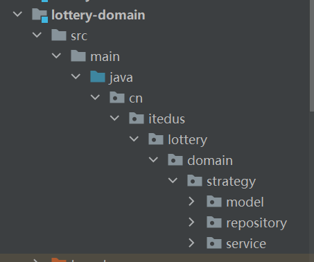
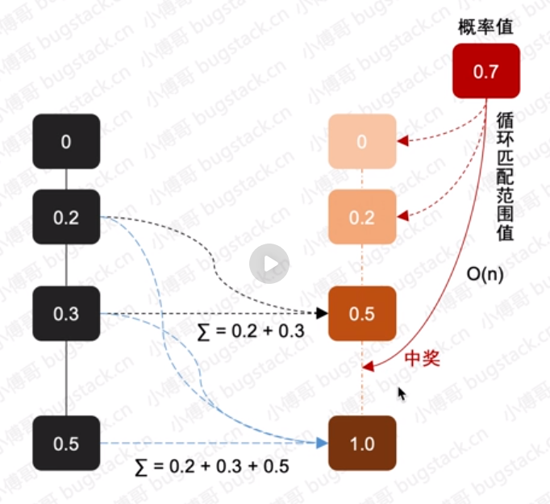
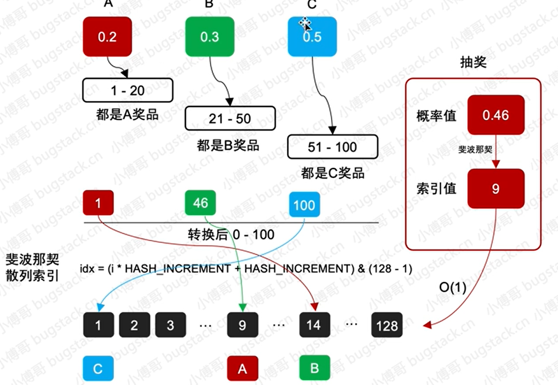

# 抽奖策略领域模块开发


## 配置两种抽奖算法


* 在domain抽奖领域模块实现两种抽奖策略算法，包括：单项概率抽奖和整体概率抽奖，并提供统一的调用方式

* 抽奖转盘有十二个奖品，每一种奖品配置不同的中奖概率，当一个奖品被抽到，那么再次抽奖之后，剩余的奖品的总概率均匀分配在11个奖品上，还是继续保持12个奖品的概率，那么这是两种的抽奖策略
* 那么相应的数据库就需要响应的字段来表示当前选择的是什么抽奖策略
* 最后统一包装的接口满足不同的抽奖功能调用

  


* model 用于提供vo req res和aggregates聚合对象
* repository 提供仓储服务  其实对mysql redis等数据的统一包装
* service 具体业务领域逻辑实现层  定义抽奖算法实现和具体的抽奖策略包装draw层 对外提供抽奖接口IDRawExec


## model


* StrategyRich： 抽奖的策略配置
```java
package cn.itedus.lottery.domain.strategy.model.aggregates;


import cn.itedus.lottery.infrastructure.po.Strategy;
import cn.itedus.lottery.infrastructure.po.StrategyDetail;

import java.util.List;

public class StrategyRich {

    // 策略ID
    private Long strategyId;
    // 策略配置
    private Strategy strategy;
    // 策略明细
    private List<StrategyDetail> strategyDetailList;

    public StrategyRich() {
    }

    public StrategyRich(Long strategyId, Strategy strategy, List<StrategyDetail> strategyDetailList) {
        this.strategyId = strategyId;
        this.strategy = strategy;
        this.strategyDetailList = strategyDetailList;
    }

    public Long getStrategyId() {
        return strategyId;
    }

    public void setStrategyId(Long strategyId) {
        this.strategyId = strategyId;
    }

    public Strategy getStrategy() {
        return strategy;
    }

    public void setStrategy(Strategy strategy) {
        this.strategy = strategy;
    }

    public List<StrategyDetail> getStrategyDetailList() {
        return strategyDetailList;
    }

    public void setStrategyDetailList(List<StrategyDetail> strategyDetailList) {
        this.strategyDetailList = strategyDetailList;
    }
}


```


* DrawReq：抽奖请求
```java

package cn.itedus.lottery.domain.strategy.model.req;

public class DrawReq {

    // 用户ID
    private String uId;

    // 策略ID
    private Long strategyId;

    public DrawReq() {
    }

    public DrawReq(String uId, Long strategyId) {
        this.uId = uId;
        this.strategyId = strategyId;
    }

    public String getuId() {
        return uId;
    }

    public void setuId(String uId) {
        this.uId = uId;
    }

    public Long getStrategyId() {
        return strategyId;
    }

    public void setStrategyId(Long strategyId) {
        this.strategyId = strategyId;
    }

}

```


* DrawResult： 抽奖结果

```java
package cn.itedus.lottery.domain.strategy.model.res;

public class DrawResult {

    // 用户ID
    private String uId;

    // 策略ID
    private Long strategyId;

    // 奖品ID
    private String rewardId;

    // 奖品名称
    private String awardName;

    public DrawResult() {
    }

    public DrawResult(String uId, Long strategyId, String rewardId, String awardName) {
        this.uId = uId;
        this.strategyId = strategyId;
        this.rewardId = rewardId;
        this.awardName = awardName;
    }

    public String getuId() {
        return uId;
    }

    public void setuId(String uId) {
        this.uId = uId;
    }

    public Long getStrategyId() {
        return strategyId;
    }

    public void setStrategyId(Long strategyId) {
        this.strategyId = strategyId;
    }

    public String getRewardId() {
        return rewardId;
    }

    public void setRewardId(String rewardId) {
        this.rewardId = rewardId;
    }

    public String getAwardName() {
        return awardName;
    }

    public void setAwardName(String awardName) {
        this.awardName = awardName;
    }
}


```


* AwardRateInfo:奖品的中奖概率

```java
package cn.itedus.lottery.domain.strategy.model.vo;

import java.math.BigDecimal;

public class AwardRateInfo {

    // 奖品ID
    private String awardId;

    // 中奖概率
    private BigDecimal awardRate;

    public AwardRateInfo() {
    }

    public AwardRateInfo(String awardId, BigDecimal awardRate) {
        this.awardId = awardId;
        this.awardRate = awardRate;
    }

    public String getAwardId() {
        return awardId;
    }

    public void setAwardId(String awardId) {
        this.awardId = awardId;
    }

    public BigDecimal getAwardRate() {
        return awardRate;
    }

    public void setAwardRate(BigDecimal awardRate) {
        this.awardRate = awardRate;
    }
}


```


## 数据仓储

* 根据奖品ID查询中将信息
* 根据策略ID查询策略配置明细

```java

package cn.itedus.lottery.domain.strategy.repository;

import cn.itedus.lottery.domain.strategy.model.aggregates.StrategyRich;
import cn.itedus.lottery.infrastructure.po.Award;


public interface IStrategyRepository1 {

    StrategyRich queryStrategyRich(Long strategyId);// 根据策略Id查询中将策略明细

    Award queryAwardInfo(String awardId);// 根据奖品ID查询中奖信息

}

```

```java

package cn.itedus.lottery.domain.strategy.repository.impl;

import cn.itedus.lottery.domain.strategy.model.aggregates.StrategyRich;
import cn.itedus.lottery.domain.strategy.repository.IStrategyRepository;
import cn.itedus.lottery.infrastructure.dao.IAwardDao;
import cn.itedus.lottery.infrastructure.dao.IStrategyDao;
import cn.itedus.lottery.infrastructure.dao.IStrategyDetailDao;
import cn.itedus.lottery.infrastructure.po.Award;
import cn.itedus.lottery.infrastructure.po.Strategy;
import cn.itedus.lottery.infrastructure.po.StrategyDetail;
import org.springframework.stereotype.Component;

import javax.annotation.Resource;
import java.util.List;

@Component
public class StrategyRepository implements IStrategyRepository {

    @Resource
    private IStrategyDao strategyDao;

    @Resource
    private IStrategyDetailDao strategyDetailDao;

    @Resource
    private IAwardDao awardDao;

    @Override
    public StrategyRich queryStrategyRich(Long strategyId) {
        Strategy strategy = strategyDao.queryStrategy(strategyId);
        List<StrategyDetail> strategyDetailList = strategyDetailDao.queryStrategyDetailList(strategyId);
        return new StrategyRich(strategyId, strategy, strategyDetailList);
    }

    @Override
    public Award queryAwardInfo(String awardId) {
        return awardDao.queryAwardInfo(awardId);
    }

}

```

## 算法实现

* 循环方式抽奖算法

  

* 斐波那契散列抽奖算法：将100个位置使用斐波那契算法散布到128个位置中


  


