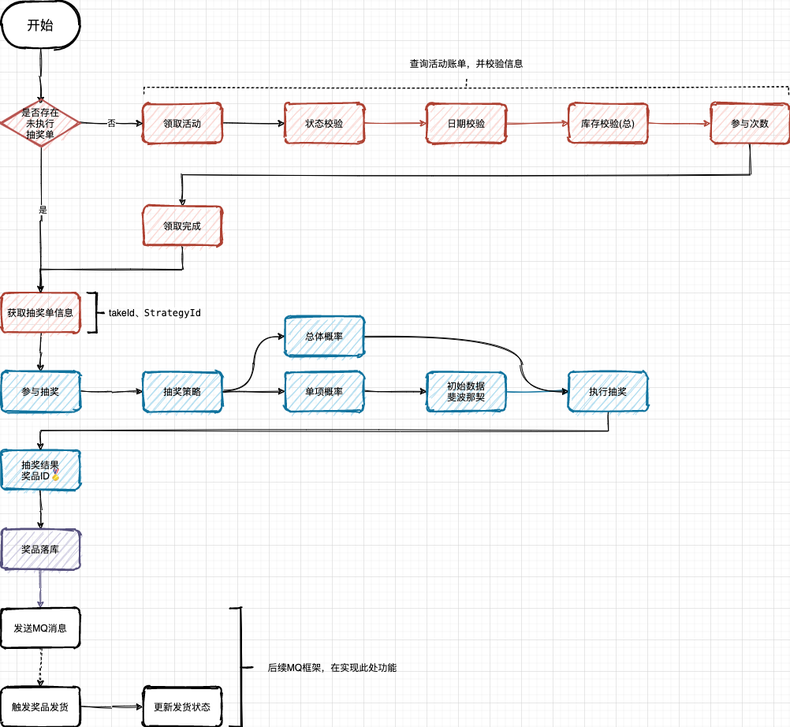

# 抽奖系统细节描述


## 领取活动领域开发-作为活动领域的一个子领域


**基于模板模式开发领取活动领域，因为在领取活动种需要进行活动的日期，库存，状态等校验，并且处理扣减库存，添加活动领取信息，封装结果等一系列流程操作，因此使用抽象类定义模板模式更加妥当**


### 抽奖活动参与接口-模板模式设计


* REQ：传入用户id 活动Id  活动领取时间
* 查询活动账单
* 活动信息校验和处理  校验活动状态 校验活动日期 校验活动库存 
* 扣减活动库存
* 领取活动信息 = 扣减个人参与次数 + 插入领取活动信息,插入领取活动信息  如果扣减成功 那么生成一个新的唯一ID 使用雪花算法生成
* 封装结果 返回的策略ID 领取完成 用于继续完成抽奖步骤

* IActivityPartake
```java
package cn.itedus.lottery.domain.activity.service.partake;

import cn.itedus.lottery.domain.activity.model.req.PartakeReq;
import cn.itedus.lottery.domain.activity.model.res.PartakeResult;

/**
 * @description: 抽奖活动参与接口
 */
public interface IActivityPartake {

    /**
     * 参与活动
     * @param req  入参
     * @return  领取结果
     */
    PartakeResult doPartake(PartakeReq req);

}

```

* BaseActivityPartake


```java
package cn.itedus.lottery.domain.activity.service.partake;

import cn.itedus.lottery.common.Constants;
import cn.itedus.lottery.common.Result;
import cn.itedus.lottery.domain.activity.model.req.PartakeReq;
import cn.itedus.lottery.domain.activity.model.res.PartakeResult;
import cn.itedus.lottery.domain.activity.model.vo.ActivityBillVO;
import org.apache.tomcat.util.bcel.Const;

/**
 * 活动领取模板抽象类
 * 先通过父类提供的数据服务  获取到活动账单  然后再定义三个抽象方法  活动信息校验处理  扣减活动库存  领取活动 依次顺序解决活动的领取操作
 *
 */
public abstract  class BaseActivityPartake extends ActivityPartakeSupport implements IActivityPartake{

    public PartakeResult doPartake(PartakeReq req){

        // 查询活动账单
        ActivityBillVO activityBillVO = super.queryActivityBill(req);

        // 活动信息校验处理 活动库存 状态日期 个人参与次数
        Result checkResult = this.checkActivityBill(req,activityBillVO);//
        if(!Constants.ResponseCode.SUCCESS.getCode().equals(checkResult.getCode())){

            // 如果状态码不一致
            return new PartakeResult(checkResult.getCode(),checkResult.getInfo());
        }

        // 扣减活动库存
        Result subtractionActivityResult = this.subtractionActivityStock(req);// 扣减互动库存
        if(!Constants.ResponseCode.SUCCESS.getCode().equals(checkResult.getCode())){
            return new PartakeResult(subtractionActivityResult.getCode(),subtractionActivityResult.getInfo());
        }

        // 领取活动信息
        Result grabResult = this.grabActivity(req,activityBillVO);
        if(!Constants.ResponseCode.SUCCESS.getCode().equals(grabResult.getCode())){
            return new PartakeResult(grabResult.getCode(),grabResult.getInfo());
        }

        // 封装结果
        PartakeResult partakeResult = new PartakeResult(Constants.ResponseCode.SUCCESS.getCode(), Constants.ResponseCode.SUCCESS.getInfo());
        partakeResult.setStrategyId(activityBillVO.getStrategyId());
        return partakeResult;
    }

    /**
     * 活动信息校验处理 把活动库存状态 日期 个人参与次数
     * @param partake  参与活动请求
     * @param bill  活动账单
     * @return  校验结果
     */
    protected abstract Result checkActivityBill(PartakeReq partake, ActivityBillVO bill);

    /**
     * 扣减活动可库存
     * @param req  参与活动请求
     * @return
     */
    protected abstract Result subtractionActivityStock(PartakeReq req);


    /**
     * 领取活动
     * @param partakeReq
     * @param bill  活动流水账单
     * @return
     */
    protected abstract Result grabActivity(PartakeReq partakeReq, ActivityBillVO bill);
}


```


* ActivityPartakeSupport
```java
package cn.itedus.lottery.domain.activity.service.partake;

import cn.itedus.lottery.domain.activity.model.req.PartakeReq;
import cn.itedus.lottery.domain.activity.model.res.PartakeResult;
import cn.itedus.lottery.domain.activity.model.vo.ActivityBillVO;
import cn.itedus.lottery.domain.activity.repository.IActivityRepository;

import javax.annotation.Resource;

public class ActivityPartakeSupport {

    @Resource
    protected IActivityRepository activityRepository;

    /**
     * 查询活动账单信息 库存 状态 日期 个人参与次数
     * @param req
     * @return
     */
    protected ActivityBillVO queryActivityBill(PartakeReq req){
        return activityRepository.queryActivityBill(req);
    }
}


```


* ActivityPartakeImpl
```java
package cn.itedus.lottery.domain.activity.service.partake.impl;

import cn.bugstack.middleware.db.router.strategy.IDBRouterStrategy;
import cn.itedus.lottery.common.Constants;
import cn.itedus.lottery.common.Result;
import cn.itedus.lottery.domain.activity.model.req.PartakeReq;
import cn.itedus.lottery.domain.activity.model.vo.ActivityBillVO;
import cn.itedus.lottery.domain.activity.repository.IUserTakeActivityRepository;
import cn.itedus.lottery.domain.activity.service.partake.BaseActivityPartake;
import cn.itedus.lottery.domain.support.IIdGenerator;
import org.slf4j.Logger;
import org.slf4j.LoggerFactory;
import org.springframework.dao.DuplicateKeyException;
import org.springframework.stereotype.Service;
import org.springframework.transaction.support.TransactionTemplate;

import javax.annotation.Resource;
import java.util.Map;


/**
 * 活动参与功能实现
 */
@Service
public class ActivityPartakeImpl extends BaseActivityPartake {

    private Logger logger = LoggerFactory.getLogger(ActivityPartakeImpl.class);

    @Resource
    private IUserTakeActivityRepository userTakeActivityRepository;

    @Resource
    private Map<Constants.Ids, IIdGenerator> idGeneratorMap;

    @Resource
    private TransactionTemplate transactionTemplate;

    @Resource
    private IDBRouterStrategy dbRouter;

    @Override
    protected Result checkActivityBill(PartakeReq partake, ActivityBillVO bill) {

        // 校验：活动状态
        if (!Constants.ActivityState.DOING.getCode().equals(bill.getState())) {
            logger.warn("活动当前状态非可用 state：{}", bill.getState());
            return Result.buildResult(Constants.ResponseCode.UN_ERROR, "活动当前状态非可用");
        }

        // 校验：活动日期
        if (bill.getBeginDateTime().after(partake.getPartakeDate()) || bill.getEndDateTime().before(partake.getPartakeDate())) {
            logger.warn("活动时间范围非可用 beginDateTime：{} endDateTime：{}", bill.getBeginDateTime(), bill.getEndDateTime());
            return Result.buildResult(Constants.ResponseCode.UN_ERROR, "活动时间范围非可用");
        }

        // 校验活动库存
        if(bill.getStockSurplusCount() <= 0){
            logger.warn("活动剩余库存不可用 :{}",bill.getStockSurplusCount());
            return Result.buildResult(Constants.ResponseCode.UN_ERROR,"活动剩余库存不可用");
        }

        // 校验个人库存 - 个人活动剩余可以领取次数 = 表示已经领取的次数
        if(bill.getUserTakeLeftCount() <= 0){
            logger.warn("个人领取次数不可用:{}",bill.getUserTakeLeftCount());
            return Result.buildResult(Constants.ResponseCode.UN_ERROR,"活动剩余库存不可用");
        }

        return Result.buildSuccessResult();
    }

    @Override
    protected Result subtractionActivityStock(PartakeReq req) {
        int count = activityRepository.subtractionActivityStock(req.getActivityId());
        if(0 == count){
            logger.error("扣减活动库存失败 activityId:{}",req.getActivityId());
            return Result.buildResult(Constants.ResponseCode.NO_UPDATE);
        }
        return Result.buildSuccessResult();
    }

    /**
     * 领取活动操作  也就是先扣减个人
     * @param partake
     * @param bill  活动流水账单
     * @return
     */
    @Override
    protected Result grabActivity(PartakeReq partake, ActivityBillVO bill) {
        try{
            // 编程式 分库分表  在业务逻辑中显示调用路由方法  动态根据运行参数比如用户id 决定目标数据库
            // 另一种基于注解的分库分表  直接使用在DAO层的方法上
            dbRouter.doRouter(partake.getuId());

            // 编程事务管理的例子  允许在匿名函数或者Lambda表达式种执行一个事务代码块
            return transactionTemplate.execute(status ->{
                try{
                    // 扣减个人已经参与次数
                    int updateCount = userTakeActivityRepository.subtractionLeftCount(bill.getActivityId(),bill.getActivityName(),bill.getTakeCount(), bill.getUserTakeLeftCount(), partake.getuId(), partake.getPartakeDate());
                    if(0 == updateCount){
                        // 更新失败
                        status.setRollbackOnly();
                        logger.error("领取活动，扣减个人已经参与次数失败 activityId:{} uId{}",partake.getActivityId(),partake.getuId());

                        return Result.buildResult(Constants.ResponseCode.NO_UPDATE);
                    }

                    // 插入领取活动信息  如果扣减成功 那么生成一个新的唯一ID 使用雪花算法生成
                    Long takeId = idGeneratorMap.get(Constants.Ids.SnowFlake).nextId();

                    // 插入活动信息到数据库中
                    userTakeActivityRepository.takeActivity(bill.getActivityId(),bill.getActivityName(),bill.getTakeCount(),bill.getUserTakeLeftCount(), partake.getuId(), partake.getPartakeDate(), takeId);

                }catch (DuplicateKeyException e){
                    status.setRollbackOnly();
                    logger.error("领取活动 唯一索引冲突 activityId:{} uId:{}",partake.getActivityId(),partake.getuId());
                    return Result.buildResult(Constants.ResponseCode.NO_UPDATE);
                }

                return Result.buildSuccessResult();
            });

        }finally {
            dbRouter.clear();
        }
    }
}


```


### 总结一下模板模式进行抽奖活动


在抽奖系统的设计中，使用模板方法模式可以非常有效地统一活动参与的流程，同时提供足够的灵活性来应对不同类型的活动或抽奖策略。


* 定义抽象基类: 定义一个抽象基类（如BaseActivityPartake），在其中定义抽奖活动参与的基本步骤和流程的框架（即模板方法）。这个模板方法会定义执行的顺序和基本的行为，但不实现具体的操作细节

```java
public abstract class BaseActivityPartake {

    // 模板方法，定义了参与活动的步骤
    public final PartakeResult doPartake(PartakeReq req) {
        ActivityBillVO activityBill = queryActivityBill(req);
        if (!checkActivityEligibility(activityBill)) {
            return new PartakeResult("Activity Ineligible");
        }
        if (!deductStock(activityBill)) {
            return new PartakeResult("Stock Insufficient");
        }
        return executePartake(req, activityBill);
    }

    // 查询活动详情（具体实现可能因活动不同而不同）
    protected abstract ActivityBillVO queryActivityBill(PartakeReq req);

    // 检查活动资格
    protected abstract boolean checkActivityEligibility(ActivityBillVO bill);

    // 扣减库存
    protected abstract boolean deductStock(ActivityBillVO bill);

    // 执行参与活动的具体操作
    protected abstract PartakeResult executePartake(PartakeReq req, ActivityBillVO bill);
}


```

* 实现具体子类:针对不同类型的活动，可以实现上述抽象基类的多个子类。这些子类将具体实现抽象基类中定义的抽象方法，以满足不同活动的特定需求
```java
public class LotteryPartake extends BaseActivityPartake {

    @Override
    protected ActivityBillVO queryActivityBill(PartakeReq req) {
        // 实现查询活动详情的逻辑
    }

    @Override
    protected boolean checkActivityEligibility(ActivityBillVO bill) {
        // 实现检查活动资格的逻辑
    }

    @Override
    protected boolean deductStock(ActivityBillVO bill) {
        // 实现扣减库存的逻辑
    }

    @Override
    protected PartakeResult executePartake(PartakeReq req, ActivityBillVO bill) {
        // 实现具体的抽奖逻辑
    }
}


```

**使用模板方法模式的好处是，它提供了一种很好的方式来复用代码（活动参与的共通流程），同时还保留了足够的灵活性来应对不同活动的特殊需求。子类只需实现那些在不同活动中有所不同的步骤即可**


## 在应用层编排抽奖过程

* application 应用层调用领域服务功能，编排抽奖过程，包括：领取活动  执行抽奖 落库结果  

  


* 抽奖整个活动过程的流程编排，主要包括：对活动的领取，对抽奖的操作，对中奖结果的存放 以及如何处理发奖，对于发奖的流程 我们使用MQ触发
* 对于每一个流程节点编排的内容，都是在领域层开发完成的，而应用层只是作为最简单的一层，方便流程编排，生成代码


## 执行抽奖算法全流程


```java
    public DrawResult doDrawExec(DrawReq req) {
        // 1. 获取抽奖策略
        StrategyRich strategyRich = super.queryStrategyRich(req.getStrategyId());
        StrategyBriefVO strategy = strategyRich.getStrategy();

        // 2. 校验抽奖策略是否已经初始化到内存
        this.checkAndInitRateData(req.getStrategyId(), strategy.getStrategyMode(), strategyRich.getStrategyDetailList());

        // 3. 获取不在抽奖范围内的列表，包括：奖品库存为空、风控策略、临时调整等
        List<String> excludeAwardIds = this.queryExcludeAwardIds(req.getStrategyId());

        // 4. 执行抽奖算法
        String awardId = this.drawAlgorithm(req.getStrategyId(), drawAlgorithmGroup.get(strategy.getStrategyMode()), excludeAwardIds);

        // 5. 包装中奖结果
        return buildDrawResult(req.getuId(), req.getStrategyId(), awardId, strategy);
    }

```


