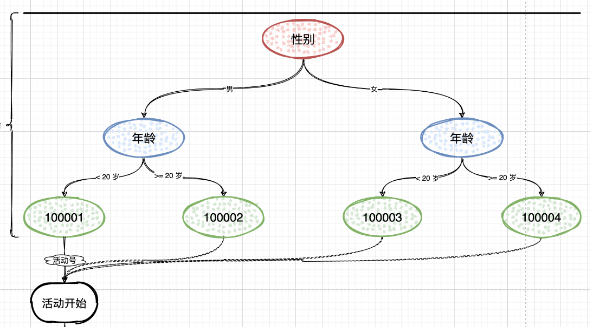
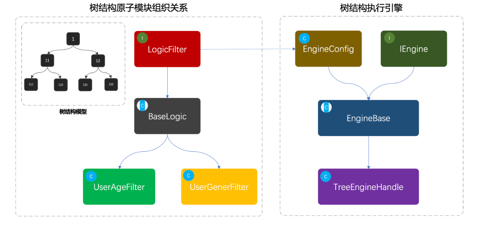
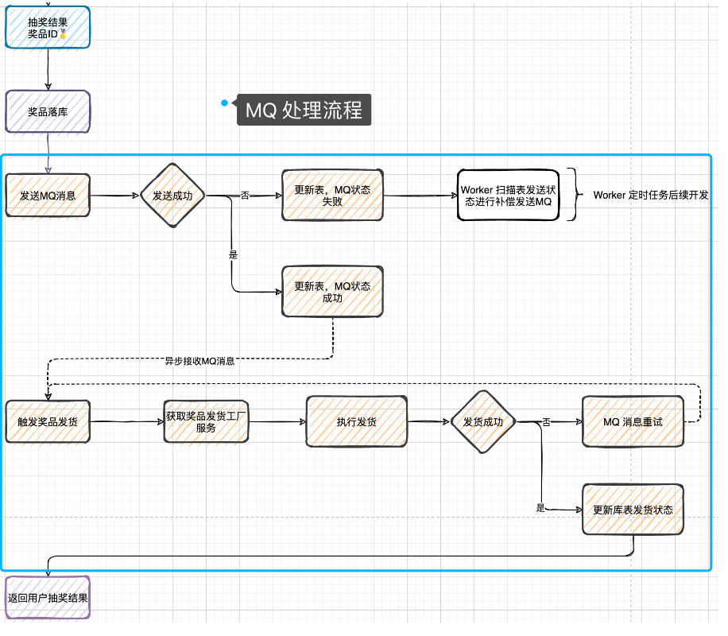
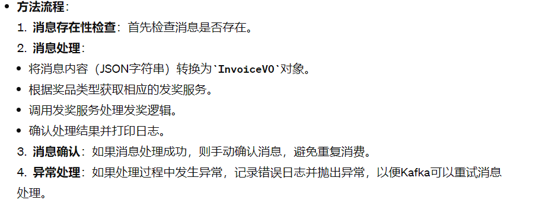
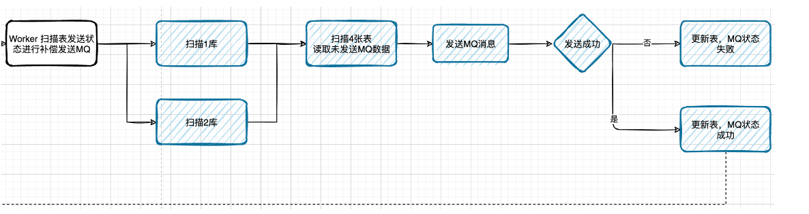
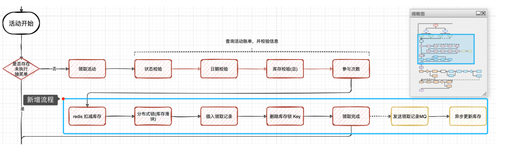

# 抽奖系统细节描述


## 领取活动领域开发-作为活动领域的一个子领域


**基于模板模式开发领取活动领域，因为在领取活动种需要进行活动的日期，库存，状态等校验，并且处理扣减库存，添加活动领取信息，封装结果等一系列流程操作，因此使用抽象类定义模板模式更加妥当**


### 抽奖活动参与接口-模板模式设计


* REQ：传入用户id 活动Id  活动领取时间
* 查询活动账单
* 活动信息校验和处理  校验活动状态 校验活动日期 校验活动库存 
* 扣减活动库存
* 领取活动信息 = 扣减个人参与次数 + 插入领取活动信息,插入领取活动信息  如果扣减成功 那么生成一个新的唯一ID 使用雪花算法生成
* 封装结果 返回的策略ID 领取完成 用于继续完成抽奖步骤

* IActivityPartake
```java
package cn.itedus.lottery.domain.activity.service.partake;

import cn.itedus.lottery.domain.activity.model.req.PartakeReq;
import cn.itedus.lottery.domain.activity.model.res.PartakeResult;

/**
 * @description: 抽奖活动参与接口
 */
public interface IActivityPartake {

    /**
     * 参与活动
     * @param req  入参
     * @return  领取结果
     */
    PartakeResult doPartake(PartakeReq req);

}

```

* BaseActivityPartake


```java
package cn.itedus.lottery.domain.activity.service.partake;

import cn.itedus.lottery.common.Constants;
import cn.itedus.lottery.common.Result;
import cn.itedus.lottery.domain.activity.model.req.PartakeReq;
import cn.itedus.lottery.domain.activity.model.res.PartakeResult;
import cn.itedus.lottery.domain.activity.model.vo.ActivityBillVO;
import org.apache.tomcat.util.bcel.Const;

/**
 * 活动领取模板抽象类
 * 先通过父类提供的数据服务  获取到活动账单  然后再定义三个抽象方法  活动信息校验处理  扣减活动库存  领取活动 依次顺序解决活动的领取操作
 *
 */
public abstract  class BaseActivityPartake extends ActivityPartakeSupport implements IActivityPartake{

    public PartakeResult doPartake(PartakeReq req){

        // 查询活动账单
        ActivityBillVO activityBillVO = super.queryActivityBill(req);

        // 活动信息校验处理 活动库存 状态日期 个人参与次数
        Result checkResult = this.checkActivityBill(req,activityBillVO);//
        if(!Constants.ResponseCode.SUCCESS.getCode().equals(checkResult.getCode())){

            // 如果状态码不一致
            return new PartakeResult(checkResult.getCode(),checkResult.getInfo());
        }

        // 扣减活动库存
        Result subtractionActivityResult = this.subtractionActivityStock(req);// 扣减互动库存
        if(!Constants.ResponseCode.SUCCESS.getCode().equals(checkResult.getCode())){
            return new PartakeResult(subtractionActivityResult.getCode(),subtractionActivityResult.getInfo());
        }

        // 领取活动信息
        Result grabResult = this.grabActivity(req,activityBillVO);
        if(!Constants.ResponseCode.SUCCESS.getCode().equals(grabResult.getCode())){
            return new PartakeResult(grabResult.getCode(),grabResult.getInfo());
        }

        // 封装结果
        PartakeResult partakeResult = new PartakeResult(Constants.ResponseCode.SUCCESS.getCode(), Constants.ResponseCode.SUCCESS.getInfo());
        partakeResult.setStrategyId(activityBillVO.getStrategyId());
        return partakeResult;
    }

    /**
     * 活动信息校验处理 把活动库存状态 日期 个人参与次数
     * @param partake  参与活动请求
     * @param bill  活动账单
     * @return  校验结果
     */
    protected abstract Result checkActivityBill(PartakeReq partake, ActivityBillVO bill);

    /**
     * 扣减活动可库存
     * @param req  参与活动请求
     * @return
     */
    protected abstract Result subtractionActivityStock(PartakeReq req);


    /**
     * 领取活动
     * @param partakeReq
     * @param bill  活动流水账单
     * @return
     */
    protected abstract Result grabActivity(PartakeReq partakeReq, ActivityBillVO bill);
}


```


* ActivityPartakeSupport
```java
package cn.itedus.lottery.domain.activity.service.partake;

import cn.itedus.lottery.domain.activity.model.req.PartakeReq;
import cn.itedus.lottery.domain.activity.model.res.PartakeResult;
import cn.itedus.lottery.domain.activity.model.vo.ActivityBillVO;
import cn.itedus.lottery.domain.activity.repository.IActivityRepository;

import javax.annotation.Resource;

public class ActivityPartakeSupport {

    @Resource
    protected IActivityRepository activityRepository;

    /**
     * 查询活动账单信息 库存 状态 日期 个人参与次数
     * @param req
     * @return
     */
    protected ActivityBillVO queryActivityBill(PartakeReq req){
        return activityRepository.queryActivityBill(req);
    }
}


```


* ActivityPartakeImpl
```java
package cn.itedus.lottery.domain.activity.service.partake.impl;

import cn.bugstack.middleware.db.router.strategy.IDBRouterStrategy;
import cn.itedus.lottery.common.Constants;
import cn.itedus.lottery.common.Result;
import cn.itedus.lottery.domain.activity.model.req.PartakeReq;
import cn.itedus.lottery.domain.activity.model.vo.ActivityBillVO;
import cn.itedus.lottery.domain.activity.repository.IUserTakeActivityRepository;
import cn.itedus.lottery.domain.activity.service.partake.BaseActivityPartake;
import cn.itedus.lottery.domain.support.IIdGenerator;
import org.slf4j.Logger;
import org.slf4j.LoggerFactory;
import org.springframework.dao.DuplicateKeyException;
import org.springframework.stereotype.Service;
import org.springframework.transaction.support.TransactionTemplate;

import javax.annotation.Resource;
import java.util.Map;


/**
 * 活动参与功能实现
 */
@Service
public class ActivityPartakeImpl extends BaseActivityPartake {

    private Logger logger = LoggerFactory.getLogger(ActivityPartakeImpl.class);

    @Resource
    private IUserTakeActivityRepository userTakeActivityRepository;

    @Resource
    private Map<Constants.Ids, IIdGenerator> idGeneratorMap;

    @Resource
    private TransactionTemplate transactionTemplate;

    @Resource
    private IDBRouterStrategy dbRouter;

    @Override
    protected Result checkActivityBill(PartakeReq partake, ActivityBillVO bill) {

        // 校验：活动状态
        if (!Constants.ActivityState.DOING.getCode().equals(bill.getState())) {
            logger.warn("活动当前状态非可用 state：{}", bill.getState());
            return Result.buildResult(Constants.ResponseCode.UN_ERROR, "活动当前状态非可用");
        }

        // 校验：活动日期
        if (bill.getBeginDateTime().after(partake.getPartakeDate()) || bill.getEndDateTime().before(partake.getPartakeDate())) {
            logger.warn("活动时间范围非可用 beginDateTime：{} endDateTime：{}", bill.getBeginDateTime(), bill.getEndDateTime());
            return Result.buildResult(Constants.ResponseCode.UN_ERROR, "活动时间范围非可用");
        }

        // 校验活动库存
        if(bill.getStockSurplusCount() <= 0){
            logger.warn("活动剩余库存不可用 :{}",bill.getStockSurplusCount());
            return Result.buildResult(Constants.ResponseCode.UN_ERROR,"活动剩余库存不可用");
        }

        // 校验个人库存 - 个人活动剩余可以领取次数 = 表示已经领取的次数
        if(bill.getUserTakeLeftCount() <= 0){
            logger.warn("个人领取次数不可用:{}",bill.getUserTakeLeftCount());
            return Result.buildResult(Constants.ResponseCode.UN_ERROR,"活动剩余库存不可用");
        }

        return Result.buildSuccessResult();
    }

    @Override
    protected Result subtractionActivityStock(PartakeReq req) {
        int count = activityRepository.subtractionActivityStock(req.getActivityId());
        if(0 == count){
            logger.error("扣减活动库存失败 activityId:{}",req.getActivityId());
            return Result.buildResult(Constants.ResponseCode.NO_UPDATE);
        }
        return Result.buildSuccessResult();
    }

    /**
     * 领取活动操作  也就是先扣减个人
     * @param partake
     * @param bill  活动流水账单
     * @return
     */
    @Override
    protected Result grabActivity(PartakeReq partake, ActivityBillVO bill) {
        try{
            // 编程式 分库分表  在业务逻辑中显示调用路由方法  动态根据运行参数比如用户id 决定目标数据库
            // 另一种基于注解的分库分表  直接使用在DAO层的方法上
            dbRouter.doRouter(partake.getuId());

            // 编程事务管理的例子  允许在匿名函数或者Lambda表达式种执行一个事务代码块
            return transactionTemplate.execute(status ->{
                try{
                    // 扣减个人已经参与次数
                    int updateCount = userTakeActivityRepository.subtractionLeftCount(bill.getActivityId(),bill.getActivityName(),bill.getTakeCount(), bill.getUserTakeLeftCount(), partake.getuId(), partake.getPartakeDate());
                    if(0 == updateCount){
                        // 更新失败
                        status.setRollbackOnly();
                        logger.error("领取活动，扣减个人已经参与次数失败 activityId:{} uId{}",partake.getActivityId(),partake.getuId());

                        return Result.buildResult(Constants.ResponseCode.NO_UPDATE);
                    }

                    // 插入领取活动信息  如果扣减成功 那么生成一个新的唯一ID 使用雪花算法生成
                    Long takeId = idGeneratorMap.get(Constants.Ids.SnowFlake).nextId();

                    // 插入活动信息到数据库中
                    userTakeActivityRepository.takeActivity(bill.getActivityId(),bill.getActivityName(),bill.getTakeCount(),bill.getUserTakeLeftCount(), partake.getuId(), partake.getPartakeDate(), takeId);

                }catch (DuplicateKeyException e){
                    status.setRollbackOnly();
                    logger.error("领取活动 唯一索引冲突 activityId:{} uId:{}",partake.getActivityId(),partake.getuId());
                    return Result.buildResult(Constants.ResponseCode.NO_UPDATE);
                }

                return Result.buildSuccessResult();
            });

        }finally {
            dbRouter.clear();
        }
    }
}


```


### 总结一下模板模式进行抽奖活动


在抽奖系统的设计中，使用模板方法模式可以非常有效地统一活动参与的流程，同时提供足够的灵活性来应对不同类型的活动或抽奖策略。


* 定义抽象基类: 定义一个抽象基类（如BaseActivityPartake），在其中定义抽奖活动参与的基本步骤和流程的框架（即模板方法）。这个模板方法会定义执行的顺序和基本的行为，但不实现具体的操作细节

```java
public abstract class BaseActivityPartake {

    // 模板方法，定义了参与活动的步骤
    public final PartakeResult doPartake(PartakeReq req) {
        ActivityBillVO activityBill = queryActivityBill(req);
        if (!checkActivityEligibility(activityBill)) {
            return new PartakeResult("Activity Ineligible");
        }
        if (!deductStock(activityBill)) {
            return new PartakeResult("Stock Insufficient");
        }
        return executePartake(req, activityBill);
    }

    // 查询活动详情（具体实现可能因活动不同而不同）
    protected abstract ActivityBillVO queryActivityBill(PartakeReq req);

    // 检查活动资格
    protected abstract boolean checkActivityEligibility(ActivityBillVO bill);

    // 扣减库存
    protected abstract boolean deductStock(ActivityBillVO bill);

    // 执行参与活动的具体操作
    protected abstract PartakeResult executePartake(PartakeReq req, ActivityBillVO bill);
}


```

* 实现具体子类:针对不同类型的活动，可以实现上述抽象基类的多个子类。这些子类将具体实现抽象基类中定义的抽象方法，以满足不同活动的特定需求
```java
public class LotteryPartake extends BaseActivityPartake {

    @Override
    protected ActivityBillVO queryActivityBill(PartakeReq req) {
        // 实现查询活动详情的逻辑
    }

    @Override
    protected boolean checkActivityEligibility(ActivityBillVO bill) {
        // 实现检查活动资格的逻辑
    }

    @Override
    protected boolean deductStock(ActivityBillVO bill) {
        // 实现扣减库存的逻辑
    }

    @Override
    protected PartakeResult executePartake(PartakeReq req, ActivityBillVO bill) {
        // 实现具体的抽奖逻辑
    }
}


```

**使用模板方法模式的好处是，它提供了一种很好的方式来复用代码（活动参与的共通流程），同时还保留了足够的灵活性来应对不同活动的特殊需求。子类只需实现那些在不同活动中有所不同的步骤即可**


## 在应用层编排抽奖过程


**总的流程：首先是否存在没有执行的抽奖单号，如果不存在，领取活动，活动校验，日期校验，库存校验，参与次数校验，领取活动完成，最后获取抽奖单号信息，接着参与抽奖，抽奖策略，单项概率，总体概率，执行抽奖，抽奖结果的奖品ID得到，奖品落库，发送MQ消息，触发奖品发货，更新发货状态**


* 活动领域中查询是否存在没有执行抽奖领取活动单号，在SQL查询当前活动ID，用户最早领取但是没有消费的一条记录（这部分一般有业务流程限制，比如是否处理最先还是最新领取单，要根据自己的业务实际场景进行处理）


* application 应用层调用领域服务功能，编排抽奖过程，包括：领取活动  执行抽奖 落库结果  

  


* 抽奖整个活动过程的流程编排，主要包括：对活动的领取，对抽奖的操作，对中奖结果的存放 以及如何处理发奖，对于发奖的流程 我们使用MQ触发
* 对于每一个流程节点编排的内容，都是在领域层开发完成的，而应用层只是作为最简单的一层，方便流程编排，生成代码


## 执行抽奖算法全流程

* 获取抽奖策略
* 校验抽奖策略是否以及初始化到内存
* 获取不在抽奖范围内的列表 包括：奖品库存为空，风控策略 
* 执行抽奖算法
* 包装中奖结果


```java
    public DrawResult doDrawExec(DrawReq req) {
        // 1. 获取抽奖策略
        StrategyRich strategyRich = super.queryStrategyRich(req.getStrategyId());
        StrategyBriefVO strategy = strategyRich.getStrategy();

        // 2. 校验抽奖策略是否已经初始化到内存
        this.checkAndInitRateData(req.getStrategyId(), strategy.getStrategyMode(), strategyRich.getStrategyDetailList());

        // 3. 获取不在抽奖范围内的列表，包括：奖品库存为空、风控策略、临时调整等
        List<String> excludeAwardIds = this.queryExcludeAwardIds(req.getStrategyId());

        // 4. 执行抽奖算法
        String awardId = this.drawAlgorithm(req.getStrategyId(), drawAlgorithmGroup.get(strategy.getStrategyMode()), excludeAwardIds);

        // 5. 包装中奖结果
        return buildDrawResult(req.getuId(), req.getStrategyId(), awardId, strategy);
    }

```


## 规则量化引擎参与活动

* 规则引擎开发需要的相关的配置类表：rule_tree rule_tree_node rule_tree_node_line
* 运用组合模式搭建规则引擎领域服务，包括：logic逻辑过滤器，engine引擎执行器
* 组合模式的特点就像是搭建出一棵二叉树，而库表中则需要把这样一颗二叉树存放进去，那么这里就需要包括：树根、树茎、子叶、果实。在具体的逻辑实现中则需要通过子叶判断走哪个树茎以及最终筛选出一个果实来


  

* 基于量化决策引擎，筛选用户身份标签，找到一个符合参与的活动号，拿到活动好之后 就可以参与到具体的抽奖活动中
* 通常量化决策引擎也是一种用于差异化人群的规则过滤器，不只是可以过滤出活动，也可以用于活动唯独的过滤，判断是否可以参与到这个抽奖活动中
* 在应用层座一层封装，由接口层进行调用使用，也就是用户参与活动之前，要做一层规则引擎过滤


### 你的规则量化引擎具体式怎么实现的


* 首先获取与决策物料相关的规则树信息，如果为空 抛出异常 表示无法进行决策
* 使用决策树的配置信息和决策物料来决定应当走向的下一个节点
     * 1 获取规则书的根节点信息 这是决策的起点
     * 2 遍历规则树 使用循环来遍历规则树的节点  对于每一个节点  使用与该节点相关联的规则ket 从Map中获取相应的路基过滤器
     * 3 执行决策逻辑  通过逻辑过滤器获取决策之 根据这个值和节点的连接线决定下一个节点

* lottery-application 应用层对规则引擎的调用
  * 输入参数为 QuantificationDrawReq，包含用户ID、规则树ID和一组决策值。
  * 执行规则引擎，获取用户可以参与的活动号
  * 然后进行抽奖处理，并将结果转换和封装，返回给调用者


  


## MQ消息组件解耦如何实现的

* 搭建MQ消息组件Kafka服务环境，并整合到SpringBoot中，完成消息的生产和消费处理

### Kafka
*  Kafka适合离线和在线消息消费。 Kafka消息保留在磁盘上，并在群集内复制以防止数据丢失。 Kafka构建在ZooKeeper同步服务之上。 它与Apache Storm和Spark非常好地集成，用于实时流式数据分析。
*  可靠性 - Kafka是分布式，分区，复制和容错的。

* 可扩展性 - Kafka消息传递系统轻松缩放，无需停机。

* 耐用性 - Kafka使用分布式提交日志，这意味着消息会尽可能快地保留在磁盘上，因此它是持久的。

* 性能 - Kafka对于发布和订阅消息都具有高吞吐量。 即使存储了许多TB的消息，它也保持稳定的性能


### 实现


* 使用MQ消息的特性，把用户抽奖到发货到流程进行解耦，这个过程包括了消息的发送、库表中状态的更新，消息的接受消费，发将状态的处理等
* 在数据库表 user_strategy_export 添加字段 mq_state 这个字段用于发送 MQ 成功更新库表状态，如果 MQ 消息发送失败则需要通过定时任务补偿 MQ 消息
* 启动 kafka 新增 topic：lottery_invoice 用于发货单消息，当抽奖完成后则发送一个发货单，再异步处理发货流程，这个部分就是MQ的解耦流程使用

  


* 从用户发起抽奖到中奖之后开始，就是MQ处理发奖的过程
* 因为MQ消息的发送是不具备事务性的，所以就是你发送MQ的时候会失败，那么MQ发送完成之后需要知道是否发送成功，进行库表状态更新，如果发送失败需要使用worker来补偿MQ发送
* 最后MQ发送完成到消费，也是可能有失败的，比如处理失败，更新库表失败等，但是无论是什么失败都是需要保证MQ进行重试处理，而保证MQ消息重试的前提就是服务的幂等性，否则你在重试的过程中就造成了流程一场 比如更新次数多了 数据库插入多了 发奖多次
* 

```java
Component
public class KafkaProducer {

    private Logger logger = LoggerFactory.getLogger(KafkaProducer.class);

    @Resource
    private KafkaTemplate<String, Object> kafkaTemplate;

    /**
     * MQ主题：中奖发货单
     */
    public static final String TOPIC_INVOICE = "lottery_invoice";

    /**
     * 发送中奖物品发货单消息
     *
     * @param invoice 发货单
     */
    public ListenableFuture<SendResult<String, Object>> sendLotteryInvoice(InvoiceVO invoice) {
        String objJson = JSON.toJSONString(invoice);
        logger.info("发送MQ消息 topic：{} bizId：{} message：{}", TOPIC_INVOICE, invoice.getuId(), objJson);
        return kafkaTemplate.send(TOPIC_INVOICE, objJson);
    }

}


```

* 我们会把所有的生产消息都放到 KafkaProducer 中，并对外提供一个可以发送 MQ 消息的方法。
* 因为我们配置的类型转换为 StringDeserializer 所以发送消息的方式是 JSON 字符串，当然这个编解码器是可以重写的，满足你发送其他类型的数据
* sendLotteryInvoice：发送中奖物品发货单消息到 Kafka。
* 参数为 InvoiceVO 对象，包含发货单的详细信息。
* 方法首先将 InvoiceVO 对象转换为 JSON 字符串。
* 使用 kafkaTemplate.send 方法发送消息到 "lottery_invoice" 主题，并返回 ListenableFuture<SendResult<String, Object>> 对象，该对象可以用来处理异步发送结果
* 当用户中奖需要发货时，系统会创建一个发货单信息的 InvoiceVO 对象，并通过这个类发送到 Kafka。消费者（可能是一个或多个服务）订阅这个主题，接收到消息后进行相应的处理，比如生成发货订单，通知仓库系统等。

```java
@Component
public class LotteryInvoiceListener {

    private Logger logger = LoggerFactory.getLogger(LotteryInvoiceListener.class);

    @Resource
    private DistributionGoodsFactory distributionGoodsFactory;

    @KafkaListener(topics = "lottery_invoice", groupId = "lottery")
    public void onMessage(ConsumerRecord<?, ?> record, Acknowledgment ack, @Header(KafkaHeaders.RECEIVED_TOPIC) String topic) {
        Optional<?> message = Optional.ofNullable(record.value());

        // 1. 判断消息是否存在
        if (!message.isPresent()) {
            return;
        }

        // 2. 处理 MQ 消息
        try {
            // 1. 转化对象（或者你也可以重写Serializer<T>）
            InvoiceVO invoiceVO = JSON.parseObject((String) message.get(), InvoiceVO.class);

            // 2. 获取发送奖品工厂，执行发奖
            IDistributionGoods distributionGoodsService = distributionGoodsFactory.getDistributionGoodsService(invoiceVO.getAwardType());
            DistributionRes distributionRes = distributionGoodsService.doDistribution(new GoodsReq(invoiceVO.getuId(), invoiceVO.getOrderId(), invoiceVO.getAwardId(), invoiceVO.getAwardName(), invoiceVO.getAwardContent()));

            Assert.isTrue(Constants.AwardState.SUCCESS.getCode().equals(distributionRes.getCode()), distributionRes.getInfo());

            // 3. 打印日志
            logger.info("消费MQ消息，完成 topic：{} bizId：{} 发奖结果：{}", topic, invoiceVO.getuId(), JSON.toJSONString(distributionRes));

            // 4. 消息消费完成
            ack.acknowledge();
        } catch (Exception e) {
            // 发奖环节失败，消息重试。所有到环节，发货、更新库，都需要保证幂等。
            logger.error("消费MQ消息，失败 topic：{} message：{}", topic, message.get());
            throw e;
        }
    }

}


```


  

### MQ解耦

### 生产者
* 抽奖结果落库之后
* 发送MQ 触发发奖流程
* 调动 kafkaProducer.sendLotteryInvoice 发送一个中奖结果的发货单。
* 消息发送完毕后进行回调处理，更新数据库中 MQ 发送的状态，如果有 MQ 发送失败则更新数据库 mq_state = 2 这里还有可能在更新库表状态的时候失败，但没关系这些都会被 worker 补偿处理掉，一种是发送 MQ 失败，另外一种是 MQ 状态为 0 但很久都没有发送 MQ 那么也可以触发发送。
### 消费者-LotteryInvoiceListener

* 这个类负责监听和处理来自Kafka中名为 "lottery_invoice" 的主题的消息
* 消息存在性检查：使用Optional类来判断消息内容是否存在
* 将消息内容转换为InvoiceVO对象，这是一个包含中奖信息的数据对象
* 通过distributionGoodsFactory获取对应的发奖服务，基于奖品类型
* 调用发即将服务的doDistribution方法进行奖品实际发放
* 使用Assert进行结果验证，确保发奖成功


### ActivityProcessImpl#doDrawProcess 

* 用户领取活动
* 执行抽奖
* 结果落库
* 发送MQ消息 触发发奖流程
* MQ消息发送成功，更新数据库表，更新数据库表 user_strategy_export.mq_state = 1
* MQ 消息发送失败 2
* 消息发送完毕后进行回调处理，更新数据库中 MQ 发送的状态，如果有 MQ 发送失败则更新数据库 mq_state = 2 这里还有可能在更新库表状态的时候失败，但没关系这些都会被 worker 补偿处理掉，一种是发送 MQ 失败，另外一种是 MQ 状态为 0 但很久都没有发送 MQ 那么也可以触发发送
* 因为用户只需要知道自己中奖了，但发奖到货是可以等待的，毕竟发送虚拟商品的等待时间并不会很长，而实物商品走物流就更可以接收了

## 轻量级分布式任务调度平台）来管理和调度抽奖活动的状态

* 获取活动列表: 从activityDeploy.scanToDoActivityList(0L)获取当前需要处理的活动列表。这个方法似乎通过传递最后一条处理的活动ID来分页获取数据
* 条件判断: 如果获取的活动列表为空，则记录日志并结束执行
* 遍历活动列表：对活动状态为审核通过（状态码为4），且临近开启时间的时候，将其状态转变为活动中
* 状态为4（审核通过）：当活动状态为审核通过(状态码4)，且临近开启时间时候，将其状态变更为活动中
* 状态为5（活动中）：对于已经开始但是已经过了结束时间的活动，将其状态变更为关闭
* 持续处理：逻辑通过在u性能换种更新活动列表来持续处理更多活动


```java
@Component
public class LotteryXxlJob {

    private Logger logger = LoggerFactory.getLogger(LotteryXxlJob.class);

    @Resource
    private IActivityDeploy activityDeploy;

    @Resource
    private IStateHandler stateHandler;

    @XxlJob("lotteryActivityStateJobHandler")
    public void lotteryActivityStateJobHandler() throws Exception {
        logger.info("扫描活动状态 Begin");

        List<ActivityVO> activityVOList = activityDeploy.scanToDoActivityList(0L);
        if (activityVOList.isEmpty()){
            logger.info("扫描活动状态 End 暂无符合需要扫描的活动列表");
            return;
        }

        while (!activityVOList.isEmpty()) {
            for (ActivityVO activityVO : activityVOList) {
                Integer state = activityVO.getState();
                switch (state) {
                    // 活动状态为审核通过，在临近活动开启时间前，审核活动为活动中。在使用活动的时候，需要依照活动状态核时间两个字段进行判断和使用。
                    case 4:
                        Result state4Result = stateHandler.doing(activityVO.getActivityId(), Constants.ActivityState.PASS);
                        logger.info("扫描活动状态为活动中 结果：{} activityId：{} activityName：{} creator：{}", JSON.toJSONString(state4Result), activityVO.getActivityId(), activityVO.getActivityName(), activityVO.getCreator());
                        break;
                    // 扫描时间已过期的活动，从活动中状态变更为关闭状态
                    case 5:
                        if (activityVO.getEndDateTime().before(new Date())){
                            Result state5Result = stateHandler.close(activityVO.getActivityId(), Constants.ActivityState.DOING);
                            logger.info("扫描活动状态为关闭 结果：{} activityId：{} activityName：{} creator：{}", JSON.toJSONString(state5Result), activityVO.getActivityId(), activityVO.getActivityName(), activityVO.getCreator());
                        }
                        break;
                    default:
                        break;
                }
            }

            // 获取集合中最后一条记录，继续扫描后面10条记录
            ActivityVO activityVO = activityVOList.get(activityVOList.size() - 1);
            activityVOList = activityDeploy.scanToDoActivityList(activityVO.getId());
        }

        logger.info("扫描活动状态 End");

    }

}

```

## 扫描库表补偿发货单MQ消息

* 循环的方式把每个库下的多张表中的每条用户记录，都进行扫描。所以需要在分库分表组件中，提供出可以设置路由到的库和表，这样就可以满足我们扫描的动作了
* 在 application 应用层下的 worker 包 LotteryXxlJob 中，添加关于扫描库表补偿消息发送的任务，并在开发完成后把任务配置到 xxl-job 任务调度后台中
* 审核通过 -> 扫描为活动中
* 活动中已过期时间 -> 扫描为活动关闭
  


```java
package cn.itedus.lottery.application.worker;

import cn.bugstack.middleware.db.router.strategy.IDBRouterStrategy;
import cn.itedus.lottery.application.mq.producer.KafkaProducer;
import cn.itedus.lottery.common.Constants;
import cn.itedus.lottery.common.Result;
import cn.itedus.lottery.domain.activity.model.vo.ActivityVO;
import cn.itedus.lottery.domain.activity.model.vo.InvoiceVO;
import cn.itedus.lottery.domain.activity.service.deploy.IActivityDeploy;
import cn.itedus.lottery.domain.activity.service.partake.IActivityPartake;
import cn.itedus.lottery.domain.activity.service.stateflow.IStateHandler;
import com.alibaba.fastjson.JSON;
import com.xxl.job.core.context.XxlJobHelper;
import com.xxl.job.core.handler.annotation.XxlJob;
import org.slf4j.Logger;
import org.slf4j.LoggerFactory;
import org.springframework.kafka.support.SendResult;
import org.springframework.stereotype.Component;
import org.springframework.util.concurrent.ListenableFuture;
import org.springframework.util.concurrent.ListenableFutureCallback;

import javax.annotation.Resource;
import java.util.Date;
import java.util.List;

/**
 * @description: 抽奖业务，任务配置
 * @author: 小傅哥，微信：fustack
 * @date: 2021/11/6
 * @github: https://github.com/fuzhengwei
 * @Copyright: 公众号：bugstack虫洞栈 | 博客：https://bugstack.cn - 沉淀、分享、成长，让自己和他人都能有所收获！
 */
@Component
public class LotteryXxlJob {

    private Logger logger = LoggerFactory.getLogger(LotteryXxlJob.class);

    @Resource
    private IActivityDeploy activityDeploy;

    @Resource
    private IActivityPartake activityPartake;

    @Resource
    private IStateHandler stateHandler;

    @Resource
    private IDBRouterStrategy dbRouter;


    @Resource
    private KafkaProducer kafkaProducer;

    @XxlJob("lotteryActivityStateJobHandler")
    public void lotteryActivityStateJobHandler() throws Exception {
        logger.info("扫描活动状态 Begin");

        List<ActivityVO> activityVOList = activityDeploy.scanToDoActivityList(0L);
        if (activityVOList.isEmpty()) {
            logger.info("扫描活动状态 End 暂无符合需要扫描的活动列表");
            return;
        }

        while (!activityVOList.isEmpty()) {
            for (ActivityVO activityVO : activityVOList) {
                Integer state = activityVO.getState();
                switch (state) {
                    // 活动状态为审核通过，在临近活动开启时间前，审核活动为活动中。在使用活动的时候，需要依照活动状态核时间两个字段进行判断和使用。
                    case 4:
                        Result state4Result = stateHandler.doing(activityVO.getActivityId(), Constants.ActivityState.PASS);
                        logger.info("扫描活动状态为活动中 结果：{} activityId：{} activityName：{} creator：{}", JSON.toJSONString(state4Result), activityVO.getActivityId(), activityVO.getActivityName(), activityVO.getCreator());
                        break;
                    // 扫描时间已过期的活动，从活动中状态变更为关闭状态【这里也可以细化为2个任务来处理，也可以把时间判断放到数据库中操作】
                    case 5:
                        if (activityVO.getEndDateTime().before(new Date())) {
                            Result state5Result = stateHandler.close(activityVO.getActivityId(), Constants.ActivityState.DOING);
                            logger.info("扫描活动状态为关闭 结果：{} activityId：{} activityName：{} creator：{}", JSON.toJSONString(state5Result), activityVO.getActivityId(), activityVO.getActivityName(), activityVO.getCreator());
                        }
                        break;
                    default:
                        break;
                }
            }

            // 获取集合中最后一条记录，继续扫描后面10条记录
            ActivityVO activityVO = activityVOList.get(activityVOList.size() - 1);
            activityVOList = activityDeploy.scanToDoActivityList(activityVO.getId());
        }

        logger.info("扫描活动状态 End");

    }

    @XxlJob("lotteryOrderMQStateJobHandler")
    public void lotteryOrderMQStateJobHandler() throws Exception {
        // 验证参数
        String jobParam = XxlJobHelper.getJobParam();
        if (null == jobParam) {
            logger.info("扫描用户抽奖奖品发放MQ状态[Table = 2*4] 错误 params is null");
            return;
        }

        // 获取分布式任务配置参数信息 参数配置格式：1,2,3 也可以是指定扫描一个，也可以配置多个库，按照部署的任务集群进行数量配置，均摊分别扫描效率更高
        String[] params = jobParam.split(",");
        logger.info("扫描用户抽奖奖品发放MQ状态[Table = 2*4] 开始 params：{}", JSON.toJSONString(params));

        if (params.length == 0) {
            logger.info("扫描用户抽奖奖品发放MQ状态[Table = 2*4] 结束 params is null");
            return;
        }

        // 获取分库分表配置下的分表数
        int tbCount = dbRouter.tbCount();

        // 循环获取指定扫描库
        for (String param : params) {
            // 获取当前任务扫描的指定分库
            int dbCount = Integer.parseInt(param);

            // 判断配置指定扫描库数，是否存在
            if (dbCount > dbRouter.dbCount()) {
                logger.info("扫描用户抽奖奖品发放MQ状态[Table = 2*4] 结束 dbCount not exist");
                continue;
            }

            // 循环扫描对应表
            for (int i = 0; i < tbCount; i++) {

                // 扫描库表数据
                List<InvoiceVO> invoiceVOList = activityPartake.scanInvoiceMqState(dbCount, i);
                logger.info("扫描用户抽奖奖品发放MQ状态[Table = 2*4] 扫描库：{} 扫描表：{} 扫描数：{}", dbCount, i, invoiceVOList.size());

                // 补偿 MQ 消息
                for (InvoiceVO invoiceVO : invoiceVOList) {

                    ListenableFuture<SendResult<String, Object>> future = kafkaProducer.sendLotteryInvoice(invoiceVO);
                    future.addCallback(new ListenableFutureCallback<SendResult<String, Object>>() {

                        @Override
                        public void onSuccess(SendResult<String, Object> stringObjectSendResult) {
                            // MQ 消息发送完成，更新数据库表 user_strategy_export.mq_state = 1
                            activityPartake.updateInvoiceMqState(invoiceVO.getuId(), invoiceVO.getOrderId(), Constants.MQState.COMPLETE.getCode());
                        }

                        @Override
                        public void onFailure(Throwable throwable) {
                            // MQ 消息发送失败，更新数据库表 user_strategy_export.mq_state = 2 【等待定时任务扫码补偿MQ消息】
                            activityPartake.updateInvoiceMqState(invoiceVO.getuId(), invoiceVO.getOrderId(), Constants.MQState.FAIL.getCode());
                        }

                    });
                }
            }

        }

        logger.info("扫描用户抽奖奖品发放MQ状态[Table = 2*4] 完成 param：{}", JSON.toJSONString(params));

    }

}


```

* lotteryActivityStateJobHandler
  * 定期扫描活动状态，并根据当前状态和时间条件更新状态
  * 状态为4（审核通过）: 在活动开始前将状态更新为“活动中”
  * 状态为5（活动中）: 如果活动已过结束时间，则将状态更新为“关闭”
  * 调用 activityDeploy.scanToDoActivityList 方法获取待处理的活动列表
  * 遍历活动列表，根据活动的当前状态和时间条件执行状态更新
  * 日志记录操作结果
  * 循环分页获取更多待处理活动，直至没有更多活动
* lotteryOrderMQStateJobHandler
  * 处理和补偿中奖发货单的消息队列状态，确保所有应发送的消息都正确发送到Kafka，并在消息发送失败时进行重试
  * 解析XXL-Job传入的任务参数，确定要扫描的数据库分库编号
  * 对指定的数据库分库进行扫描，获取所有待发送的中奖发货单
  * 对获取的中奖发货单列表进行遍历，调用 kafkaProducer.sendLotteryInvoice 方法发送Kafka消息
  * 使用 ListenableFuture 对象处理异步发送结果
  * onSuccess: 发送成功后，更新发货单的消息状态为完成
  * onFailure: 发送失败后，更新发货单的消息状态为失败，等待下次扫描重试
* 


## 设计滑动库存分布式锁处理活动秒杀

* 优化锁的颗粒度力度，不要把锁直接放到活动编号上，这样在极端临界情况下会出现秒杀解锁失败，导致库存有剩余但不能下单的情况。所以需要增加锁的颗粒度，以滑动库存剩余编号的方式进行加锁，例如 100001_1、100001_2、100001_3
* 增加缓存扣减库存后，发送 MQ 消息进行异步更新数据库中活动库存，做最终数据一致性处理。这一部分如果你的系统并发体量较大，还需要把 MQ 的数据不要直接对库更新，而是更新到缓存中，再由任务最阶段同步，以此减少对数据库表的操作


  


* 优化活动领域，活动参与流程中的库存扣减操作，这部分我们原来是使用数据库行级锁🔐 处理的库存扣减，但因为会存在并发问题所以这里优化为 Redis 分布式锁进行处理
* 活动领取完成后，其实这个时候只是把缓存的库存扣掉了，但数据库中的库存并没有扣减，所以我们需要发送一个 MQ 消息，来对数据库中的库存进行处理。因为 MQ 可以消峰因此在降低 MQ 分片的情况下，消费效率有所下降，并不会对数据库造成压力，保证最终数据一致性即可。但也有例外，所以我们提到可以使用定时任务来更新数据库库存
* 即使是使用 Redis 分布式锁，我们也不希望把锁的颗粒度放的太粗，否则还是会出现活动有库存但不能秒杀，提示“活动过于火爆”
* 我们就需要按照活动编号把库存锁的颗粒度缩小，实际操作也并不复杂，只是把活动ID+库存扣减后的值一起作为分布式锁的Key，这样就缩小了锁的颗粒度


**在活动领域层的领取活动抽象类 BaseActivityPartake 添加方法 subtractionActivityStockByRedis、recoverActivityCacheStockByRedis，分别用户 Redis 库存扣减和加锁 Key 的处理**

### 库存扣减操作

```java
@Override
public StockResult subtractionActivityStockByRedis(String uId, Long activityId, Integer stockCount) {

    //  1. 获取抽奖活动库存 Key
    String stockKey = Constants.RedisKey.KEY_LOTTERY_ACTIVITY_STOCK_COUNT(activityId);
    
    // 2. 扣减库存，目前占用库存数
    Integer stockUsedCount = (int) redisUtil.incr(stockKey, 1);
    
    // 3. 超出库存判断，进行恢复原始库存
    if (stockUsedCount > stockCount) {
        redisUtil.decr(stockKey, 1);
        return new StockResult(Constants.ResponseCode.UN_ERROR.getCode(), Constants.ResponseCode.UN_ERROR.getInfo());
    }
    
    // 4. 以活动库存占用编号，生成对应加锁Key，细化锁的颗粒度
    String stockTokenKey = Constants.RedisKey.KEY_LOTTERY_ACTIVITY_STOCK_COUNT_TOKEN(activityId, stockUsedCount);
    
    // 5. 使用 Redis.setNx 加一个分布式锁
    boolean lockToken = redisUtil.setNx(stockTokenKey, 350L);
    if (!lockToken) {
        logger.info("抽奖活动{}用户秒杀{}扣减库存，分布式锁失败：{}", activityId, uId, stockTokenKey);
        return new StockResult(Constants.ResponseCode.UN_ERROR.getCode(), Constants.ResponseCode.UN_ERROR.getInfo());
    }
    return new StockResult(Constants.ResponseCode.SUCCESS.getCode(), Constants.ResponseCode.SUCCESS.getInfo(), stockTokenKey, stockCount - stockUsedCount);
}


```

* 代码中的注释就是整个操作流程，创建 Key、占用库存、判断库存、以占用库存的编号做为加锁key、调用 setNx 加一个分布式锁，最终完成整个秒杀扣减库存的动作
* 这里还有一些其他的实现方式，例如：lua脚本、zk、jvm层，都可以处理，但经过验证 lua脚本会有一定的耗时，并发较高时会有问题。
* 秒杀的设计原则是保证不超卖，但不一定保证100个库存完全消耗掉，因为可能会有一些锁失败的情况。不过在库存数据最终一致性任务处理下，基本保证3个9到4个9的可用率还是没问题的
* 如果说你的库存秒杀tps已经到10级以上，一般单key在10万以下是可靠的，那么这个时候就需要进行库存分片，把路由是思想用到 Redis 使用上，不同的用户进入 Redis 进行秒杀处理时，把他的库存操作路由到属于他的分组上进行处理，那么这样就可以横向扩展了
* 生成库存Key: 使用活动ID构建一个库存Key（stockKey），这个Key用于在Redis中标识和追踪特定活动的库存数量
* 扣减库存: 使用 redisUtil.incr(stockKey, 1) 原子地增加库存使用计数，这意味着每调用一次这个方法，库存占用数就增加一。这个操作是原子的，保证了在高并发环境下库存数据的正确性
* 超出库存判断与恢复: 判断当前占用的库存数（stockUsedCount）是否超过了总库存（stockCount）。如果超出，使用 redisUtil.decr(stockKey, 1) 原子地减少库存使用计数，实际上是将误增的库存量撤销，然后返回库存不足的结果
* 生成分布式锁Key：根据活动ID和当前的库存占用编号（库存使用的序号）生成一个分布式锁的Key（stockTokenKey）。这个Key在Redis中用作分布式锁，防止在库存扣减操作中出现并发问题
* 尝试获取分布式锁：使用 redisUtil.setNx(stockTokenKey, 350L) 尝试设置分布式锁，其中350L可能表示锁的持有时间（350ms）。如果设置失败（返回false），表示锁当前被其他线程持有，此时记录日志并返回操作失败的结果
* 返回操作结果: 如果锁获取成功，返回操作成功的结果，包括锁的Key和剩余库存数量（总库存减去已使用库存）
* 如果最后的操作是成功的，那么正常删除掉这个加锁的 Key 就可以了，因为下一个用户获取的到的库存滑块又是新的了，旧 Key 已经没有用了。


3. 活动

### 并发锁删除处理

```java
@Override
public void recoverActivityCacheStockByRedis(Long activityId, String tokenKey, String code) {
    // 删除分布式锁 Key
    redisUtil.del(tokenKey);
}

```

* 如果最后的操作是成功的，那么正常删除掉这个加锁的 Key 就可以了，因为下一个用户获取的到的库存滑块又是新的了，旧 Key 已经没有用了

###  活动秒杀流程处理
* 查询未消耗的抽奖活动: 首先检查是否存在状态为未完成的抽奖领取活动，如果存在，直接返回该领取结果，允许用户继续之前的抽奖过程。
* 查询活动账单: 获取活动的详细信息，包括库存、活动状态、日期及个人参与次数。
* 活动信息校验: 对获取的活动账单进行校验，确保活动处于可参与的状态，时间正确，并且库存充足
* 扣减活动库存: 通过Redis进行库存扣减。库存扣减是通过生成一个细粒度的锁的Key来进行操作，如果扣减失败（如库存不足），将会恢复之前的操作并返回错误
* 记录领取活动信息: 在数据库中记录用户领取的活动信息。这包括生成一个唯一的领取ID，并将领取信息写入到用户表中。
* 处理库存扣减后的操作: 不论扣减库存是否成功，都执行库存恢复操作，确保数据的一致性。
* 构建返回结果: 最终构建并返回包含所有相关信息的结果对象


## 这个项目拟解决了哪些难题 怎么解决的


### 用户订单信息的缓存数据库一致性

* 库存扣减：用户在秒杀开始时，系统首先会在Redis等缓存中扣减库存。这是为了快速响应大量用户的请求，并减少对数据库的即时压力
* 成功扣减缓存库存后，系统尝试将用户的购买记录（如订单信息）保存到数据库中。这一步是必要的，因为它保证了即使系统出现故障，用户的购买记录也能持久保存
* 如果在用户记录落库时失败（可能是由于数据库错误、网络问题等），按照业务需求，系统可能需要将先前在缓存中扣减的库存数量恢复，以免造成“虚扣库存”的问题


### 虚扣库存

### 超卖问题

**不超卖指的是不会发生售卖比实际库存多的情况。在秒杀系统中，确保这一点通常涉及以下几个技术措施：**

* 保证不超卖的核心是利用如Redis这样的高性能存储系统来做快速的预扣减，并在操作失败时通过补偿逻辑来保证库存的准确性
* Lua脚本：使用Redis的Lua脚本来执行库存扣减和检查的原子操作。Lua脚本可以保证在扣减库存的同时检查库存量，避免超卖现象，因为Lua脚本在Redis服务器上是原子执行的
* Lua 脚本在 Redis 中的使用可以确保多个操作在单个原子事务中执行，不会被其他Redis命令中断。这意味着，无论多少客户端同时发送命令，执行Lua脚本时，脚本内的所有命令都会连续执行，中间不会插入其他客户端的命令
* 这个脚本会检查库存是否足够，足够的话才扣减,原子性


```java
-- Lua 脚本
local stockKey = KEYS[1]          -- 库存键
local stockCount = tonumber(ARGV[1]) -- 传入的库存限额
local stockUsedCount = redis.call('incr', stockKey) -- 增加库存占用并返回新值

if stockUsedCount > stockCount then
    redis.call('decr', stockKey)  -- 如果新的库存计数超过了限额，则减回去
    return 0                      -- 返回 0 表示扣减失败
else
    return 1                      -- 返回 1 表示扣减成功
end


```


* 使用 Jedis 或 Lettuce 这类 Redis 客户端库来执行 Lua 脚本。以下是如何在 Java 中使用 Jedis 执行上述 Lua 脚本的示例
* 将Lua脚本发送到Redis服务器并执行它。Lua脚本作为一个整体运行，确保了操作的原子性


```java
import redis.clients.jedis.Jedis;

public class RedisLuaExample {

    public static boolean subtractionActivityStockByRedis(Jedis jedis, String stockKey, int stockCount) {
        String luaScript = 
            "local stockKey = KEYS[1] " +
            "local stockCount = tonumber(ARGV[1]) " +
            "local stockUsedCount = redis.call('incr', stockKey) " +
            "if stockUsedCount > stockCount then " +
            "   redis.call('decr', stockKey) " +
            "   return 0 " +
            "else " +
            "   return 1 " +
            "end";

        Long result = (Long) jedis.eval(luaScript, 1, stockKey, String.valueOf(stockCount));
        return result == 1;
    }

    public static void main(String[] args) {
        try (Jedis jedis = new Jedis("localhost", 6379)) {
            String stockKey = "stock:1234";  // 示例key
            int stockCount = 10;            // 假设库存限制为10
            boolean success = subtractionActivityStockByRedis(jedis, stockKey, stockCount);
            System.out.println("库存扣减" + (success ? "成功" : "失败"));
        }
    }
}


```


### 你的抽奖系统如何解决消息重发的问题

(**上面抽奖系统如何防止MQ消息重复发送的**)


* 系统通过更新数据库中的状态字段来管理和防止消息的重复发送
* 字段 mq_state 在数据库表 user_strategy_export 中用于跟踪消息的发送状态：0：消息未发送，1：消息发送成功，2：消息发送失败
* 扫描发货单 MQ 状态，把未发送 MQ 的单子扫描出来，做补偿,这里会设定路由，
* 发送前检查：在发送消息之前，系统会检查 mq_state 的值。如果状态为 0（未发送），则继续发送消息；如果状态为 1（已发送），则跳过发送步骤，防止重复发送。
* 发送后更新：消息发送后，根据发送结果更新 mq_state 的值。成功则设置为 1，失败则设置为 2
* 消息重试：对于状态为 2（发送失败）的消息，系统会定期扫描这些记录，并尝试重新发送。成功后，状态更新为 1；如果再次失败，保持状态为 2，并待下一次扫描再次尝试


核心；MySQL 事务一起写入业务数据和任务记录 + MQ 发送 + 更新记录 + 任务补偿 + 幂等重试。

方案；可靠性保证，基于做业务流程时，在业务的数据记录上保留一个消息发送字段或者统一使用如 job 表来记录。并确保在同一个事务下完成数据库的插入。MySQL 事务外，发送MQ消息，并更新库表发送状态。如果发送失败，则通过任务补偿重新发送MQ消息。这里要确保，MQ消息中有幂等字段，确保消费可重试。因为在临界状态，可能会发生MQ重复发送，如网络抖动


