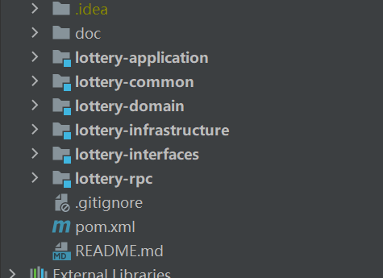

# 项目梳理


## 整体架构


  


## Common

### Constants

* 定义四种响应状态 以及 响应信息  code  + info

```java
package cn.itedus.lottery.common;


public class Constants{

    // 定义相关枚举类


    /**
     * 定义四种响应代码  响应代码和响应信息
     * SUCCESS：代表操作成功，响应代码为"0000"，信息为"成功"。
     * UN_ERROR：代表未知的失败原因，响应代码为"0001"，信息为"未知失败"。
     * ILLEGAL_PARAMETER：代表非法的参数，响应代码为"0002"，信息为"非法参数"。
     * INDEX_DUP：代表主键冲突，响应代码为"0003"，信息为"主键冲突"
     */
    public  enum  ResponseCode{
        SUCCESS("0000","成功"),

        UN_ERROR("0001","未知失败"),

        ILLEGAL_PARAMETER("0002","非法参数"),

        INDEX_DUP("0003","主键冲突");


        private String code;


        private String info;


        ResponseCode(String code,String info){
            this.code = code;
            this.info = info;
        }


        public String getCode(){
            return code;
        }


        public String getInfo(){
            return info;
        }


    }

}

```

### Result


```java

package cn.itedus.lottery.common;

import com.sun.org.apache.bcel.internal.Const;

import java.io.Serializable;

public class  Result implements Serializable{
    private static final long serialVersionUID = -3826891916021780628L;


    private String code;
    private String info;


    // 包装返回的结果

    public static Result buildResult(String code,String info){
        return new Result(code,info);
    }


    public static Result buildSuccessResult(){
        return new Result(Constants.ResponseCode.SUCCESS.getCode(),Constants.ResponseCode.SUCCESS.getInfo());
    }

    public static  Result buildErrorResult(){
        return new Result(Constants.ResponseCode.UN_ERROR.getCode(),Constants.ResponseCode.UN_ERROR.getInfo());
    }

    public Result(String code, String info) {
        this.code = code;
        this.info = info;
    }


    public String getCode() {
        return code;
    }

    public void setCode(String code) {
        this.code = code;
    }

    public String getInfo() {
        return info;
    }

    public void setInfo(String info) {
        this.info = info;
    }
}
```


**创建三种静态方法 用来创建Result对象，成功相应对象  响应代码和信息由Constants.ResponseCode.SUCCESS枚举类进行提供**


## InfraStructure

### DAO


#### IActivityDao


```java
import cn.itedus.lottery.infrastructure.po.Activity;
import org.apache.ibatis.annotations.Mapper;

@Mapper
public  interface IActivityDao {

   // 数据仓储的DAO操作


   /**
    * 插入活动
    * @param req
    */
   void insert(Activity req);

   /**
    * 查询活动
    * @param activityId
    * @return
    */
   Activity queryActivityById(Long activityId);
}

```

### PO


#### Activi


