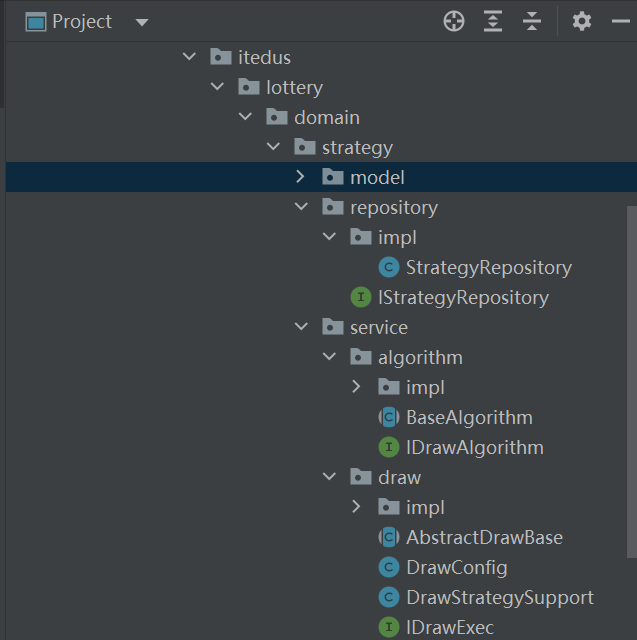

# 第06节：模板模式处理抽奖流程


## 概述

* 提取抽象类
* 编排模板流程
* 定义抽象方法
* 执行抽奖策略
* 扣减中奖库存
* 包装返回结果等


**重点：使用模板方法设计模式优化类DrawExecImpl抽奖过程方法实现，主要以抽象类AbstractDrawBase编排定义流程，定义抽象方法由类DrawExecImpl做具体实现的方式进行处理**

* **模板模式的核心设计思路是通过在，抽象类中定义抽象方法的执行顺序，并将抽象方法设定为只有子类实现**，但不设计独立访问的方法。简单说也就是把你安排的明明白白的。


## 模板模式使用


* 根据入参策略ID获取抽奖策略配置
* 校验和处理抽奖策略的数据初始化到内存中
* 获取哪些被排除掉的抽奖列表，这些奖品可能是已经奖品库位空，或者因为风控策略不能给这个用户薅羊毛的奖品
* 执行抽奖算法
* 包装抽奖结果

  


* DrawConfig：配置抽奖策略，SingleRateRandomDrawAlgorithm EntireRateRandomDrawAlgorithm
* DrawStrategySupport:提供抽奖策略数据支持，便于查询策略配置 奖品信息 通过这样的方式隔离职责
* AbsstractDrawBase：抽象类定义模板方法流程 在抽象类的doDrawExec方法中 处理整个抽奖流程   并且提供在流程中需要使用到的抽象方法，由DrawExecImpl服务逻辑中具体实现

## DrawConfig
*  PostConstruct 该注解 表示这个方法会在类实例化之后进行初始化 
*  使用了@PostConstruct注解，表示这个方法会在类实例化后进行初始化。
* 在init方法中，将整体抽奖算法和单一抽奖算法分别放入drawAlgorithmMap中，键值为抽奖策略的编号

```java
package cn.itedus.lottery.domain.strategy.service.draw;

import cn.itedus.lottery.common.Constants;
import cn.itedus.lottery.domain.strategy.service.algorithm.IDrawAlgorithm;

import javax.annotation.PostConstruct;
import javax.annotation.Resource;
import java.util.Map;
import java.util.concurrent.ConcurrentHashMap;

public class DrawConfig {

    @Resource
    private IDrawAlgorithm entiretyRateRandomDrawAlgorithm;

    @Resource
    private IDrawAlgorithm singleRateRandomDrawAlgorithm;

    /** 抽奖策略组 */
    protected static Map<Integer, IDrawAlgorithm> drawAlgorithmGroup = new ConcurrentHashMap<>();

    @PostConstruct
    public void init() {
        drawAlgorithmGroup.put(Constants.StrategyMode.ENTIRETY.getCode(), entiretyRateRandomDrawAlgorithm);
        drawAlgorithmGroup.put(Constants.StrategyMode.SINGLE.getCode(), singleRateRandomDrawAlgorithm);
    }

}


```
## DrawStrategySupport

* 抽奖策略配置信息

```java
package cn.itedus.lottery.domain.strategy.service.draw;

import cn.itedus.lottery.domain.strategy.model.aggregates.StrategyRich;
import cn.itedus.lottery.domain.strategy.repository.IStrategyRepository;
import cn.itedus.lottery.infrastructure.po.Award;

import javax.annotation.Resource;

public class DrawStrategySupport extends DrawConfig{

    @Resource
    protected IStrategyRepository strategyRepository;

    /**
     * 查询策略配置信息
     *
     * @param strategyId 策略ID
     * @return 策略配置信息
     */
    protected StrategyRich queryStrategyRich(Long strategyId){
        return strategyRepository.queryStrategyRich(strategyId);
    }

    /**
     * 查询奖品详情信息
     *
     * @param awardId 奖品ID
     * @return 中奖详情
     */
    protected Award queryAwardInfoByAwardId(String awardId){
        return strategyRepository.queryAwardInfo(awardId);
    }

}


```


## 定义抽奖模板


