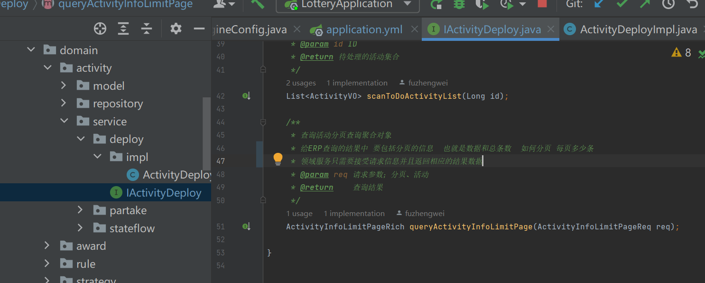
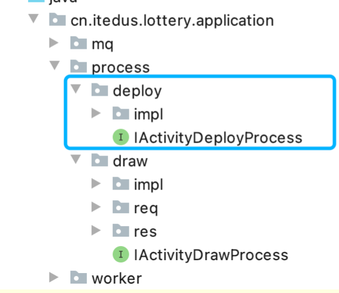

# 活动列表数据展示


## 具体实现


### 子领域添加查询列表功能


  


* 提供查询活动列表最近的领域则是活动领域中的活动部署子领域，因为这里提供了活动的配置，修改，状态以及提供活动列表查询
* 给ERP查询的结果中，需要包括分页的信息，其实也就是数据和总条数，具体如何分页，每页多少条，交给ERP自己配置和实现，所以领域服务只需要接受请求信息并且返回相应的结果数据

### 应用层-提供活动部署安排

* 实际的业务场景中，创建的活动都是需要进行娇艳的
* 因为活动信息配置了其他人服务提供的奖品，库存，风控验证，金额，活动数据领取测试，以及把活动信息在创建完成之后推送消息

  

* 活动的部署和活动的抽奖  分别在不同的模块下面实现，为了可以更好的维护

### 接口层-实现分页查询

```java
@Service
public class LotteryActivityDeploy implements ILotteryActivityDeploy {

    @Override
    public ActivityRes queryActivityListByPageForErp(ActivityPageReq req) {
        try {
            logger.info("活动部署分页数据查询开始 erpID：{}", req.getErpId());

            // 1. 包装入参
            ActivityInfoLimitPageReq activityInfoLimitPageReq = new ActivityInfoLimitPageReq(req.getPage(),req.getRows());
            activityInfoLimitPageReq.setActivityId(req.getActivityId());
            activityInfoLimitPageReq.setActivityName(req.getActivityName());

            // 2. 查询结果
            ActivityInfoLimitPageRich activityInfoLimitPageRich = activityDeploy.queryActivityInfoLimitPage(activityInfoLimitPageReq);
            Long count = activityInfoLimitPageRich.getCount();
            List<ActivityVO> activityVOList = activityInfoLimitPageRich.getActivityVOList();

            // 3. 转换对象
            List<ActivityDTO> activityDTOList = activityMapping.sourceToTarget(activityVOList);

            // 4. 封装数据
            ActivityRes activityRes = new ActivityRes(Result.buildSuccessResult());
            activityRes.setCount(count);
            activityRes.setActivityDTOList(activityDTOList);

            logger.info("活动部署分页数据查询完成 erpID：{} count：{}", req.getErpId(), count);

            // 5. 返回结果
            return activityRes;
        } catch (Exception e) {
            logger.error("活动部署分页数据查询失败 erpID：{} reqStr：{}", req.getErpId(), JSON.toJSON(req), e);
            return new ActivityRes(Result.buildErrorResult());
        }
    }

}


```

### ERP使用接口


* 通过RPC调用的方式，将抽奖系统提供的Dubbo接口，给ERP系统进行使用，并做一些封装处理，最终把数据展示到页面中

```java
# Dubbo 广播方式配置
dubbo:
  application:
    name: Lottery
    version: 1.0.0
  protocol:
    name: dubbo
    port: 20880


```


**将活动接口暴露给ERP系统**

```java

@Service
public class ActivityServiceImpl implements IActivityService {

    @Reference(interfaceClass = ILotteryActivityDeploy.class, url = "dubbo://127.0.0.1:20880")
    private ILotteryActivityDeploy activityDeploy;
    
    // ...
}

```

**配置好接口之后，就是具体的活动列表数据的查询和封装了**

* 在ERP系统中，application层定义接口 在domain实现接口  这是一个最基本的DDD结构的使用
* 最后controller提供一个数据查询接口api/activity/queryActivityListPage


