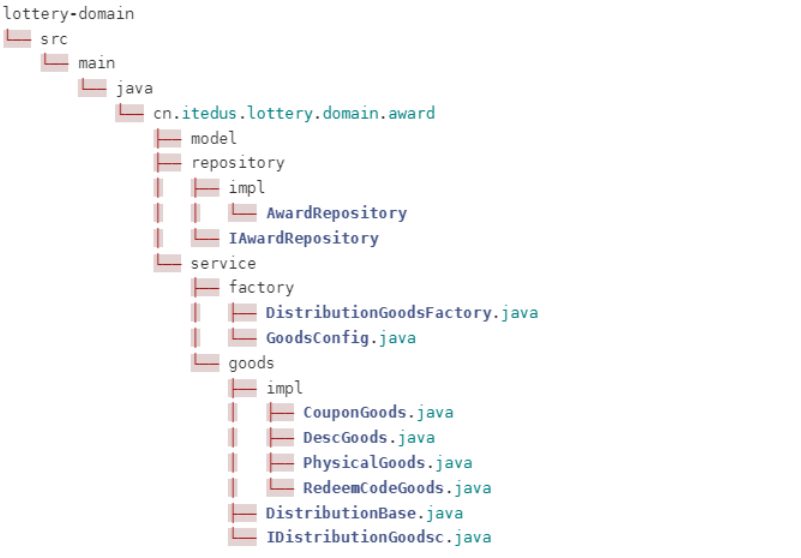

# 第07节：简单工厂搭建发奖领域

## 简单工厂搭建发奖领域

* 当各项核心的领域服务完成之后，在application层做服务编排流程处理的开发
* 从用户参与抽奖活动 过滤规则 执行抽奖 存放结果 发送奖品等内容的链路处理

## 工程结构

* award发奖领域中主要的核心实现在于service中的两块功能实现，分别是：goods商品处理 factorty 工厂
* goods 包装适配各类奖品的发放逻辑，真实业务场景中：调用优惠券、兑换码、物流发放等操作，这些内容经过封装之后就可以在自己的商品类下面进行实现
* factory：工厂模式通过调用方提供发奖类型，返回对应的发奖服务。通过这样由具体的子类决定返回结果，并做相应的业务处理

  

  

