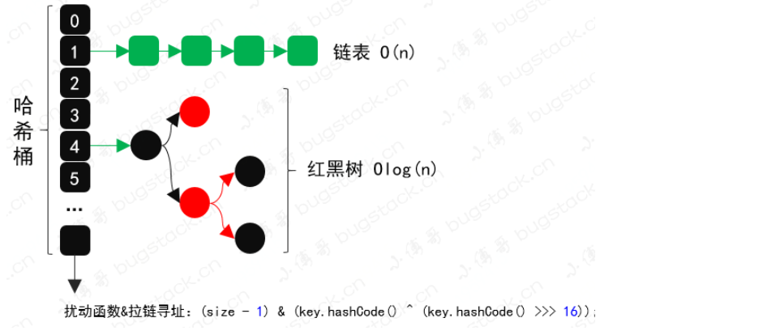

# 第10节：实现和使用分库分表

## 分库分表

* 因为业务量大，数据增长快，需要把数据拆分到不同的库表中去，减轻数据库压力
* 主要有垂直拆分和水平拆分
* 垂直拆分：按照业务将表进行分类，分布到不同的数据库中，这样数据的压力分担到不同的库中，最终一个数据库由很多表构成，每一个表对应着不同的业务，也就是专库专用
* 水平拆分：如果垂直拆分遭到问题，可以使用水平拆分，相对于垂直拆分得区别是：垂直拆分是把不同的表拆分到不同得数据库中，但是水平拆分是把同一个表拆分到不同的数据库中

## 路由设计


* 关于AOP切片拦截得使用，这是因为需要给使用数据库路由的方法坐上标记，便于处理分库分表逻辑
* 数据源得切换操作，既然有分库那么就会设计在多个数据源之间进行连接切换，以便于把数据分配给不同得数据库
* 数据库表寻址操作，一条数据分配到哪个数据库，哪张表，都需要进行索引计算，在方法调用的过程中最终通过ThreadLocal记录
* 为了能让数据均匀的分配到不同的库表中，还需要考虑如何进行数据散列操作，不能分库分表之后，让数据都集中在某个库的某个表

要用到的技术：
  * aop
  * 数据源切换
  * 散列算法
  * 哈希寻址
  * ThreadLocal
  * SpringBoot的starter


## 技术调研

* HashMap和ThreadLocal都用到了哈希索引、散列算法以及在数据膨胀的时候拉链寻址和开放寻址


### ThreadLocal

* 斐波那契的哈希值计算方式：i * 0x61c88647 + 0x61c88647;
* 然后将哈希值使用&操作符和十六进制数15进行位与运算
* 寻址方式：数据碰撞的时候进行开放寻址，从碰撞节点之后进行存放元素

```java
@Test
public void test_idx() {
    int hashCode = 0;
    for (int i = 0; i < 16; i++) {
        hashCode = i * 0x61c88647 + 0x61c88647;
        int idx = hashCode & 15;
        System.out.println("斐波那契散列：" + idx + " 普通散列：" + (String.valueOf(i).hashCode() & 15));
    }
} 


```


### HashMap


  


* 数据结构：哈希数组+ 链表 + 红黑树
* 散列算法：扰动函数、哈希索引，可以让数据更加散列的分布
* 寻址方式：通过拉链寻址的方式解决数据碰撞，数据存放会进行索引地址，遇到碰撞产生数据链表，链表长度超过8进行扩容或者进行树化


```java
public static int disturbHashIdx(String key, int size) {
    return (size - 1) & (key.hashCode() ^ (key.hashCode() >>> 16));
}
```

## 设计实现

### 定义路由注解


```java
@Documented
@Retention(RetentionPolicy.RUNTIME)
@Target({ElementType.TYPE, ElementType.METHOD})
public @interface DBRouter {

    String key() default "";

}

```


```java
@Mapper
public interface IUserDao {

     @DBRouter(key = "userId")
     User queryUserInfoByUserId(User req);

     @DBRouter(key = "userId")
     void insertUser(User req);

}

```

* 首先自定义一个注解，用于放置在需要被数据库路由的方法上
* 它的使用方式是通过方法配置注解，就可以被我们指定的AOP切面进行拦截，拦截之后进行相应的数据库路由计算和判断，并且切换到相应的操作数据源

### 2. 解析路由配置

* 分库分表下面的数据源使用中，需要支持多数据源的信息配置，这样满足不同需求的扩展
* 对于自定义较大的信息配置，需要使用到org.springframework.EnvironmentAware接口，来获取配置文件并且提取需要的配置信息

```yml
# 多数据源路由配置
mini-db-router:
  jdbc:
    datasource:
      dbCount: 2
      tbCount: 4
      default: db00
      routerKey: uId
      list: db01,db02
      db00:
        driver-class-name: com.mysql.cj.jdbc.Driver
        url: jdbc:mysql://127.0.0.1:3306/lottery?useUnicode=true&serverTimezone=UTC
        username: root
        password: 123456
      db01:
        driver-class-name: com.mysql.cj.jdbc.Driver
        url: jdbc:mysql://127.0.0.1:3306/lottery?useUnicode=true&serverTimezone=UTC
        username: root
        password: 123456
      db02:
        driver-class-name: com.mysql.cj.jdbc.Driver
        url: jdbc:mysql://127.0.0.1:3306/lottery?useUnicode=true&serverTimezone=UTC
        username: root
        password: 123456

```
### 数据源配置提取

* prefix，是数据源配置的开头信息，你可以自定义需要的开头内容。
* dbCount、tbCount、dataSources、dataSourceProps，都是对配置信息的提取，并存放到 dataSourceMap 中便于后续使用。

```java
@Override
public void setEnvironment(Environment environment) {
    String prefix = "router.jdbc.datasource.";    

    dbCount = Integer.valueOf(environment.getProperty(prefix + "dbCount"));
    tbCount = Integer.valueOf(environment.getProperty(prefix + "tbCount"));    

    String dataSources = environment.getProperty(prefix + "list");
    for (String dbInfo : dataSources.split(",")) {
        Map<String, Object> dataSourceProps = PropertyUtil.handle(environment, prefix + dbInfo, Map.class);
        dataSourceMap.put(dbInfo, dataSourceProps);
    }
}


```

### 数据源切换

* 需要提供一个 DataSource 的实例化对象，那么这个对象我们就放在 DataSourceAutoConfig 来实现，并且这里提供的数据源是可以动态变换的，也就是支持动态切换数据源。


```java
@Bean
public DataSource dataSource() {
    // 创建数据源
    Map<Object, Object> targetDataSources = new HashMap<>();
    for (String dbInfo : dataSourceMap.keySet()) {
        Map<String, Object> objMap = dataSourceMap.get(dbInfo);
        targetDataSources.put(dbInfo, new DriverManagerDataSource(objMap.get("url").toString(), objMap.get("username").toString(), objMap.get("password").toString()));
    }     

    // 设置数据源
    DynamicDataSource dynamicDataSource = new DynamicDataSource();
    dynamicDataSource.setTargetDataSources(targetDataSources);
    dynamicDataSource.setDefaultTargetDataSource(new DriverManagerDataSource(defaultDataSourceConfig.get("url").toString(), defaultDataSourceConfig.get("username").toString(), defaultDataSourceConfig.get("password").toString()));

    return dynamicDataSource;
}


```

* 这里是一个简化的创建案例，把基于从配置信息中读取到的数据源信息，进行实例化创建。
* 数据源创建完成后存放到 DynamicDataSource 中，它是一个继承了 AbstractRoutingDataSource 的实现类，这个类里可以存放和读取相应的具体调用的数据源信息

##  切面拦截

* 在 AOP 的切面拦截中需要完成；数据库路由计算、扰动函数加强散列、计算库表索引、设置到 ThreadLocal 传递数据源

```java

@Around("aopPoint() && @annotation(dbRouter)")
public Object doRouter(ProceedingJoinPoint jp, DBRouter dbRouter) throws Throwable {
    String dbKey = dbRouter.key();
    if (StringUtils.isBlank(dbKey)) throw new RuntimeException("annotation DBRouter key is null！");

    // 计算路由
    String dbKeyAttr = getAttrValue(dbKey, jp.getArgs());
    int size = dbRouterConfig.getDbCount() * dbRouterConfig.getTbCount();

    // 扰动函数
    int idx = (size - 1) & (dbKeyAttr.hashCode() ^ (dbKeyAttr.hashCode() >>> 16));

    // 库表索引
    int dbIdx = idx / dbRouterConfig.getTbCount() + 1;
    int tbIdx = idx - dbRouterConfig.getTbCount() * (dbIdx - 1);   

    // 设置到 ThreadLocal
    DBContextHolder.setDBKey(String.format("%02d", dbIdx));
    DBContextHolder.setTBKey(String.format("%02d", tbIdx));
    logger.info("数据库路由 method：{} dbIdx：{} tbIdx：{}", getMethod(jp).getName(), dbIdx, tbIdx);
   
    // 返回结果
    try {
        return jp.proceed();
    } finally {
        DBContextHolder.clearDBKey();
        DBContextHolder.clearTBKey();
    }
}


```

* 简化的核心逻辑实现代码如上，首先我们提取了库表乘积的数量，把它当成 HashMap 一样的长度进行使用。
* 接下来使用和 HashMap 一样的扰动函数逻辑，让数据分散的更加散列。
* 当计算完总长度上的一个索引位置后，还需要把这个位置折算到库表中，看看总体长度的索引因为落到哪个库哪个表。
* 最后是把这个计算的索引信息存放到 ThreadLocal 中，用于传递在方法调用过程中可以提取到索引信息。

## Mybatis 拦截器处理分表


* 最开始考虑直接在Mybatis对应的表 INSERT INTO user_strategy_export_${tbIdx} 添加字段的方式处理分表。但这样看上去并不优雅，不过也并不排除这种使用方式，仍然是可以使用的。
* 那么我们可以基于 Mybatis 拦截器进行处理，通过拦截 SQL 语句动态修改添加分表信息，再设置回 Mybatis 执行 SQL 中。
* 此外再完善一些分库分表路由的操作，比如配置默认的分库分表字段以及单字段入参时默认取此字段作为路由字段。


```java
@Intercepts({@Signature(type = StatementHandler.class, method = "prepare", args = {Connection.class, Integer.class})})
public class DynamicMybatisPlugin implements Interceptor {


    private Pattern pattern = Pattern.compile("(from|into|update)[\\s]{1,}(\\w{1,})", Pattern.CASE_INSENSITIVE);

    @Override
    public Object intercept(Invocation invocation) throws Throwable {
        // 获取StatementHandler
        StatementHandler statementHandler = (StatementHandler) invocation.getTarget();
        MetaObject metaObject = MetaObject.forObject(statementHandler, SystemMetaObject.DEFAULT_OBJECT_FACTORY, SystemMetaObject.DEFAULT_OBJECT_WRAPPER_FACTORY, new DefaultReflectorFactory());
        MappedStatement mappedStatement = (MappedStatement) metaObject.getValue("delegate.mappedStatement");

        // 获取自定义注解判断是否进行分表操作
        String id = mappedStatement.getId();
        String className = id.substring(0, id.lastIndexOf("."));
        Class<?> clazz = Class.forName(className);
        DBRouterStrategy dbRouterStrategy = clazz.getAnnotation(DBRouterStrategy.class);
        if (null == dbRouterStrategy || !dbRouterStrategy.splitTable()){
            return invocation.proceed();
        }

        // 获取SQL
        BoundSql boundSql = statementHandler.getBoundSql();
        String sql = boundSql.getSql();

        // 替换SQL表名 USER 为 USER_03
        Matcher matcher = pattern.matcher(sql);
        String tableName = null;
        if (matcher.find()) {
            tableName = matcher.group().trim();
        }
        assert null != tableName;
        String replaceSql = matcher.replaceAll(tableName + "_" + DBContextHolder.getTBKey());

        // 通过反射修改SQL语句
        Field field = boundSql.getClass().getDeclaredField("sql");
        field.setAccessible(true);
        field.set(boundSql, replaceSql);

        return invocation.proceed();
    }

}


```

* 实现 Interceptor 接口的 intercept 方法，获取StatementHandler、通过自定义注解判断是否进行分表操作、获取SQL并替换SQL表名 USER 为 USER_03、最后通过反射修改SQL语句
* 此处会用到正则表达式拦截出匹配的sql，(from|into|update)[\\s]{1,}(\\w{1,})

## 测试和验证

* 打包 db-router-spring-boot-starter
* 引入pom文件

```java

<dependency>
    <groupId>cn.bugstack.middleware</groupId>
    <artifactId>db-router-spring-boot-starter</artifactId>
    <version>1.0.0-SNAPSHOT</version>
</dependency>


```

### 在需要使用数据库路由的DAO方法上加入注解

* @DBRouter(key = "uId") key 是入参对象中的属性，用于提取作为分库分表路由字段使用


```java

@Mapper
public interface IUserTakeActivityDao {

    /**
     * 插入用户领取活动信息
     *
     * @param userTakeActivity 入参
     */
    @DBRouter(key = "uId")
    void insert(UserTakeActivity userTakeActivity);

}

```
### 数据库语句

```sql
<insert id="insert" parameterType="cn.itedus.lottery.infrastructure.po.UserTakeActivity">
    INSERT INTO user_take_activity
    (u_id, take_id, activity_id, activity_name, take_date,
     take_count, uuid, create_time, update_time)
    VALUES
    (#{uId}, #{takeId}, #{activityId}, #{activityName}, #{takeDate},
     #{takeCount}, #{uuid}, now(), now())
</insert>

```


