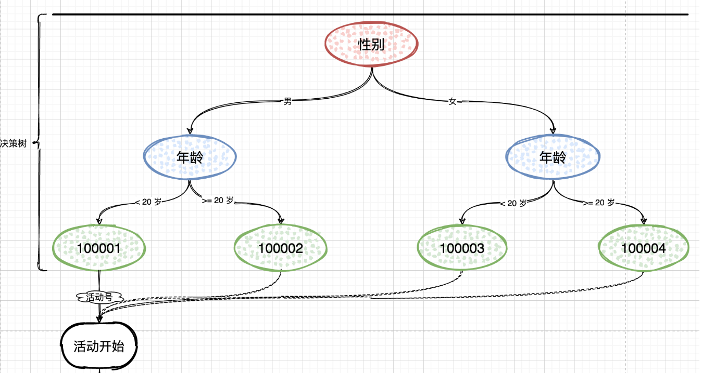
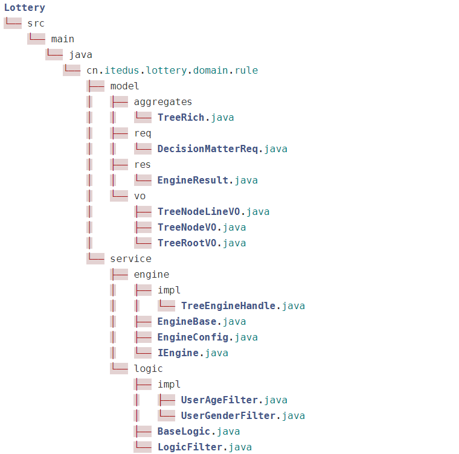
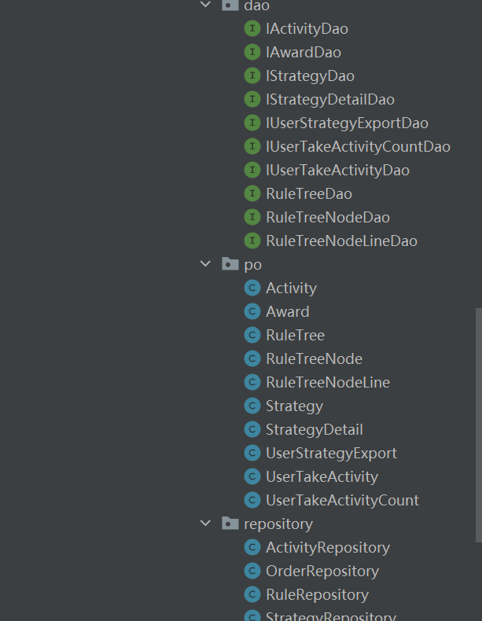

# 第13节：规则引擎量化人群参与活动


## 概述


* 使用组合模式搭建用于量化人群的规则引擎，用于用户参与活动之前，通过规则引擎过滤性别、年龄、首单消费、消费金额、忠实用户等各类身份来量化出具体可参与的抽奖活动。通过这样的方式控制运营成本和精细化运营

* 增加规则引擎开发需要的相关配置类表:rule_tree,rule_tree_node，rule_tree_node_line
* 运用组合模式搭建规则引擎领域服务，包括:logic逻辑过滤器，engine引擎执行器
* 修改lotter-infrastructure基础层中仓储实现类更为合适的注解未@Repository包括:ActivityRepository，RuleRepository,StrategyRepository,UserTakeActivityRepository


## 库表设计

* 组合模式的特点就像是搭建出一棵二叉树，而库表中则需要把这样一颗二叉树存放进去，那么这里就需要包括：树根、树茎、子叶、果实。在具体的逻辑实现中则需要通过子叶判断走哪个树茎以及最终筛选出一个果实来。


* rule_tree

```java
CREATE TABLE `rule_tree` (
  `id` bigint(20) NOT NULL AUTO_INCREMENT COMMENT '主键ID',
  `tree_name` varchar(64) DEFAULT NULL COMMENT '规则树NAME',
  `tree_desc` varchar(128) DEFAULT NULL COMMENT '规则树描述',
  `tree_root_node_id` bigint(20) DEFAULT NULL COMMENT '规则树根ID',
  `create_time` datetime DEFAULT NULL COMMENT '创建时间',
  `update_time` datetime DEFAULT NULL COMMENT '更新时间',
  PRIMARY KEY (`id`)
) ENGINE=InnoDB AUTO_INCREMENT=10002 DEFAULT CHARSET=utf8;


```


* rule_tree_node

```java
CREATE TABLE `rule_tree_node` (
  `id` bigint(20) NOT NULL AUTO_INCREMENT COMMENT '主键ID',
  `tree_id` int(2) DEFAULT NULL COMMENT '规则树ID',
  `node_type` int(2) DEFAULT NULL COMMENT '节点类型；1子叶、2果实',
  `node_value` varchar(32) DEFAULT NULL COMMENT '节点值[nodeType=2]；果实值',
  `rule_key` varchar(16) DEFAULT NULL COMMENT '规则Key',
  `rule_desc` varchar(32) DEFAULT NULL COMMENT '规则描述',
  PRIMARY KEY (`id`)
) ENGINE=InnoDB AUTO_INCREMENT=123 DEFAULT CHARSET=utf8;


```


* rule_tree_node_line

```java
CREATE TABLE `rule_tree_node_line` (
  `id` bigint(20) NOT NULL AUTO_INCREMENT COMMENT '主键ID',
  `tree_id` bigint(20) DEFAULT NULL COMMENT '规则树ID',
  `node_id_from` bigint(20) DEFAULT NULL COMMENT '节点From',
  `node_id_to` bigint(20) DEFAULT NULL COMMENT '节点To',
  `rule_limit_type` int(2) DEFAULT NULL COMMENT '限定类型；1:=;2:>;3:<;4:>=;5<=;6:enum[枚举范围];7:果实',
  `rule_limit_value` varchar(32) DEFAULT NULL COMMENT '限定值',
  PRIMARY KEY (`id`)
) ENGINE=InnoDB AUTO_INCREMENT=7 DEFAULT CHARSET=utf8;


```


## 应用场景

  


* 基于量化决策引擎，筛选用户身份标签，找到符合参与的活动号，拿到活动号码之后，就可以参与到具体的抽奖活动中
* 通常量化决策引擎也是一种用于差异化人群的规则过滤器，不只是可以过滤出活动，也可以判断是否可以参与这个抽奖活动中
* 在我们的这个抽奖系统之后，后面会使用规则引擎领域服务，**在应用层座一层封装之后，由接口层进行调用使用，也就是用户参与活动之前，要做一层规则引擎过滤**


## 功能开发


### 工程结构


  


### model层


* 首先定义好几个VO对象

#### TreeRootVO

```java
package cn.itedus.lottery.domain.rule.model.vo;

/**
 * 规则树根的配置
 */
public class TreeRootVO {

    // 规则树ID
    private Long treeId;

    // 规则树根ID
    private Long treeRootNodeId;


    // 规则树名称
    private String treeName;


    public Long getTreeId() {
        return treeId;
    }

    public void setTreeId(Long treeId) {
        this.treeId = treeId;
    }

    public Long getTreeRootNodeId() {
        return treeRootNodeId;
    }

    public void setTreeRootNodeId(Long treeRootNodeId) {
        this.treeRootNodeId = treeRootNodeId;
    }

    public String getTreeName() {
        return treeName;
    }

    public void setTreeName(String treeName) {
        this.treeName = treeName;
    }

    @Override
    public String toString() {
        return "TreeRootVO{" +
                "treeId=" + treeId +
                ", treeRootNodeId=" + treeRootNodeId +
                ", treeName='" + treeName + '\'' +
                '}';
    }
}


```


#### TreeNodeVO


```java
package cn.itedus.lottery.domain.rule.model.vo;

import java.util.List;

/**
 * 规则树节点信息
 */
public class TreeNodeVO {

    // 规则树ID
    private  Long treeId;

    // 规则树节点ID
    private Long treeNodeId;

    // 节点类型
    private Integer nodeType;

    // 节点值
    private String nodeValue;


    private String ruleKey;// 规则Key

    // 规则描述
    private String ruleDesc;

    // 节点链路
    private List<TreeNodeLineVO> treeNodeLineVOList;


    public Long getTreeId() {
        return treeId;
    }

    public void setTreeId(Long treeId) {
        this.treeId = treeId;
    }

    public Long getTreeNodeId() {
        return treeNodeId;
    }

    public void setTreeNodeId(Long treeNodeId) {
        this.treeNodeId = treeNodeId;
    }

    public Integer getNodeType() {
        return nodeType;
    }

    public void setNodeType(Integer nodeType) {
        this.nodeType = nodeType;
    }

    public String getNodeValue() {
        return nodeValue;
    }

    public void setNodeValue(String nodeValue) {
        this.nodeValue = nodeValue;
    }

    public String getRuleKey() {
        return ruleKey;
    }

    public void setRuleKey(String ruleKey) {
        this.ruleKey = ruleKey;
    }

    public String getRuleDesc() {
        return ruleDesc;
    }

    public void setRuleDesc(String ruleDesc) {
        this.ruleDesc = ruleDesc;
    }

    public List<TreeNodeLineVO> getTreeNodeLineVOList() {
        return treeNodeLineVOList;
    }

    public void setTreeNodeLineVOList(List<TreeNodeLineVO> treeNodeLineVOList) {
        this.treeNodeLineVOList = treeNodeLineVOList;
    }

    @Override
    public String toString() {
        return "TreeNodeVO{" +
                "treeId=" + treeId +
                ", treeNodeId=" + treeNodeId +
                ", nodeType=" + nodeType +
                ", nodeValue='" + nodeValue + '\'' +
                ", ruleKey='" + ruleKey + '\'' +
                ", ruleDesc='" + ruleDesc + '\'' +
                ", treeNodeLineVOList=" + treeNodeLineVOList +
                '}';
    }
}


```

#### TreeNodeLineVO


```java

package cn.itedus.lottery.domain.rule.model.vo;

/**
 * 规则树线信息
 */
public class TreeNodeLineVO {

    // 节点from  父节点
    private Long nodeIdFrom;

    private Long nodeIdTo;// 子节点

    private Integer ruleLimitType;// 限定类型

    private String ruleLimitValue;// 限定值

    public Long getNodeIdFrom() {
        return nodeIdFrom;
    }

    public void setNodeIdFrom(Long nodeIdFrom) {
        this.nodeIdFrom = nodeIdFrom;
    }

    public Long getNodeIdTo() {
        return nodeIdTo;
    }

    public void setNodeIdTo(Long nodeIdTo) {
        this.nodeIdTo = nodeIdTo;
    }

    public Integer getRuleLimitType() {
        return ruleLimitType;
    }

    public void setRuleLimitType(Integer ruleLimitType) {
        this.ruleLimitType = ruleLimitType;
    }

    public String getRuleLimitValue() {
        return ruleLimitValue;
    }

    public void setRuleLimitValue(String ruleLimitValue) {
        this.ruleLimitValue = ruleLimitValue;
    }

    @Override
    public String toString() {
        return "TreeNodeLineVO{" +
                "nodeIdFrom=" + nodeIdFrom +
                ", nodeIdTo=" + nodeIdTo +
                ", ruleLimitType=" + ruleLimitType +
                ", ruleLimitValue='" + ruleLimitValue + '\'' +
                '}';
    }
}

```


### Req请求


```java

package cn.itedus.lottery.domain.rule.model.req;

import java.util.Map;


/**
 * 决策请求
 */
public class DecisionMatterReq {
    //  规则树ID
    private Long treeId;

    // 用户ID
    private String userId;

    //决策值
    private Map<String,Object> valMap;

    public Long getTreeId() {
        return treeId;
    }

    public void setTreeId(Long treeId) {
        this.treeId = treeId;
    }

    public String getUserId() {
        return userId;
    }

    public void setUserId(String userId) {
        this.userId = userId;
    }

    public Map<String, Object> getValMap() {
        return valMap;
    }

    public void setValMap(Map<String, Object> valMap) {
        this.valMap = valMap;
    }
}

```


### TreeRuleRich 定义多叉树


```java
package cn.itedus.lottery.domain.rule.model.aggregates;


import cn.itedus.lottery.domain.rule.model.vo.TreeNodeVO;
import cn.itedus.lottery.domain.rule.model.vo.TreeRootVO;

import java.util.Map;

/**
 * 规则树聚合信息  描述一颗多叉树  =  根节点  + 子节点
 */
public class TreeRuleRich {
    // 树根信息
    private TreeRootVO treeRoot;

    // 树节点ID -> 子节点  多个子节点
    private Map<Long, TreeNodeVO> treeNodeMap;


    public TreeRootVO getTreeRoot() {
        return treeRoot;
    }

    public void setTreeRoot(TreeRootVO treeRoot) {
        this.treeRoot = treeRoot;
    }

    public Map<Long, TreeNodeVO> getTreeNodeMap() {
        return treeNodeMap;
    }

    public void setTreeNodeMap(Map<Long, TreeNodeVO> treeNodeMap) {
        this.treeNodeMap = treeNodeMap;
    }
}


```


#### EngineResult


```java

package cn.itedus.lottery.domain.rule.model.res;


/**
 * 决策结果
 */
public class EngineResult {

    // 执行结果
    private boolean isSuccess;

    // 用户ID
    private String userId;

    // 规则树ID
    private Long treeId;

    // 果实节点ID
    private Long nodeId;

    // 果实节点值
    private String nodeValue;

    public EngineResult() {
    }

    public EngineResult(String userId, Long treeId, Long nodeId, String nodeValue) {
        this.isSuccess = true;
        this.userId = userId;
        this.treeId = treeId;
        this.nodeId = nodeId;
        this.nodeValue = nodeValue;
    }

    public boolean isSuccess() {
        return isSuccess;
    }

    public void setSuccess(boolean success) {
        isSuccess = success;
    }

    public String getUserId() {
        return userId;
    }

    public void setUserId(String userId) {
        this.userId = userId;
    }

    public Long getTreeId() {
        return treeId;
    }

    public void setTreeId(Long treeId) {
        this.treeId = treeId;
    }

    public Long getNodeId() {
        return nodeId;
    }

    public void setNodeId(Long nodeId) {
        this.nodeId = nodeId;
    }

    public String getNodeValue() {
        return nodeValue;
    }

    public void setNodeValue(String nodeValue) {
        this.nodeValue = nodeValue;
    }
}


```

### Repository

**该接口用于查询树的详细节点信息，接口实现类在infrastructure层**

```java
package cn.itedus.lottery.domain.rule.repository;


import cn.itedus.lottery.domain.rule.model.aggregates.TreeRuleRich;

/**
 * 规则信息仓储服务接口
 */
public interface IRuleRepository {

    /**
     * 查询规则决策树配置
     * @param treeId  决策树ID
     * @return
     */
    TreeRuleRich queryTreeRuleRich(Long treeId);

}


```


  

**infra层主要就是定义具体的数据仓储服务DAO，DAO提供各种PO对象信息的查询，然后repository提供各种dao的数据查询操作，都是Domain领域下面的接口实现类**


### InfraStructure层


#### PO层定义三种对象  树 节点 节点链条


* ruleTree

```java

package cn.itedus.lottery.infrastructure.po;

import java.util.Date;

public class RuleTree {
    private Long id;// 主键ID

    private String treeName;// 规则树名称

    private String treeDesc;// 规则树描述

    private Long treeRootNodeId;// 规则树树根ID

    private Date createTime;// 创建时间

    private Date updateTime;// 更新时间

    public Long getId() {
        return id;
    }

    public void setId(Long id) {
        this.id = id;
    }

    public String getTreeName() {
        return treeName;
    }

    public void setTreeName(String treeName) {
        this.treeName = treeName;
    }

    public String getTreeDesc() {
        return treeDesc;
    }

    public void setTreeDesc(String treeDesc) {
        this.treeDesc = treeDesc;
    }

    public Long getTreeRootNodeId() {
        return treeRootNodeId;
    }

    public void setTreeRootNodeId(Long treeRootNodeId) {
        this.treeRootNodeId = treeRootNodeId;
    }

    public Date getCreateTime() {
        return createTime;
    }

    public void setCreateTime(Date createTime) {
        this.createTime = createTime;
    }

    public Date getUpdateTime() {
        return updateTime;
    }

    public void setUpdateTime(Date updateTime) {
        this.updateTime = updateTime;
    }
}


```


* ruleTreeNode

```java

package cn.itedus.lottery.infrastructure.po;

/**
 * 规则树节点
 */
public class RuleTreeNode {

    private Long id;// 主键ID

    private Long treeId;// 规则树ID


    private Integer nodeType;// 节点类型


    private  String nodeValue;// 节点值

    private String ruleKey;// 规则Key


    private String ruleDesc;// 规则描述

    public Long getId() {
        return id;
    }

    public void setId(Long id) {
        this.id = id;
    }

    public Long getTreeId() {
        return treeId;
    }

    public void setTreeId(Long treeId) {
        this.treeId = treeId;
    }

    public Integer getNodeType() {
        return nodeType;
    }

    public void setNodeType(Integer nodeType) {
        this.nodeType = nodeType;
    }

    public String getNodeValue() {
        return nodeValue;
    }

    public void setNodeValue(String nodeValue) {
        this.nodeValue = nodeValue;
    }

    public String getRuleKey() {
        return ruleKey;
    }

    public void setRuleKey(String ruleKey) {
        this.ruleKey = ruleKey;
    }

    public String getRuleDesc() {
        return ruleDesc;
    }

    public void setRuleDesc(String ruleDesc) {
        this.ruleDesc = ruleDesc;
    }
}

```


* ruleTreeNodeLine

```java
package cn.itedus.lottery.infrastructure.po;

public class RuleTreeNodeLine {

    // 主键   ID
    private Long id;


    // 规则树id
    private Long treeId;


    // 父节点
    private  Long  nodeIdFrom;

    private Long nodeIdTo;// 子节点

    private  Integer ruleLimitType;// 节点限定类型


    private String ruleLimitValue;// 限定值


    public Long getId() {
        return id;
    }

    public void setId(Long id) {
        this.id = id;
    }

    public Long getTreeId() {
        return treeId;
    }

    public void setTreeId(Long treeId) {
        this.treeId = treeId;
    }

    public Long getNodeIdFrom() {
        return nodeIdFrom;
    }

    public void setNodeIdFrom(Long nodeIdFrom) {
        this.nodeIdFrom = nodeIdFrom;
    }

    public Long getNodeIdTo() {
        return nodeIdTo;
    }

    public void setNodeIdTo(Long nodeIdTo) {
        this.nodeIdTo = nodeIdTo;
    }

    public Integer getRuleLimitType() {
        return ruleLimitType;
    }

    public void setRuleLimitType(Integer ruleLimitType) {
        this.ruleLimitType = ruleLimitType;
    }

    public String getRuleLimitValue() {
        return ruleLimitValue;
    }

    public void setRuleLimitValue(String ruleLimitValue) {
        this.ruleLimitValue = ruleLimitValue;
    }
}

```

#### DAO


* ruleTreeDao
```java
package cn.itedus.lottery.infrastructure.dao;


import cn.itedus.lottery.infrastructure.po.RuleTree;
import org.apache.ibatis.annotations.Mapper;


/**
 * 规则树配置Dao
 */
@Mapper
public interface RuleTreeDao {

    /**
     * 规则树查询信息
     * @param id
     * @return
     */
    RuleTree queryRuleTreeByTreeId(Long id);// 根据规则树在数据库中的id查询规则树 po对象


    /**
     * 规则树简要信息查询  名称  + description
     * @param treeId  规则树Id
     * @return
     */
    RuleTree queryTreeSummaryInfo(Long treeId);
}


```


* ruleTreeNodeDao

```java
package cn.itedus.lottery.infrastructure.dao;


import cn.itedus.lottery.infrastructure.po.RuleTreeNode;
import org.apache.ibatis.annotations.Mapper;

import java.util.List;

/**
 * 规则树节点信息查询
 */

@Mapper
public interface RuleTreeNodeDao {


    /**
     * 查询规则树节点信息  得到规则树节点集合
     * @param treeId  规则树ID
     * @return
     */
    List<RuleTreeNode> queryRuleTreeNodeList(Long treeId);

    /**
     * 查询规则树节点数量
     * @param treeId  规则树ID
     * @return  节点数量
     */
    int queryTreeNodeCount(Long treeId);


    /**
     * 查询规则树节点
     * @param treeId  规则树ID
     * @return  节点集合
     */
    List<RuleTreeNode> queryTreeRulePoint(Long treeId);

}


```


### interfaces

**这一层 主要是把xml文件信息补充，针对DAO的sql接口**

* RuleTree_Mapper

```xml
<?xml version="1.0" encoding="UTF-8"?>
<!DOCTYPE mapper PUBLIC "-//mybatis.org//DTD Mapper 3.0//EN" "http://mybatis.org/dtd/mybatis-3-mapper.dtd">
<mapper namespace="cn.itedus.lottery.infrastructure.dao.IAwardDao">

    <resultMap id="ruleTreeMap" type="cn.itedus.lottery.infrastructure.po.RuleTree">
        <id column="id" property="id"/>
        <result column="tree_name" property="treeName"/>
        <result column="tree_desc" property="treeDesc"/>
        <result column="tree_root_node_id" property="treeRootNodeId"/>
        <result column="create_time" property="createTime"/>
        <result column="update_time" property="updateTime"/>
    </resultMap>

<!--    查询规则树的详细信息-->
    <select id="queryRuleTreeByTreeId" resultMap = "ruleTreeMap">
        SELECT  id,tree_name,tree_desc,tree_root_node_id,create_time,update_TIME
        FROM  rule_tree
        where id = #{id}
    </select>

<!--    查询规则树的简要信息-->
    <select id="queryRuleTreeByTreeId" resultMap = "ruleTreeMap">
        SELECT  id,tree_name,tree_desc
        FROM  rule_tree
        where id = #{id}
    </select>

</mapper>


```


* RuleTreeNode_Mapper

```java
<?xml version="1.0" encoding="UTF-8"?>
<!DOCTYPE mapper PUBLIC "-//mybatis.org//DTD Mapper 3.0//EN" "http://mybatis.org/dtd/mybatis-3-mapper.dtd">
<mapper namespace="cn.itedus.lottery.infrastructure.dao.RuleTreeNodeDao">

    <resultMap id="ruleTreeNodeMap" type="cn.itedus.lottery.infrastructure.po.RuleTreeNode">
        <id column="id" property="id"/>
        <result column="tree_id" property="treeId"/>
        <result column="node_type" property="nodeType"/>
        <result column="node_value" property="nodeValue"/>
        <result column="rule_key" property="ruleKey"/>
        <result column="rule_desc" property="ruleDesc"/>
    </resultMap>

    <select id="queryRuleTreeNodeList" resultMap="ruleTreeNodeMap">
        SELECT id, tree_id, node_type, node_value, rule_key, rule_desc
        FROM rule_tree_node
        where tree_id = #{treeId}
    </select>

    <select id="queryTreeNodeCount" resultType="java.lang.Integer">
        select count(id) from rule_tree_node where tree_id = #{treeId}
    </select>

    <select id="queryTreeRulePoint" resultMap="ruleTreeNodeMap">
        SELECT distinct (rule_key), rule_desc
        FROM rule_tree_node
        where tree_id = #{treeId} and rule_key is not null
    </select>

</mapper>


```


* RuleTreeNodeLine_Mapper


```xml
<?xml version="1.0" encoding="UTF-8"?>
<!DOCTYPE mapper PUBLIC "-//mybatis.org//DTD Mapper 3.0//EN" "http://mybatis.org/dtd/mybatis-3-mapper.dtd">
<mapper namespace="cn.itedus.lottery.infrastructure.dao.RuleTreeNodeLineDao">

    <resultMap id="ruleTreeNodeLineResultMap" type="cn.itedus.lottery.infrastructure.po.RuleTreeNodeLine">
        <id column="id" property="id"/>
        <result column="tree_id" property="treeId"/>
        <result column="node_id_from" property="nodeIdFrom"/>
        <result column="node_id_to" property="nodeIdTo"/>
        <result column="rule_limit_type" property="ruleLimitType"/>
        <result column="rule_limit_value" property="ruleLimitValue"/>
    </resultMap>

    <select id="queryRuleTreeNodeLineList" resultMap="ruleTreeNodeLineResultMap">
        SELECT id, tree_id, node_id_from, node_id_to, rule_limit_type, rule_limit_value
        FROM rule_tree_node_line
        where tree_id = #{treeId} and node_id_from = #{nodeIdFrom}
    </select>

    <select id="queryTreeNodeLineCount" resultType="java.lang.Integer">
        select count(id) from rule_tree_node_line where tree_id = #{treeId}
    </select>

</mapper>


```

####  RuleRepository

* 实现domain下面的树节点信息查询接口

```java
package cn.itedus.lottery.infrastructure.repository;

import cn.itedus.lottery.common.Constants;
import cn.itedus.lottery.domain.rule.model.aggregates.TreeRuleRich;
import cn.itedus.lottery.domain.rule.model.vo.TreeNodeLineVO;
import cn.itedus.lottery.domain.rule.model.vo.TreeNodeVO;
import cn.itedus.lottery.domain.rule.model.vo.TreeRootVO;
import cn.itedus.lottery.domain.rule.repository.IRuleRepository;
import cn.itedus.lottery.infrastructure.dao.RuleTreeDao;
import cn.itedus.lottery.infrastructure.dao.RuleTreeNodeDao;
import cn.itedus.lottery.infrastructure.dao.RuleTreeNodeLineDao;
import cn.itedus.lottery.infrastructure.po.RuleTree;
import cn.itedus.lottery.infrastructure.po.RuleTreeNode;
import cn.itedus.lottery.infrastructure.po.RuleTreeNodeLine;
import org.springframework.stereotype.Repository;

import javax.annotation.Resource;
import java.util.ArrayList;
import java.util.HashMap;
import java.util.List;
import java.util.Map;

/**
 *  规则信息仓储服务  注入dao资源查询信息
 */
@Repository
public class RuleRepository implements IRuleRepository {

    @Resource
    private RuleTreeDao ruleTreeDao;

    @Resource
    private RuleTreeNodeDao ruleTreeNodeDao;

    @Resource
    private RuleTreeNodeLineDao ruleTreeNodeLineDao;

    /**
     * 根据树的id 查询整个树的信息
     * @param treeId  决策树ID
     * @return
     */
    @Override
    public TreeRuleRich queryTreeRuleRich(Long treeId) {

        // 首先查询出规则树 然后赋值给VO对象
        RuleTree ruleTree = ruleTreeDao.queryRuleTreeByTreeId(treeId);
        TreeRootVO treeRootVO = new TreeRootVO();
        treeRootVO.setTreeId(ruleTree.getId());// 树的id
        treeRootVO.setTreeRootNodeId(ruleTree.getTreeRootNodeId());// 根节点id
        treeRootVO.setTreeName(ruleTree.getTreeName());// 树的名字

        // 树节点  -> 树连接线
        Map<Long, TreeNodeVO> treeNodeMap = new HashMap<>();
        // 树节点集合
        List<RuleTreeNode> ruleTreeNodeList = ruleTreeNodeDao.queryRuleTreeNodeList(treeId);
        for(RuleTreeNode treeNode:ruleTreeNodeList){
            // 针对每一个树的节点 存储节点链表
            List<TreeNodeLineVO> treeNodeLineVOList = new ArrayList<>();

            // 如果当前节点是树干节点
            if(Constants.NodeType.STEM.equals(treeNode.getNodeType())){
                RuleTreeNodeLine ruleTreeNodeLineReq = new RuleTreeNodeLine();
                ruleTreeNodeLineReq.setTreeId(treeId);
                ruleTreeNodeLineReq.setNodeIdFrom(treeNode.getId());
                List<RuleTreeNodeLine> ruleTreeNodeLineList = ruleTreeNodeLineDao.queryRuleTreeNodeLineList(ruleTreeNodeLineReq);

//                查询每一个节点的父节点是谁  子节点是谁 然后包装起来
                for(RuleTreeNodeLine nodeLine: ruleTreeNodeLineList){
                    TreeNodeLineVO treeNodeLineVO = new TreeNodeLineVO();
                    treeNodeLineVO.setNodeIdFrom(nodeLine.getNodeIdFrom());
                    treeNodeLineVO.setNodeIdTo(nodeLine.getNodeIdTo());
                    treeNodeLineVO.setRuleLimitType(nodeLine.getRuleLimitType());
                    treeNodeLineVO.setRuleLimitValue(nodeLine.getRuleLimitValue());
                    treeNodeLineVOList.add(treeNodeLineVO);
                }
            }

            TreeNodeVO  treeNodeInfo = new TreeNodeVO();
            treeNodeInfo.setTreeId(treeNode.getTreeId());
            treeNodeInfo.setTreeNodeId(treeNode.getId());
            treeNodeInfo.setNodeType(treeNode.getNodeType());
            treeNodeInfo.setNodeValue(treeNode.getNodeValue());
            treeNodeInfo.setRuleKey(treeNode.getRuleKey());
            treeNodeInfo.setRuleDesc(treeNode.getRuleDesc());
            treeNodeInfo.setTreeNodeLineVOList(treeNodeLineVOList);
            treeNodeMap.put(treeNode.getId(),treeNodeInfo);
        }

        TreeRuleRich treeRuleRich = new TreeRuleRich();
        treeRuleRich.setTreeRoot(treeRootVO);
        treeRuleRich.setTreeNodeMap(treeNodeMap);
        return treeRuleRich;
    }
}


```


## 规则过滤器接口

* 定义适配的通用接口 逻辑决策器 获取决策值 让每一个提供决策能力的节点必须实现此接口，保证统一性


```java
package cn.itedus.lottery.domain.rule.service.logic;

import cn.itedus.lottery.domain.rule.model.req.DecisionMatterReq;
import cn.itedus.lottery.domain.rule.model.vo.TreeNodeLineVO;

import java.util.List;

/**
 * 规则过滤器接口
 */
public interface LogicFilter {

    /**
     * 逻辑决策器
     * @param matterValue  决策值
     * @param treeNodeLineInfoList  决策节点  多个节点
     * @return  下一个节点的ID
     */
    Long filter(String matterValue, List<TreeNodeLineVO> treeNodeLineInfoList);

    /**
     * 获取决策值
     * @param decisionMatter  决策物料
     * @return  决策值
     */
    String matterValue(DecisionMatterReq decisionMatter);


}


```

## 规则基础抽象类

* filter根据当前决策值 扫描所有子节点，然后判断哪一个节点符合 最后直接将该节点作为决策的下一个节点

```java
package cn.itedus.lottery.domain.rule.service.logic;

import cn.itedus.lottery.common.Constants;
import cn.itedus.lottery.domain.rule.model.req.DecisionMatterReq;
import cn.itedus.lottery.domain.rule.model.vo.TreeNodeLineVO;
import org.aspectj.lang.annotation.DeclareError;

import java.util.List;

public abstract  class BaseLogic  implements LogicFilter{

    /**
     * 根据决策值 和决策节点进行更新
     * @param matterValue  决策值
     * @param treeNodeLineVOList  决策节点  多个节点
     * @return
     */
    public Long filter(String matterValue, List<TreeNodeLineVO> treeNodeLineVOList){
        for(TreeNodeLineVO nodeLine: treeNodeLineVOList){
            // 做出决策 返回指向的子节点
            // 判断当前的决策值是否符合节点定义的规则 然后找到匹配的规则 返回对应的子节点 作为决策的下一步
            // 比较的结果为true 说明将当前的子节点作为当前决策路径的一部分
            if(decisionLogic(matterValue,nodeLine)){
                return nodeLine.getNodeIdTo();// 决策的下一个节点
            }
        }
        return Constants.Global.TREE_NULL_NODE;
    }


    /**
     * 获取规则对比值
     * @param decisionMatter  决策物料
     * @return  比对值
     */
    public abstract String matterValue(DecisionMatterReq decisionMatter);

    /**
     * 比较决策值和节点定义的规则限制值 比较的结果用于是否应该选择当前节点作为决策路径的一部分
     * @param matterValue
     * @param nodeLine
     * @return
     */
    private boolean decisionLogic(String matterValue,TreeNodeLineVO nodeLine){
        switch(nodeLine.getRuleLimitType()){
            case  Constants.RuleLimmitType.EQUAL:
                return matterValue.equals(nodeLine.getRuleLimitValue());
            case Constants.RuleLimmitType.GT:
                return Double.parseDouble(matterValue) > Double.parseDouble(nodeLine.getRuleLimitValue());
            case Constants.RuleLimmitType.LT:
                return Double.parseDouble(matterValue) < Double.parseDouble(nodeLine.getRuleLimitValue());
            case Constants.RuleLimmitType.GE:
                return Double.parseDouble(matterValue) >= Double.parseDouble(nodeLine.getRuleLimitValue());
            case Constants.RuleLimmitType.LE:
                return Double.parseDouble(matterValue) <= Double.parseDouble(nodeLine.getRuleLimitValue());
            default:
                return false;
        }
    }

}


```

## 年龄过滤器


```java
package cn.itedus.lottery.domain.rule.service.logic.impl;

import cn.itedus.lottery.domain.rule.model.req.DecisionMatterReq;
import cn.itedus.lottery.domain.rule.service.logic.BaseLogic;
import org.springframework.stereotype.Component;

/**
 * 年龄规则
 */
@Component
public class UserAgeFilter extends BaseLogic {

//    获取规则下面的决策值
    @Override
    public String matterValue(DecisionMatterReq decisionMatter) {
        return decisionMatter.getValMap().get("age").toString();
    }
}


```


## 性别过滤器

```java
package cn.itedus.lottery.domain.rule.service.logic.impl;

import cn.itedus.lottery.domain.rule.model.req.DecisionMatterReq;
import cn.itedus.lottery.domain.rule.service.logic.BaseLogic;
import org.springframework.stereotype.Component;

/**
 * 性别规则
 */
@Component
public class UserGenderFilter extends BaseLogic {
    @Override
    public String matterValue(DecisionMatterReq decisionMatter) {
        return decisionMatter.getValMap().get("gender").toString();
    }
}


```

## EngineFilter


```java

package cn.itedus.lottery.domain.rule.service.engine;

import cn.itedus.lottery.domain.rule.model.req.DecisionMatterReq;
import cn.itedus.lottery.domain.rule.model.res.EngineResult;

/**
 * 规则过滤器引擎
 */
public interface EngineFilter {

    /**
     * 规则过滤器引擎
     * @param matter  规则决策物料
     * @return  规则决策结果
     */
    EngineResult process(final DecisionMatterReq matter);
}

```


## EngineConfig

```java
package cn.itedus.lottery.domain.rule.service.engine;

import cn.itedus.lottery.domain.rule.service.logic.LogicFilter;
import cn.itedus.lottery.domain.rule.service.logic.impl.UserAgeFilter;
import cn.itedus.lottery.domain.rule.service.logic.impl.UserGenderFilter;

import javax.annotation.PostConstruct;
import javax.annotation.Resource;
import java.util.Map;
import java.util.concurrent.ConcurrentHashMap;

/**
 * 规则配置
 */
public class EngineConfig {

    // 将两种过滤器放进去
    protected static Map<String, LogicFilter> logicFilterMap = new ConcurrentHashMap<>();


    @Resource
    private UserAgeFilter userAgeFilter;


    @Resource
    private UserGenderFilter userGenderFilter;


    @PostConstruct
    public void init(){
        logicFilterMap.put("userAge",userAgeFilter);
        logicFilterMap.put("userGender",userGenderFilter);
    }


}


```

## EngineBase


```java

package cn.itedus.lottery.domain.rule.service.engine;

import cn.itedus.lottery.common.Constants;
import cn.itedus.lottery.domain.rule.model.aggregates.TreeRuleRich;
import cn.itedus.lottery.domain.rule.model.req.DecisionMatterReq;
import cn.itedus.lottery.domain.rule.model.res.EngineResult;
import cn.itedus.lottery.domain.rule.model.vo.TreeNodeLineVO;
import cn.itedus.lottery.domain.rule.model.vo.TreeNodeVO;
import cn.itedus.lottery.domain.rule.model.vo.TreeRootVO;
import cn.itedus.lottery.domain.rule.service.logic.LogicFilter;
import org.slf4j.Logger;
import org.slf4j.LoggerFactory;

import java.util.Map;

/**
 * 规则引擎基础类
 */
public class EngineBase extends EngineConfig implements EngineFilter {

    private Logger logger = LoggerFactory.getLogger(EngineBase.class);

    @Override
    public EngineResult process(DecisionMatterReq matter) {
        throw new RuntimeException("未实现规则引擎服务");
    }

    protected TreeNodeVO engineDecisionMaker(TreeRuleRich treeRuleRich, DecisionMatterReq matter){
        TreeRootVO treeRootVO = treeRuleRich.getTreeRoot();// 获取树的信息
        Map<Long,TreeNodeVO> treeNodeMap = treeRuleRich.getTreeNodeMap();// 直接获取该树的所有节点信息

        Long treeRootNodeId = treeRootVO.getTreeRootNodeId();// 获取根节点的ID

        // 获取具体节点的信息
        TreeNodeVO treeNodeInfo = treeNodeMap.get(treeRootNodeId);// 根据根节点的ID 获取根节点的信息

        // 规则树的数个ID
        while(Constants.NodeType.STEM.equals(treeNodeInfo.getNodeType())){
            String ruleKey = treeNodeInfo.getRuleKey();
            LogicFilter logicFilter = logicFilterMap.get(ruleKey);
            String matterValue = logicFilter.matterValue(matter);// 根据决策物料 获取决策值
            Long nextNode = logicFilter.filter(matterValue,treeNodeInfo.getTreeNodeLineVOList());
            treeNodeInfo = treeNodeMap.get(nextNode);
            logger.info("决策树引擎=> userId：{} treeId:{} treeNode:{} ruleKey:{} matterValue:{]", treeRootVO.getTreeName(), matter.getUserId(), matter.getTreeId(), treeNodeInfo.getTreeNodeId(), ruleKey, matterValue);

        }

        return treeNodeInfo;
    }

}

```


