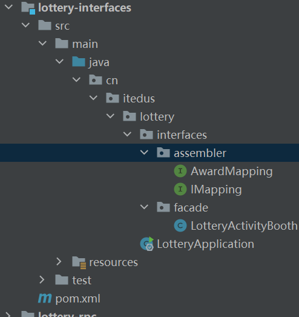
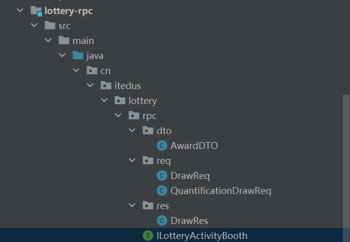

# 第14节：门面接口封装和对象转换


## 开发日志

* 补充 lottery-application 应用层对规则引擎的调用，添加接口方法 IActivityProcess#doRuleQuantificationCrowd

* 删掉 lottery-rpc 测试内容，新增加抽奖活动展台接口 ILotteryActivityBooth，并添加两个抽奖的接口方法，普通抽奖和量化人群抽奖。
* 开发 lottery-interfaces 接口层，对抽奖活动的封装，并对外提供抽奖服务


## 对象转换

&emsp;根据DDD设计的结构框架，在接口层和应用层需要做防污处理，也就是说不能直接把应用层、领域层的对象直接暴露处理，因为暴露出去可能会随着业务发展的过程中不断地添加各类字段，从而破坏领域结构，那么就需要增加一层对象转换，也就有了vo2dto、dto2vo的操作，单这些转换的字段基本都是重复的，在保证性能的情况下，一些高并发场景就只会选择手动编写get\set


## 功能开发


### 工程结构


* lottery-interfaces 是对lottery-rpc接口定义的具体实现，在rpc接口定义层还会出现DTO REQ RES对象
* lottery-interfaces包括facade门面接口  assembler对象转换操作

  


### rpc

  


#### AwardDTO

```java
package cn.itedus.lottery.rpc.dto;

import java.io.Serializable;
import java.util.Date;

/**
 * 奖品信息
 */
public class AwardDTO implements Serializable {

    /**
     * 用户ID
     */
    private String userId;


    /**
     * 活动ID
     */
    private Long activityId;


    /**
     * 奖品ID
     */
    private String awardId;


    /**
     * 奖品类型  文字描述  兑换码 优惠券  实物奖品
     */
    private  Integer awardType;

    /**
     * 奖品名称
     */
    private String awardName;


    /**
     * 奖品内容
     */
    private String awardContent;

    /**
     * 策略方式
     */
    private Integer strategyMode;


    /**
     * 发放奖品方式
     */

    private Integer grantType;


    /**
     * 发奖时间
     *
     */
    private Date grantDate;


    public String getUserId() {
        return userId;
    }

    public void setUserId(String userId) {
        this.userId = userId;
    }

    public Long getActivityId() {
        return activityId;
    }

    public void setActivityId(Long activityId) {
        this.activityId = activityId;
    }

    public String getAwardId() {
        return awardId;
    }

    public void setAwardId(String awardId) {
        this.awardId = awardId;
    }

    public Integer getAwardType() {
        return awardType;
    }

    public void setAwardType(Integer awardType) {
        this.awardType = awardType;
    }

    public String getAwardName() {
        return awardName;
    }

    public void setAwardName(String awardName) {
        this.awardName = awardName;
    }

    public String getAwardContent() {
        return awardContent;
    }

    public void setAwardContent(String awardContent) {
        this.awardContent = awardContent;
    }

    public Integer getStrategyMode() {
        return strategyMode;
    }

    public void setStrategyMode(Integer strategyMode) {
        this.strategyMode = strategyMode;
    }

    public Integer getGrantType() {
        return grantType;
    }

    public void setGrantType(Integer grantType) {
        this.grantType = grantType;
    }

    public Date getGrantDate() {
        return grantDate;
    }

    public void setGrantDate(Date grantDate) {
        this.grantDate = grantDate;
    }

    @Override
    public String toString() {
        return "AwardDTO{" +
                "userId='" + userId + '\'' +
                ", activityId=" + activityId +
                ", awardId='" + awardId + '\'' +
                ", awardType=" + awardType +
                ", awardName='" + awardName + '\'' +
                ", awardContent='" + awardContent + '\'' +
                ", strategyMode=" + strategyMode +
                ", grantType=" + grantType +
                ", grantDate=" + grantDate +
                '}';
    }
}


```

#### DrawReq

```java
package cn.itedus.lottery.rpc.req;

/**
 * 抽奖请求
 */
public class DrawReq {
    private String uId;// 用户id

    private Long activityId;// 活动ID

    public DrawReq() {
    }

    public DrawReq(String uId, Long activityId) {
        this.uId = uId;
        this.activityId = activityId;
    }

    public String getuId() {
        return uId;
    }

    public void setuId(String uId) {
        this.uId = uId;
    }

    public Long getActivityId() {
        return activityId;
    }

    public void setActivityId(Long activityId) {
        this.activityId = activityId;
    }
}


```

#### QuantificationDrawReq

```java
package cn.itedus.lottery.rpc.req;

import java.util.Map;

/**
 * 量化人群抽奖请求参数
 */
public class QuantificationDrawReq {

    private String uId;// 用户id

    private Long treeID;// 规则树Id


    private Map<String,Object> valMap;// 决策值

    public QuantificationDrawReq() {
    }

    public QuantificationDrawReq(String uId, Long treeID, Map<String, Object> valMap) {
        this.uId = uId;
        this.treeID = treeID;
        this.valMap = valMap;
    }

    public String getuId() {
        return uId;
    }

    public void setuId(String uId) {
        this.uId = uId;
    }

    public Long getTreeID() {
        return treeID;
    }

    public void setTreeID(Long treeID) {
        this.treeID = treeID;
    }

    public Map<String, Object> getValMap() {
        return valMap;
    }

    public void setValMap(Map<String, Object> valMap) {
        this.valMap = valMap;
    }
}


```

#### DrawRes


```java
package cn.itedus.lottery.rpc.res;

import cn.itedus.lottery.common.Result;
import cn.itedus.lottery.rpc.dto.AwardDTO;

import java.io.Serializable;

/**
 * 抽奖结果
 */
public class DrawRes extends Result implements Serializable {

    private AwardDTO awardDTO;

    public DrawRes(String code, String info) {
        super(code, info);
    }

    public AwardDTO getAwardDTO() {
        return awardDTO;
    }

    public void setAwardDTO(AwardDTO awardDTO) {
        this.awardDTO = awardDTO;
    }
}

```

#### ILotteryActivityBooth


```java
package cn.itedus.lottery.rpc;

import cn.itedus.lottery.rpc.req.DrawReq;
import cn.itedus.lottery.rpc.req.QuantificationDrawReq;
import cn.itedus.lottery.rpc.res.DrawRes;

/**
 * 抽奖活动展台接口
 */
public interface ILotteryActivityBooth {

    /**
     * 指定活动抽奖
     * @param drawReq  请求参数
     * @return  抽奖结果
     */
    DrawRes doDraw(DrawReq drawReq);

    /**
     * 量化人群抽奖
     * @param quantificationDrawReq  请求参数
     * @return  抽奖结果
     */
    DrawRes doQuantificationDraw(QuantificationDrawReq quantificationDrawReq);

}


```


## interfaces


### IMapping


* 该接口通过泛型<SOURCE,TARGET> 定义了元对象和目标对象的类型，并且提供了一系列的映射方法，包括单个对象的映射，集合的映射以及利用Java 8的Stream进行的集合流映射
* @MapperConfig 注解：这个注解用来定义映射器配置 标记在接口
* sourceToTarget:映射方法实现，将源对象SOURCE类型 映射到目标对象 TARGET类型  此方法特别指定了对createTime 字段进行格式化的配置 使用@Mapping注解的dateFormat属性来定义时间格式为""yyyy-MM-dd HH:mm:ss"
* targetToSource 方法用于执行反向映射，将目标对象Target类型映射回元对象SOURCE类型

```java
package cn.itedus.lottery.interfaces.assembler;


import org.mapstruct.InheritConfiguration;
import org.mapstruct.InheritInverseConfiguration;
import org.mapstruct.MapperConfig;
import org.mapstruct.Mapping;

import java.util.List;
import java.util.stream.Stream;

/**
 * 对象映射接口
 * @param <SOURCE>
 * @param <TARGET>
 */
@MapperConfig
public interface IMapping<SOURCE,TARGET> {

    /**
     * 映射同名属性
     * @param var1
     * @return
     */
    @Mapping(target = "createTime",dateFormat = "yyyy-MM-dd HH:mm:ss")
    TARGET sourceToTarget(SOURCE var1);


    /**
     * 映射同名属性  反向
     * @param var1  源头
     * @return  结果
     */
    @InheritInverseConfiguration(name = "sourceToTarget")
    SOURCE targetToSource(TARGET var1);

    /**
     * 映射同名属性 集合形式
     * @param var1
     * @return
     */
    @InheritConfiguration(name = "sourceToTarget")
    List<TARGET> sourceToTarget(List<SOURCE> var1);

    /**
     * 反向 映射同名属性  集合形式
     * @param var1
     * @return
     */
    @InheritConfiguration(name = "targetToSource")
    List<SOURCE> targetToSource(List<TARGET> var1);

    /**
     * 映射同名属性  集合流形式
     * @param stream
     * @return
     */
    List<TARGET> sourceToTarget(Stream<SOURCE> stream);

    /**
     * 反向 映射同名属性 集合流形式
     * @param stream
     * @return
     */
    List<SOURCE> targetToSource(Stream<TARGET> stream);
}


```


