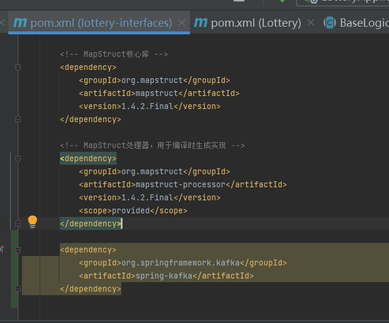
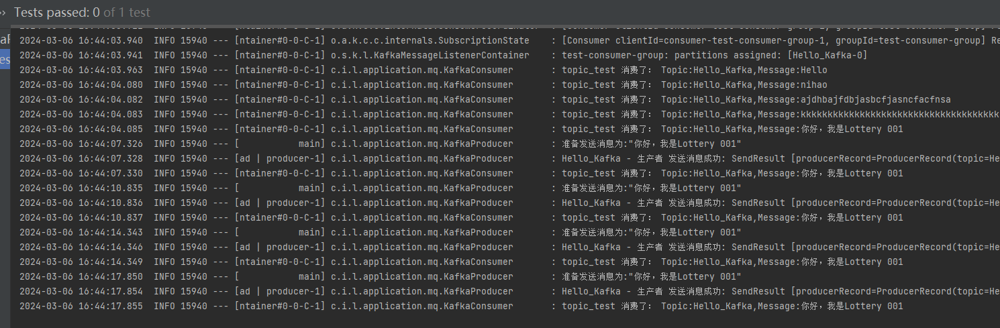
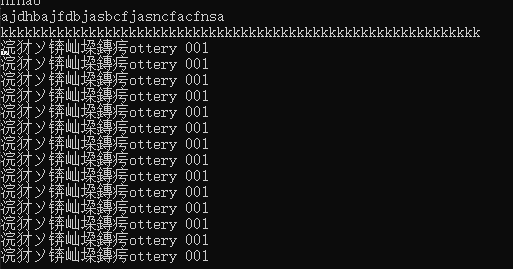

# 第15节：搭建MQ消息组件Kafka服务环境


## 概述


* 搭建MQ消息组件KafKa服务环境，并且整合到SpringBoot中，完成消息的生产和消费处理
* 消息组件也可以是RocketMq
* SpringBoot整合Kafka，验证消息的生产和消费


## Kafka 安装和配置


## 整合进入SpringBoot

* 在interfaces层引入kafka依赖

  


```xml
<dependency>
    <groupId>org.springframework.kafka</groupId>
    <artifactId>spring-kafka</artifactId>
</dependency>


```


* application.yml 配置 kafka


* BOOTstrap-servers: kafka集群的地址列表 用于初始化连接，指向本地机器上的默认Kafka端口
* retries：如果Kafka生产者在发送消息时候，它会重新发送消息的次数，这里设置为1意味着生产者会再尝试发送一次失败的消息
* batch_size:kafka生产者会将多个消息聚合一个批次来提高效率 这个设置定义一个批次可以使用的最大字节数
* buffer-memory:生产者用于缓存待发送消息的内存大小 允许生产者再暂时无法发送消息缓存
* key-serializer指定消息的序列化方式  字符串序列化
* ack:控制生产者请求确认的程度
* 


```XML

spring:
  kafka:
    bootstrap-servers: localhost:9092
    producer:
      # 发生错误后，消息重发的次数。
      retries: 1
      #当有多个消息需要被发送到同一个分区时，生产者会把它们放在同一个批次里。该参数指定了一个批次可以使用的内存大小，按照字节数计算。
      batch-size: 16384
      # 设置生产者内存缓冲区的大小。
      buffer-memory: 33554432
      # 键的序列化方式
      key-serializer: org.apache.kafka.common.serialization.StringSerializer
      # 值的序列化方式
      value-serializer: org.apache.kafka.common.serialization.StringSerializer
      # acks=0 ： 生产者在成功写入消息之前不会等待任何来自服务器的响应。
      # acks=1 ： 只要集群的首领节点收到消息，生产者就会收到一个来自服务器成功响应。
      # acks=all ：只有当所有参与复制的节点全部收到消息时，生产者才会收到一个来自服务器的成功响应。
      acks: 1
    consumer:
      # 自动提交的时间间隔 在spring boot 2.X 版本中这里采用的是值的类型为Duration 需要符合特定的格式，如1S,1M,2H,5D
      auto-commit-interval: 1S
      # 该属性指定了消费者在读取一个没有偏移量的分区或者偏移量无效的情况下该作何处理：
      # latest（默认值）在偏移量无效的情况下，消费者将从最新的记录开始读取数据（在消费者启动之后生成的记录）
      # earliest ：在偏移量无效的情况下，消费者将从起始位置读取分区的记录
      auto-offset-reset: earliest
      # 是否自动提交偏移量，默认值是true,为了避免出现重复数据和数据丢失，可以把它设置为false,然后手动提交偏移量
      enable-auto-commit: false
      # 键的反序列化方式
      key-deserializer: org.apache.kafka.common.serialization.StringDeserializer
      # 值的反序列化方式
      value-deserializer: org.apache.kafka.common.serialization.StringDeserializer
    listener:
      # 在侦听器容器中运行的线程数。
      concurrency: 5
      #listner负责ack，每调用一次，就立即commit
      ack-mode: manual_immediate
      missing-topics-fatal: false


```


## 生产者


* Spring Boot应用程序中配置和使用KafkaTemplate来发送消息到Kafka主题

```java
package cn.itedus.lottery.application.mq;


import com.alibaba.fastjson.JSON;
import org.slf4j.Logger;
import org.slf4j.LoggerFactory;
import org.springframework.kafka.core.KafkaTemplate;
import org.springframework.stereotype.Component;
import org.springframework.util.concurrent.ListenableFuture;
import org.springframework.util.concurrent.ListenableFutureCallback;
import org.springframework.kafka.support.SendResult;
import javax.annotation.Resource;


/**
 * 消息生产者
 */

@Component
public class KafkaProducer {
    private Logger logger = LoggerFactory.getLogger(KafkaProducer.class);

    @Resource
    private KafkaTemplate<String,Object> kafkaTemplate;

    public static final String TOPIC_TEST = "Hello_Kafka";// 我本地创建的一个Kafka主题

    public static final String TOPIC_GROUP = "test-consumer-group";


    public void send(Object obj){
        String obj2String = JSON.toJSONString(obj);
        logger.info("准备发送消息为:{}",obj2String);


        // 发送消息
        // ListenableFuture<SendResult<String, Object>>是异步发送操作的返回类型，它允许你添加回调来处理成功或失败的情况。


        ListenableFuture<SendResult<String,Object>> future = kafkaTemplate.send(TOPIC_TEST,obj);

        // 回调函数  处理失败的情况
        future.addCallback(new ListenableFutureCallback<SendResult<String, Object>>() {
            @Override
            public void onFailure(Throwable throwable) {
                // 发送失败的处理
                logger.info(TOPIC_TEST + " - 生产者 发送消息失败: " + throwable.getMessage());
            }

            @Override
            public void onSuccess(SendResult<String, Object> stringObjectSendResult) {
                // 成功的处理
                logger.info(TOPIC_TEST + " - 生产者 发送消息成功: " + stringObjectSendResult.toString());
            }
        });
    }
}


```

* 使用Resource注解，Spring会自动注入一个KafkaTemplate<String,Object> 该实例用于发送消息到Kafka
* TOPIC_TEST TOPIC_GROUP分别定义Kafka主题和消费者名称
* 发送消息send 将obj对象转换为json字符串 发给kafka
* kafkaTemplate.send(TOPIC_TEST,obj); 发送消息到指定的主题
* ListenableFuture<SendResult<String,Object>> 是异步发送操作的返回类型 允许添加回调处理成功或者失败情况


## 消费者


```java
package cn.itedus.lottery.application.mq;

import org.apache.kafka.clients.consumer.ConsumerRecord;
import org.slf4j.Logger;
import org.slf4j.LoggerFactory;
import org.springframework.kafka.annotation.KafkaListener;
import org.springframework.kafka.support.Acknowledgment;
import org.springframework.kafka.support.KafkaHeaders;
import org.springframework.messaging.handler.annotation.Header;
import org.springframework.stereotype.Component;

import java.util.Optional;

@Component
public class KafkaConsumer {

    private Logger logger = LoggerFactory.getLogger(KafkaConsumer.class);

    @KafkaListener(topics = KafkaProducer.TOPIC_TEST,groupId = KafkaProducer.TOPIC_GROUP)
    public void topicTest(ConsumerRecord<?, ?> record, Acknowledgment ack, @Header(KafkaHeaders.RECEIVED_TOPIC) String topic) {
        Optional<?> message = Optional.ofNullable(record.value());
        if (message.isPresent()) {
            Object msg = message.get();
            logger.info("topic_test 消费了： Topic:" + topic + ",Message:" + msg);
            ack.acknowledge();
        }
    }


}


```


## 测试

  

  

