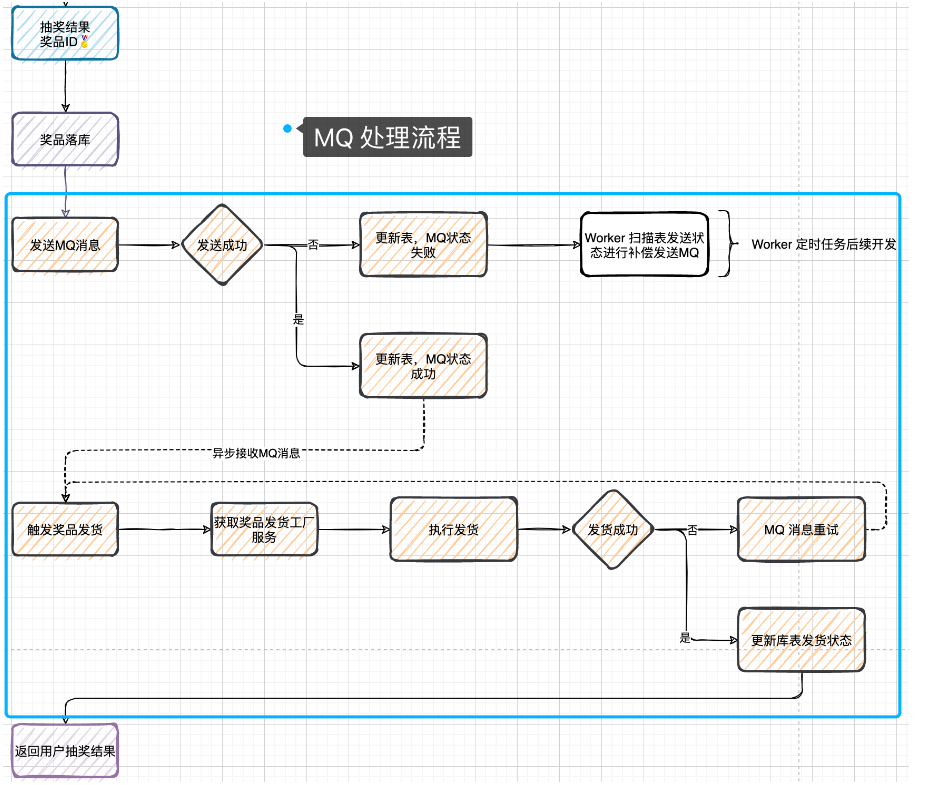
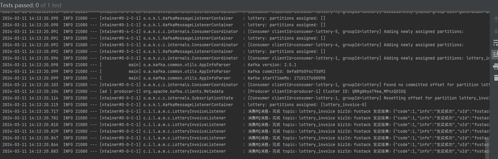

# 第16节：使用MQ解耦抽奖发货流程


## 使用MQ消息的特性，将用户抽奖到发货流程进行解耦，这个过程包括消息发送，库表中状态的更新，消息的接受消费，发将状态的处理等

## 开发日志

* 在数据库表user_strategy_export 添加字段mq_state 这个字段用于发送MQ成功更新库表状态，如果MQ消息发送失败则需要通过定时补偿MQ消息
* 启动KAFKA新增topic:lottery_invoice用于发货单消息，当抽奖完成之后则发送一个发货单，在异步处理发货流程，这个部分就是MQ的解耦流程使用
* 在ActivityProcessImpl # doDrawProcess活动抽奖流程编排中补全用户抽奖之后，发送MQ触达异步奖品发送的流程


## 创建主题（Topic）

* 启动zookeeper

* 启动kafka
```java
.\bin\windows\kafka-server-start.bat .\config\server.properties

```


* 创建一个MQ的主题

```java

 .\bin\windows\kafka-topics.bat --create --bootstrap-server localhost:9092--replication-factor 1 --partitions 1 MQ
```


## 流程

  

* 从用户发起抽奖到中奖之后开始 就是MQ处理发奖的流程
* 因为MQ消息的发送是不具备事务性的，也就是你在发送MQ可能会失败，哪怕成功率是很大，也有一定概率失败，所以在MQ发送完成之后需要知道是否发送成功，进行库表状态更新，如果发送失败则需使用worker来步长MQ发送
* 最后MQ发送完成到消费，也是可能有失败的，比如处理失败，更新库表失败，但是不无论是什么失败都需要保证MQ进行重试处理，而保证MQ消息重试的前提就是服务的幂等性，否则你在重试的过程中就造成了流程异常，比如更新次数多了 数据库插入多了 给用户发奖多了等


## MQ服务


&emsp;关于MQ的使用 无论是Kafka还是RocketMQ 基本方式都是类似的 一个生产消息 一个监听消息 

### 生产者


* Component注解表示这个类是一个spring组件，spring会自动检测并且管理
* 定义logger实例用于记录日志
* KafkaTemplate注入 使用Resouce注解自动注入KafkaTemplate<String,Object>实例，KafakaTemplate是Spring人提供的一个用于发送消息到Kafka的高级抽象类。泛型<String,Object> 指示键类型是String 值类型是Obejct
* 定义MQ主题
* 发送给消息kafkaTemplate.send 发送消息到kafka 返回一个异步处理结果

```java
@Component
public class KafkaProducer {

    private Logger logger = LoggerFactory.getLogger(KafkaProducer.class);

    @Resource
    private KafkaTemplate<String, Object> kafkaTemplate;

    /**
     * MQ主题：中奖发货单
     */
    public static final String TOPIC_INVOICE = "lottery_invoice";

    /**
     * 发送中奖物品发货单消息
     *
     * @param invoice 发货单
     */
    public ListenableFuture<SendResult<String, Object>> sendLotteryInvoice(InvoiceVO invoice) {
        String objJson = JSON.toJSONString(invoice);
        logger.info("发送MQ消息 topic：{} bizId：{} message：{}", TOPIC_INVOICE, invoice.getuId(), objJson);
        return kafkaTemplate.send(TOPIC_INVOICE, objJson);
    }

}


```

* 将所有的生产消息都放到KafkaProducer中 并对外提供一个可以发送MQ消息的方法
* 因为我们配置的类型转换为StringDeserializer 所以发送消息的方式是JSON字符串  当然 这个编解码器可以重写 满足其他类型数据

## 消费者

* Kafka的消息监听器
* onMessahe方法是消息消费的具体实现，接受三个参数
* 将消息内容转换为InvoiceVO对象 这是通过Json.parseObject实现的
* 通过distributionGoodsFactory.getDistributionGoodsService(invoiceVO.getAwardType());根据奖品类型获取相应的发奖服务，然后通过doDistribution方法进行奖品发放
* 使用Assert.isTrue校验发奖结果 确保发奖成功  否则抛出异常
* acknowledge手动确认消息

```java
package cn.itedus.lottery.application.mq.consumer;

import cn.hutool.core.lang.Assert;
import cn.itedus.lottery.common.Constants;
import cn.itedus.lottery.domain.activity.model.vo.InvoiceVO;
import cn.itedus.lottery.domain.award.model.req.GoodsReq;
import cn.itedus.lottery.domain.award.model.res.DistributionRes;
import cn.itedus.lottery.domain.award.service.factory.DistributionGoodsFactory;
import cn.itedus.lottery.domain.award.service.goods.IDistributionGoods;
import com.alibaba.fastjson.JSON;
import jdk.internal.org.jline.terminal.spi.JansiSupport;
import org.apache.kafka.clients.consumer.ConsumerRecord;
import org.slf4j.Logger;
import org.slf4j.LoggerFactory;
import org.springframework.kafka.annotation.KafkaListener;
import org.springframework.kafka.support.Acknowledgment;
import org.springframework.kafka.support.KafkaHeaders;
import org.springframework.messaging.handler.annotation.Header;
import org.springframework.stereotype.Component;

import javax.annotation.Resource;
import java.util.Optional;

/**
 * 中奖发货单监听消息
 */
@Component
public class LotteryInvoiceListener {

    private Logger logger = LoggerFactory.getLogger(LotteryInvoiceListener.class);

    @Resource
    private DistributionGoodsFactory distributionGoodsFactory;

    @KafkaListener(topics = "lottery_invoice",groupId = "lottery")
    public void onMessage(ConsumerRecord<?,?> record, Acknowledgment ack, @Header(KafkaHeaders.RECEIVED_TOPIC) String topic){
        Optional<?> message = Optional.ofNullable(record.value());

        // 判断消息是否存在
        if(!message.isPresent()){
            return;
        }

        // 处理MQ消息
        try{
            // 转化对象  将接收的json字符串转换为目标对象
            InvoiceVO invoiceVO = JSON.parseObject((String) message.get(),InvoiceVO.class);

            // 获取发送奖品呢工厂 执行发奖
            IDistributionGoods distributionGoodsService = distributionGoodsFactory.getDistributionGoodsService(invoiceVO.getAwardType());
            DistributionRes distributionRes = distributionGoodsService.doDistribution(new GoodsReq(invoiceVO.getuId(), invoiceVO.getOrderId(), invoiceVO.getAwardId(), invoiceVO.getAwardName(), invoiceVO.getAwardContent()));

            Assert.isTrue(Constants.AwardState.SUCCESS.getCode().equals(distributionRes.getCode()),distributionRes.getInfo());

            // 3. 打印日志
            logger.info("消费MQ消息，完成 topic：{} bizId：{} 发奖结果：{}", topic, invoiceVO.getuId(), JSON.toJSONString(distributionRes));

            // 4. 消息消费完成
            ack.acknowledge();

        }  catch (Exception e) {
        // 发奖环节失败，消息重试。所有到环节，发货、更新库，都需要保证幂等。
        logger.error("消费MQ消息，失败 topic：{} message：{}", topic, message.get());
        throw e;
    }
    }

}


```
* 每一个MQ消息的消费都会有一个对应的xxxListener来处理消息体，如果您使用一些其他的Mq可能会看到一些抽象类来处理MQ消息集合
* 在这个LotteryInvoiceListener消息监听类中 **主要就是通过消息中的发奖类型获取到对应的奖品发货工厂，处理奖品的发奖操作**


## 抽奖流程解耦

* 调用kafkaProducer.sendLotteryInvoice 发送一个中奖结果的发货单
* 消息发送完毕后进行回调处理，更新数据库中MQ发送的状态，如果有MQ发送失败则更新数据库mq_state = 2 这里还有可能在更新库表状态的时候失败，但是这些都会被worker补偿处理掉
* 现在从用户领取活动 执行抽奖 结果落库 到发送MQ处理之后流程就解耦，用户只需要知道自己中奖了  但是发奖到货是可以等待的，毕竟发送虚拟奖品的等待时间并不会很长

```java
package cn.itedus.lottery.application.process.impl;

import cn.itedus.lottery.application.mq.producer.KafkaProducer;
import cn.itedus.lottery.application.process.IActivityProcess;
import cn.itedus.lottery.application.process.req.DrawProcessReq;
import cn.itedus.lottery.application.process.res.DrawProcessResult;
import cn.itedus.lottery.application.process.res.RuleQuantificationCrowdResult;
import cn.itedus.lottery.common.Constants;
import cn.itedus.lottery.common.Result;
import cn.itedus.lottery.domain.activity.model.req.PartakeReq;
import cn.itedus.lottery.domain.activity.model.res.PartakeResult;
import cn.itedus.lottery.domain.activity.model.vo.DrawOrderVO;
import cn.itedus.lottery.domain.activity.model.vo.InvoiceVO;
import cn.itedus.lottery.domain.activity.service.partake.IActivityPartake;
import cn.itedus.lottery.domain.rule.model.req.DecisionMatterReq;
import cn.itedus.lottery.domain.rule.model.res.EngineResult;
import cn.itedus.lottery.domain.rule.service.engine.EngineFilter;
import cn.itedus.lottery.domain.strategy.model.req.DrawReq;
import cn.itedus.lottery.domain.strategy.model.res.DrawResult;
import cn.itedus.lottery.domain.strategy.model.vo.DrawAwardInfo;
import cn.itedus.lottery.domain.strategy.model.vo.DrawAwardVO;
import cn.itedus.lottery.domain.strategy.service.draw.IDrawExec;
import cn.itedus.lottery.domain.support.ids.IIdGenerator;
import org.apache.tomcat.util.bcel.Const;
import org.springframework.kafka.support.SendResult;
import org.springframework.stereotype.Service;
import org.springframework.util.concurrent.ListenableFuture;
import org.springframework.util.concurrent.ListenableFutureCallback;

import javax.annotation.Resource;

import java.util.Map;
import java.util.Scanner;


@Service
public class ActivityProcessImpl implements IActivityProcess {

    @Resource
    private IActivityPartake activityPartake;

    @Resource
    private IDrawExec drawExec;// 执行抽奖的接口

//    从容器中加载过滤器资源
    @Resource(name = "ruleEngineHandle")
    private EngineFilter engineFilter;

    @Resource
    private Map<Constants.Ids, IIdGenerator> idGeneratorMap;// 生成id


    @Resource
    private KafkaProducer kafkaProducer;

    public ActivityProcessImpl() {
    }

    @Override
    public DrawProcessResult doDrawProcess(DrawProcessReq req) {
        // 领取活动
        PartakeResult partakeResult = activityPartake.doPartake(new PartakeReq(req.getuId(),req.getActivityId()));

        if(!Constants.ResponseCode.SUCCESS.getCode().equals(partakeResult.getCode())){
            // 如果领取活动没有成功的话  重新执行一次
            return  new DrawProcessResult(partakeResult.getCode(),partakeResult.getInfo());
        }

        Long strategyId = partakeResult.getStrategyId();//获取活动的策略
        Long takeId = partakeResult.getTakeId();// 获取领取活动的记录ID

        // 执行抽奖  传入参数  用户id + 策略ID + 活动领取的ID
        DrawResult drawResult = drawExec.doDrawExec(new DrawReq(req.getuId(),strategyId,String.valueOf(takeId)));

        if(Constants.DrawState.FAIL.getCode().equals(drawResult.getDrawState())){
//            如果抽奖结果没有 再次执行一遍
            return new DrawProcessResult(Constants.ResponseCode.LOSING_DRAW.getCode(), Constants.ResponseCode.LOSING_DRAW.getInfo());
        }
        DrawAwardVO drawAwardInfo = drawResult.getDrawAwardVO();//  获取奖品信息

        // 结果落库
        DrawOrderVO drawOrderVO = buildDrawOrderVO(req,strategyId,takeId,drawAwardInfo);// 包装奖品订单信息
        Result recordResult = activityPartake.recordDrawOrder(drawOrderVO);// 记录中奖订单号  保存进入数据库中
        if(!Constants.ResponseCode.SUCCESS.getCode().equals(recordResult.getCode())){
            return new DrawProcessResult(recordResult.getCode(),recordResult.getInfo());
        }

//        activityPartake.recordDrawOrder(buildDrawOrderVO(req,strategyId,takeId,drawAwardInfo));

        // 发送MQ 触发发奖流程
        InvoiceVO invoiceVO = buildInvoiceVO(drawOrderVO);
        ListenableFuture<SendResult<String,Object>> future = kafkaProducer.sendLotteryInvoice(invoiceVO);// 生产者发送消息

        future.addCallback(new ListenableFutureCallback<SendResult<String, Object>>() {
            @Override
            public void onFailure(Throwable throwable) {
                // 如果MQ发送消息失败  更新数据库表  主要是更新状态关键字
                activityPartake.updateInvoiceMqState(invoiceVO.getuId(),invoiceVO.getOrderId(),Constants.MQState.COMPLETE.getCode());
            }

            @Override
            public void onSuccess(SendResult<String, Object> stringObjectSendResult) {
                activityPartake.updateInvoiceMqState(invoiceVO.getuId(),invoiceVO.getOrderId(),Constants.MQState.FAIL.getCode());
            }
        });


        // 返回结果
        return new DrawProcessResult(Constants.ResponseCode.SUCCESS.getCode(), Constants.ResponseCode.SUCCESS.getInfo(),drawAwardInfo);
    }

    @Override
    public RuleQuantificationCrowdResult doRuleQuantificationCrowd(DecisionMatterReq req) {
        // 量化决策
        EngineResult engineResult = engineFilter.process(req);

        if(!engineResult.isSuccess()){
            return new RuleQuantificationCrowdResult(Constants.ResponseCode.RULE_ERR.getCode(), Constants.ResponseCode.RULE_ERR.getInfo());
        }

        // 封装结果
        RuleQuantificationCrowdResult ruleQuantificationCrowdResult = new RuleQuantificationCrowdResult(Constants.ResponseCode.SUCCESS.getCode(), Constants.ResponseCode.SUCCESS.getInfo());
        ruleQuantificationCrowdResult.setActivityId(Long.valueOf(engineResult.getNodeValue()));// 封装 活动号

        return ruleQuantificationCrowdResult;
    }

    private DrawOrderVO buildDrawOrderVO(DrawProcessReq req, Long strategyId, Long takeId, DrawAwardVO drawAwardInfo) {
        long orderId = idGeneratorMap.get(Constants.Ids.SnowFlake).nextId();
        DrawOrderVO drawOrderVO = new DrawOrderVO();
        drawOrderVO.setuId(req.getuId());
        drawOrderVO.setTakeId(takeId);
        drawOrderVO.setActivityId(req.getActivityId());
        drawOrderVO.setOrderId(orderId);
        drawOrderVO.setStrategyId(strategyId);
        drawOrderVO.setStrategyMode(drawAwardInfo.getStrategyMode());
        drawOrderVO.setGrantType(drawAwardInfo.getGrantType());
        drawOrderVO.setGrantDate(drawAwardInfo.getGrantDate());
        drawOrderVO.setGrantState(Constants.GrantState.INIT.getCode());
        drawOrderVO.setAwardId(drawAwardInfo.getAwardId());
        drawOrderVO.setAwardType(drawAwardInfo.getAwardType());
        drawOrderVO.setAwardName(drawAwardInfo.getAwardName());
        drawOrderVO.setAwardContent(drawAwardInfo.getAwardContent());
        return drawOrderVO;
    }

    /**
     * 将中奖订单号的信息 保存成MQ消息对象 然后发送出去
     * @param drawOrderVO
     * @return
     */
    private  InvoiceVO buildInvoiceVO(DrawOrderVO drawOrderVO){
        InvoiceVO invoiceVO = new InvoiceVO();
        invoiceVO.setuId(drawOrderVO.getuId());
        invoiceVO.setOrderId(drawOrderVO.getOrderId());
        invoiceVO.setAwardId(drawOrderVO.getAwardId());
        invoiceVO.setAwardType(drawOrderVO.getAwardType());
        invoiceVO.setAwardName(drawOrderVO.getAwardName());
        invoiceVO.setAwardContent(drawOrderVO.getAwardContent());
        invoiceVO.setShippingAddress(null);
        invoiceVO.setExtInfo(null);
        return invoiceVO;
    }

}


```


## 测试


测试之前需要开启 Kafka 服务

* 启动zookeeper zkserver
* 启动kafka: .\bin\windows\kafka-server-start.bat .\config\server.properties
* 创建主题： .\bin\windows\kafka-topics.bat --create --bootstrap-server localhost:9092--replication-factor 1 --partitions 1 lottery_invoice


### 单元测试 发送消息

```java

@Test
public void test_send() throws InterruptedException {
    InvoiceVO invoice = new InvoiceVO();
    invoice.setuId("fustack");
    invoice.setOrderId(1444540456057864192L);
    invoice.setAwardId("3");
    invoice.setAwardType(Constants.AwardType.DESC.getCode());
    invoice.setAwardName("Code");
    invoice.setAwardContent("苹果电脑");
    invoice.setShippingAddress(null);
    invoice.setExtInfo(null);
    kafkaProducer.sendLotteryInvoice(invoice);

    while (true){
        Thread.sleep(10000);
    }
}

```
  


