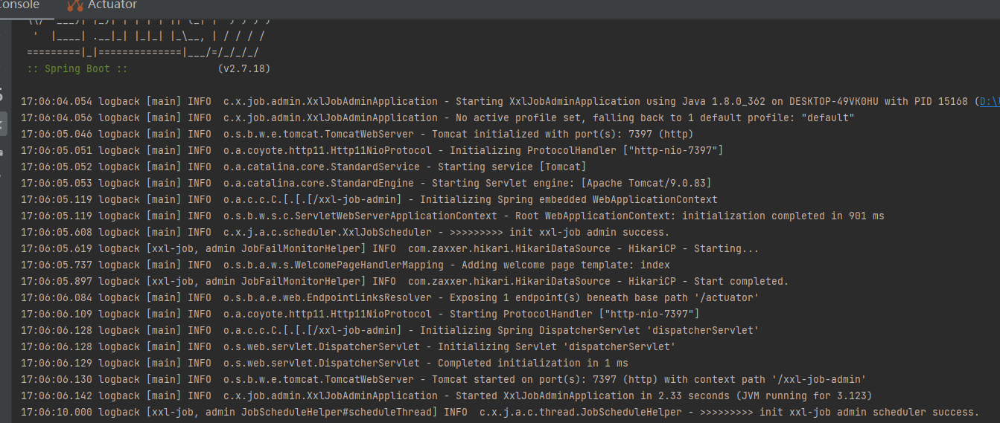
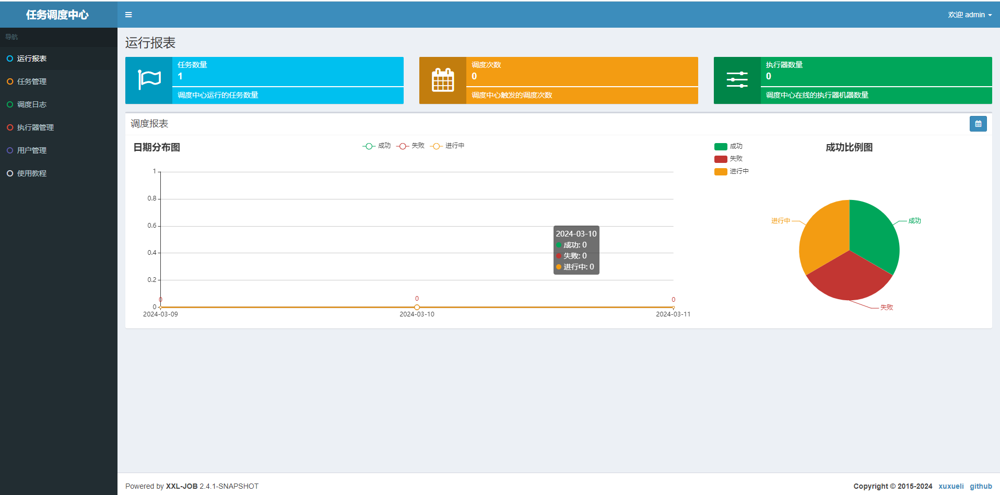
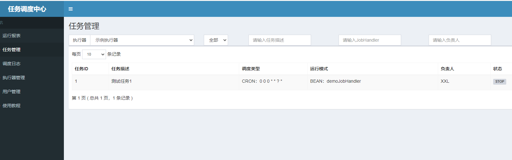

# 第17节：引入xxl job处理活动状态扫描

## 概述

* 搭建 XXL-JOB 分布式任务调度环境，这里需要在官网：https://github.com/xuxueli/xxl-job/ 下载运行包，按照 Java SpringBoot 修改一些基本配置，项目启动即可。
* 配置 XXL-JOB 的基础使用环境，导入库表、配置文件、验证官网管理，测试任务启动运行
* **解决第一个分布式任务场景问题，扫描抽奖活动状态，把审核通过的活动扫描为活动中，把已经过期活动中的状态扫描为关闭**

## 搭建分布式任务调度环境(XXL-JOB)
### 系统简介

* XXL-JOB是一个分布式任务调度平台，其核心设计目标是开发迅速、学习简单、轻量级、易扩展。现已开放源代码并接入多家公司线上产品线，开箱即用

### 分布式任务调度

* 任务分配：分布式任务调度系统会根据预设的规则或者动态的资源使用情况，将任务分配给不同的节点执行
* 负载均衡：为了防止某些节点过载而其他节点空闲，分布式任务调度系统需要实现负载均衡，确保每个节点的负载相对平衡，从而提高整体系统的运行效率
* 容错处理：再分布式系统中，节点因为硬件故障、网络等问题原因发生故障。任务调度系统需要具备容错能力，能够在节点或者任务失败的时候 迅速将任务迁移到其他健康的节点上面执行
* 资源管理：分布式任务调度系统需要对各个节点的计算资源进行管理
* 调度策略：调度策略是分布式任务调度中的核心，包括静态调度和动态调度


### 功能


1、简单：支持通过Web页面对任务进行CRUD操作，操作简单，一分钟上手；
2、动态：支持动态修改任务状态、启动/停止任务，以及终止运行中任务，即时生效；
3、调度中心HA（中心式）：调度采用中心式设计，“调度中心”自研调度组件并支持集群部署，可保证调度中心HA；
4、执行器HA（分布式）：任务分布式执行，任务"执行器"支持集群部署，可保证任务执行HA；
5、注册中心: 执行器会周期性自动注册任务, 调度中心将会自动发现注册的任务并触发执行。同时，也支持手动录入执行器地址；
6、弹性扩容缩容：一旦有新执行器机器上线或者下线，下次调度时将会重新分配任务；
7、触发策略：提供丰富的任务触发策略，包括：Cron触发、固定间隔触发、固定延时触发、API（事件）触发、人工触发、父子任务触发；
8、调度过期策略：调度中心错过调度时间的补偿处理策略，包括：忽略、立即补偿触发一次等；
9、阻塞处理策略：调度过于密集执行器来不及处理时的处理策略，策略包括：单机串行（默认）、丢弃后续调度、覆盖之前调度；
10、任务超时控制：支持自定义任务超时时间，任务运行超时将会主动中断任务；
11、任务失败重试：支持自定义任务失败重试次数，当任务失败时将会按照预设的失败重试次数主动进行重试；其中分片任务支持分片粒度的失败重试；
12、任务失败告警；默认提供邮件方式失败告警，同时预留扩展接口，可方便的扩展短信、钉钉等告警方式；
13、路由策略：执行器集群部署时提供丰富的路由策略，包括：第一个、最后一个、轮询、随机、一致性HASH、最不经常使用、最近最久未使用、故障转移、忙碌转移等；
14、分片广播任务：执行器集群部署时，任务路由策略选择"分片广播"情况下，一次任务调度将会广播触发集群中所有执行器执行一次任务，可根据分片参数开发分片任务；
15、动态分片：分片广播任务以执行器为维度进行分片，支持动态扩容执行器集群从而动态增加分片数量，协同进行业务处理；在进行大数据量业务操作时可显著提升任务处理能力和速度。
16、故障转移：任务路由策略选择"故障转移"情况下，如果执行器集群中某一台机器故障，将会自动Failover切换到一台正常的执行器发送调度请求。
17、任务进度监控：支持实时监控任务进度；
18、Rolling实时日志：支持在线查看调度结果，并且支持以Rolling方式实时查看执行器输出的完整的执行日志；
19、GLUE：提供Web IDE，支持在线开发任务逻辑代码，动态发布，实时编译生效，省略部署上线的过程。支持30个版本的历史版本回溯。
20、脚本任务：支持以GLUE模式开发和运行脚本任务，包括Shell、Python、NodeJS、PHP、PowerShell等类型脚本;
21、命令行任务：原生提供通用命令行任务Handler（Bean任务，"CommandJobHandler"）；业务方只需要提供命令行即可；
22、任务依赖：支持配置子任务依赖，当父任务执行结束且执行成功后将会主动触发一次子任务的执行, 多个子任务用逗号分隔；
23、一致性：“调度中心”通过DB锁保证集群分布式调度的一致性, 一次任务调度只会触发一次执行；
24、自定义任务参数：支持在线配置调度任务入参，即时生效；
25、调度线程池：调度系统多线程触发调度运行，确保调度精确执行，不被堵塞；
26、数据加密：调度中心和执行器之间的通讯进行数据加密，提升调度信息安全性；
27、邮件报警：任务失败时支持邮件报警，支持配置多邮件地址群发报警邮件；
28、推送maven中央仓库: 将会把最新稳定版推送到maven中央仓库, 方便用户接入和使用;
29、运行报表：支持实时查看运行数据，如任务数量、调度次数、执行器数量等；以及调度报表，如调度日期分布图，调度成功分布图等；
30、全异步：任务调度流程全异步化设计实现，如异步调度、异步运行、异步回调等，有效对密集调度进行流量削峰，理论上支持任意时长任务的运行；
31、跨语言：调度中心与执行器提供语言无关的 RESTful API 服务，第三方任意语言可据此对接调度中心或者实现执行器。除此之外，还提供了 “多任务模式”和“httpJobHandler”等其他跨语言方案；
32、国际化：调度中心支持国际化设置，提供中文、英文两种可选语言，默认为中文；
33、容器化：提供官方docker镜像，并实时更新推送dockerhub，进一步实现产品开箱即用；
34、线程池隔离：调度线程池进行隔离拆分，慢任务自动降级进入"Slow"线程池，避免耗尽调度线程，提高系统稳定性；
35、用户管理：支持在线管理系统用户，存在管理员、普通用户两种角色；
36、权限控制：执行器维度进行权限控制，管理员拥有全量权限，普通用户需要分配执行器权限后才允许相关操作；


##  基础配置

下载：2.3.0

打开：使用 IDEA 打开下载的 xxl-job
导表：把 xxl-job 中的 doc\db\tables_xxl_job.sql 导入到自己的数据库中
启动：xxl-job-admin 是用于管理分布式任务调度的后台，一切配置完后，启动 xxl-job-admin 另外你需要配置 application.properties 修改数据库链接参数和日志文件夹
案例：xxl-job-executor-samples 是一组job任务案例，运行后可以在分布式任务调度后台管理任务，配置、启动、关闭
核心：xxl-job-core
**修改数据库连接以及端口号**

## 启动服务(xxl-job-admin)

* 启动前检查好application.properties中的端口号 我设置为7397
* 确保数据库表已经初始化完成 并且修改application.properties中数据库连接信息
* 修改logback.xml日志打印目录，否则日志找不到会报错

## 执行启动 

  

```java
@SpringBootApplication
public class XxlJobAdminApplication {

	public static void main(String[] args) {
        SpringApplication.run(XxlJobAdminApplication.class, args);
	}

}


```


## 访问页面


* 地址：http://localhost:`7397`/xxl-job-admin 我修改端口为7397了，你按照自己的端口就可以

* 账号：admin
* 密码：123456

  

* 这个就是 xxl-job 的任务调度后台，你可以在这里查看和配置任务。如果有一些特殊的功能需要使用，可以查看官网文档


## 启动任务

* 当任务调度后台启动后，则可以启动测试任务，这样就可以通过任务调度后来管理任务了

```java
@Component
public class SampleXxlJob {

    private Logger logger = LoggerFactory.getLogger(SampleXxlJob.class);

    /**
     * 1、简单任务示例（Bean模式）
     */
    @XxlJob("demoJobHandler")
    public void demoJobHandler() throws Exception {
        logger.info("XXL-JOB, Hello World.");

        for (int i = 0; i < 5; i++) {
            XxlJobHelper.log("beat at:" + i);
            TimeUnit.SECONDS.sleep(2);
        }
        // default success
    }

}


```


```java
package com.xxl.job.executor;

import org.springframework.boot.SpringApplication;
import org.springframework.boot.autoconfigure.SpringBootApplication;

/**
 * @author xuxueli 2018-10-28 00:38:13
 */
@SpringBootApplication
public class XxlJobExecutorApplication {

	public static void main(String[] args) {
        SpringApplication.run(XxlJobExecutorApplication.class, args);
	}

}

```


## 查看任务


```java
http://localhost:7397/xxl-job-admin/jobinfo?jobGroup=1

```

  


* 在任务管理中 可以新增任务 并且配置任务的执行时间 以及测试等功能


## 执行器管理


* 所有的任务配置，都需要先配置执行器，也就是你哪个应用实例执行任务。
* 每一个执行器下就会对应一组带执行的 job 任务，来完成我们自己的任务调度。


## 任务扫描活动状态


### 引入POM


```java
<dependency>
    <groupId>com.xuxueli</groupId>
    <artifactId>xxl-job-core</artifactId>
    <version>2.3.0</version>
</dependency>


```
* 把需要使用 xxl-job 的包，引入对应的 POM 配置
* 同时需要将xxl-job直接打包成jar包


### 配置 application.yml


```yml
xxl:
  job:
    admin:
      addresses: http://127.0.0.1:7397/xxl-job-admin
    executor:
      address:
      appname: lottery-job
      ip:
      port: 9999
      logpath: /Users/fuzhengwei/itstack/data/applogs/xxl-job/jobhandler
      logretentiondays: 50
    accessToken:


```


* 配置中主要包括你的服务地址，应用名称、日志路径等


### 任务初始类

* 这里需要启动一个任务执行器  通过配置@Bean对象的方式交给Spring进行管理

```java
package cn.itedus.lottery.application.worker;


import com.xxl.job.core.executor.impl.XxlJobSpringExecutor;
import org.slf4j.Logger;
import org.slf4j.LoggerFactory;
import org.springframework.beans.factory.annotation.Value;
import org.springframework.context.annotation.Configuration;

/**
 * xxl-job 分布式任务调度的配置类
 * 将yml中的配置 写成Bean 交给Spring进行管理  @Value进行读取
 */
@Configuration
public class LotteryXxlJobConfig {

    private Logger logger = LoggerFactory.getLogger(LotteryXxlJobConfig.class);

    @Value("${xxl.job.admin.addresses}")
    private  String adminAddresses;

    @Value("${xxl.job.accessToken}")
    private  String accessToken;

    @Value("{xxl.job.executor.appname}")
    private String appname;

    @Value("{xxl.job.executor.address}")
    private String address;


    @Value("{xxl.job.executor.ip}")
    private String ip;

    @Value("{xxl.job.executor.port}")
    private int port;

    @Value("{xxl.job.executor.logpath}")
    private String logPath;

    @Value("{xxl.job.executor.logretentiondays}")
    private int logRetentionDays;


    // 构造器 声明为Bean资源  导入之前将xxl-job 打包成Jar包
    public XxlJobSpringExecutor xxlJobExecutor() {
        logger.info(">>>>>>>>>>> xxl-job config init.");

        XxlJobSpringExecutor xxlJobSpringExecutor = new XxlJobSpringExecutor();
        xxlJobSpringExecutor.setAdminAddresses(adminAddresses);
        xxlJobSpringExecutor.setAppname(appname);
        xxlJobSpringExecutor.setAddress(address);
        xxlJobSpringExecutor.setIp(ip);
        xxlJobSpringExecutor.setPort(port);
        xxlJobSpringExecutor.setAccessToken(accessToken);
        xxlJobSpringExecutor.setLogPath(logPath);
        xxlJobSpringExecutor.setLogRetentionDays(logRetentionDays);

        return xxlJobSpringExecutor;
    }


}


```


* 这段代码是一个用于XXL-JOB客户端的Java类，主要的功能是将应用程序中与XXL-JOB相关的配置项读取出来，并且初始化一个XXljOBsPRINGeXEXCITOR实例，这个实例用于XXL-JOB的调度中心进行通信，实现任务的分发和执行等功能
* Configuration表示这是一个配置类，目的是将application.yml文件中关于XXL-JOB配置的部分读取出来 并且以Bean资源的形式交给Spring容器进行管理
* 成员变量通过Value注解，类中的成员变量被赋值为对应配置文件中的值 包括adminAddress: XXL-JOB调度中心的地址
* accessToken:访问调度中心所需要的令牌
* appname address ip port 执行器的基本配置 包括应用名称 地址 IP和端口
* logPath 和logRetentionDays:日志存储的路径和日志保留的天数


* 构造方法xxlJobExecutor() 这个方法是关键 创建并且返回一个XxlJobSpringExecutor实例，这个实例是XXL-JOB客户端和调度中心交互的核心
* 在这个方法中 首先打印一条日志信息表示XXL-JOB的配置开始初始化
* 然后创建XXLJobSpringExecutor对象 并且使用前面通过Value注解读取的配置值对他进行配置
* 最后 返回这个配置好的XxlJobSpringExecutor实例


