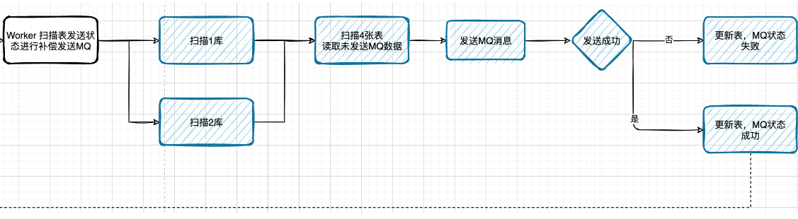
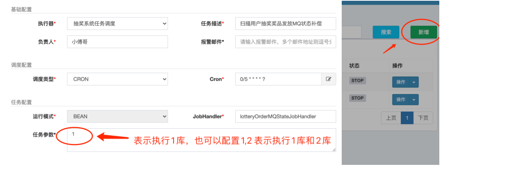
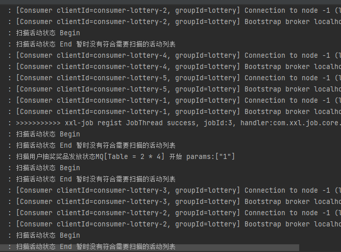
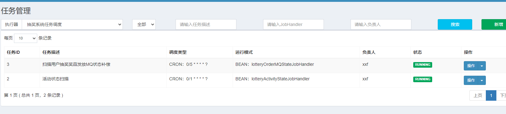

# 第18节：扫描库表补偿发货单MQ消息


## 概述

* 分布式任务调度，扫描抽奖发货单消息状态，对于未发送MQ或者发送失败的MQ，进行补偿发送处理

* 因为需要扫描库表，也就是循环的方式将每一个库下面的多张表中的每条用户记录都进行扫描，所以需要在分库分表组件中，提供出可以设置路由到的库和表，这样就可以满足扫描的动作
* 在application应用层下面的worker包LotteryXxlJob中，添加关于扫描库表补偿消息发送的任务，并在开发完成之后把任务配置到xxl-job任务调度后台中。


## 任务流程


  


* 我们的任务流程 完成的就是整个抽奖活动中 关于中奖结果落库后 进行MQ后 。 出现问题时，进行补偿消息发送处理的部分
* 在MQ消息补偿的过程中 会把发送失败的消息和迟迟没有发送的消息 都进行补偿 已保障全流程的可靠性


## 功能实现


### 路由组件提供必要方法


```JAVA
public interface IDBRouterStrategy {

    /**
     * 路由计算
     *
     * @param dbKeyAttr 路由字段
     */
    void doRouter(String dbKeyAttr);

    /**
     * 手动设置分库路由
     *
     * @param dbIdx 路由库，需要在配置范围内
     */
    void setDBKey(int dbIdx);

    /**
     * 手动设置分表路由
     *
     * @param tbIdx 路由表，需要在配置范围内
     */
    void setTBKey(int tbIdx);

    /**
     * 获取分库数
     *
     * @return 数量
     */
    int dbCount();

    /**
     * 获取分表数
     *
     * @return 数量
     */
    int tbCount();

    /**
     * 清除路由
     */
    void clear();

}

```


### 消息补偿任务


```java

package cn.itedus.lottery.application.worker;

import cn.bugstack.middleware.db.router.strategy.IDBRouterStrategy;
import cn.itedus.lottery.application.mq.producer.KafkaProducer;
import cn.itedus.lottery.common.Constants;
import cn.itedus.lottery.common.Result;
import cn.itedus.lottery.domain.activity.model.vo.ActivityVO;
import cn.itedus.lottery.domain.activity.model.vo.InvoiceVO;
import cn.itedus.lottery.domain.activity.service.deploy.IActivityDeploy;
import cn.itedus.lottery.domain.activity.service.partake.IActivityPartake;
import cn.itedus.lottery.domain.activity.service.stateflow.IStateHandler;
import com.alibaba.fastjson.JSON;
import com.xxl.job.core.context.XxlJobHelper;
import com.xxl.job.core.handler.annotation.XxlJob;
import org.slf4j.Logger;
import org.slf4j.LoggerFactory;
import org.springframework.kafka.support.SendResult;
import org.springframework.stereotype.Component;
import org.springframework.util.concurrent.ListenableFuture;
import org.springframework.util.concurrent.ListenableFutureCallback;

import javax.annotation.Resource;
import java.util.Date;
import java.util.List;

/**
 * @description: 抽奖业务，任务配置
 * @author: 小傅哥，微信：fustack
 * @date: 2021/11/6
 * @github: https://github.com/fuzhengwei
 * @Copyright: 公众号：bugstack虫洞栈 | 博客：https://bugstack.cn - 沉淀、分享、成长，让自己和他人都能有所收获！
 */
@Component
public class LotteryXxlJob {

    private Logger logger = LoggerFactory.getLogger(LotteryXxlJob.class);

    @Resource
    private IActivityDeploy activityDeploy;

    @Resource
    private IActivityPartake activityPartake;

    @Resource
    private IStateHandler stateHandler;

    @Resource
    private IDBRouterStrategy dbRouter;


    @Resource
    private KafkaProducer kafkaProducer;

    @XxlJob("lotteryActivityStateJobHandler")
    public void lotteryActivityStateJobHandler() throws Exception {
        logger.info("扫描活动状态 Begin");

        List<ActivityVO> activityVOList = activityDeploy.scanToDoActivityList(0L);
        if (activityVOList.isEmpty()) {
            logger.info("扫描活动状态 End 暂无符合需要扫描的活动列表");
            return;
        }

        while (!activityVOList.isEmpty()) {
            for (ActivityVO activityVO : activityVOList) {
                Integer state = activityVO.getState();
                switch (state) {
                    // 活动状态为审核通过，在临近活动开启时间前，审核活动为活动中。在使用活动的时候，需要依照活动状态核时间两个字段进行判断和使用。
                    case 4:
                        Result state4Result = stateHandler.doing(activityVO.getActivityId(), Constants.ActivityState.PASS);
                        logger.info("扫描活动状态为活动中 结果：{} activityId：{} activityName：{} creator：{}", JSON.toJSONString(state4Result), activityVO.getActivityId(), activityVO.getActivityName(), activityVO.getCreator());
                        break;
                    // 扫描时间已过期的活动，从活动中状态变更为关闭状态【这里也可以细化为2个任务来处理，也可以把时间判断放到数据库中操作】
                    case 5:
                        if (activityVO.getEndDateTime().before(new Date())) {
                            Result state5Result = stateHandler.close(activityVO.getActivityId(), Constants.ActivityState.DOING);
                            logger.info("扫描活动状态为关闭 结果：{} activityId：{} activityName：{} creator：{}", JSON.toJSONString(state5Result), activityVO.getActivityId(), activityVO.getActivityName(), activityVO.getCreator());
                        }
                        break;
                    default:
                        break;
                }
            }

            // 获取集合中最后一条记录，继续扫描后面10条记录
            ActivityVO activityVO = activityVOList.get(activityVOList.size() - 1);
            activityVOList = activityDeploy.scanToDoActivityList(activityVO.getId());
        }

        logger.info("扫描活动状态 End");

    }

    @XxlJob("lotteryOrderMQStateJobHandler")
    public void lotteryOrderMQStateJobHandler() throws Exception {
        // 验证参数
        String jobParam = XxlJobHelper.getJobParam();
        if (null == jobParam) {
            logger.info("扫描用户抽奖奖品发放MQ状态[Table = 2*4] 错误 params is null");
            return;
        }

        // 获取分布式任务配置参数信息 参数配置格式：1,2,3 也可以是指定扫描一个，也可以配置多个库，按照部署的任务集群进行数量配置，均摊分别扫描效率更高
        String[] params = jobParam.split(",");
        logger.info("扫描用户抽奖奖品发放MQ状态[Table = 2*4] 开始 params：{}", JSON.toJSONString(params));

        if (params.length == 0) {
            logger.info("扫描用户抽奖奖品发放MQ状态[Table = 2*4] 结束 params is null");
            return;
        }

        // 获取分库分表配置下的分表数
        int tbCount = dbRouter.tbCount();

        // 循环获取指定扫描库
        for (String param : params) {
            // 获取当前任务扫描的指定分库
            int dbCount = Integer.parseInt(param);

            // 判断配置指定扫描库数，是否存在
            if (dbCount > dbRouter.dbCount()) {
                logger.info("扫描用户抽奖奖品发放MQ状态[Table = 2*4] 结束 dbCount not exist");
                continue;
            }

            // 循环扫描对应表
            for (int i = 0; i < tbCount; i++) {

                // 扫描库表数据
                List<InvoiceVO> invoiceVOList = activityPartake.scanInvoiceMqState(dbCount, i);
                logger.info("扫描用户抽奖奖品发放MQ状态[Table = 2*4] 扫描库：{} 扫描表：{} 扫描数：{}", dbCount, i, invoiceVOList.size());

                // 补偿 MQ 消息
                for (InvoiceVO invoiceVO : invoiceVOList) {

                    ListenableFuture<SendResult<String, Object>> future = kafkaProducer.sendLotteryInvoice(invoiceVO);
                    future.addCallback(new ListenableFutureCallback<SendResult<String, Object>>() {

                        @Override
                        public void onSuccess(SendResult<String, Object> stringObjectSendResult) {
                            // MQ 消息发送完成，更新数据库表 user_strategy_export.mq_state = 1
                            activityPartake.updateInvoiceMqState(invoiceVO.getuId(), invoiceVO.getOrderId(), Constants.MQState.COMPLETE.getCode());
                        }

                        @Override
                        public void onFailure(Throwable throwable) {
                            // MQ 消息发送失败，更新数据库表 user_strategy_export.mq_state = 2 【等待定时任务扫码补偿MQ消息】
                            activityPartake.updateInvoiceMqState(invoiceVO.getuId(), invoiceVO.getOrderId(), Constants.MQState.FAIL.getCode());
                        }

                    });
                }
            }

        }

        logger.info("扫描用户抽奖奖品发放MQ状态[Table = 2*4] 完成 param：{}", JSON.toJSONString(params));

    }

}


```


```java
@Override
public List<InvoiceVO> scanInvoiceMqState(int dbCount, int tbCount) {
    try {
        // 设置路由
        dbRouter.setDBKey(dbCount);
        dbRouter.setTBKey(tbCount);
        // 查询数据
        return userTakeActivityRepository.scanInvoiceMqState();
    } finally {
        dbRouter.clear();
    }
}

```

* 另外这里有一点是关于分布式设计的思考，一般我们运行在线上的任务都是由多个实例共同完成，所以我们配置里面一个任务的参数，已经到达可以满足每一个任务实例只跑自己需要扫描的库表

## 任务配置


http://localhost:7397/xxl-job-admin/jobinfo


  


运行参数1 表示扫描数据库1 也可以配置1,2 表示执行1库和2库

* 在新增任务中，添加我们的扫描任务，注意这里有一个任务参数配置，用于配置这个任务负责扫描的库表，如果你希望一个任务只处理一个库表，可以在编写任务的时候，提供多个任务方法 ，方法实现内容只调用一份即可


## 测试验证


* 启动zookeeper kafka 可以直接部署在云服务器
* 启动xxl-job
* 启动lottery使用debug模式，方便验证
* 修改库表中，user_strategy_export_001~004 中任意一个表的MQ状态为2表示发送MQ失败

  


  


