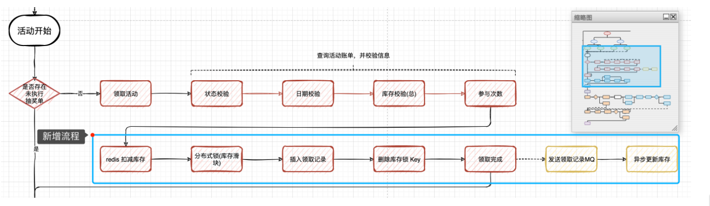

# 第19节：设计滑动库存分布式锁处理活动秒杀

## 概述

* 引入Redis到抽奖系统，设计颗粒度更细的滑动库存编号分布式锁，处理活动秒杀流程
* 本地搭建Redis环境
* 在抽奖系统中引入redis模块，优化用户参与抽奖活动，因为只要有大量的用户参与抽奖  那么这个就属于秒杀场景，所以需要使用redis分布式锁的方式来处理集中优化库存扣减的问题  否则在TPS达到1k-2k，就会把数据库拖垮
* 在设计秒杀流程的时候，优化所得颗粒度力度，不要把锁直接放到活动编号上面，这样在极端临界的情况下会出现秒杀解锁失败，导致库存剩余但不能下单的情况，所有需要增加所得颗粒度，以互动库存剩余编号的方式进行加锁，100001_1,100001_2,100001_3
* 增加缓存扣减库存之后，发送MQ消息进行异步更新数据库中活动库存，做最终数据一致性处理，这一部分如果你的系统并发体谅比较大，还需要把MQ的数据不要直接对库更新，而是更新到缓存中，再有任务最后阶段同步，以此来减少对数据库表的操作

## 扣减流程

  

* 优化活动领域，活动参与流程中的库存扣减操作，这部分我们原来是使用数据库行级锁处理的库存扣减，但是因为这会存在并发问题所有优化为Redis分布式锁进行处理
* 活动领取完成之后，其实这个时候只是把缓存的库存扣掉，，但是数据库中的库存并没有扣减，所以我们需要发送一个MQ消息，来对数据库中的库存进行处理，因为MQ可以消除峰值因此在降低MQ分片的情况下，消费效率有所下降，并不会对数据库造成压力，保证最终数据一致性即可，当然也可以使用定时任务来更新数据库库存

## 配置Redis云服务环境

