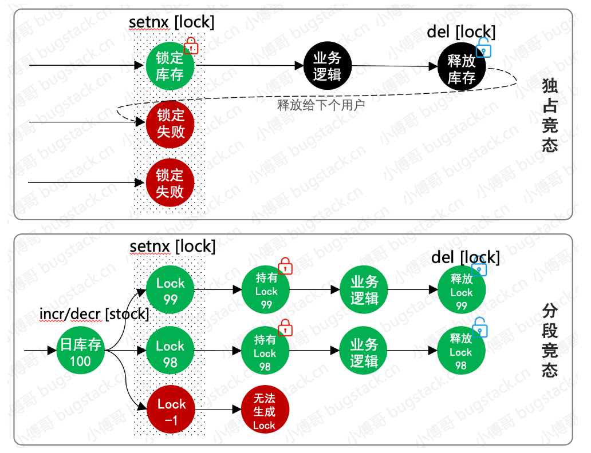

# 第19节：设计滑动库存分布式锁处理活动秒杀


## 概述

* 引入Redis到抽奖系统，设计颗粒度更细的滑动库存编号分布式锁，处理活动秒杀流程
* 本地搭建Redis环境
* 在抽奖系统中引入redis模块，优化用户参与抽奖活动，因为只要有大量的用户参与抽奖  那么这个就属于秒杀场景，所以需要使用redis分布式锁的方式来处理集中优化库存扣减的问题  否则在TPS达到1k-2k，就会把数据库拖垮
* 在设计秒杀流程的时候，优化所得颗粒度力度，不要把锁直接放到活动编号上面，这样在极端临界的情况下会出现秒杀解锁失败，导致库存剩余但不能下单的情况，所有需要增加所得颗粒度，以互动库存剩余编号的方式进行加锁，100001_1,100001_2,100001_3
* 增加缓存扣减库存之后，发送MQ消息进行异步更新数据库中活动库存，做最终数据一致性处理，这一部分如果你的系统并发体谅比较大，还需要把MQ的数据不要直接对库更新，而是更新到缓存中，再有任务最后阶段同步，以此来减少对数据库表的操作


## 扣减流程


  

* 优化活动领域，活动参与流程中的库存扣减操作，这部分我们原来是使用数据库行级锁处理的库存扣减，但是因为这会存在并发问题所有优化为Redis分布式锁进行处理
* 活动领取完成之后，其实这个时候只是把缓存的库存扣掉，，但是数据库中的库存并没有扣减，所以我们需要发送一个MQ消息，来对数据库中的库存进行处理，因为MQ可以消除峰值因此在降低MQ分片的情况下，消费效率有所下降，并不会对数据库造成压力，保证最终数据一致性即可，当然也可以使用定时任务来更新数据库库存

## 配置Redis云服务环境


* 直接本地安装redis


## 功能开发


### 滑块库存锁设计


  


**我们的目标是保证库存的正确性和一致性，即使在多用户并发操作的时候，同一件商品的库存不会被超卖，这通常涉及到在数据库层面上实现锁机制或者使用分布式锁，以避免并发写入导致的数据不一致问题**

* 设计思路
  * 获取库存所：在用户尝试扣减库存之前，首先尝试从redis中获取一个分布式锁，这个锁的key可以是商品ID，value可以是唯一表示UUID 以确保锁的唯一性
  * 扣减库存：一旦获取到锁 就查询数据库中的库存数量 如果库存充足 则扣减库存 并且更新数据库 
  * 释放库存所，操作完成之后  释放redis中的分布式锁 允许其他操作继续进行 


### 分布式锁的实现

* 在活动领域层的领取活动抽象类BaseActivityPartake添加方法  subtractionActivityStockByRedis、recoverActivityCacheStockByRedis,分别用户redis库存扣减和枷锁key的处理

## Redis实现的滑块库存锁的基本设计方案

* 原子操作：确保库存更新的操作是原子性的 避免在并发情况下发生数据不一致的问题
* 过期时间：给锁设置一个过期时间，以防止死锁的发生
* 重试机制：在无法获取锁，应设置一个合理的重试次数和等待时间，避免无限等待


* 库存锁定：当用户尝试下单的时候，系统首先尝试从Redis中锁定相应数量的库存
  * 使用SETNX或者SET命令 在redis中设置一个锁，其中键是商品的库存锁标识，值可以是锁定的数量，ex/px选项用于设置锁的过期时间
  * 如果锁设置成功，则继续执行后续的下单操作，如果锁没有设置失败，则重试逻辑，直到成功或达到最大重试次数
* 更新库存：在数据库中更新库存的时候 需要根据之前锁定的数量来减少库存
  * 更新库存的操作需要保证原子性 可以通过事务或者乐观锁来实现
  * 更新成功之后 释放redis的库存锁


## 独态竞态 分段竞态

* 独态竞态发生在多个线程或进程尝试同时访问共享资源时，而这些访问需要互斥（即在同一时间内只能由一个执行单元访问）才能保持数据的一致性和正确性。如果没有适当的同步机制（如互斥锁、信号量等）来控制对共享资源的访问，就可能导致数据不一致、丢失或被损坏
* 分段竞态涉及到多个线程或进程在没有适当同步的情况下，以不可预测的顺序执行操作的情况，这些操作分布在代码的不同段落中。它通常涉及对一系列步骤的执行，这些步骤需要按特定的顺序发生，但由于并发执行，导致实际执行顺序错乱

* 示例场景：考虑一个在线购物应用，其中包含两个步骤：1) 检查商品库存；2) 扣减库存并生成订单。如果两个用户几乎同时购买最后一个库存商品，而这个过程没有被适当同步（即两个步骤作为一个整体来同步执行），可能出现两个用户都检查到库存足够，但实际上库存只能满足一个用户的情况，导致超卖。


#### 库存扣减操作


```java
@Override
public StockResult subtractionActivityStockByRedis(String uId, Long activityId, Integer stockCount) {

    //  1. 获取抽奖活动库存 Key
    String stockKey = Constants.RedisKey.KEY_LOTTERY_ACTIVITY_STOCK_COUNT(activityId);
    
    // 2. 扣减库存，目前占用库存数
    Integer stockUsedCount = (int) redisUtil.incr(stockKey, 1);
    
    // 3. 超出库存判断，进行恢复原始库存
    if (stockUsedCount > stockCount) {
        redisUtil.decr(stockKey, 1);
        return new StockResult(Constants.ResponseCode.UN_ERROR.getCode(), Constants.ResponseCode.UN_ERROR.getInfo());
    }
    
    // 4. 以活动库存占用编号，生成对应加锁Key，细化锁的颗粒度
    String stockTokenKey = Constants.RedisKey.KEY_LOTTERY_ACTIVITY_STOCK_COUNT_TOKEN(activityId, stockUsedCount);
    
    // 5. 使用 Redis.setNx 加一个分布式锁
    boolean lockToken = redisUtil.setNx(stockTokenKey, 350L);
    if (!lockToken) {
        logger.info("抽奖活动{}用户秒杀{}扣减库存，分布式锁失败：{}", activityId, uId, stockTokenKey);
        return new StockResult(Constants.ResponseCode.UN_ERROR.getCode(), Constants.ResponseCode.UN_ERROR.getInfo());
    }
    return new StockResult(Constants.ResponseCode.SUCCESS.getCode(), Constants.ResponseCode.SUCCESS.getInfo(), stockTokenKey, stockCount - stockUsedCount);
}


```

* 代码中的注释就是整个操作流程  创建Key 占用库存 判断库存 以占用库存的编号作为加锁Key 调用setNx加一个分布式锁，最终完成整个秒杀扣减库存的动作


## 并发锁删除处理


```java
@Override
public void recoverActivityCacheStockByRedis(Long activityId, String tokenKey, String code) {
    // 删除分布式锁 Key
    redisUtil.del(tokenKey);
}

```

* 秒杀完毕之后，接下来的流程是用户记录落库，但是可能这个时候会发生失败的情况，因为需要在失败的时候回复缓存的库存，不过这个情况不是事务性的，因此可能会恢复失败，也就是保证不超卖，但是不能保证一定会完全消耗库存
* 如果最后的操作是成功的，那么正常删除掉这个加锁的key就可以了 因为下一个用户获取到的库存滑块又是新的

## 活动秒杀流程处理


* 在领取活动的模板方法中，优化掉原来直接使用数据库行级锁的流程，把 Redis 库存的扣减添加到这里。
* 扣减库存后，在各个以下的流程节点中，如果有流程失败则进行缓存库存的恢复操作。


## 发送MQ消息，处理数据一致性

* 由于我们使用 Redis 代替数据库库存，那么在缓存的库存处理后，还需要把数据库中的库存处理为和缓存一致，这样在后续运营这部分数据时才能保证一定的运营可靠性。


* MQ的发送 只发生在用户首次领取活动的时候  如果是已经领取活动但是因为抽奖等流程失败  二次进行此流程 则不会发送MQ消息

## 活动领取记录 MQ 消费

```java
@KafkaListener(topics = "lottery_activity_partake", groupId = "lottery")
public void onMessage(ConsumerRecord<?, ?> record, Acknowledgment ack, @Header(KafkaHeaders.RECEIVED_TOPIC) String topic) {
    Optional<?> message = Optional.ofNullable(record.value());
    // 1. 判断消息是否存在
    if (!message.isPresent()) {
        return;
    }
    // 2. 转化对象（或者你也可以重写Serializer<T>）
    ActivityPartakeRecordVO activityPartakeRecordVO = JSON.parseObject((String) message.get(), ActivityPartakeRecordVO.class);
    logger.info("消费MQ消息，异步扣减活动库存 message：{}", message.get());
    
    // 3. 更新数据库库存
    activityPartake.updateActivityStock(activityPartakeRecordVO);
}


```

* 消费MQ消息的流程比较简单，接收到MQ进行更新数据库处理即可，这里更新数据库并不是直接对数据库进行库存扣减操作，而是把缓存拿到的库存最新镜像更新到数据库中
* 更新数据库哭粗  实际场景业务体量较大 可能也会由于MQ消费引起并发 对数据库产生压力 所以如果并发量较大  可以把库存记录缓存中  并使用定时任务进行处理缓存和数据库库存同步  减少对数据库操作次数


