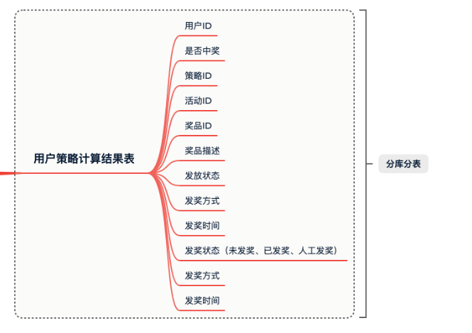

# 面试抽奖系统

## 项目总体介绍

## 技术

技术：JDK 1.8、SpringBoot、Mybatis、Dubbo、MQ、Redis、Mysql、ELK、分库分表、Otter、vue、微信公众号、Docker
架构：DDD 领域驱动设计、充血模型、设计模式
规范：分支提交规范、代码编写规范

## 技术框架

  

## 数据库表的设计

* 抽奖系统作为营销活动平台中的一个环节，承接着活动玩法、积分消耗、奖品发放等系统的纽带，帮助整个业务完成用户的活跃
* 对应系统的具体实现上要拆分出；活动、算法、规则、策略、用户、订单等领域。
* 根据领域驱动中对各个模块的定义，设计数据库表，也就对应了活动表、抽奖策略配置表、准入规则引擎表、用户抽奖单记录表、以及配合这些表数据结构运行的其他表，如：记录用户的参与次数等。

## DDD与MVC

* MVC：更偏向与数据建模实现，由数据调用驱动，所以也就引申出的DAO、PO、VO类会随着项目开发不断的膨胀，不易于迭代和维护。
* DDD：以业务流程提炼领域模型为驱动，设计和实现模块开发，在一个领域中包含mode对象、仓储数据、服务实现，也更注重设计模式的使用，否则实现的DDD徒有其表更多的只是归类了 DAO、PO、VO 对象。

## 抽奖活动策略库表设计

  

  

  

  

* 活动配置，activity：提供活动的基本配置
* 策略配置，strategy：用于配置抽奖策略，概率、玩法、库存、奖品
* 策略明细，strategy_detail：抽奖策略的具体明细配置
* 奖品配置，award：用于配置具体可以得到的奖品
* 用户参与活动记录表，user_take_activity：每个用户参与活动都会记录下他的参与信息，时间、次数
* 用户活动参与次数表，user_take_activity_count：用于记录当前参与了多少次
* 用户策略计算结果表，user_strategy_export_001~004：最终策略结果的一个记录，也就是奖品中奖信息的内容

## 抽奖算法

* 在domain抽奖领域模块实现两种抽奖策略算法，包括：单项概率抽奖和整体概率抽奖，并提供统一的调用方式
* **抽奖系统工程采用DDD架构 + Module模块方式搭建，lottery-domain 是专门用于开发领域服务的模块，不限于目前的抽奖策略在此模块下实现还有以后需要实现的活动领域、规则引擎、用户服务等都需要在这个模块实现对应的领域功能。**
* strategy 是第1个在 domain 下实现的抽奖策略领域，在领域功能开发的服务下主要含有model、repository、service三块区域，接下来分别介绍下在抽奖领域中这三块区域都做了哪些事情：
  * model，用于提供vo、req、res 和 aggregates 聚合对象。
  * repository，提供仓储服务，其实也就是对Mysql、Redis等数据的统一包装。
  * service，是具体的业务领域逻辑实现层，在这个包下定义了algorithm抽奖算法实现和具体的抽奖策略包装 draw 层，对外提供抽奖接口 IDrawExec#doDrawExec
* 总体概率：如果A奖品抽空后，B和C奖品的概率按照 3:5 均分，相当于B奖品中奖概率由 0.3 升为 0.375

* 单项概率：如果A奖品抽空后，B和C保持目前中奖概率，用户抽奖扔有20%中为A，因A库存抽空则结果展示为未中奖。为了运营成本，通常这种情况的使用的比较多
### 总体概率(算法)

* 分别把A、B、C对应的概率值转换成阶梯范围值，A=(0~0.2」、B=(0.2-0.5」、C=(0.5-1.0」，当使用随机数方法生成一个随机数后，与阶梯范围值进行循环比对找到对应的区域，匹配到中奖结果。

首先要从总的中奖列表中排除掉那些被排除掉的奖品，这些奖品会涉及到概率的值重新计算。
如果排除后剩下的奖品列表小于等于1，则可以直接返回对应信息
接下来就使用随机数工具生产一个100内的随值与奖品列表中的值进行循环比对，算法时间复杂度O(n)

### 单项概率(算法)

* 单项概率算法不涉及奖品概率重新计算的问题，那么也就是说我们分配好的概率结果是可以固定下来的。好，这里就有一个可以优化的算法，不需要在轮训匹配O(n)时间复杂度来处理中奖信息，而是可以根据概率值存放到HashMap或者自定义散列数组进行存放结果，这样就可以根据概率值直接定义中奖结果，时间复杂度由O(n)降低到O(1)。这样的设计在一般电商大促并发较高的情况下，达到优化接口响应时间的目的。

## 模板模式处理抽奖流程

* 根据入参策略ID获取抽奖策略配置
* 校验和处理抽奖策略的数据初始化到内存
* 获取那些被排除掉的抽奖列表，这些奖品可能是已经奖品库存为空，或者因为风控策略不能给这个用户薅羊毛的奖品
* 执行抽奖算法
* 包装中奖结果

* 在 doDrawExec 方法中，主要定义了5个步骤：获取抽奖策略、校验抽奖策略是否已经初始化到内存、获取不在抽奖范围内的列表，包括：奖品库存为空、风控策略、临时调整等、执行抽奖算法、包装中奖结果，和2个抽象方法 queryExcludeAwardIds、drawAlgorithm，具体实现内容可以在代码中查看调试

* 扣减库存，暂时采用数据库行级锁的方式进行扣减库存
## ID生成策略领域开发

在 domain 领域包下新增支撑领域，ID 的生成服务就放到这个领域下实现。
关于 ID 的生成因为有三种不同 ID 用于在不同的场景下；

订单号：唯一、大量、订单创建时使用、分库分表
活动号：唯一、少量、活动创建时使用、单库单表
策略号：唯一、少量、活动创建时使用、单库单表

**使用策略模式把三种生成ID的算法进行统一包装，由调用方决定使用哪种生成ID的策略。策略模式属于行为模式的一种，一个类的行为或算法可以在运行时进行更改**

* 之所以使用策略模式，是因为外部的调用方会需要根据不同的场景来选择出适合的ID生成策略，而策略模式就非常适合这一场景的使用
* IIdGenerator，定义生成ID的策略接口。RandomNumeric、ShortCode、SnowFlake，是三种生成ID的策略。
* IdContext，ID生成上下文，也就是从这里提供策略配置服务
* 使用 hutool 工具类提供的雪花算法，提供生成ID服务

## 规则引擎量化人群参与活动

 * 使用组合模式搭建用于量化人群的规则引擎，用于用户参与活动之前，通过规则引擎过滤性别、年龄、首单消费、消费金额、忠实用户等各类身份来量化出具体可参与的抽奖活动。通过这样的方式控制运营成本和精细化运营
 * 增加规则引擎开发需要的相关的配置类表：rule_tree、rule_tree_node、rule_tree_node_line
* 组合模式的特点就像是搭建出一棵二叉树，而库表中则需要把这样一颗二叉树存放进去，那么这里就需要包括：树根、树茎、子叶、果实。在具体的逻辑实现中则需要通过子叶判断走哪个树茎以及最终筛选出一个果实来。
* 基于量化决策引擎，筛选用户身份标签，找到符合参与的活动号。拿到活动号后，就可以参与到具体的抽奖活动中了。
通常量化决策引擎也是一种用于差异化人群的规则过滤器，不只是可以过滤出活动，也可以用于活动唯独的过滤，判断是否可以参与到这个抽奖活动中。
* 在我们的这个抽奖系统后，后面会使用规则引擎领域服务，在应用层做一层封装后，由接口层进行调用使用。也就是用户参与活动之前，要做一层规则引擎过滤

## 第16节：使用MQ解耦抽奖发货流程

* 使用MQ消息的特性，把用户抽奖到发货到流程进行解耦。这个过程中包括了消息的发送、库表中状态的更新、消息的接收消费、发奖状态的处理等
* 启动 kafka 新增 topic：lottery_invoice 用于发货单消息，当抽奖完成后则发送一个发货单，再异步处理发货流程，这个部分就是MQ的解耦流程使用。
* 在 ActivityProcessImpl#doDrawProcess 活动抽奖流程编排中补全用户抽奖后，发送MQ触达异步奖品发送的流程

* 从用户发起抽奖到中奖后开始，就是MQ处理发奖的流程
因为 MQ 消息的发送是不具备事务性的，也就是说你在发送 MQ 时可能会失败，哪怕成功率是3个9到4个9，也会有一定的概率触发发送失败。所以我们在 MQ 发送完成后需要知道是否发送成功，进行库表状态更新，如果发送失败则需要使用 worker 来补偿 MQ 发送。PS：这部分内容我们会在后续章节实现。
* 最后 MQ 发送完成到消费，也是可能有失败的，比如处理失败、更新库表失败等，但无论是什么失败都需要保证 MQ 进行重试处理。而保证 MQ 消息重试的前提就是服务的幂等性，否则你在重试的过程中就造成了流程异常，比如更新次数多了、数据库插入多了、给用户发奖多了等等，尤其是发生资损是更可怕的

## 创新点
* 抽奖算法  哈希散列算法
* 模板模式处理抽奖流程
* ID生成策略领域开发  雪花算法   三种策略模式生成ID

* 用户领取活动完毕，发送MQ去更新数据库中的库存:保证缓存和数据库的一致性,

## 规则引擎如何实现的

* 这是一个基于降低重复编码和提高可维护性的，并需要符合当前项目诉求的，同时不过渡的设计和减少运维成本的前提下，在技术调研后所做的微型规则引擎设计实现
* 此规则引擎的主要作用是解决，抽奖业务场景中对个性化运营诉求的处理，如；人群身份标签、交易记录、活动资格、授信状态等规则的可配置化的交叉使用。
* 规则引擎的设计是一个二叉树判断，实现手段运用到了组合模式、工厂模式等。并为了便于维护和使用，进行了库表对二叉树的抽象设计，树根、节点、子叶，映射为二叉树编码的相关属性信息。同时，也可以基于这样的库表做前端页面的托拉拽配置操作，降低运营成本
* 有三张表, 分别是node节点、node引用指向和任务id, 任务id对应一个决策树的根节点, 在代码中用组合模式在决策树中查询, 判断传入的用户是否符合抽奖规则

