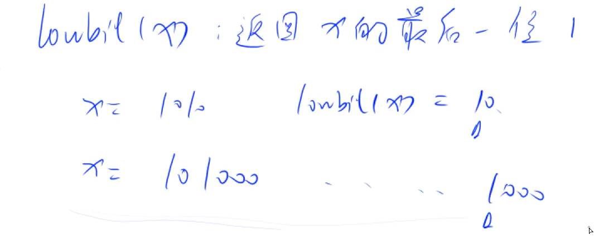
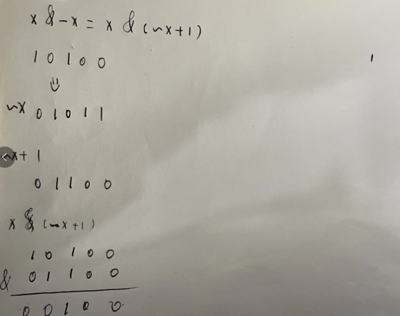

# 位运算

## 输出一个数二进制的第K位

思路： 将一个数的二进制右移动K位，即将第K位的数字移动到第0位，之后&1操作，取出该数字

```cpp
#include<iostream>
#include<string.h>

using namespace std;

int main(){
    int n = 10;
    
    // 右移3位 将最高位移动到个位
    for(int k = 3; k >= 0; k--){
        cout<< (n >> k & 1);
    }
    
    return 0;
}

```

## 返回一个数的二进制的最后一位1

  

  


