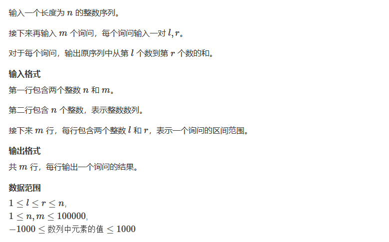

# 前缀和算法

## 概述

&emsp;前缀和是一种预处理，用于降低查询时的时间复杂度。比如，给定n个整数，然后进行m此询问，每一次询问求出一个区间内部值和。比如求出[2,9]之间所有数字之和，那么我们就可以使用S9 - S1

## 题目
  


## 代码

```cpp
#include<iostream>
using namespace std;

const int N = 1e5 + 10;
int s[N];
int n,m;

int main()
{
    scanf("%d%d",&n,&m);
    for(int i =1; i <= n; i++)
    {
        scanf("%d",&s[i]);
    }
    
    
    for(int i = 1; i <= n; i++)
    {
        s[i] += s[i - 1];// 初始化前缀和
    }
    
    int l,r;
    
    while(m--){
        scanf("%d%d",&l,&r);
        
        printf("%d\n",s[r] - s[l - 1]);
        
        
    }
    
    
    
    return 0;
}


```


