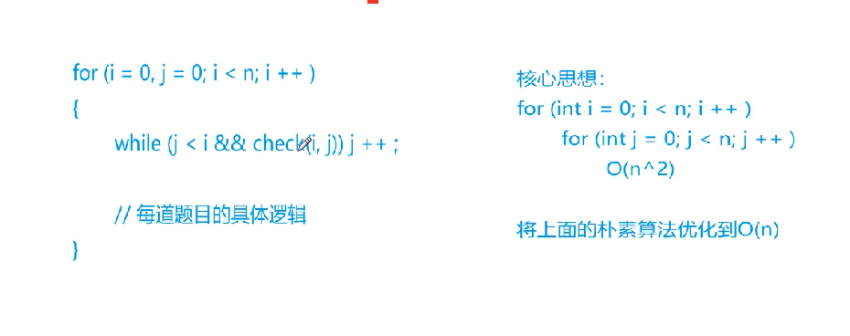
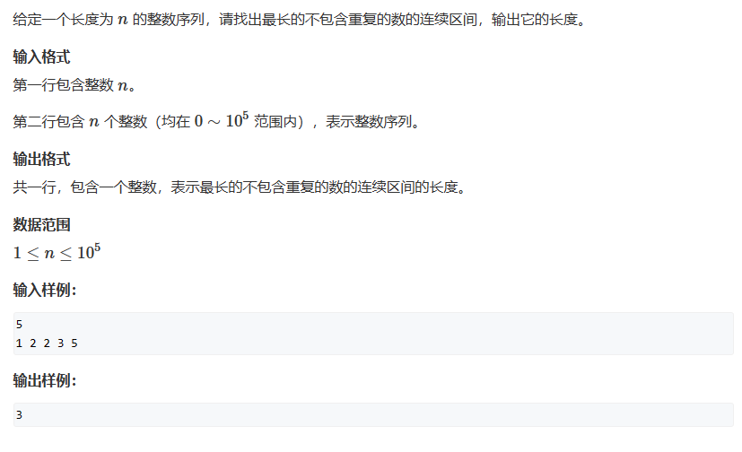

# 双指针算法

## 双指针模板

  

例子：输入一行字符串  字符串之间有空格进行分割 将这些单词逐行打印

```cpp
#include<iostream>
#include<string.h>

using namespace std;

int main(){
    char str[1000];
    // 输入字符串
    gets(str);
    int n = strlen(str);
    for(int i = 0 ; i < n; i++){
        int j = i;
        while(j < n && str[j] != ' '){
            j++;// 使用j指针 从i的位置开始向下寻找 停止在空格位置结束
        }
        
        // 一道题目的具体逻辑
        for(int k = i; k < j; k++)
        {
            cout<<str[k];
        }
        cout<<endl;
        
        i = j;
    }
    
    
    return 0;
}


```

## AcWing 799. 最长连续不重复子序列

  

```cpp
#include<iostream>
using namespace std;

const int N = 100010;

int n;
int a[N],s[N];

int main()
{
    cin>>n;
    for(int i = 0; i < n; i++)
    {
        scanf("%d",&a[i]);
    }
    int res = 0;
    int j = 0;
    for(int i = 0; i < n; i++)
    {
        // 统计每一个字符的个数
        s[a[i]]++;// 标记第i各位置的数字 
        
        // j指针运动逻辑
        while(j < i && s[a[i]] > 1){
            // 如果遇到了重复的数字 不断移动j指针 使得j指针指向i的位置
            // 同时因为移动j指针 也就说明区间[j,i]中重复的数字需要重新计算 s[a[j]]--
            // 也就是说 在讲j移动到i的位置的时候  这一段区间内的所有数字 个数都要减一 因为最后的区间就是一个数
            s[a[j]] --;
            j++;//n 知道j = i 表明s[a[i]] = 1 [j,i]区间只有一个数字
        }
        
        // 本题目的逻辑
        res = max(res,i - j + 1);
    }
    
    cout<<res<<endl;
    
    return 0;
}

```
