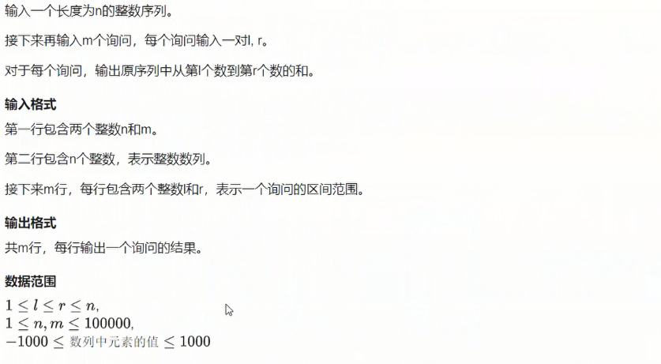

# 基础算法前缀和

## 一维前缀和
  

例题：
  

```cpp
#include<iostream>
using namespace std;
const int N = 1e5 + 10;

int n,m;
int a[N],s[N];


int main()
{
    scanf("%d%d",&n,&m);

    for(int i = 1; i <= n; i++)
    {
        scanf("%d",&a[i]);
    }

    for(int i = 1; i <= n; i++)
    {
        s[i] = s[i - 1] + a[i];// 计算前缀和公式
    }
    // s[0] = 0
    while(m--)
    {
        int l,r;
        scanf("%d%d",&l,&r);
        printf("%d/n",s[r] - s[l - 1]); // 计算给定区间内的前缀和公式
    }
    return 0;
}


```


## 二维前缀和


