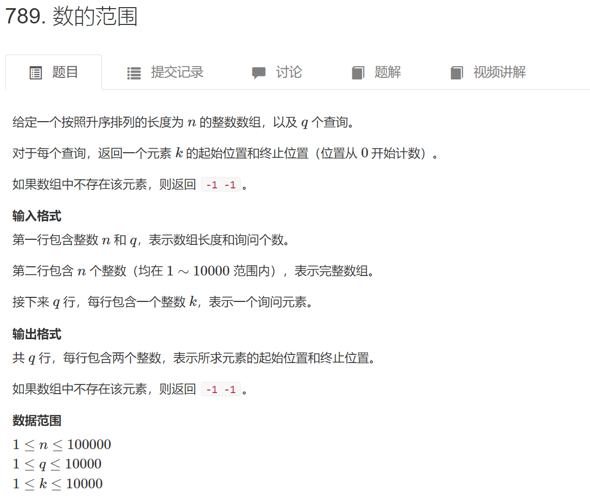

# ACWing基础算法第一课

算法模板先背调，写过的题目再写一遍

## 一、排序算法

### 1.快速排序

一般做法：
* 确定分界点x:q[l],q[(l+r)/2],q[r]  随机  
* 调整范围：使得x左边的数都小于或者等于x,使得x右边的数都大于或者等于x
* 递归处理左右两段。

最难的是第二步，有一种简单的做法：
```
* 首先开辟两个空数组a,b，
* 之后循环遍历q[l~r],将小于x的放进a,大于x的放进b
* 之后将a,b的内容放进q
```

算法模板：
```cpp
#include<iostream>
using namespace std;
const int N = 1e6 + 10;

int n;
int q[N];

void quick_sort(int q[],int l,int r)
{   
    // 如果没有数或者只有一个数 那就不用进行排序
    if(l >= r) return;

    int x = q[l],i = l - 1, j = r + 1; // 将左右指针指向数组的左右边界外一个位置
    

    while(i < j)
    {
        do i++; while(q[i] < x);    // 左边找大于等于x的 然后停下  等待另一个指针停下
        do j--; while(q[j] > x);    // 右边找小于等于x的 然后停下  等待另一个指针也停下

        if(i < j) swap(q[i],q[j]);  // 两个指针指向的数字进行交换，所有左边的数字小于x 右边的数字大于x

    }

    //递归处理左右两边
    // 递归是j的写法  所以x一定不可以取右边界  否则造成死循环
    // 原因： 比如数组是 1,0  l = 0 r = 1, x = 1， 那么 一开始i 指针就会在 下标为0的地方停下
    // j指针会在 下标为1的地方停下，那么交换数字  数组变为 0 1，那么接下去循环
    // quick_sort(q,l,j) = qucik_sort(q,0,1)   这样又回到了开始调用的时候 无限循环下去
    //qucik_sort(q,j + 1,r) = qucik_sort(q,2,1) return 退出
    quick_sort(q,l,j);
    quick_sort(q,j + 1,r);


    // 同理 这里写成i的话，上面的x就一定不可以选择左边界

}

int main()
{
    scanf("%d",&n);
    for(int i = 0; i < n; i++) scanf("%d",&q[i]);
    // int l,r;
    // scanf("%d %d",&l,&r);
    quick_sort(q,0,n - 1);

    for(int i = 0; i < n; i++)
    {
        printf("%d ",q[i]);
    }

    return 0;
}

```


### 2.归并排序

归并排序采用的是分治思想。

* 首先确定分界点：mid = (l + r) / 2
* 递归排序：左半边、右半边，左右两个序列分别有序，并不是整体有序
* 归并，合二为一

模板代码：
```cpp
#include<iostream>
using namespace std;

const int N = 1000010;
int n;
int q[N];
int tmp[N];

void merge_sort(int q[],int l,int r)
{
    if(l >= r) return;

    int mid = l + r >> 1;

    // 先划分
    merge_sort(q,l,mid),merge_sort(q,mid+1,r);

    int k = 0,i = l,j = mid + 1;

    // 开始归并
    while(i <= mid && j <= r)
    {
        if(q[i] <= q[j])
        {
            tmp[k++] = q[i++];
        }
        else
        {
            tmp[k++] = q[j++];
        }

    }

    // 如果有一个序列剩余 全部并入
    while(i <= mid)
    {
        tmp[k++] = q[i++];
    }

    while(j <= r)
    {
        tmp[k++] = q[j++];
    }

    for(int i = l,j = 0; i <= r; i++,j++)
    {
        q[i] = tmp[j];
    }


}


int main()
{
    scanf("%d",&n);

    for(int i = 0; i < n; i++)
    {
        scanf("%d",&q[i]);
    }

    merge_sort(q,0,n-1);

    for(int i = 0; i < n; i++)
    {
        printf("%d ",q[i]);
    }

    return 0;
}

```


## 二、二分算法

这里指的是二分查找,基于有序序列

### 1.整数类型

**整数型二分一共有两个，分别适用于不同的情况。**

版本1：你要找的数字在右边

```cpp
int binary_search(int l,int r)
{
    while(l < r)
    {
        int mid = l + r + 1 >> 1;
        if(check(mid))
        {
            l = mid;
        }
        else
        {
            r = mid - 1;
        }
    }

    return l;
}
```

举一个例子：数组：1 2 2 2 3 4  六个数  查找3(**3 是偏靠右边的数字** 上帝视角)

那么mid = (0 + n - 1 + 1) / 2 = (0 + 6) / 2 = 3 a[3] = 2

2 < 3  那么很显然，需要将l = mid **意思就是：这个数组是有序的，mid位子上的数字小于你要查找的数字，那么下一轮查找就要让左边界l = mid  反正mid左边的那些数字都小于3,这是缩小范围的过程！**,


然后l = mid = 3, mid = (3 + 5 )/ 2 = 4  a[mid] = 3  找到。

同时你也可以认为模板二是从右往左查找第一个小于等于x。


版本2：你要找的数字在左边

```cpp
int binary_search(int l,int r)
{
    while(l < r>
    {
        int mid = l + r >> 1;
        if(check(mid))
        {
            r = mid;
        }
        else
        {
            l = mid + 1;
        }
    })
}
```

举一个例子：数组 1 2 3 3 4 5 查找2
那么mid = (0 + 5) / 2 = 2  a[mid] = a[2] = 3

a[mid] > 2 对吧，**所以，由于这个数组是有序的，你要查找的数字一定在左边，所以你为了缩小范围，就需要让r = mid = 2**  下一步就找到数值2


**同时你也可以认为模板二是从左往右查找第一个大于等于x**


**问题一、那么到底该如何选取模板？**

我们只需要使用mid位上的数值与需要查找的数字进行比较即可，如果x > a[mid],说明你要查找的数字在右边，那么就是用模板一，如果你要查找的数字在左边（x < a[mid]），那么你就使用模板2


**问题二、为什么模板一需要使用mid = l + r + 1 >> 2 但是模板二没有？**

举一个例子，如果数组只有两个数3 5，l与r只差一，l = 0 r = 1，查找数字5

那么 假设我要查找右边的数字1  那么不加1，mid = l + r >> 2   mid = 0


 a[mid] = 3 < 5 说明 你要查找的数字在右边， 对吧， 然后，你就需要更新l = mid = 0，

 l = 0, 那么这不等于没变化吗？  所以我们需要加上1,才可以


 那么，问题来了，模板二就没有这种情况吗？

 同样的例子，数组只有两个元素3 5，那么你要查找数字3 

mid = (0 + 1) / 2 = 0,a[0] = 3 查找成功。


**问题三、如果找不到数字是啥情况？**

对于模板二，数组 1 1 3 3 4 5 查找数字 2 

那么第一步，mid = (0 + 5) / 2 = 2 a[2] = 3 > 2 那么你要找的数字在左边，所以你也不需要写成mid = l + r + 1 >> 2,那么 r = mid (缩小范围)，之后，mid = (0 + 2) / 2 = 1 a[1] = 1，那么a[mid] < 2，则 l = mid + 1 = 2，这就造成了r = l = 2， a[r] = a[l] = 3 > 2,那么它将永远也找不到数字2，**可以看到这也应证了上面的一句话，模板二是从左往右找第一个大于或者等于x的数字，只不过，你可以理解为：找得到话：是正好等于x，找不到的话：是大于x**


看一道例题：789.数的范围

  

AC代码：
```cpp
#include<iostream>
using namespace std;

const int N = 1e5 + 10;

int n,m;
int q[N];

int main()
{
    scanf("%d%d",&n,&m);

    for(int i = 0; i < n; i++)
    {
        scanf("%d",&q[i]);
    }

    while(m--)
    {
        int x;
        scanf("%d",&x);

        int l = 0,r = n -1;

        while(l < r)
        {
            // 认为你要查找的数字在左边  那么使用模板二
            int mid = l + r >> 1;
            if(q[mid] >= x)
            {
                r = mid;
            }
            else
            {
                l = mid + 1;
            }
        }

        if(q[l] != x)
        {
            //说明没找到，并且q[l] 是第一个大于x的数字
            cout<<"-1 -1"<<endl;
        }
        else
        {
            cout<<l<<" ";  // 查找到数字 
            // 但是使用模板二是从左往右查找的第一个大于或者等于x的数字 偏向于x
            // 这只从左边找到一个数字，但是 这道题要查找的数字是多个的
            // 这就意味着我还要从右往左在查找一次数字  这样就找到一个数字的下标范围
            
            int l = 0, r = n - 1;

            while(l < r)
            {
                int mid = l + r + 1>> 1;// 第二个模板  加一！

                if(q[mid] <= x)
                {
                    l = mid;
                }
                else{
                    r = mid - 1;
                }
            }

            cout<<l<<endl;  // 这里输出的l 是从右往左找第一个小于或者等于x的数字

        }
    }

    return 0;
}
```


### 2.浮点数类型

简单多了。


代码：
```cpp
#include<iostream>

using namespace std;


int main()
{
    double x;
    cin>>x;


    double l = 0,r = x;

    while(r - l > 1e-8)
    {
        double mid = (l + r) / 2;
        if(mid * mid >= x)
        {
            r = mid;
        }
        else
        {
            l = mid;
        }

        printf("%lf\n",l);
    }

    return 0;
}

```


