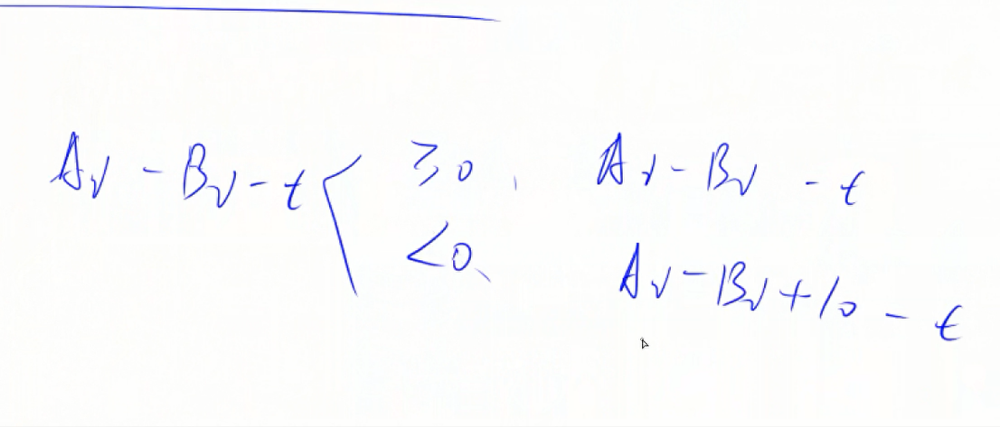
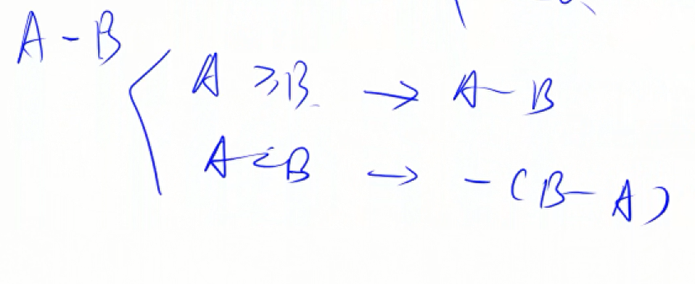

# 基础算法第二课——高精度

## 一、高精度算法常用在：

* A + B：两个大整数相加
* A - B：两个大整数相减
* A x a：一个大整数乘一个小整数
* A / a: 一个大整数除以一个小整数


## 二、大整数的存储

用一个数组来存储大整数的每一位上的数字，将大整数按从低位到高位存储，就是将数的个位存储到数组的第一位，十位存储到数组的第二位，这样做的目的在于：如果两个数组进行相加，那么数组元素对应相加，产生的进位就会进入数组下一位元素。

## 三、A + B算法

```cpp
#include<iostream>
#include<vector>
using namespace std;

const int N = 1e6 + 10;

// C = A + B
vector<int> add(vector<int> &A,vector<int> &B)
{
    vector<int> C;
    int t = 0;

    for(int i = 0; i < A.size() || i < B.size(); i++)
    {
        if(i < A.size()) t += A[i];
        if(i < B.size()) t += B[i];

        C.push_back(t % 10); 
        t = t / 10; // 获取进位 
    }

    if(t != 0)
    {
        C.push_back(1);  // 最高位相加 还有进位  1 
    }

    return C;
}


int main()
{
    string a,b;

    vector<int>A,B;

    cin>>a>>b; // a = "123456"

    for(int i = a.size() - 1; i >= 0; i--)
    {
        A.push_back(a[i] - '0');// A = [6,5,4,3,2,1]
    }

    for(int i = b.size() - 1; i >= 0; i--)
    {
        B.push_back(b[i] - '0');
    }

    vector<int> C = add(A,B);

    for(int i = C.size() - 1; i >= 0; i--)
    {
        printf("%d",C[i]);
    }

    return 0;
}

```


## 四、A-B算法


t 是上一位的借位
  


  


模板代码：
```cpp
#include<iostream>
#include<vector>

using namespace std;

// 判断是否有 A >= B
bool cmp(vector<int> &A, vector<int> &B)
{
    // 此时的数组低位存储 个位 
    // 长度不一致
    if(A.size() != B.size())
    {
        return A.size() > B.size();
    }

    // 长度一致  从最高位开始比较  987 986 
    // 数组中这两个数组应该是：789 689
    for(int i = A.size() - 1; i >= 0; i--)
    {
        // 从最高位开始比较
        if(A[i] != B[i])
        {
            return A[i] > B[i];
        }
    }
    return true;
}

// C = A - B
vector<long long> sub(vector<int> &A, vector<int> &B)
{
    vector<long long> C;

    // C = 976 - 967  6 -7 不够减  t < 0 
    for(int i = 0,t = 0; i < A.size(); i++)
    {
        t = A[i] - t;

        if(i < B.size()) t -= B[i];

        // 如果 t < 0 那么借位 + 10 ， 如果t > 0，+ 10 之后% 10 不影响
        // 不管t 是否大于0 还是小于0 这种情况都包含
        C.push_back((t + 10) % 10); 

        //  t < 0 说明有借位
        if(t < 0) t = 1;  
        else t = 0;  // 没有借位
    }

     while(C.size() > 1 && C.back() == 0)
     {
         C.pop_back();// 如果最后结果是 3 0 0  那么去掉高位的两个0 留下最低为3 
         // 这里的3 0 0 是3 这个数字在数组中的存储形式
     }

    return C;
}


int main()
{
    string a,b;
    vector<int>A,B;

    cin>>a>>b;

    // 9 6 7 存储在数组中是：7 6 9
    // 也就是数组低位存储数字低位  数组高位存储数字高位
    for(int i = a.size() - 1; i >= 0; i--)
    {
        A.push_back(a[i] - '0');
    }


    for(int i = b.size() - 1; i >= 0; i--)
    {
        B.push_back(b[i] - '0');
    }

    // for(int i = B.size() - 1; i >= 0; i--)
    // {
    //     printf("%d",B[i]);
    // }
    // cout<<endl;

    if(cmp(A,B))
    {
        vector<long long> C = sub(A,B);
        // 数组低位存储数字低位 数组高位存储数字高位  倒着打印
        for(int i = C.size() - 1; i >= 0; i--)
        {
            printf("%d",C[i]);
        }
    }
    else{

        vector<long long> C = sub(A,B);
        printf("-");
        for(int i = C.size() - 1; i >= 0; i--)
        {
            printf("%d",C[i]);
        }

    }
}


```

## 五、A * B

模板代码：

```cpp
#include<iostream>
#include<vector>

using namespace std;


vector<long long> mul(vector<long long> &A,long long b)
{
    vector<long long> C;

    int t = 0;//进位
    for(int i = 0; i < A.size(); i++)
    {
        if(i < A.size())
        {
            t += A[i] * b;
        }

        C.push_back(t % 10);
        t = t  / 10;  // 这里的t 进位就不是1了
    }

    if(t != 0)
    {
        C.push_back(t);
    }

    return C;
}


int main()
{
    string a;
    long long b;
    cin>>a>>b;

    vector<long long> A;
    for(int i = a.size() - 1; i >= 0; i--)
    {
        A.push_back(a[i] - '0');
    }

    vector<long long> C = mul(A,b);

    for(int i = C.size() - 1; i>= 0; i--)
    {
        printf("%d",C[i]);
    }

    return 0;

}

```


## 六、A / B
```cpp
#include<iostream>
#include<algorithm>
#include<vector>
using namespace std;

// A/b 商是C 余数r
vector<int> div(vector<int> &A,int b,int &r)
{
    vector<int> C;
    r = 0;
    for(int i = A.size() - 1; i >= 0; i--)
    {
        r = r * 10 + A[i];

        C.push_back(r / b);
        r = r % b;
    }

    reverse(C.begin(),C.end());// 反转数组  数组低位对低位  高位对高位

    // 去除前导0  比如003   0 是低位   3 是高位
    while(C.size() > 1 && C.back() == 0)
    {
        // 数组C的长度大于1  并且C的低位是0
        C.pop_back();// 去除末尾的0   循环该动作 
    }

    return C;
}


int main()
{
    string a;
    int b;
    cin>>a>>b;

    vector<int> A;

    for(int i = a.size() - 1; i >= 0; i--)
    {
        A.push_back(a[i] - '0');
    }

    int r;
    vector<int> C = div(A,b,r);

    for(int i = C.size() - 1; i >= 0; i--)
    {
        printf("%d",C[i]);
    }
    cout<<endl<<r<<endl;
    return 0;
}

```


