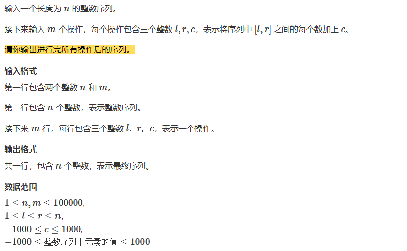

# 差分算法

## 原理

* 如果数组A是数组B的前缀和，那么数组B就是数组A的差分数组
* 比如，将一个数组的一段区间[l,r]中间的每一个数字都加上c 可能执行n次，如果多次执行该操作，每次都是On的时间复杂度，但是如果对该数组的差分数组进行该操作，然后再求前缀和，还原该数组，大大降低时间复杂度。

参考他的文章,写的很清楚：```https://zhuanlan.zhihu.com/p/344718960```


## 题目：Acwing 797. 差分
  


## 模板代码

```cpp
#include<iostream>
using namespace std;

const int N = 1e5 + 10;
int n,m;
int a[N],b[N];

void insert(int l,int r,int c)
{
    b[l] += c;
    b[r + 1] -= c;
}

int main()
{
    scanf("%d%d",&n,&m);
    
    for(int i = 1; i <= n; i++)
    {
        scanf("%d",&a[i]);
        
    }
    
    for(int i = 1; i <= n; i++)
    {
        insert(i,i,a[i]);// 将原数组的n个数插入  构造a的差分数组
    }
    
    // 对差分数组进行操作
    while(m--)
    {
        int l,r,c;
        scanf("%d%d%d",&l,&r,&c);
        insert(l,r,c);
    }
    
    // 计算前缀和  还原数组
    for(int i = 1; i <= n; i++)
    {
        b[i] += b[i - 1];
    }
    
    for(int i = 1; i <=n; i++)
    {
        printf("%d ",b[i]);
    }
    
    return 0;
}


```
