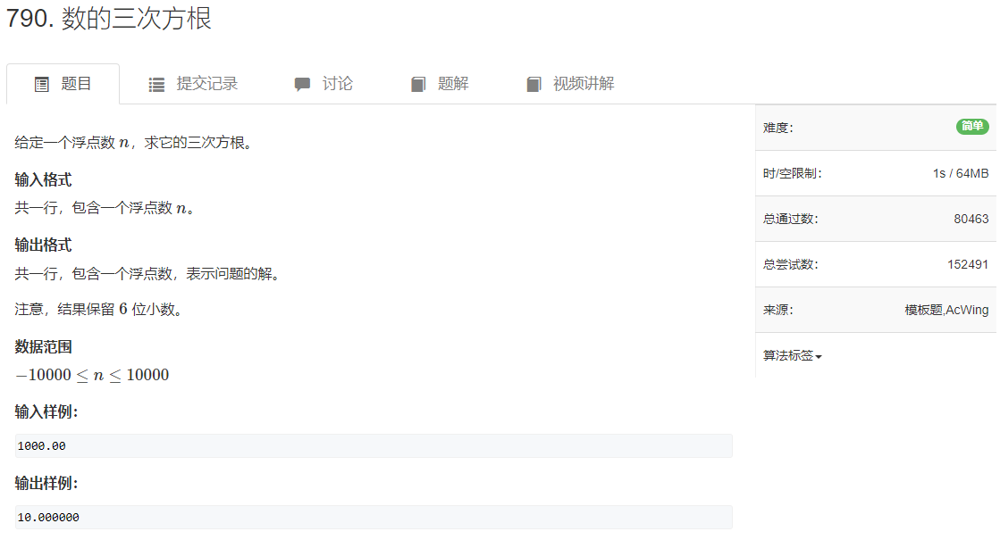

# 790. 数的三次方根


## 题目
  


## 思路
* 浮点数二分
* 当mid * mid * mid >= x   将mid更新为右边界
* 否则更新为左边界
* 注意循环结束条件


## 代码

```cpp
#include<iostream>
using namespace std;

int main(void)
{
    double l = -10000,r = 10000;
    double x;
    cin>>x;
    
    
    while(r - l > 1e-8)
    {
        double mid = (l + r) / 2.0;
        if(mid * mid * mid >= x)
        {
            r = mid;
        }
        else
        {
            l = mid;
        }
    }
    printf("%lf",l);
    return 0;
}

```
