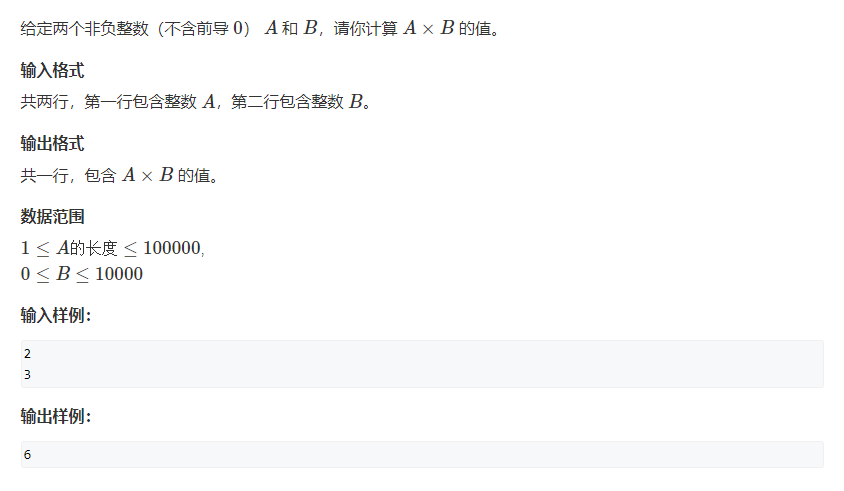

# 793. 高精度乘法

## 题目
  


## 思路
* 123 x 72
* 将字符串123 拆分成数组 
* 将3乘以72 使用进位t存储 
* 保留t % 10 t = t / 10
* 如果123遍历完毕之后 t还不为0 继续存储
* 计算的结果很可能是0  所以从高位开始将0 全部弹出  只保留最后一位0

## 代码

```cpp
#include<iostream>
#include<vector>
using namespace std;

vector<int> mul(vector<int> A,int b)
{
    vector<int> C;
    int t = 0;// 进位
    for(int i = 0; i < A.size(); i++){
        t = t + A[i] * b;
        C.push_back(t % 10);
        t = t / 10;
    }
    
    // 最后一次进位的结果还没有存储结束
    while(t)
    {
       C.push_back(t % 10);
       t = t / 10;
    }
    
    // 将高位的0一一弹出
    while(C.size() > 1 && C.back() == 0)
    {
        // vetcor数组的末端存储数字的高位
        C.pop_back();
    }
    
    return C;
}


int main()
{
    string a;
    int b;
    
    cin>>a;
    scanf("%d",&b);
    
    vector<int> A;
    for(int i = a.size() - 1; i >= 0; i--)
    {
        A.push_back(a[i] - '0');
    }
    
    auto C = mul(A,b);
    
    // if(C[C.size() - 1] == 0)
    // {
    //     // 最高位是0 说明全部都是0
    //     cout<<0;
    //     return 0;
    // }
    
    for(int i = C.size() - 1; i >= 0; i--)
    {
        
        printf("%d",C[i]);
    }
    
    return 0;
}

```

