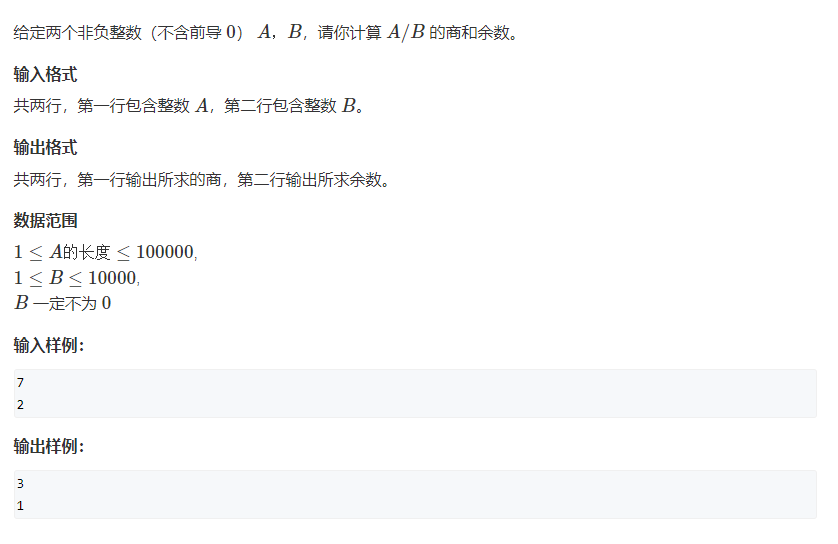

# 794. 高精度除法

## 题目
  


## 思路

* 按照除法的法则
* 设置余数r
* r一开始初始化为0
* 由于除法是从高位开始计算的 所以结果也是从高位开始存储的（结果需要反转）
* r = r * 10 + A[i](写一下除法的计算过程)
* 商就是r / 10
* 反而余数r = r % 10 对于下一个A[i]进行计算

## 代码

```cpp
#include<iostream>
#include<vector>
#include<algorithm>

using namespace std;

vector<int> div(vector<int> A,int b, int &r)
{
    vector<int> C;
    r = 0;
    
    // 除法 从高位开始计算
    
    for(int i = A.size() - 1; i >= 0; i--)
    {
        r  = r * 10 + A[i];
        C.push_back(r / b);
        r = r % b;
    }
    
    reverse(C.begin(),C.end());// C是高位放在下标0位置 但是我们需要 个位放在下标0位置
    
    // 去掉前导0
    while(C.size() > 1 && C.back() == 0){
        C.pop_back();
    }
    
    return C;
}

int main()
{
    string a;
    int b;
    cin>>a>>b;
    
    vector<int> A;
    
    for(int i = a.size() - 1; i >= 0; i--)
    {
        A.push_back(a[i] - '0');
    }
    
    int r;// 余数
    auto C =  div(A,b,r);
    
    for(int i = C.size() - 1; i >= 0; i--)
    {
        cout<<C[i];
    }
    
    cout<<endl<<r;
    
    
    
    return 0;
}

```
