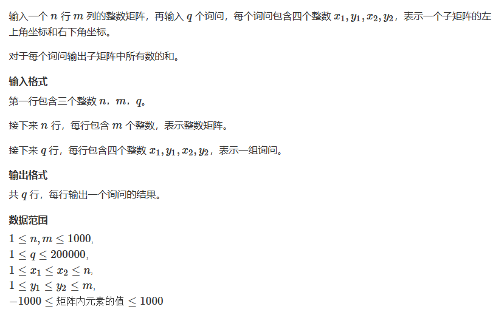

# 796. 子矩阵的和

## 题目
  


## 思路
* 二维前缀和思想

  

* 计算一个区域中的和
  


## 代码

```cpp
#include<iostream>
using namespace std;

const int N = 1010;
int a[N][N];

int S[N][N];


int main()
{
    int n,m,q;
    scanf("%d%d%d",&n,&m,&q);
    for(int i = 1 ; i <= n; i++)
    {
        for(int j = 1; j <= m; j++)
        {
            scanf("%d",&a[i][j]);
        }
    }
    
    // 初始化前缀和数组
    for(int i = 1; i <= n; i++)
    {
        for(int j = 1; j <= m; j++)
        {
            S[i][j] = S[i][j - 1] + S[i - 1][j] - S[i - 1][j - 1] + a[i][j];
        }
    }
    
    while(q--)
    {
        int x1,y1,x2,y2;
        scanf("%d%d%d%d",&x1,&y1,&x2,&y2);
        
        // 计算该范围的和 
        int result = S[x2][y2] - S[x2][y1 - 1] - S[x1 - 1][y2] + S[x1 - 1][y1 - 1];
        cout<<result<<endl;
        
    }
    
    return 0;
}

```


