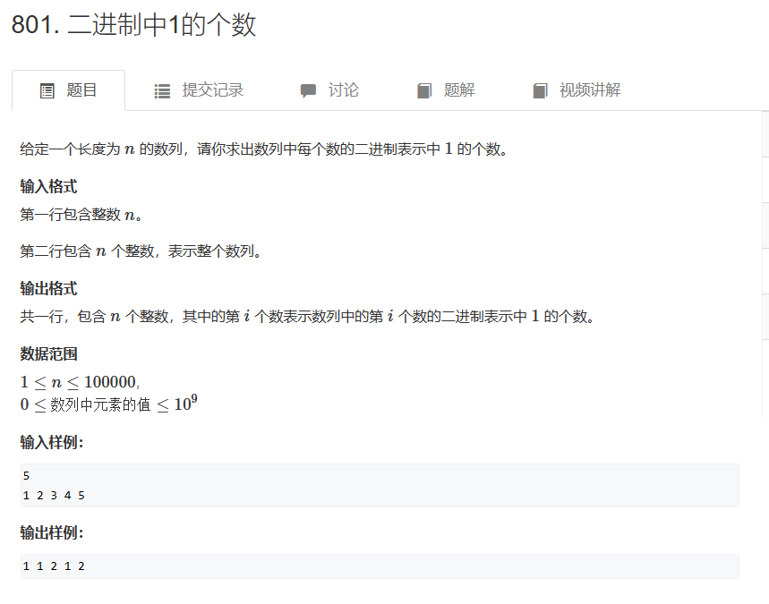

# Acwing 801. 二进制中1的个数

## 题目
  


## 思路

* 使用lowBit运算  计算x二进制的最后一个1 比如10100 使用lowBit运算得到00100 
* 不断对x使用lowBit运算 直到x为0  最后运算次数就是1的个数

## 代码

```cpp
#include<iostream>
using namespace std;

int lowbit(int x)
{
    return x & -x;// 计算x中最后一个1
    // 1010
    // 该函数返回10
}

int main()
{
    int n;
    cin>>n;
    
    int res = 0;
    
    while(n--)
    {
        int x;
        cin>>x;
        res = 0;
       while(x != 0)
       {
            // 每一次x减去最后一个1
            x -= lowbit(x);
            res++;// 直到x变成0
       }
       
       cout<<res<<" ";
    }
    
    
    return 0;
}

```

