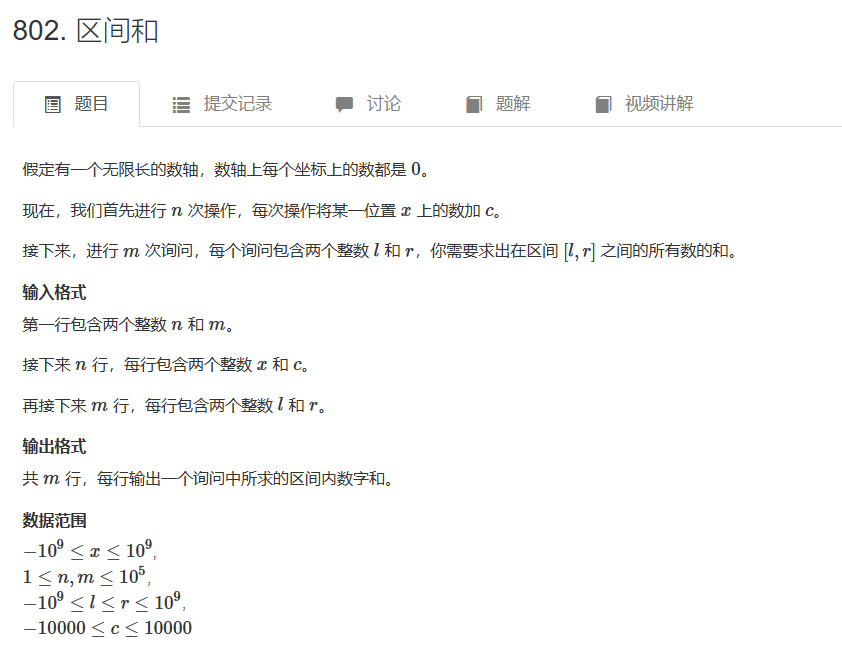

# AcWing 802. 区间和

## 题目
  

## 思路

* 离散化的思路
```cpp
vector<int> alls; // 存储所有待离散化的值
sort(alls.begin(), alls.end()); // 将所有值排序
alls.erase(unique(alls.begin(), alls.end()), alls.end());   // 去掉重复元素

// 二分求出x对应的离散化的值
int find(int x) // 找到第一个大于等于x的位置
{
    int l = 0, r = alls.size() - 1;
    while (l < r)
    {
        int mid = l + r >> 1;
        if (alls[mid] >= x) r = mid;
        else l = mid + 1;
    }
    return r + 1; // 映射到1, 2, ...n
}
```


## 代码

```cpp
#include<iostream>
#include<vector>
#include<algorithm>
using namespace std;

int n,m,x,c,l,r;
typedef pair<int,int> P;// 第一个数是位置 第二个数是数值
vector<int> alls;// 记录加数的位置  询问区间左右的位置
vector<P> add,query;// add 是加数位置  询问区间左右的位置

const int N = 300005;

int a[N],s[N];// a是离散化之后加数序列原数组  s是a的前缀和序列

int find(int x){
    int l = 0,r = alls.size() - 1;
    
    while(l < r){
        int mid = (l + r)>> 1;
        
        if(alls[mid] >= x){
            r = mid;
        }else{
            l = mid + 1;
        }
    }
    
    
    return r + 1;
}

int main()
{
    cin>>n>>m;
    for(int i = 1; i <= n; i++){
        scanf("%d%d",&x,&c);
        add.push_back({x,c});// add存储加数的位置以及该数字
        alls.push_back(x);// 存储该位置
    }
    
    for(int i = 1; i <= m; i++)
    {
        scanf("%d%d",&l,&r);// 读入区间位置
        query.push_back({l,r});
        alls.push_back(l);
        alls.push_back(r);// 存储区间的位置
    }
    
    sort(alls.begin(),alls.end());// 排序
    alls.erase(unique(alls.begin(),alls.end()),alls.end());// 去重
    
    // 构建离散化之后的加数的原数组序列
    for(auto item:add){
        int x = find(item.first);
        a[x] += item.second;
    }
    
    // 前缀和
    for(int i = 1; i <= alls.size(); i++)
    {
        s[i] = s[i - 1] + a[i];
    }
    
    // 使用二分取出区间[l,r] 对应的离散化的值
    for(auto item:query){
        int l = find(item.first);
        int r = find(item.second);
        
        cout<<s[r] - s[l - 1]<<endl;
    }
    
    return 0;
}

```
