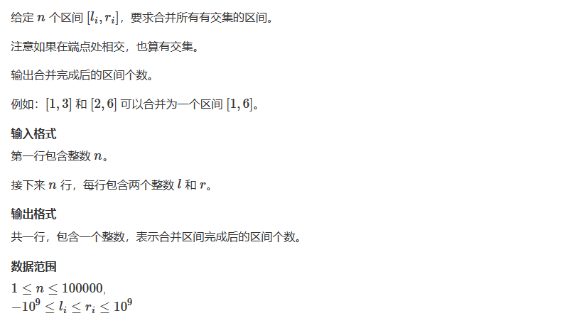
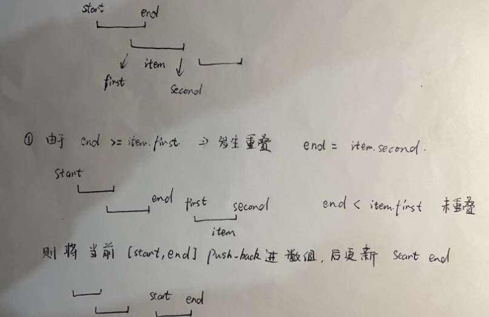

# 803. 区间合并

## 题目

  


## 思路

  


## 代码

```cpp
#include<iostream>
#include<vector>
#include<algorithm>

using namespace std;

typedef pair<int,int> PII;

int n;

void merge(vector<PII> &interval){
    
    vector<PII> ans;
    
    // 想将区间按照左端点进行排序
    sort(interval.begin(),interval.end());
    
    // 设置原始的区间
    int start = -2e9,end = -2e9;
    
    for(auto item:interval)
    {
        // 比较该区间的左端点和目前区间的右端点的大小
        if(end < item.first){
            
            // 说明没有交集 将当前区间送入interval中
            // 将start 和 end重新初始化为新的区间
            
            // 需要判断一下 因为start 和 end一开始还不是指向第一段区间
             if(start != -2e9){
                 ans.push_back({item.first,item.second});
             }
             
             // 第一段区间进行初始化
             start = item.first;
             end = item.second;
        }
        else
        {
            // 合并新的区间
            end = max(end,item.second);
        }
    }
    
    // 上面的循环结束之后 还会剩下当前区间
    // start != 是因为interval很可能是空的 所以需要判断一下
    if(start != -2e9)
    {
        ans.push_back({start,end});
    }
    
    interval = ans;
    
} 

int main()
{
    cin>>n;
    vector<PII> interval;// 存储输入的区间
    
    while(n--)
    {
        int l,r;// 
        cin>>l>>r;// 输入区间
        interval.push_back({l,r});
    }
    
    merge(interval);// 合并区间
    
    cout<<interval.size()<<endl;// 输出区间的个数
    
    return 0;
}

```


