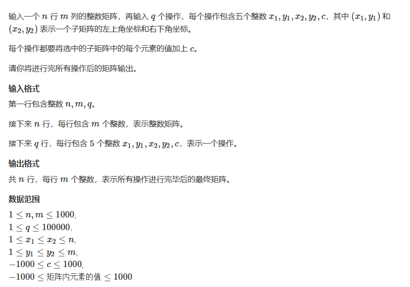
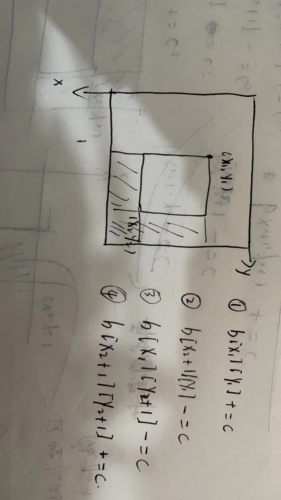

# 差分矩阵

## 题目

  


## 思路
* 二维矩阵的差分操作
* 先构造矩阵a的差分矩阵b
* 然后对矩阵b进行操作
* 最后对矩阵b计算前缀和

  


## 代码


```cpp

#include<iostream>
using namespace std;

const int N = 1010;
int a[N][N],b[N][N];
int n,m,q;

void insert(int x1,int y1,int x2,int y2,int c)
{
    b[x1][y1] += c;
    b[x2 + 1][y1] -= c;
    b[x1][y2 + 1] -= c;
    b[x2 + 1][y2 + 1] += c;
}

int main()
{
    scanf("%d%d%d",&n,&m,&q);
    
    for(int i = 1; i <= n; i++)
    {
        for(int j = 1; j <= m; j++)
        {
            scanf("%d",&a[i][j]);
        }
    }
    
    // 构造差分数组
    for(int i = 1; i <= n; i++)
    {
        for(int j = 1; j <= m; j++)
        {
            insert(i,j,i,j,a[i][j]);
        }
    }
    
    while(q--)
    {
        int x1,y1,x2,y2,c;
        
        cin>>x1>>y1>>x2>>y2>>c;
        
        insert(x1,y1,x2,y2,c);
    }
    
    
    // 计算前缀和
    for(int i = 1; i <= n; i++)
    {
        for(int j  = 1; j <= m; j++)
        {
            b[i][j] = b[i - 1][j] + b[i][j - 1] - b[i - 1][j - 1] + b[i][j];
        }
    }
    
    for(int i = 1; i <= n; i++)
    {
        for(int j = 1; j <= m; j++)
        {
            printf("%d ",b[i][j]);
        }
        cout<<endl;
    }
    
}


```


