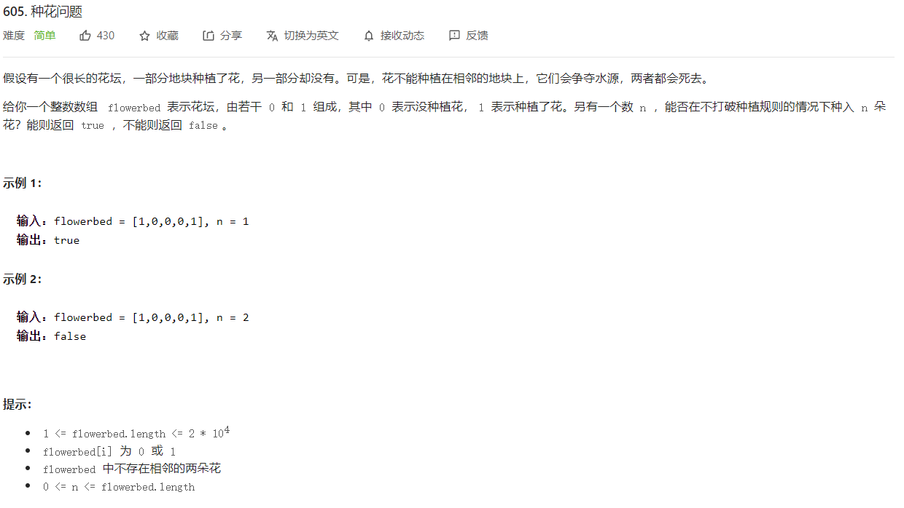
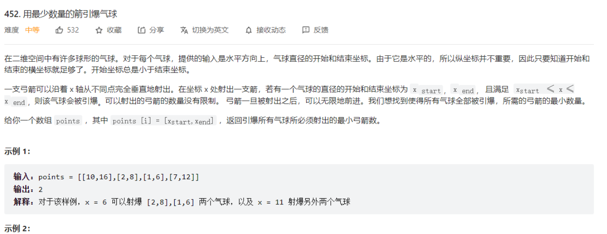
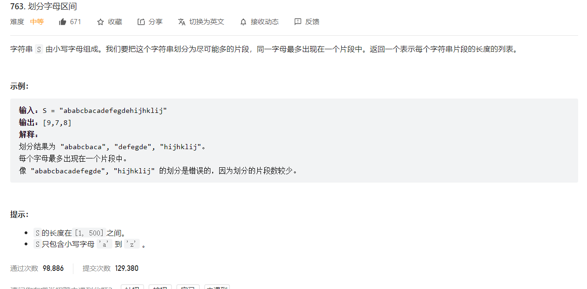
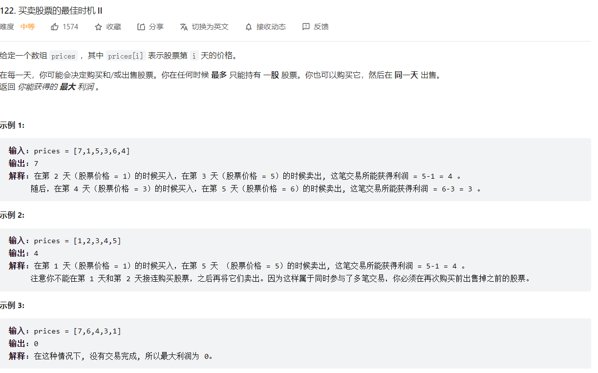
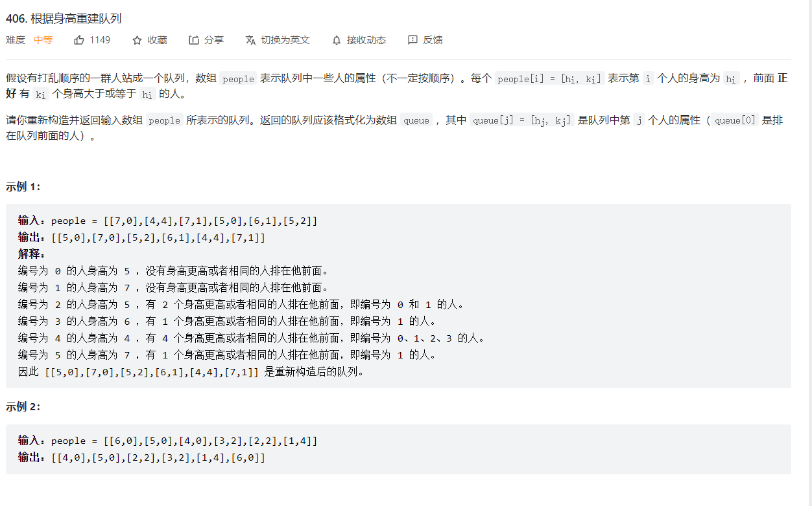
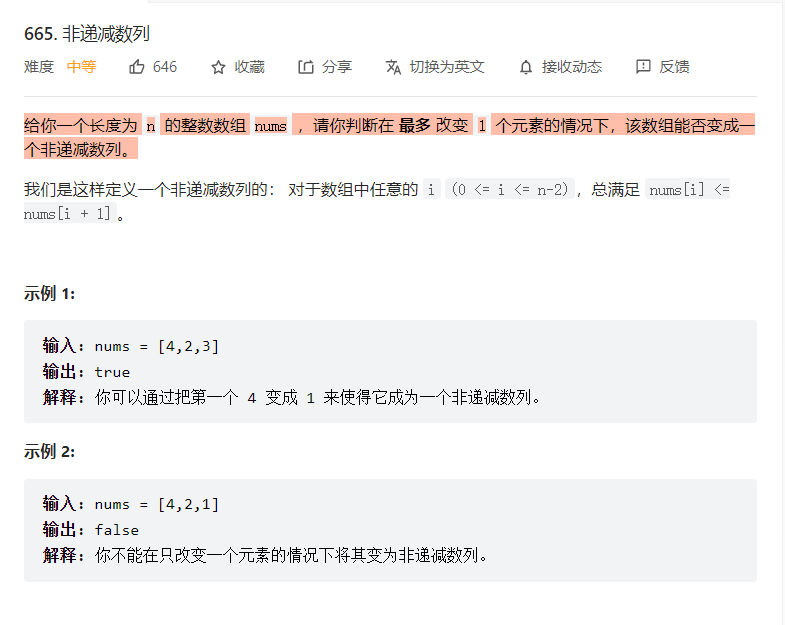

# 贪心算法

## 算法简介

贪心算法，是寻找最优解问题的常用方法，这种方法模式一般将求解过程分成若干个步骤，对于每一个步骤寻找当前状态下最好最优的选择，并以此希望最后堆叠出的结果也是最好最优的解。


## 455. 分发饼干——贪心算法


原题连接：```https://leetcode-cn.com/problems/assign-cookies/```


### 解题代码：
```cpp
class Solution {
public:
    int findContentChildren(vector<int>& g, vector<int>& s) {
    	// 先进行排序
        sort(g.begin(),g.end());
        sort(s.begin(),s.end());
        int child = 0,cookie = 0;

        while(child < g.size() && cookie < s.size())
        {
            if(s[cookie] >= g[child])
            {
                // 最小饥饿的孩子分配最小能饱腹的饼干
                child++;//  满足 + 1
            }

            // 即使 我这个饼干不满足 这个孩子的胃口 他也就要吃掉  
            // 如果出现一次这样的情况 那么后面都是不满足情况
            cookie++;
        }

        return child;

    }
};
```

### 解题思路
本题采用贪心的思想：饥饿度最小的孩子最容易吃饱，先考虑这个孩子，为了尽量使得剩下的饼干可以满足饥饿度更大的孩子，所以应该把大于或者等于这个孩子的饥饿度、且大小最小的饼干给这个孩子。满足这个条件之后，采取同样的策略，考虑剩下孩子里饥饿度最小的孩子，直到没有满足条件的饼干存在。


也就是，先将孩子的饥饿度与饼干大小进行排序，然后一次分配即可。

## 【贪心算法】135. 分发糖果


### 解题思想
贪心思想：两次遍历即可，先将所有孩子的糖果数初始化1，然后从左往右遍历一遍，如果右边的孩子评分比左边孩子的评分高，那么右边孩子的糖果数更新为左边孩子的糖果数加一，然后再从右往左遍历一遍，如果左边的孩子评分比右边的高，且左边孩子的糖果数不大于右边孩子的糖果数，则左边孩子的糖果数加一。

### 解题代码
```cpp
class Solution {
public:
    int candy(vector<int>& ratings) {
        int size = ratings.size();

        if(size <= 1)
        {
            return 1;
        }

        vector<int> num(size,1);//  根据这个size 新开辟一个数组 数组每一个元素都初始化1


        // 先从左往右遍历 
        for(int i = 1; i < size; i++)
        {
            // 如果右边的评分高于左边的评分 那么加一
            if(ratings[i] > ratings[i - 1])
            {
                num[i] = num[i - 1] + 1;  // 比他左边的糖果数加一
            }
        }

        // 从右往左遍历
        for(int i = size - 1; i >=1; i--)
        {
            // 左边的分数比右边的要高  并且左边孩子的糖果数不大于右边孩子的糖果数
            if(ratings[i] < ratings[i - 1]  && num[i-1] <= num[i])
            {
                num[i - 1] = num[i] + 1;

            }
        }

        return accumulate(num.begin(),num.end(),0);// 数组元素求和
    }
};
```


## 【贪心算法】435. 无重叠区间


### 题目

### 解析

题目要求最少需要移除区间的个数  一般都是贪心算法,也就是 要让互不重叠的区间个数最多  那么重叠的区间个数最少！
        
保留不重叠的区间，如果选择的区间结尾越小，那么这个区间和其他区间相互重叠的可能性越小，不重叠个数越多.


首先按照区间结尾递增的顺序进行排序，然后标记第一个区间的结尾为prev，从第二个区间开始遍历，让后面的每一个区间的开始与该结尾进行比较，如果比他小，说明发生了重叠，removed++,如果不重叠，那么标记第二个区间的结尾为prev,  然后接着向下开始遍历。

像这个案例：[1,2]与[1,3]重叠，那么prev 指向[2,4]（[1,2]与[2,4] 不重叠） , 但是[2,4]与[1,5] 发生重叠  最后只保留两个。

那么，可能要问，尽管prev已经变化了，但是如果前面的区间和后面的区间发生了重叠怎么办？是不是更新了prev就不需要考虑前面的区间和后面的区间的重叠，比如这里的[1,2]与[1,5], 但是prev已经指向了[2,4] 

答案是：不需要考虑，一旦prev往后移动了，只需要考虑后面的元素与prev有没有重叠，因为prev([2,4])与前面某一个区间([1,2]) 不重叠，那么说明prev的开始大于或者等于前面这个区间的结尾，所以前面这个区间一旦与prev后面的某一个区间发生了重叠（前面该区间的结尾大于或者等于prev后面某一个区间开始），那么prev的结尾一定大于后面该区间的开始，这样又发生了一次重叠，所以不用考虑。

```intervals = [[1,2],[1,3],[2,4],[1,5]]```

### 代码
```cpp
class Solution {
public:
    int eraseOverlapIntervals(vector<vector<int>>& intervals) {
        //  数组长度最小为1  不需要判空

        //  题目要求最少需要移除区间的个数  一般都是贪心算法
        // 也就是 要让互不重叠的区间个数最多  那么重叠的区间个数最少！
        
        // 保留不重叠的区间，如果选择的区间结尾越小，那么这个区间和其他区间相互重叠的可能性越小，不重叠个数越多
        
        int n = intervals.size();

        // 按照区间的结尾从小到大的顺序排序
        sort(intervals.begin(),intervals.end(),[](vector<int> &a,vector<int> &b){return a[1] < b[1];});

        int removed = 0,prev = intervals[0][1];// 取出 第一个区间的结尾

        for(int i = 1; i < n; i++)
        {
            // 取出后面一个区间的开始  如果比第一个区间的结尾小  说明 重叠
          if(intervals[i][0] < prev)
          {
              removed++;
          }  
          else{
              prev = intervals[i][1];// 如果不重叠 更新prev
          }
        }
        return removed;

    }
};

```

## 【贪心算法】605.种花问题

### 题目

  


### 解析
只要判断连续三个位置都是0 就可以在中间位置中一朵花,同时需要考虑边界问题：最后一个位置与第一个位置。

### 代码

```cpp
class Solution {
public:
    bool canPlaceFlowers(vector<int>& flowerbed, int n) {
        
        // 只要判断连续三个位置都是0 就可以在中间位置中一朵花

        int count = 0;

        for(int i = 0 ; i < flowerbed.size(); i++)
        {
            // 考虑边界问题，比如 0 0 1 那么只能在第一个位置种上一朵花   1 0 0 最后一个位置种上一朵花
            // 也就是这里要考虑最后一个位置与第一个位置
            if(flowerbed[i] == 0 && (i == 0 || flowerbed[i - 1] == 0) &&(i == flowerbed.size() - 1 ||  flowerbed[i + 1] == 0))
            {
                flowerbed[i] = 1;
                count++;// 种上一朵花
            }
        }

        return count >= n;

    }
};
```

## 【贪心算法】用最少数量的箭引爆气球

### 题目
  


### 解析

这道题，首先看题目，给出最少的字眼，那么初步判断用的是贪心算法。

分析这道题目，可以看到的是，要想箭的数量最少，那么就要求这些区间拥有一个公共区间（这个公共区间由若干个区间堆叠形成的，越多越好）

那么，我只要遍历这些区间，然后找公共区间


下面我给出题目中的案例，演示一下：
[[1,6],[2,8],[7,12],[10,12]],首先将这些区间按照起始点进行排序，然后从第一个区间开始，设置pre = points[0][1], 将pre
与points[i][0]进行比较，也就是[1,6] 区间的6端点与[2,8]区间的2端点进行比较，那么，2 < 6 说明重叠，那么这时候，你就需要开始找公共区间了

你可以一眼看到公共区间是[2,6], 那么你可以断定公共区间的左端点一定是第二个区间的左端点， 但是公共区间的右端点是不是第二个区间的右端点呢？这里显然不是，
这里是第一个区间的右端点，所以是不是选择两个区间较小的右端点呢？ 答案是肯定的。


### 代码

```cpp
class Solution {
public:
    int findMinArrowShots(vector<vector<int>>& points) {
        // 最少 一般使用贪心算法
        // 找出 最多区间重叠个数：这些重叠区间都有公共区间

        if(points.size() == 1)
        {
            return 1;
        }

        // 将数组的所有区间按照左端点进行排序
        sort(points.begin(),points.end());

        int res = 1;
        int pre = points[0][1]; // 拿出第一个区间的右端点

        for(int i = 1; i < points.size(); i++)
        {
            // 将第二个区间的左端点与第一个区间的右端点进行比较
            if(pre < points[i][0])
            {
                // 说明不重叠
                res++; 
                pre = points[i][1];  // 更新为第二个区间的右端点
            }
            else
            {
                // 如果重叠
                // 最终的目的是找出所有区间的公共区间
                // 我们可以看到题目给出的例子 x = 6 引爆[2,8] [1,6] 公共区间 [2,6]
                // x = 11 引爆[7,12] [10,16]  公共区间即为[10,12]
                // [10,12] 与 [2,6] 没有公共区间

                // 那么更新公共区间  [第二个区间的左端点，pre]
                // 在看上面的例子 更新的公共区间左端点都是第二个区间的左端点（小于第一个区间的右端点 说明交叉，作为左端点）
                // 但是 对于右端点 有可能是第一个区间的右端点 有可能是第二个区间的右端点  选取最小的！
                pre = min(pre,points[i][1]);
            }
        }

        return res;

    }
};
```


## 【贪心算法】763. 划分字母区间

### 题目
  


### 思路

* 首先，计算字符串中每一个字母的最后位置
* 之后 设置start,end分别表示符合要求的片段的开始索引以及结束索引
* 按照字符遍历字符串，不断更新end的值，直到**i == end** 说明已经搜寻到一个符合要求的片段，重置start = end + 1

**提问：为什么在i == end处分离片段？**

因为，**end是你目前遍历的所有字符中的最大的最后出现位置，那么，恰好，你下一个要遍历的字符的i 正好等于end,说明了什么？说明了i位置处的字符正好是你先前遍历过的所有字符中end最大的那个字符，也就是说，你恰好找到一个片段**


### 代码
```cpp
class Solution {
public:
    vector<int> partitionLabels(string s) {
            // 同一个字母最多出现在一个片段中
            // 等价于 任意字符串中的任意字母不在其他字符串中出现 
            // 标记一个字母的起始位置 然后找终止位置  确定最后出现位置

            // 那么，我们需要遍历字符串的所有字母  找到一个字母的最大终止位置，那么以这个字母的起始，终止位置就是一个片段

           int a[26] = {0};//   该数组用于记录每一个字母最后出现的位置
            // abcdaef
            // 学会这个套路
           for(int i = 0; i < s.size(); i++)
           {
               // 按照26个字母的顺序更新 字符串中每一个字母的最后出现位置
               a[s[i] - 'a'] = i;
           }
           // 那么a[0] 是a字母最后出现的位置  a[1] 是b字母最后出现的位置 a[2] 是c字母最后出现的位置
           vector<int> result;
           int start = 0;
           int end = 0;// 表示符合要求的片段的结束索引

            // S = "ababcbacadefegdehijhklij"
           for(int i = 0; i < s.size(); i++)
           {
               // 遍历字符串不断更新end
               if(end < a[s[i] - 'a'])
               {
                   end = a[s[i] - 'a'];
                   // 更新end  end这里是对照上面的a数组,从头开始
                   // 获取一个字母的最大位置 a数组已经记录了abcdef.. 顺序每一个字母的最后位置
               }

                // 第一次搜到a的时候，end被更新了一次  在第一个a到最后一个a之间的所有字母的end都不会更新
                // 这就导致搜索a最后位置的时候 i == end 这就是一个片段
                // 那么，如果a和a之间有个b 他的end比a的end大 那么很显然 end会更新  直到搜索到b的end
               if(i == end)
               {
                   result.push_back(i - start + 1);// 将该字母的长度push
                   start = i+ 1;// 下一个字母开始片段
               }
           }

           return result;
    }
};
```

## 【贪心算法】121.买卖股票的最佳时机

### 题目
  

### 思路

**本题的思路很简单，最大利润：一定是遍历这个数组之后找到的两点的最大差值（好像是废话），不是历史最大值 - 历史最小值，比如[2,5,1,3], 如果我记录了历史最小值1，那么后面只能在股票价格为3的时候卖出，但是实际上的最大利润是3，而且得到的3这个最大利润也并不是减去“历史最小值”，减去的是2，所以我们需要更新的是：遍历到当前点i，看看i之前的历史最小值，让i的值减去这个历史最小值，那么获得的是当前的最大利润，即使接着向下遍历，比如我已经遍历到1这个位置，更新历史最小值，但是之后的3 - 1 = 2 并不可以更新最大利润**


### 代码

```cpp
class Solution {
public:
    int maxProfit(vector<int>& prices) {
        // 限制购买次数 那么最大利润其实就是正向的差值为正最大的那两个数的差值
        // // 如何获取差值最大的那两个数  双重循环  pass 时间复杂度太高   N/A
        // for(int i = 0; i < prices.size(); i++)
        // {
        //     for(int j = i + 1; j < prices.size(); j++)
        //     {
        //         int t = prices[j] - prices[i];
        //         max_value = max(max_value,t); 
        //     }
        // }

        int min_value = 1e9;
        int max_value = 0;

        // 假设在第i天卖出股票，那么最大利润差一定是在[0,i - 1] 之间的最低点买入，
        // 那么遍历数组，找出每个卖出时机的最大差值  然后选取最大值

        // 也就是遍历数组，对于每一个I ,我都向前寻找历史最小值，然后相减 获取差值 将该差值与最大差值进行比较
        // 要注意，对于这个历史最小值，不是每一次遍历到i都要把前面i - 1个数字都要遍历一遍
        // 而是从一开始就比较  记录并更新这个历史最小值
        for(int i = 0; i < prices.size(); i++)
        {
            // [2,5,1,3]
            // 可以看到 这个历史最小值 都是从头开始遍历的 逐步更新的
            if(prices[i] < min_value)
            {
                min_value = prices[i];
            }
            else if(prices[i] - min_value > max_value)
            {
                // 当前价格 大于历史最小值  更新最大利润
                max_value = prices[i] - min_value;// 更新最大利润
                // 所以 我们可以看到 即使这个历史最小值 更新为1 
                // 下一步 3 - 1 = 2 但是 2 < max_value  也就是他不会更新最大利润
            }
        }
         return max_value;

    }
};
```


## 【贪心算法】406根据身高重建队列

### 题目

  

### 解析

区间问题，有两个维度，如何确定一个维度，然后再按照另一个维度重新排列,将身高按照从大到小的顺序进行排列，然后确定k维度。

也就是说先按照身高降序的顺序排列，然后再新开辟一个数组，循环遍历排序之后的数组，将区间拿出来按照第二个元素插入新开辟的数组的相应位置，这样就保证了最终的二维数组是按照k规则进行排列的（前面有几个人比他高）


### 代码
```cpp
class Solution {
public:

    static bool compare(const vector<int> a,const vector<int> b){
        if(a[0] == b[0])  return a[1] < b[1];
        return a[0] > b[0];
    }

    vector<vector<int>> reconstructQueue(vector<vector<int>>& people) {
      // 本题就是想让你将顺序恢复（原来的顺序是打乱的） 
      // 区间问题，有两个维度，如何确定一个维度，然后再按照另一个维度重新排列
      // 将身高按照从大到小的顺序进行排列，然后确定k维度
      sort(people.begin(),people.end(),compare);// 按照指定规则进行排序

      vector<vector<int>> que;// 重新开辟一个二维数组
      // 身高高的先插入
      for(int i = 0; i < people.size(); i++)
      {
          int position = people[i][1];// 取出排序后每一个区间的第二个元素：k
          // 将k插入指定位置  前面有k个人 
          que.insert(que.begin() + position,people[i]);
      }
      
      return que;


    }
};
```


## 【贪心算法】665非递减数列

### 题目
  


### 解析
这道题并不easy, 参考这篇题解：```https://leetcode-cn.com/problems/non-decreasing-array/solution/3-zhang-dong-tu-bang-zhu-ni-li-jie-zhe-d-06gi/```


### 代码
```cpp
class Solution {
public:
    bool checkPossibility(vector<int>& nums) {
        int count = 0;

        for(int i = 1; i < nums.size(); i++)
        {
            // 比如  1 4 2 5  或者  4 2 5  nums[i] = 2 nums[i - 1] = 4
            if(nums[i] < nums[i - 1])
            {
                if(i == 1 || nums[i] >= nums[i - 2])
                {
                    // 尽量不修改 nums[i]  因为 提升nums[i] 容易造成后面的数字又变成降序
                    // 所以将nums[i - 1] 进行削减  保证了递增有序
                    nums[i - 1] = nums[i];
                }
                else
                {
                    nums[i] = nums[i - 1];// 第三种情况 3 4 2 5 只能改变2 提升为4 或者 5 不可以改变4 将为比2小的数字
                }

                count++;// 进行了一次修改
            }
        }

        return count <= 1;

    }
};
```


