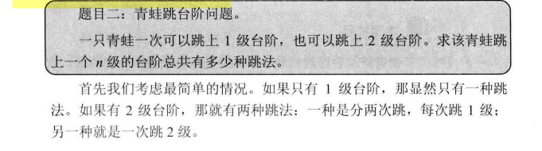

# 剑指offer读书笔记-递归与循环

## 一、递归与循环概述

&emsp;递归是在一个函数的内部调用这个函数自身。但是循环时通过设置计算的初始值以及终止条件，比如求：1+2+3+...+n,我们可以使用递归或者循环两种方式求出结果。

```cpp
int AddFrom1ToN_Recursive(int n)
{
    return n <= 0 ? 0:n + AddFrom1ToN_Recursive(n-1);
}

int AddFrom1ToN_Iterative(int n)
{
    int resultc = 0;
    for(int i = 1; i <= n; ++i)
    {
        result += i;
    }

    return result;
}

```

递归的缺点：递归由于是函数调用自身，而函数调用是有时间和空间的消耗的：每一次函数调用，都需要在内存栈中分配空间以保存参数、返回地址以及临时变量，而且往栈中压入数据和弹出数据都需要时间。同时递归中很多计算都是重复的，递归地本质是将一个问题划分成两个或者多个小问题。如果多个小问题存在相互重叠的部分，就存在重复的计算。递归还有一个严重的问题就是：栈溢出，每一个进程的栈的容量是有限的，当递归调用的层级太多时，就会超出栈的容量。

## 二、效率低下的解法

```cpp
long long Fibonacci(unsigned int n)
{
    if(n < 0)
    {
        return 0;
    }
    if(n < 1)
    {
        return 1;
    }
    return Fibonacci(n - 1) + Fiboncci(n - 2);
}
```

当递归100次时，效率非常差。

## 三、面试官期待的解法

&emsp;上述递归代码之所以慢，是因为重复的计算太多，我们只要避免重复计算就可以了。

**从下往上计算，首先根据f(0)和f(1)计算f(2)，再根据f(1)和f(2)计算(3)以此类推，计算f(n)**

```cpp
long long Fibonacci(unsigned n)
{
    int result[2] = {0,1};
    if(n < 2)
    {
        return result[n];
    }

    long long fibNMinusOne = 0;
    long long fibNMinusTwo = 1;
    long long fibSum = 0;

    for(unsigned int i = 2; i <= n)
    {
        fibSum = fibNMinusOne + fibNMinusTwo;
        fibNMinusOne = fibNMinusTwo;
        fibNMinusTwo = fibSum;
    }
    return fibSum;
}

```

## 四、青蛙跳台阶问题

  

当n>2时，第一次跳的时候就有两种不同的选择：一是第一次只跳一级，此时的跳法数目等于后面剩下的n-1级台阶的跳法数目，即为f(n - 1)；二是第一次跳两级，此时跳法数目等于后面剩下的n-2级台阶的跳法数目，也就是f(n - 2).因此n级台阶的不同跳法数目的总数等于f(n) = f(n - 1) + f(n -2)。

注意和斐波那契初始值不同。

```cpp
class Solution {
public:
    int numWays(int n) {
        long long result[2] = {1,1};
        if(n < 2)
        {
            return result[n];
        }

        int first = 1;
        int second = 1;
        int sum = 2;

        for(int i = 2; i <= n; i++)
        {
           sum = (first + second) % 1000000007;
           first = second;
           second = sum; 
        }

        return sum;
    }
};

```


